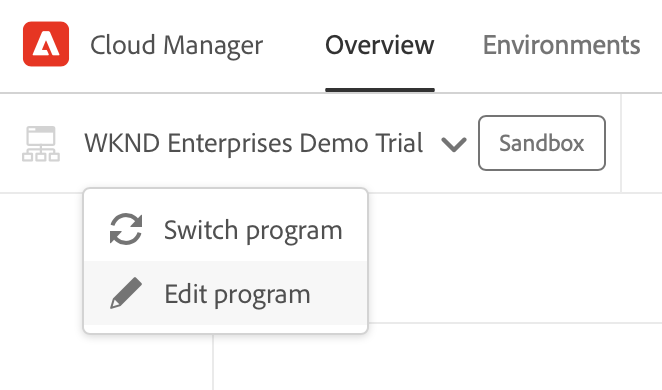
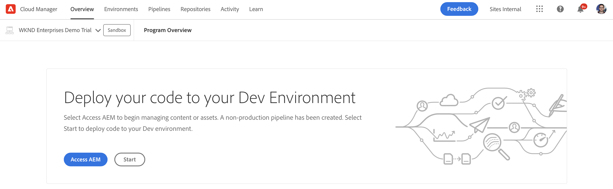

# Programma maken {#creating-a-program}

Leer hoe te opstelling een nieuw programma en een pijpleiding om toe:voegen-op op te stellen.

## Het verhaal tot nu toe {#story-so-far}

In het vorige document van de AEM Snelle reis van de Plaats, [Invoegtoepassing demodemodus begrijpen,](installation.md) U leerde hoe het installatieproces van de Add-On van de Demos van de Verwijzing werkt, die hoe de verschillende stukken samenwerken. Nu moet u:

* U hebt een basiskennis van Cloud Manager.
* Begrijp hoe de pijpleidingen inhoud en configuratie aan AEM leveren.
* Bekijk hoe sjablonen met slechts een paar klikken nieuwe sites kunnen maken die vooraf zijn gevuld met demo-inhoud.

Dit artikel bouwt op die grondbeginselen voort en neemt de eerste configuratiestap om een programma voor het testen doeleinden tot stand te brengen en gebruikt een pijpleiding om toe:voegen-op inhoud op te stellen.

## Doelstelling {#objective}

Dit document helpt u begrijpen hoe te opstelling een nieuw programma en een pijpleiding om toe:voegen-op op te stellen. Na het lezen moet u:

* Begrijp hoe u met Cloud Manager een nieuw programma kunt maken.
* Zorg dat u weet hoe u de Add-on Reference Demos voor het nieuwe programma activeert.
* Kan een pijpleiding in werking stellen om toe:voegen-op inhoud op te stellen.

## Een programma maken {#create-program}

Nadat u zich hebt aangemeld bij Cloud Manager, kunt u een nieuw sandboxprogramma maken voor test- en demonstratiedoeleinden.

>[!NOTE]
>
>Je gebruiker moet lid zijn van de **Zakelijke eigenaar** rol in Cloud Manager in uw organisatie om programma&#39;s te maken.

1. Meld u aan bij Adobe Cloud Manager via [my.cloudmanager.adobe.com](https://my.cloudmanager.adobe.com/).

1. Nadat u zich hebt aangemeld, zorgt u ervoor dat u zich in de juiste organisatie bevindt door deze in de rechterbovenhoek van het scherm te controleren. Als u slechts lid bent van één org, is deze stap niet nodig.

   

1. Tik of klik op **Programma toevoegen** rechtsboven in het venster.

1. In de **Laten we uw programma maken** moet u ervoor zorgen dat **Adobe Experience Manager** is geselecteerd onder **Producten** tikken of klikken **Doorgaan**.

   

1. In het volgende dialoogvenster:

   * Een **Programmanaam** om uw programma te beschrijven.
   * Tik of klik op **Een sandbox instellen** voor uw **Programmadoelstelling**

   Tik vervolgens of klik op **Maken**.

   

1. U wordt naar het scherm met het programmaoverzicht geleid waar u het proces van het creëren van uw programma kunt waarnemen. Cloud Manager geeft een schatting van de resterende tijd. U kunt bij het maken van het programma weg van dit scherm navigeren en indien nodig later terugkeren.

   

1. Na voltooiing geeft Cloud Manager een overzicht met de omgevingen en pijpleidingen die automatisch worden gemaakt.

   

1. Bewerk de programmatiedetails door op de programmanaam linksboven op de pagina te klikken en in de vervolgkeuzelijst de optie **Programma bewerken**.

   

1. In de **Programma bewerken** dialoogvenster, schakelen naar de **Oplossingen en invoegtoepassingen** tab.

   

1. Op de **Oplossingen en invoegtoepassingen** tabblad, vouwt u de **Sites** vermelding in de lijst en vervolgens controleren **Demo van referenties**. Tik of klik op **Bijwerken**.

   

1. Invoegtoepassing wordt nu toegelaten als optie, maar zijn inhoud moet aan AEM worden opgesteld om beschikbaar te zijn. Tik of klik op de pagina met het programmaoverzicht **Start** om de pijpleiding te beginnen om de toe:voegen-on inhoud aan AEM op te stellen.

   

1. De pijpleiding begint en u wordt genomen aan een pagina die de vooruitgang van de plaatsing detailleert. U kunt bij het maken van het programma weg van dit scherm navigeren en indien nodig later terugkeren.

   

Zodra de pijpleiding volledig is, is toe:voegen-op en zijn demo inhoud beschikbaar voor gebruik in het AEM auteursmilieu.

## Volgende functies {#what-is-next}

Nu u dit deel van de AEM Toelage van de Demo van de Verwijzing hebt voltooid zou u moeten:

* Begrijp hoe u met Cloud Manager een nieuw programma kunt maken.
* Zorg dat u weet hoe u de Add-on Reference Demos voor het nieuwe programma activeert.
* Kan een pijpleiding in werking stellen om toe:voegen-op inhoud op te stellen.

Bouw op deze kennis voort en vervolg uw AEM Toelating van de Demo van de Verwijzing door het document opnieuw te bekijken [Maak een demo-site,](create-site.md) waar u zult leren om een demoplaats in AEM tot stand te brengen die op een bibliotheek van pre-gevormde malplaatjes wordt gebaseerd die door de pijpleiding werden opgesteld.

## Aanvullende bronnen {#additional-resources}

* [Documentatie van Cloud Manager](https://experienceleague.adobe.com/docs/experience-manager-cloud-service/onboarding/onboarding-concepts/cloud-manager-introduction.html) - Als u meer informatie wilt over de functies van Cloud Manager, kunt u de diepgaande technische documenten direct raadplegen.
