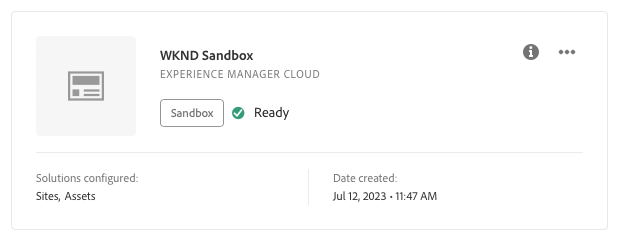

# Programma maken {#creating-a-program}

Leer hoe te opstelling een nieuw programma en een pijpleiding om toe:voegen-op op te stellen.

## Het verhaal tot nu toe {#story-so-far}

In het vorige document van de Adobe Experience Manager (AEM) Reference Demos Add-on trip, [Invoegtoepassing demodemodus begrijpen,](installation.md) u leerde hoe het installatieproces van de Add-on van de Demos van de Verwijzing werkt, illustrerend hoe de verschillende stukken samenwerken. Nu moet u:

* U hebt een basiskennis van Cloud Manager.
* Begrijp hoe de pijpleidingen inhoud en configuratie aan AEM leveren.
* Bekijk hoe sjablonen met slechts een paar klikken sites kunnen maken die vooraf zijn gevuld met demo-inhoud.

Dit artikel bouwt op die grondbeginselen voort en neemt de eerste configuratiestap om een programma voor het testen doeleinden tot stand te brengen en gebruikt een pijpleiding om toe:voegen-op inhoud op te stellen.

## Doelstelling {#objective}

Dit document helpt u begrijpen hoe te opstelling een nieuw programma en een pijpleiding om toe:voegen-op op te stellen. Na het lezen moet u het volgende kunnen doen:

* Begrijp en leg uit hoe u Cloud Manager kunt gebruiken om een programma te maken.
* Activeer de Add-on Referentie-demo&#39;s voor het nieuwe programma.
* Stel een pijpleiding in werking zodat kunt u toe:voegen-op inhoud opstellen.

## Een programma maken {#create-program}

Nadat u zich hebt aangemeld bij Cloud Manager, kunt u een sandboxprogramma maken voor test- en demonstratiedoeleinden.

>[!NOTE]
>
>Je gebruiker moet lid zijn van de **Zakelijke eigenaar** rol in Cloud Manager in uw organisatie om programma&#39;s te maken.

1. Aanmelden bij Adobe Cloud Manager op [my.cloudmanager.adobe.com](https://my.cloudmanager.adobe.com/).

1. Nadat u zich hebt aangemeld, zorgt u ervoor dat u zich in de juiste organisatie bevindt door deze in de rechterbovenhoek van het scherm te controleren. Als u slechts lid bent van één org, is deze stap niet nodig.

   

1. Selecteren **Programma toevoegen** rechtsboven in het venster.

1. In de **Laten we uw programma maken** dialoogvenster:

   1. Geef een **Programmanaam** om uw programma te beschrijven.
   1. Selecteren **Een sandbox instellen** voor uw **Programmadoelstelling**
   1. Selecteren **Doorgaan**.

   

1. In de **Sandbox instellen** in het dialoogvenster **Oplossingen en invoegtoepassingen** tabel uitvouwen **Sites** item in de lijst door erop te tikken of erop te klikken en vervolgens te controleren **Demo van referenties**.

   * Als u ook demo&#39;s voor AEM Screens wilt maken, schakelt u het selectievakje **Schermen** in de lijst. Selecteren **Bijwerken**.

   

1. Selecteren **Maken** en Cloud Manager wordt gestart met het instellen van uw sandboxprogramma. U wordt naar het scherm met het programmaoverzicht geleid en een korte bannermelding geeft aan dat het proces is gestart. Er is een kaart toegevoegd aan de overzichtspagina voor uw nieuwe programma. Het installatieproces duurt een paar minuten.

1. Zodra de installatie is voltooid, geeft de kaart voor de omgeving op de overzichtspagina zijn status als **Gereed**. Selecteer de kaart zodat u de omgeving kunt openen.

   

1. Uw omgeving is gereed en de invoegtoepassing is nu ingeschakeld als optie, maar de inhoud van de demo moet worden geïmplementeerd om beschikbaar te AEM. Om dit te doen, selecteer de ellipsknoop naast Deploy aan Dev pijpleiding in **Pijpleidingen** kaart en selecteer **Uitvoeren**.

   

1. De pijpleiding begint en u wordt genomen aan een pagina die de vooruitgang van de plaatsing detailleert. U kunt bij het maken van het programma weg van dit scherm navigeren en indien nodig later terugkeren.

   

De pijplijn kan enkele minuten duren. Zodra volledig, zijn toe:voegen-aan en zijn demo inhoud beschikbaar voor gebruik in het AEM auteursmilieu.

## Volgende functies {#what-is-next}

Nu u dit deel van de AEM Invoegtoepassing van de Demo van de Verwijzing hebt voltooid zou u moeten:

* Begrijp hoe u met Cloud Manager een programma kunt maken.
* Zorg dat u weet hoe u de invoegtoepassing voor demo&#39;s referentie voor het programma activeert.
* Kan een pijpleiding in werking stellen zodat kunt u de toe:voegen-op inhoud opstellen.

Bouw op deze kennis voort en vervolg uw AEM Toelating van de Demo van de Verwijzing door volgende het herzien [Een demo-site maken](create-site.md). In daar, leert u om een demoplaats in AEM tot stand te brengen die op een bibliotheek van pre-gevormde malplaatjes wordt gebaseerd die door de pijpleiding werden opgesteld.

## Aanvullende bronnen {#additional-resources}

* [Documentatie van Cloud Manager](https://experienceleague.adobe.com/docs/experience-manager-cloud-service/content/onboarding/onboarding-concepts/cloud-manager-introduction.html) - Als u meer informatie wilt over de functies van Cloud Manager, kunt u de diepgaande technische documenten direct raadplegen.
