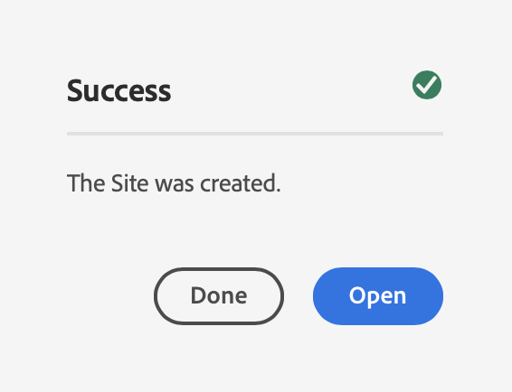

# Demo-site maken {#creating-a-site}

Maak een demosite in AEM op basis van een bibliotheek met vooraf geconfigureerde sjablonen.

## Het verhaal tot nu toe {#story-so-far}

In het vorige document van de AEM Toelating van de Demos van de Verwijzing, [ creeer Programma ](create-program.md), nam u de eerste configuratiestap om een programma voor het testen doeleinden tot stand te brengen en gebruikte een pijpleiding om de toe:voegen-op inhoud op te stellen. Nu moet u:

* Begrijp hoe u Cloud Manager kunt gebruiken om een programma te maken.
* Zorg dat u weet hoe u de Add-on Reference Demos voor het nieuwe programma activeert.
* Kan een pijpleiding in werking stellen om toe:voegen-op inhoud op te stellen.

In dit artikel wordt de volgende stap van het proces beschreven door een site of AEM Screens-project te maken in AEM op basis van de sjablonen van de invoegtoepassing voor demo van referentie.

## Doelstelling {#objective}

Dit document helpt u begrijpen hoe te om een plaats tot stand te brengen die op de malplaatjes van de Toevoeging van de Demo van de Verwijzing wordt gebaseerd. Na het lezen moet u:

* Begrijp hoe te om tot het AEM auteursmilieu toegang te hebben.
* Weet hoe u een site kunt maken op basis van een sjabloon.
* Begrijp de grondbeginselen van het navigeren van de plaatsstructuur en het uitgeven van een pagina.

## Een demo-site of Screens-project maken {#create-site}

Zodra de pijpleiding toe:voegen-aan van de Demo van de Verwijzing heeft opgesteld, kunt u tot het AEM auteursmilieu toegang hebben om demoplaatsen tot stand te brengen die op de toe:voegen-op inhoud worden gebaseerd.

1. Selecteer op de pagina met het programmaoverzicht in Cloud Manager de koppeling naar de AEM ontwerpomgeving.

   

1. Van het belangrijkste menu van AEM, uitgezochte **Plaatsen**.

   

1. Van de plaatsenconsole, creeert de uitgezochte **&#x200B;**&#x200B;bij het hoogste recht van het scherm en selecteert **Plaats van malplaatje** in drop-down.

   

1. De wizard voor het maken van de site wordt gestart. In de linkerkolom kunt u de demo malplaatjes zien die de pijpleiding aan uw auteursinstantie opstelde. Selecteer een optie om deze te selecteren en geef details weer in de rechterkolom. Als u AEM Screens wilt testen of demo, ben zeker om het **Sjabloon van de Plaats te kiezen Web.Cafe**. Selecteer **daarna**.

   

1. Geef in het volgende scherm een titel op voor uw site of Screens-project. U kunt een sitenaam opgeven of genereren op basis van de titel, als u deze weglaat. Selecteer **creeer**.

   * De titel van de site wordt weergegeven in de titelbalk van browsers.
   * De sitenaam wordt onderdeel van de URL.
   * De plaatsnaam moet AEM pagina het noemen overeenkomsten naleven, waarvan de details in de [ Extra sectie van Middelen ](#additional-resources) beschikbaar zijn.

   

1. Het maken van de site wordt bevestigd door een dialoogvenster. Selecteer **Gereed**.

   

U hebt nu uw eigen demo-site gemaakt!

## Demo-site gebruiken {#use-site}

Nu uw demosite is gemaakt, kunt u deze op dezelfde manier gebruiken als elke andere site in AEM.

1. De site wordt nu weergegeven in de siteconsole.

   

1. In de hoger-juiste hoek van het scherm, zorg ervoor dat de consolemening aan **Mening van de Kolom** wordt geplaatst.

   

1. Selecteer de site om de structuur en inhoud ervan te bekijken. De kolomweergave wordt voortdurend uitgebreid terwijl u door de inhoudsstructuur van de demosite navigeert.

   

1. Selecteer een pagina om het te selecteren en dan **te selecteren geef** in de toolbar uit.

   

1. U kunt de pagina net als elke andere AEM inhoudspagina bewerken, zoals onderdelen of elementen toevoegen of bewerken en de functionaliteit van AEM testen.

    uit

Gefeliciteerd! U kunt nu de inhoud van uw demo-site verder verkennen en alles ontdekken wat AEM te bieden heeft via de inhoud met best practices van de Add-on voor demo-weergave van verwijzingen.

Maak aanvullende sites op basis van andere sjablonen om meer AEM functionaliteit te verkennen.

## Volgende functies {#what-is-next}

Nu u dit deel van de AEM Toelage van de Demo van de Verwijzing hebt voltooid zou u moeten:

* Begrijp hoe te om tot het AEM auteursmilieu toegang te hebben.
* Weet hoe u een site kunt maken op basis van een sjabloon.
* Begrijp de grondbeginselen van het navigeren van de plaatsstructuur en het uitgeven van een pagina.

U kunt nu de functies van AEM testen met add-on inhoud. U hebt twee opties om uw reis voort te zetten:

* Als u de inhoud van AEM Screens volledig wilt demo en testen, zorg ervoor dat u een plaats hebt opgesteld die op het **wordt gebaseerd Web.Cafe Sjabloon van de Plaats** zoals eerder beschreven en [ AEM Screens voor Uw Plaats van de Demo ](screens.md) blijft toelaten.
* Als u slechts met om de inhoud van Plaatsen te demonstreren, [ Uw Plaatsen van de Demo ](manage.md) blijft beheren, waar u over de hulpmiddelen beschikbaar leert om u te helpen uw demoplaatsen beheren en hoe te om hen te verwijderen.

## Aanvullende bronnen {#additional-resources}

* [ documentatie van Cloud Manager ](https://experienceleague.adobe.com/docs/experience-manager-cloud-service/onboarding/onboarding-concepts/cloud-manager-introduction.html) - als u meer details over de eigenschappen van Cloud Manager zou willen, kunt u de diepgaande technische documenten direct willen raadplegen.
* [ creeer Plaats ](/help/sites-cloud/administering/site-creation/create-site.md) - leer hoe te om AEM te gebruiken om een plaats tot stand te brengen gebruikend plaatssjablonen om de stijl en de structuur van uw plaats te bepalen.
* [ AEM pagina noemende overeenkomsten ](/help/sites-cloud/authoring/sites-console/organizing-pages.md#page-name-restrictions-and-best-practices). - Zie deze pagina voor meer informatie over de conventies voor het ordenen van AEM pagina&#39;s.
* [ AEM Basisbehandeling ](/help/sites-cloud/authoring/basic-handling.md) - onderzoek dit document als u nieuw bent om basisconcepten zoals navigatie en consoleorganisatie AEM te begrijpen.
