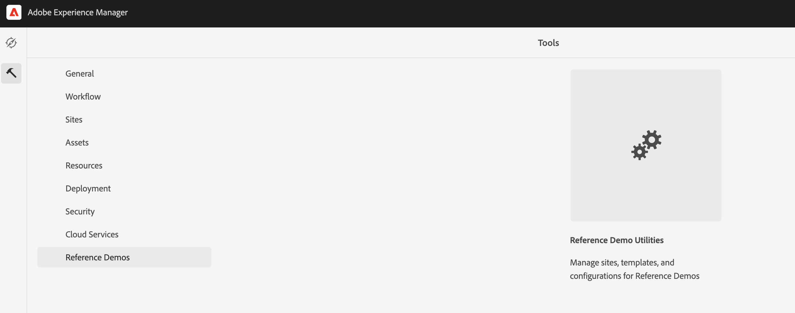

# Uw demo-sites beheren {#manage-demo-sites}

Leer meer over de gereedschappen die beschikbaar zijn om u te helpen uw demosites te beheren en hoe u deze kunt verwijderen.

## Het verhaal tot nu toe {#story-so-far}

In het vorige document van de AEM Toelaatbare reis van de Demo&#39;s van de Verwijzing, [&#x200B; creeerde Plaats &#x200B;](create-site.md), creeerde u een nieuwe demoplaats die op de malplaatjes van de Toelating van de Demo van de Verwijzing wordt gebaseerd. Nu moet u:

* Begrijp hoe te om tot het AEM auteursmilieu toegang te hebben.
* Weet hoe u een site kunt maken op basis van een sjabloon.
* Begrijp de grondbeginselen van het navigeren van de plaatsstructuur en het uitgeven van een pagina.

Als u ook [&#x200B; AEM Screens voor uw demoplaats &#x200B;](screens.md) toeliet, zou u ook moeten:

* De basisbeginselen van AEM Screens kennen.
* Begrijp de Web.Cafe demo-inhoud.
* Weet hoe u AEM Screens for We.Cafe kunt configureren.

Nu u uw eigen demosite hebt om te verkennen, worden in dit artikel de gereedschappen beschreven die beschikbaar zijn om u te helpen uw demosites te beheren en hoe u deze kunt verwijderen.

## Doelstelling {#objective}

Dit document helpt u begrijpen hoe u de demosites kunt beheren die u hebt gemaakt. Na het lezen moet u:

* Begrijp hoe te om tot de Hulpmiddelen van de Demo van de Zelfbediening toegang te hebben.
* Weet welke hulpprogramma&#39;s voor u beschikbaar zijn.
* Hoe te om een bestaande demoplaats of malplaatje te schrappen.

## Toegang tot de Hulpprogramma&#39;s van de Demo van de Zelfbediening {#accessing-utilities}

Nu u uw eigen demosites hebt, wilt u waarschijnlijk weten hoe u deze kunt beheren. De pijpleiding stelde niet alleen de plaatsmalplaatjes op om uw inhoud van demoplaatsen te geven, zette het ook een reeks nut op om die plaatsen te beheren.

1. Van de AEM globale navigatiebar, uitgezochte **Hulpmiddelen** > **Demo&#39;s van de Verwijzing** > **Hulpmiddelen van de Demo van de Verwijzing**.

   

1. De Hulpprogramma&#39;s van de Demo van de verwijzing zijn een inzameling van nuttige functionaliteit die opstelling en controle uw milieu van Adobe Experience Manager zal helpen. De aanvankelijke mening is het **dashboard**, dat als statuscontrole van het milieu en zijn demofunctionaliteit dient.

   

De Hulpprogramma&#39;s van de Demo van de zelfbediening verstrekken verscheidene hulpmiddelen.

* **de Plaatsen van de Schrapping** - selecteer de Plaats u in deze instantie van Adobe Experience Manager zou willen schrappen. Onthoud dat dit een destructieve actie is en dat deze actie niet ongedaan kan worden gemaakt als de actie eenmaal is gestart.
* **de Malplaatjes van de Plaats van de Schrapping** - selecteer het Malplaatje van de Plaats u in deze instantie van Adobe Experience Manager zou willen schrappen. Voordat u een Sjabloon site verwijdert, moet u ervoor zorgen dat alle sites die verwijzen naar de sjabloon, ook worden verwijderd. Onthoud dat dit een destructieve actie is en dat deze actie niet ongedaan kan worden gemaakt als de actie eenmaal is gestart.
* **het Geheime voorgeheugen van de Auteur van Prime** - dit zal verscheidene middelen binnen de instantie van Adobe Experience Manager halen, die hun ophaaltijden versnellen. Het kan enkele seconden duren.
* **Android App** - Hulpmiddelen om de demonstratieAndroid App te installeren en te lanceren. Creeer een plaats die op **wordt gebaseerd WKND Enige Pagina App** om deze pagina te bevolken. Gebruiken vanaf een Android-apparaat, emulator of Bluestacks.
* **de Voorkeur van de Gebruiker** - draai van Pop-updialoogvensters van het Leerprogramma.
* **GraphQL van de Opstelling** - opstelling snel het globale eindpunt van GraphQL.

## Demosites en sjablonen verwijderen {#deleting}

Nadat u een set AEM hebt getest, hebt u mogelijk niet langer uw demosite of zelfs de sjabloon waarop deze is gebaseerd nodig. Het is gemakkelijk om zowel demo plaatsen als plaatsmalplaatjes te schrappen.

1. Heb toegang tot de **Hulpmiddelen van de Demo van de Verwijzing** en selecteer **Plaatsen van de Schrapping**.

   

1. De beschikbare sites worden in een lijst weergegeven. Controleer de plaats of de plaatsen u wilt schrappen en dan selecteren **Schrapping**.

   >[!CAUTION]
   >
   >De plaats en malplaatjeschrapping is een destructieve actie en kan niet ongedaan worden gemaakt zodra in werking gesteld.

1. Bevestig het verwijderen van de site in het dialoogvenster.

   

1. AEM schrapt de geselecteerde plaats of plaatsen en toont zijn vooruitgang waar de **Schrapping** knoop eerder was.

   

De site wordt nu verwijderd.

U kunt malplaatjes op de zelfde manier onder de rubriek **schrappen de Malplaatjes van de Plaats** in de **Hulpprogramma&#39;s van de Demo van de Verwijzing**.

>[!CAUTION]
>
>Voordat u een Sjabloon site verwijdert, moet u ervoor zorgen dat alle sites die verwijzen naar de sjabloon, ook worden verwijderd.

## Einde van de reis? {#end-of-journey}

Gefeliciteerd! U hebt de reis AEM de Toelage van de Demos van de Verwijzing voltooid! Nu moet u:

* Een basiskennis van Cloud Manager hebben en begrijpen hoe pijpleidingen inhoud en configuratie leveren aan AEM.
* Begrijp hoe u Cloud Manager kunt gebruiken om een programma te maken.
* Weet hoe te om toe:voegen-aan van de Demos van de Verwijzing voor het nieuwe programma te activeren en een pijpleiding in werking te stellen om toe:voegen-op inhoud op te stellen.
* Begrijp hoe te om tot het AEM auteursmilieu toegang te hebben om een plaats tot stand te brengen die op een malplaatje wordt gebaseerd.
* Begrijp hoe te om tot de Hulpmiddelen van de Demo van de Zelfbediening toegang te hebben.
* Weet hoe u een bestaande demosite of sjabloon kunt verwijderen.

U bent nu klaar om de mogelijkheden van AEM te onderzoeken gebruikend uw eigen demo plaatsen. AEM is echter een krachtig hulpmiddel en er zijn veel aanvullende opties beschikbaar. Controle uit enkele extra middelen beschikbaar in de [&#x200B; Extra sectie van Middelen &#x200B;](#additional-resources) om meer over de eigenschappen te leren u in deze reis zag.

## Aanvullende bronnen {#additional-resources}

* [&#x200B; documentatie van Cloud Manager &#x200B;](https://experienceleague.adobe.com/docs/experience-manager-cloud-service/onboarding/onboarding-concepts/cloud-manager-introduction.html?lang=nl-NL) - als u meer details over de eigenschappen van Cloud Manager zou willen, kunt u de diepgaande technische documenten direct willen raadplegen.
* [&#x200B; creeer Plaats &#x200B;](/help/sites-cloud/administering/site-creation/create-site.md) - leer hoe te om AEM te gebruiken om een plaats tot stand te brengen gebruikend plaatssjablonen om de stijl en de structuur van uw plaats te bepalen.
* [&#x200B; AEM pagina noemende overeenkomsten &#x200B;](/help/sites-cloud/authoring/sites-console/organizing-pages.md#page-name-restrictions-and-best-practices). - Zie deze pagina voor meer informatie over de conventies voor het ordenen van AEM pagina&#39;s.
* [&#x200B; AEM Basisbehandeling &#x200B;](/help/sites-cloud/authoring/basic-handling.md) - onderzoek dit document als u nieuw bent om basisconcepten zoals navigatie en consoleorganisatie AEM te begrijpen.
* [&#x200B; AEM as a Cloud Service technische documentatie &#x200B;](https://experienceleague.adobe.com/docs/experience-manager-cloud-service.html?lang=nl-NL) - als u reeds een vast begrip van AEM hebt, kunt u de diepgaande technische documenten direct willen raadplegen.
* [&#x200B; Malplaatjes van de Plaats &#x200B;](/help/sites-cloud/administering/site-creation/site-templates.md) - als u meer over de structuur van plaatssjablonen zou willen weten en hoe zij worden gebruikt om plaatsen tot stand te brengen, verwijs naar dit document.
