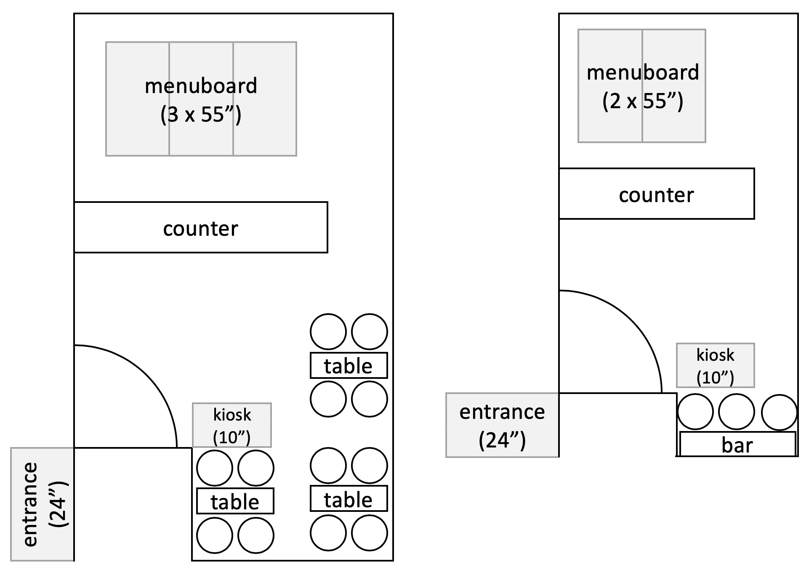
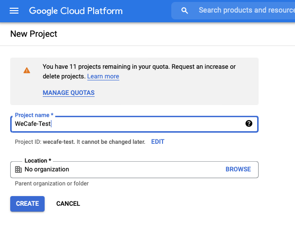
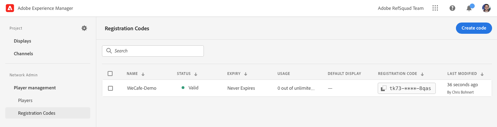

# AEM Screens inschakelen voor uw demo-site {#enable-screens}

Leer de stappen die de volledige as a Cloud Service ervaring van AEM Screens op uw demo-site mogelijk maken.

>[!NOTE]
>
>AEM Screens Demo vereist dat de invoegtoepassing Screens wordt toegevoegd aan het Cloud Manager-programma. Leer hoe met [ het Toevoegen van Screens als toe:voegen-op aan een Nieuw Programma in Cloud Manager ](/help/screens-cloud/onboarding-screens-cloud/add-on-new-program-screens-cloud.md) hoe te om het toe te voegen.

## Het verhaal tot nu toe {#story-so-far}

In het vorige document van de AEM Toelating van de Demo&#39;s van de Verwijzing, [ creeerde de Plaats van de Demo van de Demo, ](create-site.md) u een demoplaats die op de malplaatjes van toe:voegen-op van de Demo van de Verwijzing wordt gebaseerd. Nu moet u:

* Begrijp hoe te om tot het AEM auteursmilieu toegang te hebben.
* Weet hoe u een site kunt maken op basis van een sjabloon.
* Begrijp de grondbeginselen van het navigeren van de plaatsstructuur en het uitgeven van een pagina.

Nu u uw eigen demo-site hebt om te verkennen en de tools te begrijpen waarmee u uw demo-sites kunt beheren, kunt u de volledige as a Cloud Service ervaring van AEM Screens voor uw demo-sites inschakelen.

## Doelstelling {#objective}

De AEM Reference Demos Add-on bevat AEM Screens-inhoud voor We.Cafe, een verticaal bedrijf in een café. Dit document helpt u te begrijpen hoe u de Web.Cafe demo-instellingen kunt uitvoeren in de context van AEM Screens. Na het lezen moet u:

* De basisbeginselen van AEM Screens kennen.
* Begrijp de Web.Cafe demo-inhoud.
* Weet hoe u AEM Screens for We.Cafe kunt configureren.
   * Weet hoe u een Screens-project voor We.Cafe kunt maken.
   * Een gesimuleerde weerservice configureren met Google Sheets en API&#39;s.
   * Simuleer dynamisch veranderende Screens-inhoud op basis van uw &quot;weerservice&quot;.
   * Installeer en gebruik de schermspeler.

## Screens begrijpen {#understand-screens}

AEM Screens as a Cloud Service is een digitale signaaloplossing waarmee marketers dynamische digitale ervaringen op schaal kunnen creëren en beheren. Met AEM Screens as a Cloud Service kunt u aantrekkelijke en dynamische digitale signage-ervaringen creëren die bedoeld zijn om te worden gebruikt in openbare ruimten.

>[!TIP]
>
>Voor de volledige details van AEM Screens as a Cloud Service, zie de [ Extra sectie van Middelen ](#additional-resources) aan het eind van dit document.

Door de AEM Reference Demos Add-on te installeren, beschikt u automatisch over Web.Cafe-inhoud voor AEM Screens in uw demo-ontwerpomgeving. De stappen die in [ worden beschreven stellen een Project van Screens van de Manifestatie ](#deploy-project) helpen u de volledige ervaring van AEM Screens toelaten door die inhoud te publiceren en aan media spelers op te stellen, etc.

## De demo-inhoud begrijpen {#demo-content}

De We.Cafe-koffiewinkel bestaat uit drie winkels op drie locaties in de VS. Alle drie winkels hebben drie vergelijkbare ervaringen:

* Een menukaart boven de teller met twee of drie verticale panelen
* Een ingangsscherm dat de straat onder ogen ziet met een horizontaal of verticaal paneel dat klanten in de winkel uitnodigt
* Een snelle zelfrangschikkende kioskcabine om de rij met één verticale tablet te mijden

>[!NOTE]
>
>Alleen de ingangsweergave kan in de huidige versie van de demo worden getest. Andere weergaven volgen in een toekomstige versie.
>
>De kiosk is niet opgenomen in de huidige versie van de demo. Het wordt in een toekomstige versie opgenomen.

De locatie in New York wordt verondersteld zich in een kleinere winkel te bevinden die niet veel ruimte heeft, en als zodanig:

* Het menubord heeft slechts twee verticale panelen in plaats van drie voor San Francisco en San Jose
* De ingangsweergave wordt verticaal in plaats van horizontaal geplaatst

>[!NOTE]
>
>Als u besluit om met de Cloud Service van Screens in de [ Connect Screens as a Cloud Service ](#connect-screens) sectie te verbinden, creeer de plaatsen als omslagen onder vertoningen. Zie de [ Extra sectie van Middelen ](#additional-resources) aan het eind van dit document voor meer informatie over vertoningen.

### Cafe-indelingen {#care-layouts}

De locaties Web.Cafe hebben de volgende lay-outs.



>[!NOTE]
>
>De metingen voor de schermen zijn in inches.

### Entrance {#entrance}

De ingangsweergave wordt dagelijks geparseerd en wijzigt alleen de eerste afbeelding van ochtend naar middag. Bij elke stap van de reeks wordt ook reclame gemaakt voor een ander speciaal koffiepreparaat, waarbij een gemeten ingesloten reeks wordt gebruikt om telkens een ander item af te spelen.

Het laatste beeld op de ingangskanalen wordt ook gericht (namelijk dynamisch veranderd) die op buitentemperatuur wordt gebaseerd, die zoals die in [ wordt beschreven kan worden gesimuleerd creëren Gesimuleerde Gegevens Source ](#data-source) sectie.

## Een demo Screens-project implementeren {#deploy-project}

Om de demo inhoud in de zandbak te gebruiken die u in [ creeerde creeerde de stap van het Programma ](create-program.md), moet een plaats worden gecreeerd gebaseerd op een malplaatje.

Als u nog geen de demoplaats van Web.Cafe hebt gecreeerd, volg eenvoudig de zelfde stappen zoals in [ creeer de Plaats van de Demo ](create-site.md) sectie. Wanneer het selecteren van het malplaatje, kies eenvoudig het {**Malplaatje 1} Web.Cafe van de Website.**


Nadat de wizard is voltooid, vindt u de inhoud die onder Sites is geïmplementeerd en kunt u navigeren en verkennen zoals u elke andere inhoud wilt.


Nu we Web.Cafe-demo-inhoud hebben, hebt u een keuze over hoe u AEM Screens wilt testen:

* Als u slechts de inhoud binnen de console van AEM Sites wilt onderzoeken, eenvoudig beginnen en meer in de [ Extra Bronnen ](#additional-resources) sectie te ontdekken en te ontdekken! er is geen actie meer nodig .
* Als u de volledige dynamische eigenschappen van AEM Screens wilt ervaren, ga aan de volgende sectie, [ dynamisch de Inhoud van Screens van de Verandering.](#dynamically-change)

## Screens-inhoud dynamisch wijzigen {#dynamically-change}

Net als AEM Sites kan AEM Screens inhoud dynamisch wijzigen op basis van context. De Wij.Cafe demo heeft kanalen die worden gevormd om verschillende inhoud afhankelijk van de huidige temperatuur te tonen. Om deze ervaring te simuleren, moet u uw eigen eenvoudige weerdienst creëren.

### Simulatiegegevens maken Source {#data-source}

Omdat het moeilijk is het weer tijdens een demo of tijdens de test te veranderen, moeten temperatuurveranderingen worden gesimuleerd. Een weerdienst wordt gesimuleerd door een temperatuurwaarde in een spreadsheet van het Blad van Google op te slaan die de vraag ContextHub AEM om de temperatuur terug te winnen.

#### Google API-sleutel maken {#create-api-key}

Ten eerste moet u een Google API-sleutel maken om de gegevensuitwisseling te vergemakkelijken.

1. Meld u aan bij een Google-account.
1. Open de Cloud Console met deze koppeling `https://console.cloud.google.com` .
1. Creeer een project door de huidige projectnaam in top-left van de toolbar na het **Google Cloud Platform** etiket te klikken.

   

1. In de dialoog van de projectselecteur, klik **NIEUW PROJECT**.

   

1. Geef het project een naam en klik **CREATE**.

   

1. Zorg ervoor dat uw nieuw project wordt geselecteerd en dan gebruikend het hamburgermenu in het dashboard van de Console van de Wolk, uitgezochte **APIs &amp; de Diensten**.

   

1. In het linkerpaneel van het venster APIs &amp; van de Diensten, klik **Geloofsbrieven** bij de bovenkant van het venster, dan klik **CREËREN CREDENTIALS** en **API Sleutel**.

   

1. Kopieer de nieuwe API-sleutel in het dialoogvenster en sla deze op voor later gebruik. Klik **SLUITEN** zodat kunt u de dialoogdoos weggaan.

#### Google Sheets API inschakelen {#enable-sheets}

Als u de uitwisseling van Google Sheets-gegevens met behulp van uw API-sleutel wilt toestaan, moet u de Google Sheets API inschakelen.

1. Terugkeer naar de Console van de Wolk van Google bij `https://console.cloud.google.com` voor uw project en gebruik dan het hamburger menu om **APIs &amp; de Diensten > Bibliotheek** te selecteren.

   

1. In het scherm van de Bibliotheek API van API, rol om uw onderzoek naar **Google Bladen API** te vinden, dan het te klikken.

   

1. In het **Google Bladen API** venster, klik **** TOESTAAN.

   

#### Google-werkblad met bladen maken {#create-spreadsheet}

Nu kunt u een Google Sheets-spreadsheet maken om uw weergegevens op te slaan.

1. Ga naar `https://docs.google.com` en maak een Google-werkblad.
1. Definieer de temperatuur door `32` in cel A2 in te voeren.
1. Deel het document door **Aandeel** bij het hoogste recht van het venster te klikken en onder **krijg verbinding**, klik **Verandering**.

   

1. Kopieer de koppeling voor de volgende stap.

   

1. Zoek de pagina-id.

   * De pagina-id is de willekeurige tekenreeks van tekens in de bladkoppeling die u na `d/` en voor `/edit` hebt gekopieerd.
   * Bijvoorbeeld:
      * Als uw URL `https://docs.google.com/spreadsheets/d/1cNM7j1B52HgMdsjf8frCQrXpnypIb8NkJ98YcxqaEP30/edit#gid=0` is
      * De pagina-id is `1cNM7j1B52HgMdsjf8frCQrXpnypIb8NkJ98YcxqaEP30` .

1. Kopieer de pagina-id voor toekomstig gebruik.

#### Uw weerservice testen {#test-weather-service}

Nu u uw gegevensbron hebt gemaakt als een Google Sheets-spreadsheet en toegang via API hebt ingeschakeld, test u deze om te controleren of uw &quot;weerservice&quot; toegankelijk is.

1. Open een webbrowser.

1. Voer de volgende aanvraag in en vervang de waarden van de blad-id en de API-sleutel die u eerder hebt opgeslagen.

   ```
   https://sheets.googleapis.com/v4/spreadsheets/<yourSheetID>/values/Sheet1?key=<yourAPIKey>
   ```

1. Als u JSON-gegevens ontvangt die vergelijkbaar zijn met de volgende, stelt u deze op de juiste wijze in.

   ```json
   {
     "range": "Sheet1!A1:Z1000",
     "majorDimension": "ROWS",
     "values": [
       [],
       [
         "32"
       ]
     ]
   }
   ```

AEM Screens kan deze zelfde dienst gebruiken om tot de gesimuleerde weergegevens toegang te hebben die in de volgende stap wordt gevormd.

### ContextHub configureren {#configure-contexthub}

AEM Screens kan inhoud dynamisch wijzigen op basis van context. De manifestatie We.Cafe heeft kanalen die worden gevormd om verschillende inhoud afhankelijk van de huidige temperatuur te tonen door AEM te gebruiken ContextHub.

>[!TIP]
>
>Voor de volledige details van ContextHub, zie de [ Extra sectie van Middelen ](#additional-resources) aan het eind van dit document.

Wanneer de het scherminhoud wordt getoond, roept ContextHub uw weerdienst om de huidige temperatuur te vinden om te bepalen welke inhoud aan vertoning.

Voor demo-doeleinden kunnen de waarden in het blad worden gewijzigd. ContextHub erkent dit feit en de inhoud past in het kanaal volgens de bijgewerkte temperatuur aan.

1. Voor de auteur AEMaaCS instantie, ga **Globale Navigatie > Hulpmiddelen > Plaatsen > ContextHub**.
1. Selecteer de configuratiecontainer die de zelfde naam heeft zoals wat u het project gaf toen u het project van Screens van het **Web.Cafe Malplaatje van de Website** creeerde.
1. Selecteer **Configuratie > Configuratie ContextHub > de Bladen van Google** dan **daarna** bij het hoogste recht klikken.
1. De configuratie zou reeds JSON gegevens moeten hebben pre-gevormd. Er zijn twee waarden die moeten worden gewijzigd:
   1. Vervang `[your Google Sheets id]` met blad identiteitskaart die [ u eerder ](#create-spreadsheet) bewaarde.
   1. Vervang `[your Google API Key]` met de API sleutel die [ u eerder ](#create-api-key) bewaarde.
1. Klik **sparen**.

Nu kunt u de temperatuurwaarde in uw spreadsheet van Google veranderen en ContextHub werkt Screens dynamisch bij aangezien het &quot;de weerverandering ziet.&quot;

### Dynamische gegevens testen {#test-dynamic}

Nu AEM Screens en ContextHub met uw weerdienst worden verbonden, kunt u het testen om te zien hoe de schermen inhoud dynamisch kunnen bijwerken.

1. Toegang tot de instantie van de maker van de sandbox.
1. Navigeer aan de plaatsenconsole via **Globale Navigatie > Plaatsen** en selecteer de volgende pagina **Screens > &lt;project-name> > Kanalen > Binnenkomt (Portret)**.

   

1. Klik **uitgeven** in de toolbar of typ de kortere wegsleutel `e` zodat kunt u de pagina uitgeven.

1. In de redacteur, kunt u de inhoud zien. Eén afbeelding wordt in blauw gemarkeerd met een doelpictogram in de hoek.

   

1. Wijzig de temperatuur die u hebt ingevoerd in het werkblad van 32 in 70 en bekijk de wijziging van de inhoud.

   

Op basis van de temperatuursverandering van een vriestemperatuur van 32°F (0°C) in een comfortabele 70°F (21°C) veranderde het aanbevolen beeld van een opwarmer theekopje in een koele, geijkte koffie.

>[!IMPORTANT]
>
>Gebruik de beschreven Google Sheets-oplossing alleen voor demo-doeleinden. Adobe biedt geen ondersteuning voor het gebruik van Google Sheets voor productieomgevingen.

## Connect Screens as a Cloud Service {#connect-screens}

Als u ook een echte digitale handtekening wilt instellen, inclusief een speler die op een digitaal signaalapparaat of op uw computer wordt uitgevoerd, voert u de volgende stappen uit.

U kunt de demo ook eenvoudig voorvertonen in de Kanaaleditor op AEMaaCS.

>[!TIP]
>
>Voor de volledige details van de Redacteur van het Kanaal, zie de [ Extra sectie van Middelen ](#additional-resources) aan het eind van dit document.

### AEM Screens as a Cloud Service configureren {#configure-screens}

Eerst moet u de Screens-demo-inhoud publiceren naar AEM Screens as a Cloud Service en de service configureren.

1. Publish de inhoud van uw demo screens project.
1. Navigeer naar Screens as a Cloud Service op `https://experience.adobe.com/screens` en meld u aan.
1. Rechtsboven in het scherm moet u controleren of u zich in de juiste organisatie bevindt.

   

1. Vlak de upper-left hoek, klik **uitgeeft het pictogram van Montages**, vormde als versnelling.

    uit

1. Verstrek URLs van auteur AEMaaCS en publiceer instanties waar u uw demoplaats creeerde en **sparen** klikt.

   

1. Zodra Screens is verbonden met uw demo-instanties, wordt de inhoud van uw kanaal opgehaald. Klik **Kanalen** in het linkerpaneel zodat kunt u uw gepubliceerde kanalen zien. Het kan even duren voordat de informatie wordt ingevuld. U kunt de blauwe **knoop van de Synchronisatie** bij het hoogste recht van het scherm klikken om de informatie bij te werken.

   

1. Klik **Vertoningen** in het linkerpaneel. U hebt nog geen bestanden voor uw demo gemaakt. U kunt de locaties van Web.Cafe simuleren door voor elke locatie mappen te maken. Klik **creëren** bij het hoogste recht van het scherm en selecteren **Omslag**.

   

1. In de dialoogdoos, verstrek een omslagnaam zoals **San Jose** en klik **creeer**.

1. Open de omslag door het te klikken en dan **te klikken creeert** bij top-right en selecteert **Vertoning**.

1. Verstrek een vertoningsnaam en klik **creëren**.

   

1. Nadat de weergave is gemaakt, klikt u op de naam van de weergave om het scherm met weergavedetails te openen. Aan de weergave moet een kanaal worden toegewezen dat vanuit uw demosite is gesynchroniseerd. Klik **toewijzen kanaal** bij het hoogste recht van het scherm.

   

1. In de dialoog, selecteer het kanaal en klik **toewijzen**.

    toe

U kunt deze stappen voor uw extra plaatsen en vertoningen herhalen. Na voltooiing hebt u een koppeling tot stand gebracht tussen uw demo-site en AEM Screens en hebt u de benodigde configuratie voltooid.

U kunt de demo eenvoudig voorvertonen in de Kanaaleditor op AEMaaCS.

### Screens Player gebruiken {#screens-player}

Als u de inhoud op een echt scherm wilt weergeven, kunt u de speler downloaden en lokaal instellen. AEM Screens as a Cloud Service levert de inhoud aan uw speler

#### Een registratiecode genereren {#registration-code}

Eerst moet u een registratiecode maken om een speler veilig te verbinden met AEM Screens as a Cloud Service.

1. Navigeer naar Screens as a Cloud Service op `https://experience.adobe.com/screens` en meld u aan.
1. Rechtsboven in het scherm moet u controleren of u zich in de juiste organisatie bevindt.

   

1. In het linkerpaneel, klik **Beheer van de Speler > Codes van de Registratie** en klik dan **creeer code** bij het hoogste recht van het scherm.


1. Ga een naam voor de code in en klik **creeer**.

   

1. Nadat de code is gemaakt, wordt deze weergegeven in de lijst. Klik om de code te kopiëren.

   

#### Speler installeren en configureren {#install-player}

1. Download de speler voor uw platform vanaf `https://download.macromedia.com/screens/` en installeer deze.
1. Stel de speler in werking, dan schakelaar aan de **Configuratie** tabel.
1. De rol aan de bodem, klikt en bevestigt dan zowel **Terugstellen aan Factory** en **Verandering in de Wijze van de Wolk** opties.

   

1. De speler verandert automatisch in de **Registratie van de Speler** tabel. Ga de code in die u eerder produceerde en klik **Register**.

   

1. Schakelaar aan het **lusje van de Informatie van het Systeem** om te bevestigen dat de speler is geregistreerd.

   

#### Speler aan een Vertoning toewijzen {#assign-player}

1. Navigeer naar Screens as a Cloud Service op `https://experience.adobe.com/screens` en meld u aan.
1. Rechtsboven in het scherm moet u controleren of u zich in de juiste organisatie bevindt.

   

1. In het linkerpaneel, klik **het Beheer van de Speler > Players** en u ziet de speler die u eerder installeerde en registreerde.

   

1. Klik op de naam van de speler, zodat u de details kunt openen. Klik **toewijzen aan vertoning** in het hoogste recht van het scherm.

    toe

1. In de dialoogdoos, selecteer de vertoning die u eerder creeerde en klik dan **Uitgezocht**.

    toe

#### Afspelen! {#playback}

Nadat u een weergave aan een speler hebt toegewezen, levert AEM Screens as a Cloud Service de inhoud aan de speler waar deze zichtbaar is.


## Volgende functies {#what-is-next}

Nu u dit deel van de AEM Invoegtoepassing van de Demo van de Verwijzing hebt voltooid zou u moeten:

* De basisbeginselen van AEM Screens kennen.
* Begrijp de Web.Cafe demo-inhoud.
* Weet hoe u AEM Screens for We.Cafe kunt configureren.

U kunt nu de mogelijkheden van AEM Screens verkennen met uw eigen demo-sites. Ga aan de volgende sectie van de reis, [ leiden Uw Plaatsen van de Demo, ](manage.md) voort waar u over de hulpmiddelen beschikbaar leert om u te helpen uw demoplaatsen beheren en hoe te om hen te verwijderen.

U kunt enkele extra middelen ook controleren beschikbaar in de [ Extra sectie van Middelen ](#additional-resources) om meer over de eigenschappen te leren u in deze reis zag.

## Aanvullende bronnen {#additional-resources}

* [ documentatie ContextHub ](/help/sites-cloud/authoring/personalization/contexthub.md) - leer hoe ContextHub kan worden gebruikt om inhoud te personaliseren die op gebruikerscontext voorbij weersomstandigheden wordt gebaseerd.
* [ Gebruikend API Sleutels - de Documentatie van Google ](https://developers.google.com/maps/documentation/javascript/get-api-key) - een handige verwijzing voor details over het gebruiken van Google API sleutels.
* [ Vertoningen ](/help/screens-cloud/creating-content/creating-displays-screens-cloud.md) - leer meer over wat een vertoning in AEM Screens is en wat het kan doen.
* [ Speler van de Download ](/help/screens-cloud/managing-players-registration/installing-screens-cloud-player.md) - Leer hoe te om tot de Speler van Screens toegang te hebben en hoe te te installeren.
* [ Speler van het Register ](/help/screens-cloud/managing-players-registration/registering-players-screens-cloud.md) - leer hoe te opstelling en een speler bij uw project van AEM Screens te registreren.
* [ Toewijzend Speler aan een Vertoning ](/help/screens-cloud/managing-players-registration/assigning-player-display.md) - vorm een speler om uw inhoud te tonen.
