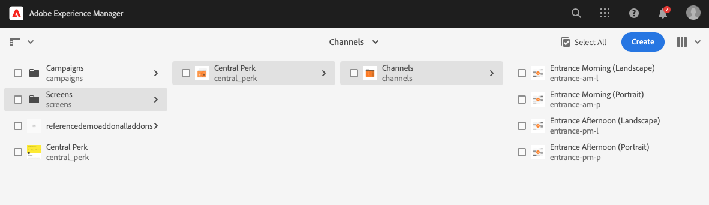

# AEM Screens inschakelen voor uw demo-site {#enable-screens}

Leer de stappen die de volledige as a Cloud Service AEM Screens-ervaring op uw demo-site mogelijk maken.

>[!NOTE]
>
>AEM Screens Demo vereist dat de invoegtoepassing Schermen wordt toegevoegd aan het Cloud Manager-programma. Meer informatie [hier](https://experienceleague.adobe.com/docs/experience-manager-cloud-service/content/screens-as-cloud-service/onboarding-screens-cloud/adding-screens-addon/add-on-new-program-screens-cloud.html) toevoegen.

## Het verhaal tot nu toe {#story-so-far}

In het vorige document van de AEM Reference Demos Add-on trip, [Maak een demo-site,](create-site.md) u hebt een demosite gemaakt op basis van de sjablonen van de Add-on voor de demoversie van verwijzingen. Nu moet u:

* Begrijp hoe te om tot het AEM auteursmilieu toegang te hebben.
* Weet hoe u een site kunt maken op basis van een sjabloon.
* Begrijp de grondbeginselen van het navigeren van de plaatsstructuur en het uitgeven van een pagina.

Nu u uw eigen demo-site hebt om te verkennen en de tools te begrijpen waarmee u uw demo-sites kunt beheren, kunt u de volledige as a Cloud Service AEM Screens-ervaring voor uw demo-sites inschakelen.

## Doelstelling {#objective}

De AEM Reference Demos Add-on bevat AEM Screens-inhoud voor We.Cafe, een verticaal bedrijf in een café. Dit document helpt u te begrijpen hoe u de Web.Cafe demo-instellingen kunt uitvoeren in de context van AEM Screens. Na het lezen moet u:

* De basisbeginselen van AEM Screens kennen.
* Begrijp de Web.Cafe demo-inhoud.
* Weet hoe u AEM Screens for We.Cafe kunt configureren.
   * Weet hoe u een Screens-project voor We.Cafe kunt maken.
   * Een gesimuleerde weerservice configureren met Google Sheets en API&#39;s.
   * Simuleer dynamisch veranderende inhoud van het Scherm die op uw &quot;weerdienst wordt gebaseerd.&quot;
   * Installeer en gebruik de schermspeler.

## Schermen begrijpen {#understand-screens}

AEM Screens as a Cloud Service is een digitale signaaloplossing waarmee marketers dynamische digitale ervaringen op schaal kunnen creëren en beheren. Met AEM Screens as a Cloud Service kunt u aantrekkelijke en dynamische digitale signage-ervaringen creëren die bedoeld zijn om te worden gebruikt in openbare ruimten.

>[!TIP]
>
>Voor alle informatie over AEM Screens as a Cloud Service raadpleegt u de [Aanvullende bronnen](#additional-resources) aan het einde van dit document.

Door de AEM Reference Demos Add-on te installeren, beschikt u automatisch over Web.Cafe-inhoud voor AEM Screens in uw demo-ontwerpomgeving. De stappen die worden beschreven in het dialoogvenster [Een demo-rasterproject implementeren](#deploy-project) Help u de volledige AEM Screens-ervaring te benutten door die inhoud te publiceren en te implementeren voor mediaspelers, enzovoort.

## De demo-inhoud begrijpen {#demo-content}

De We.Cafe-koffiewinkel bestaat uit drie winkels op drie locaties in de VS. Alle drie winkels hebben drie vergelijkbare ervaringen:

* Een menukaart boven de teller met twee of drie verticale panelen
* Een ingangsscherm dat de straat onder ogen ziet met een horizontaal of verticaal paneel dat klanten in de winkel uitnodigt
* Een snelle zelfrangschikkende kioskcabine om de rij met één verticale tablet te mijden

>[!NOTE]
>
>Alleen de ingangsweergave kan in de huidige versie van de demo worden getest. Andere weergaven volgen in een toekomstige versie.
>
>De kiosk is niet opgenomen in de huidige versie van de demo. Het wordt in een toekomstige versie opgenomen.

De locatie in New York wordt verondersteld zich in een kleinere winkel te bevinden die niet veel ruimte heeft, en als zodanig:

* Het menubord heeft slechts twee verticale panelen in plaats van drie voor San Francisco en San Jose
* De ingangsweergave wordt verticaal in plaats van horizontaal geplaatst

>[!NOTE]
>
>Als u besluit verbinding te maken met de Cloud Service Schermen in het dialoogvenster [As a Cloud Service Connect-schermen](#connect-screens) , maakt u de locaties als mappen onder Weergave. Zie de [Aanvullende bronnen](#additional-resources) aan het einde van dit document voor meer informatie over de weergave.

### Cafe-indelingen {#care-layouts}

De locaties Web.Cafe hebben de volgende lay-outs.


>[!NOTE]
>
>De metingen voor de schermen zijn in inches.

### Entrance {#entrance}

De ingangsweergave wordt dagelijks geparseerd en wijzigt alleen de eerste afbeelding van ochtend naar middag. Bij elke stap van de reeks wordt ook reclame gemaakt voor een ander speciaal koffiepreparaat, waarbij een gemeten ingesloten reeks wordt gebruikt om telkens een ander item af te spelen.

De laatste afbeelding op de ingangskanalen is ook gericht (dynamisch gewijzigd) op basis van de buitentemperatuur, die kan worden gesimuleerd zoals beschreven in het dialoogvenster [Gesimuleerde gegevensbron maken](#data-source) sectie.

## Een demo-rasterproject implementeren {#deploy-project}

De demo-inhoud gebruiken in de sandbox die u in het dialoogvenster [Programma maken](create-program.md) stap, moet een plaats worden gecreeerd gebaseerd op een malplaatje.

Als u nog geen Web.Cafe demo-site hebt gemaakt, voert u gewoon dezelfde stappen uit als in het dialoogvenster [Demo-site maken](create-site.md) sectie. Als u de sjabloon selecteert, kiest u gewoon de **We.Cafe-websitesjabloon**.


Nadat de wizard is voltooid, vindt u de inhoud die onder Sites is geïmplementeerd en kunt u navigeren en verkennen zoals u elke andere inhoud wilt.



Nu we Web.Cafe-demo-inhoud hebben, hebt u een keuze over hoe u AEM Screens wilt testen:

* Als u alleen de inhoud binnen de AEM Sites-console wilt verkennen, kunt u gewoon meer verkennen en ontdekken in de [Aanvullende bronnen](#additional-resources) sectie! er is geen actie meer nodig .
* Ga naar de volgende sectie als u de volledige dynamische eigenschappen van AEM Screens wilt ervaren, [Scherminhoud dynamisch wijzigen.](#dynamically-change)

## Scherminhoud dynamisch wijzigen {#dynamically-change}

Net als AEM Sites kan AEM Screens inhoud dynamisch wijzigen op basis van context. De Wij.Cafe demo heeft kanalen die worden gevormd om verschillende inhoud afhankelijk van de huidige temperatuur te tonen. Om deze ervaring te simuleren, moet u uw eigen eenvoudige weerdienst creëren.

### Gesimuleerde gegevensbron maken {#data-source}

Omdat het moeilijk is het weer tijdens een demo of tijdens de test te veranderen, moeten temperatuurveranderingen worden gesimuleerd. Een weerdienst wordt gesimuleerd door een temperatuurwaarde in een spreadsheet van Google op te slaan die de vraag ContextHub AEM om de temperatuur terug te winnen.

#### Google API-sleutel maken {#create-api-key}

Ten eerste moet u een Google API-sleutel maken om de gegevensuitwisseling te vergemakkelijken.

1. Meld u aan bij een Google-account.
1. De Cloud Console openen met deze koppeling `https://console.cloud.google.com`.
1. Maak een project door linksboven op de werkbalk op de naam van het huidige project te klikken **Google Cloud Platform** label.

   

1. Klik in het dialoogvenster Projectkiezer op **NIEUW PROJECT**.

   

1. Geef het project een naam en klik **MAKEN**.

   

1. Zorg ervoor dat uw nieuwe project is geselecteerd en selecteer vervolgens met het hamburgermenu in het dashboard van de Cloud Console de optie **API&#39;s en services**.

   

1. Klik in het linkerdeelvenster van het venster API&#39;s en services op **Credentials** boven aan het venster klikt u op **CREDENTIALS** en **API-sleutel**.

   

1. Kopieer de nieuwe API-sleutel in het dialoogvenster en sla deze op voor later gebruik. Klikken **SLUITEN** zodat u het dialoogvenster kunt sluiten.

#### Google Sheets API inschakelen {#enable-sheets}

Als u de uitwisseling van Google Sheets-gegevens met behulp van uw API-sleutel wilt toestaan, moet u de Google Sheets API inschakelen.

1. Ga terug naar de Google Cloud Console op `https://console.cloud.google.com` voor uw project en gebruik vervolgens het hamburgermenu om **API&#39;s en services > Bibliotheek**.

   

1. Blader in het scherm API-bibliotheek naar uw zoekopdracht **Google Sheets API** en klikt u erop.

   

1. In de **Google Sheets API** venster, klikt u op **INSCHAKELEN**.

   

#### Google-werkblad met bladen maken {#create-spreadsheet}

Nu kunt u een Google Sheets-spreadsheet maken om uw weergegevens op te slaan.

1. Ga naar `https://docs.google.com` en maak een Google Sheets-werkblad.
1. Definieer de temperatuur door deze in te voeren `32` in cel A2.
1. Document delen door erop te klikken **Delen** rechtsboven in het venster en onder **Koppeling ophalen**, klikt u op **Wijzigen**.

   

1. Kopieer de koppeling voor de volgende stap.

   

1. Zoek de pagina-id.

   * De pagina-id is de willekeurige tekenreeks in de bladkoppeling die u hebt gekopieerd na `d/` en voor `/edit`.
   * Bijvoorbeeld:
      * Als uw URL `https://docs.google.com/spreadsheets/d/1cNM7j1B52HgMdsjf8frCQrXpnypIb8NkJ98YcxqaEP30/edit#gid=0`
      * De pagina-id is `1cNM7j1B52HgMdsjf8frCQrXpnypIb8NkJ98YcxqaEP30`.

1. Kopieer de pagina-id voor toekomstig gebruik.

#### Uw weerservice testen {#test-weather-service}

Nu u uw gegevensbron hebt gemaakt als een Google Sheets-spreadsheet en toegang via API hebt ingeschakeld, test u deze om te controleren of uw &quot;weerservice&quot; toegankelijk is.

1. Open een webbrowser.

1. Voer de volgende aanvraag in en vervang de waarden van de blad-id en de API-sleutel die u eerder hebt opgeslagen.

   ```
   https://sheets.googleapis.com/v4/spreadsheets/<yourSheetID>/values/Sheet1?key=<yourAPIKey>
   ```

1. Als u JSON-gegevens ontvangt die vergelijkbaar zijn met de volgende, stelt u deze op de juiste wijze in.

   ```json
   {
     "range": "Sheet1!A1:Z1000",
     "majorDimension": "ROWS",
     "values": [
       [],
       [
         "32"
       ]
     ]
   }
   ```

AEM Screens kan deze zelfde dienst gebruiken om tot de gesimuleerde weergegevens toegang te hebben die in de volgende stap wordt gevormd.

### ContextHub configureren {#configure-contexthub}

AEM Screens kan inhoud dynamisch wijzigen op basis van context. De manifestatie We.Cafe heeft kanalen die worden gevormd om verschillende inhoud afhankelijk van de huidige temperatuur te tonen door AEM ContextHub te gebruiken.

>[!TIP]
>
>Voor de volledige details van ContextHub, zie [Aanvullende bronnen](#additional-resources) aan het einde van dit document.

Wanneer de het scherminhoud wordt getoond, roept ContextHub uw weerdienst om de huidige temperatuur te vinden om te bepalen welke inhoud aan vertoning.

Voor demo-doeleinden kunnen de waarden in het blad worden gewijzigd. ContextHub erkent dit feit en de inhoud past in het kanaal volgens de bijgewerkte temperatuur aan.

1. Ga voor de auteur van AEMaaCS naar **Algemene navigatie > Gereedschappen > Sites > ContextHub**.
1. Selecteer de configuratiecontainer die de zelfde naam heeft zoals wat u het project gaf toen u het project van de Schermen van creeerde **We.Cafe-websitesjabloon**.
1. Selecteren **Configuration > ContextHub Configuration > Google Sheets** klik vervolgens op **Volgende** aan de rechterbovenhoek.
1. De configuratie zou reeds JSON gegevens moeten hebben pre-gevormd. Er zijn twee waarden die moeten worden gewijzigd:
   1. Vervangen `[your Google Sheets id]` met de pagina-id die [eerder opgeslagen](#create-spreadsheet).
   1. Vervangen `[your Google API Key]` met de API-sleutel die [eerder opgeslagen](#create-api-key).
1. Klikken **Opslaan**.

Nu kunt u de temperatuurwaarde in uw spreadsheet van Google veranderen en de UpdatesScreens ContextHub dynamisch aangezien het &quot;de weerverandering ziet.&quot;

### Dynamische gegevens testen {#test-dynamic}

Nu AEM Screens en ContextHub met uw weerdienst worden verbonden, kunt u het testen om te zien hoe de schermen inhoud dynamisch kunnen bijwerken.

1. Toegang tot de instantie van de maker van de sandbox.
1. Navigeren naar de siteconsole via **Algemene navigatie > Sites** en selecteer de volgende pagina **Schermen > &lt;project-name> > Kanalen > Intrance Morning (staand)**.

   

1. Klikken **Bewerken** in de werkbalk of typt u de sneltoets `e` zodat u de pagina kunt bewerken.

1. In de redacteur, kunt u de inhoud zien. Eén afbeelding wordt in blauw gemarkeerd met een doelpictogram in de hoek.

   

1. Wijzig de temperatuur die u hebt ingevoerd in het werkblad van 32 in 70 en bekijk de wijziging van de inhoud.

   

Op basis van de temperatuursverandering van een vriestemperatuur van 32°F (0°C) in een comfortabele 70°F (21°C) veranderde het aanbevolen beeld van een opwarmer theekopje in een koele, geijkte koffie.

>[!IMPORTANT]
>
>Gebruik de beschreven Google Sheets-oplossing alleen voor demo-doeleinden. Adobe biedt geen ondersteuning voor het gebruik van Google Sheets voor productieomgevingen.

## As a Cloud Service Connect-schermen {#connect-screens}

Als u ook een echte digitale handtekening wilt instellen, inclusief een speler die op een digitaal signaalapparaat of op uw computer wordt uitgevoerd, voert u de volgende stappen uit.

U kunt de demo ook eenvoudig voorvertonen in de Kanaaleditor op AEMaaCS.

>[!TIP]
>
>Zie voor alle informatie over de Kanaaleditor de [Aanvullende bronnen](#additional-resources) aan het einde van dit document.

### AEM Screens as a Cloud Service configureren {#configure-screens}

Eerst moet u de inhoud van uw schermdemo publiceren naar AEM Screens as a Cloud Service en de service configureren.

1. Publiceer de inhoud van uw demoscreensproject.
1. Navigeren naar as a Cloud Service schermen op `https://experience.adobe.com/screens` en aanmelden.
1. Rechtsboven in het scherm moet u controleren of u zich in de juiste organisatie bevindt.

   

1. Klik in de linkerbovenhoek op de knop **Instellingen bewerken** pictogram, gevormd als een tandwiel.

   

1. Geef de URL&#39;s van de auteur van AEMaaCS op en publiceer instanties waar u uw demosite hebt gemaakt en klik op **Opslaan**.

   

1. Wanneer de schermen zijn aangesloten op uw demo-instanties, worden de kanalen zichtbaar in uw kanaalinhoud. Klikken **Kanalen** in het linkerpaneel zodat kunt u uw gepubliceerde kanalen zien. Het kan even duren voordat de informatie wordt ingevuld. U kunt op blauw klikken **Sync** aan de rechterbovenhoek van het scherm om de informatie bij te werken.

   

1. Klikken **Weergaven** in het linkerdeelvenster. U hebt nog geen bestanden voor uw demo gemaakt. U kunt de locaties van Web.Cafe simuleren door voor elke locatie mappen te maken. Klikken **Maken** rechtsboven in het scherm en selecteert u **Map**.

   

1. Geef in het dialoogvenster een mapnaam op, bijvoorbeeld **San Jose** en klik op **Maken**.

1. Open de map door erop te klikken en klik vervolgens op **Maken** aan de rechterbovenhoek en selecteert u **Weergave**.

1. Geef een weergavenaam op en klik op **Maken**.

   

1. Nadat de weergave is gemaakt, klikt u op de naam van de weergave om het scherm met weergavedetails te openen. Aan de weergave moet een kanaal worden toegewezen dat vanuit uw demosite is gesynchroniseerd. Klikken **Kanaal toewijzen** rechtsboven in het scherm.

   

1. Selecteer het kanaal in het dialoogvenster en klik op **Toewijzen**.

   

U kunt deze stappen voor uw extra plaatsen en vertoningen herhalen. Na voltooiing hebt u een koppeling tot stand gebracht tussen uw demo-site en AEM Screens en hebt u de benodigde configuratie voltooid.

U kunt de demo eenvoudig voorvertonen in de Kanaaleditor op AEMaaCS.

### Schermspeler gebruiken {#screens-player}

Als u de inhoud op een echt scherm wilt weergeven, kunt u de speler downloaden en lokaal instellen. AEM Screens as a Cloud Service levert de inhoud aan uw speler

#### Een registratiecode genereren {#registration-code}

Eerst moet u een registratiecode maken om een speler veilig te verbinden met as a Cloud Service AEM Screens.

1. Navigeren naar as a Cloud Service schermen op `https://experience.adobe.com/screens` en aanmelden.
1. Rechtsboven in het scherm moet u controleren of u zich in de juiste organisatie bevindt.

   

1. Klik in het linkerdeelvenster op **Player Management > Registratiecodes** en klik vervolgens op **Code maken** rechtsboven in het scherm.


1. Voer een naam in voor de code en klik op **Maken**.

   

1. Nadat de code is gemaakt, wordt deze weergegeven in de lijst. Klik om de code te kopiëren.

   

#### Speler installeren en configureren {#install-player}

1. Download de speler van uw platform van `https://download.macromedia.com/screens/` en installeer het.
1. Voer de speler uit en schakel vervolgens over naar de **Configuratie** tab.
1. Naar de onderkant schuiven, vervolgens klikken en beide bevestigen **Herstellen naar fabriek** en **Wijzigen in de cloudmodus** opties.

   

1. De speler verandert automatisch in de **Spelerregistratie** tab. Voer de code in die u eerder hebt gegenereerd en klik op **Registreren**.

   

1. Schakel over naar de **Systeeminformatie** om te bevestigen dat de speler is geregistreerd.

   

#### Speler aan een Vertoning toewijzen {#assign-player}

1. Navigeren naar as a Cloud Service schermen op `https://experience.adobe.com/screens` en aanmelden.
1. Rechtsboven in het scherm moet u controleren of u zich in de juiste organisatie bevindt.

   

1. Klik in het linkerdeelvenster op **Player Management > Players** en u ziet de speler die u eerder installeerde en registreerde.

   

1. Klik op de naam van de speler, zodat u de details kunt openen. Klikken **Toewijzen aan weergave** in de rechterbovenhoek van het scherm.

   

1. Selecteer in het dialoogvenster de weergave die u eerder hebt gemaakt en klik op **Selecteren**.

   

#### Afspelen! {#playback}

Nadat u een weergave aan een speler hebt toegewezen, levert AEM Screens as a Cloud Service de inhoud aan de speler waar deze zichtbaar is.


## Volgende functies {#what-is-next}

Nu u dit deel van de AEM Invoegtoepassing van de Demo van de Verwijzing hebt voltooid zou u moeten:

* De basisbeginselen van AEM Screens kennen.
* Begrijp de Web.Cafe demo-inhoud.
* Weet hoe u AEM Screens for We.Cafe kunt configureren.

U kunt nu de mogelijkheden van AEM Screens verkennen met uw eigen demo-sites. Ga door met het volgende traject, [Uw demosites beheren,](manage.md) waar u meer te weten komt over de gereedschappen die beschikbaar zijn om u te helpen uw demosites te beheren en hoe u deze kunt verwijderen.

U kunt ook een aantal extra bronnen bekijken die beschikbaar zijn in het dialoogvenster [Sectie Aanvullende bronnen](#additional-resources) voor meer informatie over de functies die u tijdens deze reis hebt gezien.

## Aanvullende bronnen {#additional-resources}

* [ContextHub-documentatie](/help/sites-cloud/authoring/personalization/contexthub.md) - Leer hoe ContextHub kan worden gebruikt om inhoud te personaliseren die op gebruikerscontext voorbij weersomstandigheden wordt gebaseerd.
* [API-toetsen gebruiken - Google-documentatie](https://developers.google.com/maps/documentation/javascript/get-api-key) - Een handige referentie voor meer informatie over het gebruik van Google API-sleutels.
* [Weergaven](/help/screens-cloud/creating-content/creating-displays-screens-cloud.md) - Meer informatie over wat een display in AEM Screens is en wat het kan doen.
* [Downloadspeler](/help/screens-cloud/managing-players-registration/installing-screens-cloud-player.md) - Leer hoe u toegang krijgt tot de schermspeler en hoe u deze installeert.
* [Speler registreren](/help/screens-cloud/managing-players-registration/registering-players-screens-cloud.md) - Leer hoe u een speler instelt en registreert bij uw AEM Screens-project.
* [Speler aan een Vertoning toewijzen](/help/screens-cloud/managing-players-registration/assigning-player-display.md) - Configureer een speler om uw inhoud weer te geven.
