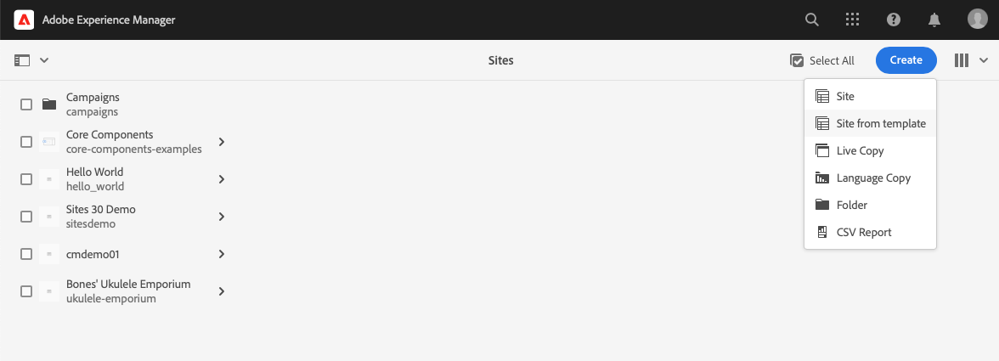
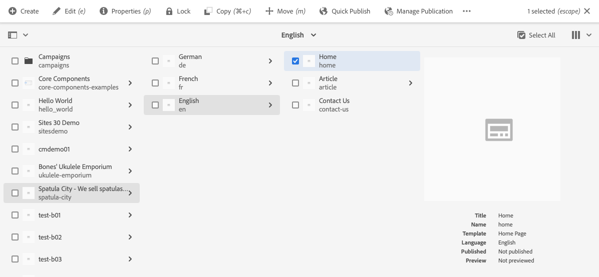
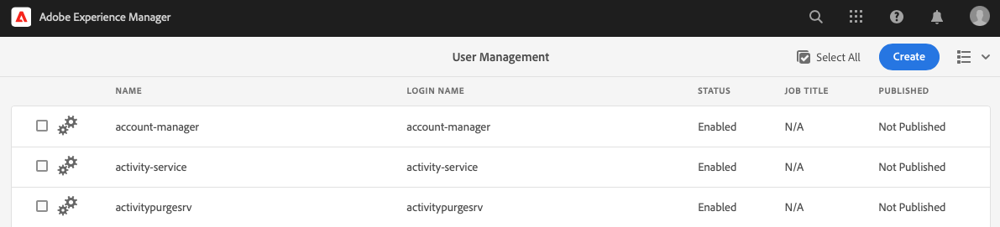
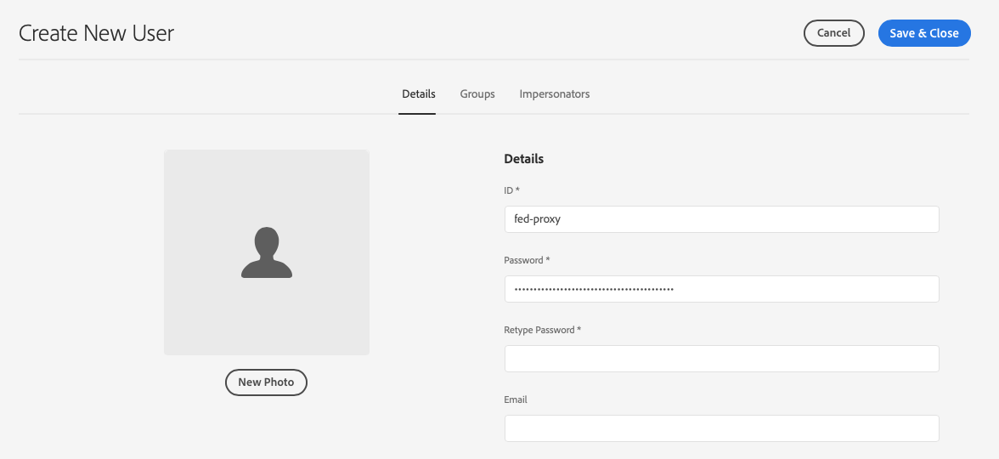

# Site maken van sjabloon {#create-site-from-template}

{{traditional-aem}}

Leer hoe u snel een AEM-site kunt maken met een sitesjabloon.

## Het verhaal tot nu toe {#story-so-far}

In het vorige document van de reis van de Aanmaak van de Plaats van AEM Snelle, [ Begrijp Cloud Manager en het Snelle Werkschema van de Aanmaak van de Plaats ](cloud-manager.md), leerde u over Cloud Manager en hoe het het nieuwe Snelle proces van de Aanmaak van de Plaats verbindt en u zou nu moeten:

* Begrijp hoe AEM Sites en Cloud Manager samenwerken om front-end ontwikkeling te vergemakkelijken
* Ontdek hoe de stap voor aanpassing aan de voorkant volledig losgekoppeld is van AEM en geen AEM-kennis vereist.

Dit artikel bouwt op die grondbeginselen voort zodat kunt u de eerste configuratiestap nemen en een plaats voor een malplaatje tot stand brengen dat u later kunt aanpassen gebruikend voorste-eindhulpmiddelen.

## Doelstelling {#objective}

Dit document helpt u te begrijpen hoe u snel een AEM-site kunt maken met een sitesjabloon. Na het lezen moet u:

* Begrijp hoe u AEM Site-sjablonen kunt verkrijgen.
* Leer hoe u een site maakt met een sjabloon.
* Zie hoe u de sjabloon van uw nieuwe site kunt downloaden en aan de front-end ontwikkelaar kunt leveren.

## Verantwoordelijke rol {#responsible-role}

Dit deel van de reis is van toepassing op de beheerder van AEM.

## Sitesjablonen {#site-templates}

Sitesjablonen zijn een manier om basissite-inhoud te combineren tot een handig en herbruikbaar pakket. Sitesjablonen bevatten over het algemeen inhoud en structuur van de basissite en informatie over de siteopmaak om snel met de nieuwe site aan de slag te kunnen gaan. De werkelijke structuur is als volgt:

* `files`: map met de UI-kit, het XD-bestand en mogelijk andere bestanden
* `previews`: map met screenshots van de sitesjabloon
* `site`: Inhoudspakket met de inhoud die wordt gekopieerd voor elke site die met deze sjabloon wordt gemaakt, zoals paginasjablonen, pagina&#39;s enzovoort.
* `theme`: bronnen van het sjabloonthema om de weergave van de site te wijzigen, zoals CSS, JavaScript enzovoort.

Sjablonen zijn krachtig omdat ze herbruikbaar zijn, zodat de auteurs van de inhoud snel een site kunnen maken. En aangezien u veelvoudige malplaatjes in uw installatie van AEM kunt hebben, hebt u de flexibiliteit om aan diverse bedrijfsbehoeften te voldoen.

>[!NOTE]
>
>De sitesjabloon mag niet worden verward met paginasjablonen. Sitesjablonen die hier worden beschreven, definiëren de algemene structuur van een site. Een paginasjabloon definieert de structuur en initiële inhoud van een afzonderlijke pagina.

## Sitesjabloon verkrijgen {#obtaining-template}

De eenvoudigste manier om begonnen te worden is de recentste versie van het Malplaatje van de Plaats van AEM Standaard van zijn bewaarplaats GitHub [ te downloaden.](https://github.com/adobe/aem-site-template-standard/releases)

Na het downloaden kunt u het net als elk ander pakket uploaden naar uw AEM-omgeving. Zie de [ Extra sectie van Middelen ](#additional-resources) voor details op hoe te met pakketten werken als u meer informatie over dit onderwerp nodig hebt.

>[!TIP]
>
>Het AEM Standard Site-sjabloon kan worden aangepast aan de behoeften van uw project en kan verdere aanpassing overbodig maken. Dit onderwerp valt echter buiten het bereik van deze reis. Zie de documentatie GitHub van het StandaardMalplaatje van de Plaats voor meer informatie.

>[!TIP]
>
>U kunt het malplaatje van bron als deel van uw projectwerkschema ook verkiezen om te bouwen. Dit onderwerp valt echter buiten het bereik van deze reis. Zie de documentatie GitHub van het StandaardMalplaatje van de Plaats voor meer informatie.

## Sjabloon van site installeren {#installing-template}

Het is eenvoudig om een site te maken met een sjabloon.

1. Aanmelden bij uw AEM-ontwerpomgeving en naar de Sites-console navigeren

   * `https://<your-author-environment>.adobeaemcloud.com/sites.html/content`

1. Selecteer **creeer** bij het hoogste recht van het scherm en van het drop-down menu uitgezocht **Plaats van malplaatje**.

   

1. In de Create tovenaar van de Plaats, uitgezochte **Invoer** bij de bovenkant van de linkerkolom.

   

1. In dossierbrowser, bepaal de plaats van het malplaatje [ u eerder ](#obtaining-template) downloadde en **selecteert uploadt**.

1. Zodra het geüpload, verschijnt het in de lijst van beschikbare malplaatjes. Selecteer het om het te selecteren (die ook informatie over het malplaatje in de juiste kolom) openbaart en dan **daarna** selecteert.

   

1. Geef een titel op voor uw site. U kunt een sitenaam opgeven of genereren op basis van de titel, als u deze weglaat.

   * De titel van de site wordt weergegeven in de titelbalk van browsers.
   * De sitenaam wordt onderdeel van de URL.

1. Selecteer **creeer** en de nieuwe plaats wordt gecreeerd van het plaatssjabloon.

   

1. In de bevestigingsdialoog die verschijnt, uitgezocht **Gedaan**.

   

1. In de plaatsenconsole, is de nieuwe plaatsen zichtbaar en kan worden genavigeerd om zijn basisstructuur te onderzoeken zoals die door het malplaatje wordt bepaald.

   

Inhoudsauteurs kunnen nu beginnen met ontwerpen.

## Is verdere aanpassing vereist? {#customization-required}

Sitesjablonen zijn zeer krachtig en flexibel en elk gewenst aantal kan worden gemaakt voor een project, zodat u gemakkelijk sitescheidingen kunt maken. Afhankelijk van het niveau van aanpassing die reeds op het plaatsmalplaatje wordt uitgevoerd u gebruikt, kunt u zelfs geen extra front-end aanpassing nodig hebben.

* Gefeliciteerd als uw site geen extra aanpassing vereist! Uw reis eindigt hier!
* Als u nog extra front-end aanpassing nodig hebt, of als u eenvoudig het volledige proces wilt begrijpen voor het geval u toekomstige aanpassing nodig hebt, blijft het lezen.

## Voorbeeld van pagina {#example-page}

Als u extra front-end aanpassing vereist, houd in mening dat de front-end ontwikkelaar niet met de details van uw inhoud vertrouwd kan zijn. Daarom is het een goed idee om de ontwikkelaar van een weg aan typische inhoud te voorzien die als basis van verwijzing kan worden gebruikt aangezien het thema wordt aangepast. Een typisch voorbeeld is de homepage voor de hoofdtaal van de plaats.

1. In plaatsen browser, navigeer aan de homepage van de hoofdtaal van de plaats en selecteer dan de pagina om het te selecteren en dan **uitgezocht geef** in de menubar uit.

   

1. In de redacteur, selecteer de **knoop van de Informatie van de Pagina** in de toolbar en dan **Mening zoals gepubliceerd**.

   

1. Kopieer op het tabblad dat wordt geopend het pad van de inhoud van de adresbalk. Het zal er ongeveer als `/content/<your-site>/en/home.html?wcmmode=disabled` uitzien.

   

1. Sla het pad op dat u later aan de front-end ontwikkelaar wilt geven.

## Het thema downloaden {#download-theme}

Nu de site is gemaakt, kan het thema van de site dat door de sjabloon wordt gegenereerd, worden gedownload en aan de front-end ontwikkelaar worden doorgegeven voor aanpassing.

1. Op de plaatsenconsole, toon het **spoor van de Plaats**.

   

1. Selecteer de wortel van uw nieuwe plaats en selecteer dan **de Bronnen van het Thema van de Download** in de plaats spoorstaaf.

   

U hebt nu een kopie van de bronbestanden voor thema&#39;s in uw downloadbestanden.

## Proxy-gebruiker instellen {#proxy-user}

Als u wilt dat de front-end ontwikkelaar de aanpassingen voorvertoont met AEM-inhoud van uw site, moet u een proxygebruiker instellen.

1. In AEM van belangrijkste navigatie gaat naar **Hulpmiddelen** > **Veiligheid** > **Gebruikers**.
1. In de console van het gebruikersbeheer, uitgezochte **creeert**.

   
1. In **creeer Nieuwe Gebruiker** venster u moet minstens verstrekken:
   * **identiteitskaart** - neem nota van deze waarde aangezien u het aan de front-end ontwikkelaar moet verstrekken.
   * **Wachtwoord** - sparen deze waarde veilig in een wachtwoordkluis aangezien u het aan de front-end ontwikkelaar moet verstrekken.

   

1. Op het **lusje van Groepen**, voeg de volmachtsgebruiker aan de `contributors` groep toe.
   * Als u de term `contributors` typt, wordt de functie voor automatisch aanvullen in AEM geactiveerd, zodat u de groep gemakkelijk kunt selecteren.

   

1. Selecteer **sparen &amp; Sluiten**.

U hebt de configuratie nu voltooid. Inhoudsauteurs kunnen nu beginnen met het maken van inhoud voor het voorbereiden van de site, zodat ze deze in de volgende stap van de reis op de voorgrond kunnen aanpassen.

## Volgende functies {#what-is-next}

Nu u dit deel van de AEM Quick Site Creation-reis hebt voltooid, kunt u het volgende doen:

* Begrijp hoe u AEM Site-sjablonen kunt verkrijgen.
* Leer hoe u een site maakt met een sjabloon.
* Zie hoe u de sjabloon van uw nieuwe site kunt downloaden en aan de front-end ontwikkelaar kunt leveren.

Bouw op deze kennis voort en ga uw reis van het Gemaakt van de Plaats van AEM Snelle door het document [ eerst te herzien Opstelling Uw Pijpleiding ](pipeline-setup.md) voort, waar u een front-end pijpleiding zult creëren om de aanpassing van het thema van uw plaats te beheren.

## Aanvullende bronnen {#additional-resources}

Terwijl het wordt geadviseerd dat u zich op het volgende deel van de Snelle reis van de Verwezenlijking van de Plaats door de document [ Reeks te herzien Uw Pijpleiding ](pipeline-setup.md) beweegt, zijn het volgende sommige extra, facultatieve middelen die een diepere duik op sommige die concepten doen in dit document worden vermeld, maar zij worden niet vereist om op de reis verder te gaan.

* [ het StandaardMalplaatje van de Plaats van AEM ](https://github.com/adobe/aem-site-template-standard) - dit is de bewaarplaats GitHub van het malplaatje van de Plaats van AEM Standaard.
* [ het Organiseren van Pagina&#39;s ](/help/sites-cloud/authoring/sites-console/organizing-pages.md) - Deze gids specificeert hoe te om de pagina&#39;s van uw Plaats van AEM te organiseren.
* [ Creërend Pagina&#39;s ](/help/sites-cloud/authoring/sites-console/creating-pages.md) - Deze gids bepaalt hoe te om nieuwe pagina&#39;s aan uw plaats toe te voegen.
* [ het Leiden Pagina&#39;s ](/help/sites-cloud/authoring/sites-console/managing-pages.md) - Deze gids bepaalt hoe te om de pagina&#39;s van uw plaats te beheren met inbegrip van het bewegen, het kopiëren, en het schrappen.
* [ hoe te met Pakket ](/help/implementing/developing/tools/package-manager.md) te werken - de Pakketten laten het invoeren en het uitvoeren van bewaarplaatsinhoud toe. In dit document wordt uitgelegd hoe u met pakketten werkt in AEM 6.5. Dit geldt ook voor AEMaaCS.
* [ Documentatie van het Beleid van de Plaats ](/help/sites-cloud/administering/site-creation/create-site.md) - Controle uit de technische documenten op plaatsverwezenlijking voor meer details op de Snelle eigenschappen van het hulpmiddel van de Aanmaak van de Plaats.
* [ creeer of voeg vormen aan een pagina van AEM Sites ](/help/forms/create-or-add-an-adaptive-form-to-aem-sites-page.md) toe - leer geleidelijke technieken en beste praktijken voor het integreren van vormen in uw website, die uw digitale ervaringen voor maximumeffect optimaliseren.
