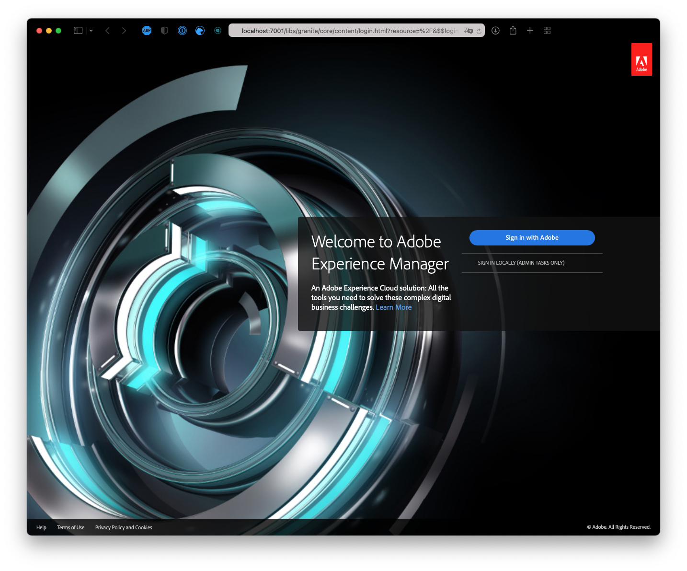

# Het sitethema aanpassen {#customize-the-site-theme}

{{traditional-aem}}

Leer hoe u het sitethema hebt gemaakt, hoe u het kunt aanpassen en hoe u het kunt testen met live AEM-inhoud.

## Het verhaal tot nu toe {#story-so-far}

In het vorige document van de reis van de Aanmaak van de Plaats van AEM Snelle, [ wint de Informatie van de Toegang van de Toegang van de Bewaarplaats van de it ](retrieve-access.md) terug, leerde u hoe de front-end ontwikkelaarsgebruikers Cloud Manager om tot informatie van de gokbewaarplaats toegang te hebben, en u zou nu moeten:

* Begrijp op een hoog niveau wat Cloud Manager is.
* U hebt uw gegevens opgehaald voor toegang tot de AEM-kit zodat u uw aanpassingen kunt doorvoeren.

Dit deel van de reis neemt de volgende stap en graaft in het plaatsthema en toont u hoe te om het aan te passen en dan die aanpassingen te begaan gebruikend de toegangsgeloofsbrieven u terugwond.

## Doelstelling {#objective}

In dit document wordt uitgelegd hoe het AEM-sitethema is samengesteld, hoe u het kunt aanpassen en hoe u het kunt testen met live AEM-inhoud. Na het lezen moet u:

* Begrijp de basisstructuur van het sitethema en hoe u dit kunt bewerken.
* Zie hoe u uw themaaanpassingen kunt testen met echte AEM-inhoud via lokale proxy.
* Weet hoe u uw wijzigingen kunt doorvoeren in de AEM Git-opslagplaats.

## Verantwoordelijke rol {#responsible-role}

Dit deel van de reis geldt voor de front-end ontwikkelaar.

## Begrijp de Themastructuur {#understand-theme}

Extraheer het thema dat door de AEM-beheerder wordt aangeboden naar de locatie waar u het thema wilt bewerken en open het in de gewenste editor.


U ziet dat het thema een typisch front-end project is. De belangrijkste onderdelen van de structuur zijn:

* `src/main.ts`: Het belangrijkste ingangspunt van uw JS &amp; CSS-thema
* `src/site`: JS- en CSS-bestanden die van toepassing zijn op de gehele site
* `src/components`: JS- en CSS-bestanden die specifiek zijn voor AEM-componenten
* `src/resources`: statische bestanden zoals pictogrammen, logo&#39;s en lettertypen

>[!TIP]
>
>Als u meer over het standaard de plaatsthema van AEM zou willen weten, zie de verbinding GitHub in de [ Extra sectie van Middelen ](#additional-resources) aan het eind van dit document.

Als u vertrouwd bent met de structuur van het themaproject, start u de lokale proxy zodat u in real-time alle themaaanpassingen kunt zien op basis van de werkelijke AEM-inhoud.

## De lokale proxy starten {#starting-proxy}

1. Navigeer vanaf de opdrachtregel naar de basis van het thema op uw lokale computer.
1. Uitvoeren `npm install` en npm halen gebiedsdelen terug en installeert het project.

   

1. Uitvoeren `npm run live` en de proxyserver start.

   

1. Wanneer de proxyserver wordt gestart, opent deze automatisch een browser naar `http://localhost:7001/` . Selecteer **LOKAAL ONDERTEKENEN (ALLEEN TAKEN VAN ADMIN)** en ondertekenen binnen met de geloofsbrieven van de volmachtsgebruiker die aan u door de beheerder van AEM worden verstrekt.

   

   >[!TIP]
   >
   >Als u deze geloofsbrieven niet hebt, spreek met uw beheerder die de [ sectie van de Gebruiker van de Volmacht van de Opstelling van Create Plaats van het artikel van het Malplaatje ](/help/journey-sites/quick-site/create-site.md#proxy-user) in deze reis van verwijzingen voorzien.

1. Als u zich eenmaal hebt aangemeld, wijzigt u de URL in de browser zodat deze verwijst naar het pad naar de voorbeeldinhoud die de AEM-beheerder u heeft verschaft.

   * Als het opgegeven pad bijvoorbeeld `/content/<your-site>/en/home.html?wcmmode=disabled` was
   * U verandert de URL in `http://localhost:7001/content/<your-site>/en/home.html?wcmmode=disabled`

   

U kunt op de site navigeren om de inhoud te verkennen. De site wordt live opgehaald uit het live AEM-exemplaar, zodat u uw thema kunt aanpassen op basis van echte inhoud.

## Het thema aanpassen {#customize-theme}

Nu kunt u beginnen het thema aan te passen. In het volgende voorbeeld ziet u hoe u uw wijzigingen live kunt zien via de proxy.

1. Open het bestand in de editor `<your-theme-sources>/src/site/_variables.scss`

    uit

1. Bewerk de variabele `$color-background` en stel deze in op een andere waarde dan wit. In dit voorbeeld wordt `orange` gebruikt.

   

1. Wanneer u het bestand opslaat, ziet u dat de proxyserver de wijziging herkent via de regel `[Browsersync] File event [change]` .

   

1. Als u terugschakelt naar uw browser van de proxyserver, is de wijziging direct zichtbaar.

   

U kunt het thema blijven aanpassen op basis van de vereisten die de AEM-beheerder u biedt.

## Wijzigingen vastleggen {#committing-changes}

Zodra uw aanpassingen volledig zijn, kunt u hen aan de git bewaarplaats van AEM begaan. Eerst moet u de repository klonen op uw lokale computer.

1. Navigeer vanaf de opdrachtregel naar de locatie waar u de repo wilt klonen.
1. Voer het bevel uit u [ eerder van Cloud Manager ](retrieve-access.md) wordt teruggewonnen. Deze zou vergelijkbaar moeten zijn met `git clone https://git.cloudmanager.adobe.com/<my-org>/<my-program>/` . Gebruik de gebruikersnaam en het wachtwoord van de git die [ u in het vorige deel van deze reis ](retrieve-access.md) terugwint.

   

1. Verplaats het themaproject dat u aan het bewerken was naar het gekloonde antwoord met een opdracht vergelijkbaar met `mv <site-theme-sources> <cloned-repo>`
1. Wijs in de map met de gekloonde repo de themabestanden toe waarnaar u zojuist hebt verplaatst met de volgende opdrachten.

   ```text
   git add .
   git commit -m "Adding theme sources"
   git push
   ```

1. De aanpassingen worden doorgestuurd naar de AEM git-opslagplaats.

   

Uw aanpassingen worden nu veilig opgeslagen in de AEM-it-opslagplaats.

## Volgende functies {#what-is-next}

Nu u dit deel van de AEM Quick Site Creation-reis hebt voltooid, kunt u het volgende doen:

* Begrijp de basisstructuur van het sitethema en hoe u dit kunt bewerken.
* Zie hoe u uw themaaanpassingen kunt testen met echte AEM-inhoud via lokale proxy.
* Weet hoe u uw wijzigingen kunt doorvoeren in de AEM Git-opslagplaats.

Bouw op deze kennis voort en zet uw reis van de Gemaakt van de Plaats van AEM Snelle door het document [ opnieuw te bekijken stelt Uw Aangepast Thema ](deploy-theme.md) op, waar u leert hoe te om het thema op te stellen gebruikend de front-end pijpleiding.

## Aanvullende bronnen {#additional-resources}

Terwijl het wordt geadviseerd dat u zich op het volgende deel van de Snelle reis van de Verwezenlijking van de Plaats door het document [ te herzien uw Aangepast Thema ](deploy-theme.md) opstelt, zijn het volgende sommige extra, facultatieve middelen die een diepere duik op sommige die concepten doen in dit document worden vermeld, maar zij worden niet vereist om op de reis verder te gaan.

* [ het Thema van de Plaats van AEM ](https://github.com/adobe/aem-site-template-standard-theme-e2e) - dit is de bewaarplaats GitHub van het Thema van de Plaats van AEM.
* [ npm ](https://www.npmjs.com) - de thema&#39;s van AEM die worden gebruikt om plaatsen snel te bouwen zijn gebaseerd op npm.
* [ webpack ](https://webpack.js.org) - de thema&#39;s van AEM die worden gebruikt om sites snel te bouwen baseren zich op webpack.
