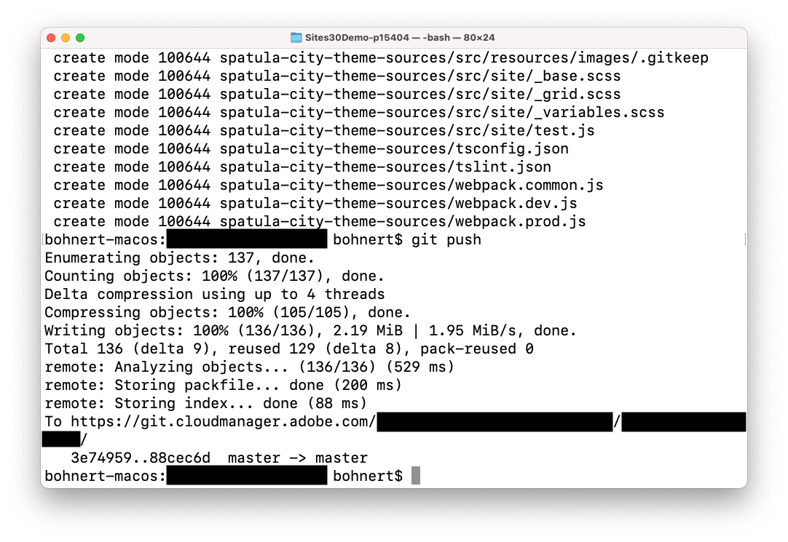

# Het sitethema aanpassen {#customize-the-site-theme}

Leer hoe het thema van de site is opgebouwd, hoe u het kunt aanpassen en hoe u live-AEM kunt testen.

## Het verhaal tot nu toe {#story-so-far}

In het vorige document van de AEM Snelle reis van de Plaats, [Haal toegangsgegevens uit Git Repository op,](retrieve-access.md) U hebt geleerd hoe de front-end ontwikkelaars gebruikers Cloud Manager toegang hebben tot informatie in de git-opslagplaats en u moet nu:

* Begrijp op een hoog niveau wat Cloud Manager is.
* Uw referenties zijn opgehaald voor toegang tot de AEM, zodat u uw aanpassingen kunt doorvoeren.

Dit deel van de reis neemt de volgende stap en graaft in het plaatsthema en toont u hoe te om het aan te passen en dan die aanpassingen te begaan gebruikend de toegangsgeloofsbrieven u terugwond.

## Doelstelling {#objective}

In dit document wordt uitgelegd hoe het thema van de AEM site is opgebouwd, hoe u het kunt aanpassen en hoe u het kunt testen met live AEM-inhoud. Na het lezen moet u:

* Begrijp de basisstructuur van het sitethema en hoe u dit kunt bewerken.
* Zie hoe u themaaanpassingen kunt testen met echte AEM inhoud via lokale proxy.
* Weet hoe u uw wijzigingen in de AEM-git-opslagplaats kunt doorvoeren.

## Verantwoordelijke rol {#responsible-role}

Dit deel van de reis geldt voor de front-end ontwikkelaar.

## Begrijp de Themastructuur {#understand-theme}

Extraheer het thema dat door de AEM beheerder wordt geboden naar de locatie waar u het thema wilt bewerken en open het in de gewenste editor.


U ziet dat het thema een typisch front-end project is. De belangrijkste onderdelen van de structuur zijn:

* `src/main.ts`: Het belangrijkste ingangspunt van uw thema JS &amp; CSS
* `src/site`: JS- en CSS-bestanden die van toepassing zijn op de gehele site
* `src/components`: JS- en CSS-bestanden die specifiek zijn voor AEM componenten
* `src/resources`: Statische bestanden zoals pictogrammen, logo&#39;s en lettertypen

>[!TIP]
>
>Als u meer over het standaard AEM plaatsthema zou willen weten, zie de verbinding GitHub in [Aanvullende bronnen](#additional-resources) aan het einde van dit document.

Zodra u met de structuur van het themaproject vertrouwd bent, begin de lokale volmacht zodat kunt u om het even welke themaaanpassingen in real time zien die op daadwerkelijke AEM inhoud worden gebaseerd.

## De lokale proxy starten {#starting-proxy}

1. Navigeer vanaf de opdrachtregel naar de basis van het thema op uw lokale computer.
1. Uitvoeren `npm install` en npm wint gebiedsdelen terug en installeert het project.

   

1. Uitvoeren `npm run live` en de proxyserver wordt gestart.

   

1. Wanneer de proxyserver wordt gestart, wordt automatisch een browser geopend voor `http://localhost:7001/`. Selecteren **LOKAAL AANMELDEN (ALLEEN TAKEN BEHEREN)** en meld u aan met de gegevens van de proxygebruiker die u van de AEM beheerder hebt ontvangen.

   

   >[!TIP]
   >
   >Als u deze geloofsbrieven niet hebt, spreek met uw beheerder die van verwijzingen voorzien [Sectie Proxy-gebruiker instellen van het artikel Site maken van sjabloon](/help/journey-sites/quick-site/create-site.md#proxy-user) tijdens deze reis.

1. Als u zich eenmaal hebt aangemeld, wijzigt u de URL in de browser zodat deze verwijst naar het pad naar de voorbeeldinhoud die de AEM aan u heeft gegeven.

   * Als het opgegeven pad bijvoorbeeld `/content/<your-site>/en/home.html?wcmmode=disabled`
   * U wijzigt de URL in `http://localhost:7001/content/<your-site>/en/home.html?wcmmode=disabled`

   

U kunt op de site navigeren om de inhoud te verkennen. De site wordt live opgehaald uit de live AEM-instantie, zodat u uw thema kunt aanpassen aan de werkelijke inhoud.

## Het thema aanpassen {#customize-theme}

Nu kunt u beginnen het thema aan te passen. In het volgende voorbeeld ziet u hoe u uw wijzigingen live kunt zien via de proxy.

1. Open het bestand in de editor `<your-theme-sources>/src/site/_variables.scss`

   

1. De variabele bewerken `$color-background` en stelt u deze in op een andere waarde dan wit. In dit voorbeeld: `orange` wordt gebruikt.

   

1. Wanneer u het bestand opslaat, ziet u dat de proxyserver de wijziging via de regel herkent `[Browsersync] File event [change]`.

   

1. Als u terugschakelt naar uw browser van de proxyserver, is de wijziging direct zichtbaar.

   

U kunt doorgaan met het aanpassen van het thema op basis van de vereisten die de AEM u biedt.

## Wijzigingen vastleggen {#committing-changes}

Zodra uw aanpassingen volledig zijn, kunt u hen aan de AEM git bewaarplaats begaan. Eerst moet u de repository klonen op uw lokale computer.

1. Navigeer vanaf de opdrachtregel naar de locatie waar u de repo wilt klonen.
1. Voer het bevel uit u [eerder opgehaald uit Cloud Manager.](retrieve-access.md) Het moet vergelijkbaar zijn met `git clone https://git.cloudmanager.adobe.com/<my-org>/<my-program>/`. Gebruik de gebruikersnaam en het wachtwoord voor de it [u in het vorige gedeelte van deze reis terugwint.](retrieve-access.md)

   

1. Verplaats het themaproject dat u bewerkt naar de gekloonde reactie met een opdracht die lijkt op `mv <site-theme-sources> <cloned-repo>`
1. Wijs in de map met de gekloonde repo de themabestanden toe waarnaar u zojuist hebt verplaatst met de volgende opdrachten.

   ```text
   git add .
   git commit -m "Adding theme sources"
   git push
   ```

1. De aanpassingen worden doorgestuurd naar de AEM git-opslagplaats.

   

Uw aanpassingen worden nu veilig opgeslagen in de AEM git-opslagplaats.

## Volgende functies {#what-is-next}

Nu u dit gedeelte van de AEM Quick Site Creation-reis hebt voltooid, moet u:

* Begrijp de basisstructuur van het sitethema en hoe u dit kunt bewerken.
* Zie hoe u themaaanpassingen kunt testen met echte AEM inhoud via lokale proxy.
* Weet hoe u uw wijzigingen in de AEM-git-opslagplaats kunt doorvoeren.

Gebaseerd op deze kennis en doorgaan met uw AEM snelle site-creatie door het document opnieuw te bekijken [Uw aangepast thema implementeren,](deploy-theme.md) waar u leert hoe te om het thema op te stellen gebruikend de front-end pijpleiding.

## Aanvullende bronnen {#additional-resources}

Terwijl u wordt aangeraden naar het volgende gedeelte van de reis Snel site maken te gaan door het document te bekijken [Uw aangepast thema implementeren,](deploy-theme.md) hieronder volgen enkele aanvullende , optionele bronnen die een dieper beeld geven van bepaalde in dit document genoemde concepten , maar die niet verplicht zijn om op de reis verder te gaan .

* [Sitethema AEM](https://github.com/adobe/aem-site-template-standard-theme-e2e) - Dit is de bewaarplaats GitHub van het Thema van de Plaats van de AEM.
* [npm](https://www.npmjs.com) - AEM thema&#39;s die worden gebruikt om sites snel te bouwen, zijn gebaseerd op npm.
* [webpack](https://webpack.js.org) - AEM thema&#39;s die worden gebruikt om sites snel op te bouwen, zijn gebaseerd op webpack.
