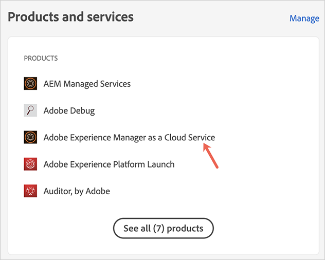

# Toegang verlenen aan de front-end ontwikkelaar {#grant-fed-access}

Aan boord van de front-end ontwikkelaars in Cloud Manager zodat hebben zij toegang tot uw AEM plaats git bewaarplaats en pijpleiding.

## Het verhaal tot nu toe {#story-so-far}

In het vorige document van de AEM Snelle reis van de Plaats, [Opstelling uw pijpleiding,](pipeline-setup.md) u leerde hoe te om een front-end pijpleiding tot stand te brengen om de aanpassing van het thema van uw plaats te beheren, en u zou nu moeten:

* Begrijp wat een front-end pijpleiding is.
* Weet hoe u een front-end pijplijn instelt in Cloud Manager.

U moet nu uw front-end ontwikkelaar toegang tot Cloud Manager verlenen via het instapproces, zodat de front-end ontwikkelaar toegang heeft tot de AEM git-opslagplaats en de pijpleiding die u hebt gemaakt.

## Doelstelling {#objective}

Het proces om toegang tot Cloud Manager te verlenen en gebruikersrollen toe te wijzen aan uw gebruikers wordt genoemd onboarding. In dit document wordt een overzicht gegeven van de belangrijkste stappen voor het instappen van een front-end ontwikkelaar. Na het lezen weet u:

* Een front-end ontwikkelaar toevoegen als een gebruiker.
* Hoe te om de vereiste rollen aan de front-end ontwikkelaar te verlenen.

>[!TIP]
>
>Er is een volledige documentatietraject dat is gewijd aan het opnemen van uw team op AEM als Cloud-service, gekoppeld aan in het dialoogvenster [Sectie Aanvullende bronnen](#additional-resources) van dit document, als u meer details over het proces nodig hebt.

## Verantwoordelijke rol {#responsible-role}

Dit deel van de reis is van toepassing op de beheerder van de Manager van de Wolk.

## Vereisten {#requirements}

* U moet lid zijn van **Zakelijke eigenaar** rol in Cloud Manager.
* Je moet een **Sys Admin** in Cloud Manager.
* U moet toegang tot de Admin Console hebben.

## Voeg de Front-End Ontwikkelaar als Gebruiker toe {#add-fed-user}

Eerst moet u de front-end ontwikkelaar als gebruiker toevoegen door de Admin Console te gebruiken.

1. Aanmelden bij de Admin Console op [https://adminconsole.adobe.com/](https://adminconsole.adobe.com/).

1. Nadat u zich hebt aangemeld, krijgt u een overzichtspagina te zien die lijkt op de volgende afbeelding.

   

1. Controleer de naam van de org in de rechterbovenhoek van het scherm en zorg ervoor dat u zich op de juiste org bevindt.

   

1. Selecteren **Adobe Experience Manager as a Cloud Service** van de **Producten en diensten** kaart.

   

1. U ziet de lijst met vooraf geconfigureerde productprofielen voor Cloud Manager. Als deze profielen niet worden weergegeven, neemt u contact op met de beheerder van Cloud Manager omdat u mogelijk niet de juiste machtigingen op uw org hebt.

   

1. Als u de front-end ontwikkelaar wilt toewijzen aan de juiste profielen, selecteert u de optie **Gebruikers** en vervolgens de **Gebruiker toevoegen** knop.

   

1. In de **Gebruikers aan uw team toevoegen** typt u de e-mailid van de gebruiker die u wilt toevoegen. Selecteer Adobe ID bij Type id als de Federated ID voor uw teamleden nog niet is ingesteld.

   

1. In de **Product** Selecteer eerst het plusteken en selecteer vervolgens **Adobe Experience Manager as a Cloud Service** en wijst de **Implementatiebeheer** en **Ontwikkelaar** productprofielen voor de gebruiker.

   

1. Selecteren **Opslaan** en er wordt een welkomstbericht verzonden naar de front-end ontwikkelaar die u als gebruiker hebt toegevoegd.

De uitgenodigde front-end ontwikkelaar kan tot de Manager van de Wolk toegang hebben door de verbinding in welkome e-mail te klikken en zich binnen te ondertekenen gebruikend hun Adobe ID.

## Overhandigen aan front-end ontwikkelaar {#handover}

Met een e-mailuitnodiging aan Cloud Manager onderweg naar de front-end ontwikkelaar, kunnen u en de AEM nu de front-end ontwikkelaar de resterende benodigde informatie geven om met aanpassingen te beginnen.

* A [pad naar typische inhoud](#example-page)
* De themabron die [u hebt gedownload](#download-theme)
* De [gebruikersgegevens voor proxy](#proxy-user)
* De naam van het programma of de URL ervan [gekopieerd uit Cloud Manager](pipeline-setup.md#login)
* De ontwerpvereisten aan de voorzijde

## Volgende functies {#what-is-next}

Nu u dit gedeelte van de AEM snelle reis van de Plaats hebt voltooid zou u moeten weten:

* Een front-end ontwikkelaar toevoegen als een gebruiker.
* Hoe te om de vereiste rollen aan de front-end ontwikkelaar te verlenen.

Gebaseerd op deze kennis en doorgaan met uw AEM snelle site-creatie door het document opnieuw te bekijken [Haal toegangsgegevens uit Git Repository op,](retrieve-access.md) waarin het perspectief exclusief wordt overgeschakeld naar de front-end ontwikkelaar en wordt uitgelegd hoe de front-end ontwikkelaarsgebruikers Cloud Manager toegang krijgen tot informatie over de git-opslagplaats.

## Aanvullende bronnen {#additional-resources}

Terwijl u wordt aangeraden naar het volgende gedeelte van de reis Snel site maken te gaan door het document te bekijken [Open Front-End Developer Credentials,](retrieve-access.md) hieronder volgen enkele aanvullende , optionele bronnen die een dieper beeld geven van bepaalde in dit document genoemde concepten , maar die niet verplicht zijn om op de reis verder te gaan .

* [Onboarding Journaal](/help/journey-onboarding/overview.md) - Deze gids dient als uitgangspunt om ervoor te zorgen dat uw teams opstelling zijn en toegang tot AEM as a Cloud Service hebben.
