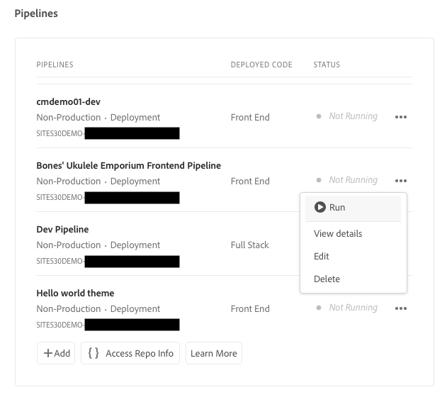

# Uw pijplijn instellen {#set-up-your-pipeline}

Maak een front-end pijplijn om de aanpassing van het thema van uw site te beheren.

## Het verhaal tot nu toe {#story-so-far}

In het vorige document van de AEM Snelle reis van de Plaats, [Site maken van sjabloon,](create-site.md) U hebt geleerd hoe u een sitesjabloon kunt gebruiken om snel een AEM site te maken die verder kan worden aangepast met front-end hulpprogramma&#39;s. Nu moet u het volgende doen:

* Begrijp hoe u AEM Sitesjablonen kunt verkrijgen.
* Leer hoe u een site maakt met een sjabloon.
* Zie hoe u de sjabloon van uw nieuwe site kunt downloaden en aan de front-end ontwikkelaar kunt leveren.

Dit artikel bouwt op die grondbeginselen voort zodat kunt u opstelling een front-end pijpleiding, die de front-end ontwikkelaar later in de reis zal gebruiken om front-end aanpassingen op te stellen.

## Doelstelling {#objective}

Dit document helpt u front-end pijpleidingen en hoe te om één te creëren om de plaatsing van het aangepaste thema van uw plaats te beheren te begrijpen. Na het lezen moet u:

* Begrijp wat een front-end pijpleiding is.
* Weet hoe u een front-end pijplijn instelt in Cloud Manager.

## Verantwoordelijke rol {#responsible-role}

Dit deel van de reis is van toepassing op de beheerder van de Manager van de Wolk.

## Vereisten {#requirements}

* U moet toegang hebben tot Cloud Manager.
* U moet lid zijn van de **Implementatiebeheer** rol in Cloud Manager.
* Er moet een git-repo voor de AEM-omgeving worden ingesteld in Cloud Manager.
   * Dit is in het algemeen al het geval voor elk actief project. Als dit echter niet het geval is, raadpleegt u de documentatie bij opslagplaatsen voor Cloud Manager die beschikbaar is onder de [Aanvullende bronnen](#additional-resources) sectie.

## Wat is een voorste pijpleiding {#front-end-pipeline}

Voor-end ontwikkeling omvat de aanpassing van JavaScript, CSS, en statische middelen die het stileren van uw AEM plaats bepalen. De front-end ontwikkelaar zal in hun eigen lokale milieu&#39;s werken om deze aanpassingen te maken. Zodra zij klaar zijn, worden de veranderingen geëngageerd aan de AEM git bewaarplaats. Maar zij zijn slechts geëngageerd aan de broncode. Ze leven nog niet.

De front-end pijpleiding neemt deze geëngageerde aanpassingen en stelt hen aan een AEM milieu, over het algemeen productie of non-production milieu&#39;s op.

Op deze manier kan de ontwikkeling aan de voorzijde afzonderlijk van en parallel aan elke volledige back-end ontwikkeling op AEM werken, die zijn eigen distributiepijpleidingen heeft.

>[!NOTE]
>
>De front-end pijpleidingen kunnen JavaScript, CSS, en statische middelen slechts opstellen om uw AEM plaats te stileren. Site-inhoud, zoals pagina&#39;s of elementen, kan niet via een pijplijn worden geïmplementeerd.

## Cloud Manager openen {#login}

1. Aanmelden bij Adobe Cloud Manager op [my.cloudmanager.adobe.com](https://my.cloudmanager.adobe.com/).

1. Cloud Manager geeft de verschillende beschikbare programma&#39;s weer. Selecteer de map die u wilt beheren. Als u slechts met AEM as a Cloud Service begint, hebt u waarschijnlijk slechts één programma beschikbaar.

   

U ziet nu een overzicht van uw programma. De pagina ziet er anders uit, maar is vergelijkbaar met dit voorbeeld.

Noteer de naam van het programma dat u hebt geopend of kopieer de URL. U moet dit later aan de front-end ontwikkelaar verstrekken.

## Een voorste pijplijn maken {#create-front-end-pipeline}

Nu u Cloud Manager hebt benaderd, kunt u een pijplijn voor front-end implementatie maken.

1. In de **Pijpleidingen** van de pagina Cloud Manager selecteert u de optie **Toevoegen** knop.

   

1. In het pop-upmenu dat onder het dialoogvenster **Toevoegen** knop selecteren **Niet-productiepijpleiding toevoegen** voor deze reis.

1. Op de **Configuratie** tabblad van het **Niet-productiepijpleiding toevoegen** dialoogvenster dat wordt geopend:
   * Selecteren **Implementatiepijp**.
   * Geef de pijpleiding een naam in het deelvenster **Naam niet-productiepijpleiding** veld.

   

1. Selecteren **Doorgaan**.

1. Op de **Broncode** tab:
   * Selecteren **Code frontend** als het type code dat moet worden geïmplementeerd.
   * Zorg ervoor dat de juiste omgeving is geselecteerd onder **In aanmerking komende implementatieomgevingen**.
   * Selecteer de juiste **Bewaarplaats**.
   * Definiëren welke **Git Branch** de pijpleiding moet worden gekoppeld .
   * Definieer de **Codelocatie** als de front-end ontwikkeling zich onder een bepaald pad in de geselecteerde opslagplaats bevindt. De standaardwaarde is de wortel van de bewaarplaats, maar vaak front-end ontwikkeling en achtereind zijn onder verschillende wegen.

   

1. Selecteren **Opslaan**.

De nieuwe pijpleiding wordt gecreeerd en zichtbaar in **Pijpleidingen** in het venster Cloud Manager. Tik op de ellips nadat u de naam van de pijplijn hebt weergegeven. U kunt dan desgewenst nog meer details bewerken of weergeven.

>[!TIP]
>
>Als u reeds met pijpleidingen in AEMaaCS vertrouwd bent en meer over de verschillen tussen de verschillende types pijpleidingen met inbegrip van verdere details over de voorste eindpijpleiding wilt leren, zie CI/CD Pijpleiding vormen - Cloud Servicen verbonden in [Aanvullende bronnen](#additional-resources) hieronder.

## Volgende functies {#what-is-next}

Nu u dit gedeelte van de AEM Quick Site Creation-reis hebt voltooid, moet u:

* Begrijp wat een front-end pijpleiding is.
* Weet hoe u een front-end pijplijn instelt in Cloud Manager.

Gebaseerd op deze kennis en doorgaan met uw AEM snelle site-creatie door het document opnieuw te bekijken [Toegang verlenen aan de Front-End Developer,](grant-access.md) waar u de front-end ontwikkelaars in Cloud Manager zult opnemen zodat zij toegang hebben tot uw AEM plaats git bewaarplaats en pijpleiding.

## Aanvullende bronnen {#additional-resources}

Terwijl u wordt aangeraden naar het volgende gedeelte van de reis Snel site maken te gaan door het document te bekijken [Pas het thema Site aan,](customize-theme.md) hieronder volgen enkele aanvullende , optionele bronnen die een dieper beeld geven van bepaalde in dit document genoemde concepten , maar die niet verplicht zijn om op de reis verder te gaan .

* [Documentatie van Cloud Manager](https://experienceleague.adobe.com/docs/experience-manager-cloud-service/onboarding/onboarding-concepts/cloud-manager-introduction.html) - Als u meer informatie wilt over de functies van Cloud Manager, kunt u de diepgaande technische documenten direct raadplegen.
* [Opslagplaatsen voor Cloud Manager](/help/implementing/cloud-manager/managing-code/cloud-manager-repositories.md) - Raadpleeg dit document als u meer informatie nodig hebt over het instellen en beheren van git-opslagruimten voor uw AEMaaCS-project.
* [CI/CD-pijpleiding configureren - Cloud Servicen](/help/implementing/cloud-manager/configuring-pipelines/introduction-ci-cd-pipelines.md) - Meer informatie over het instellen van pijpleidingen, zowel volledige stapel als front-end, vindt u in dit document.
