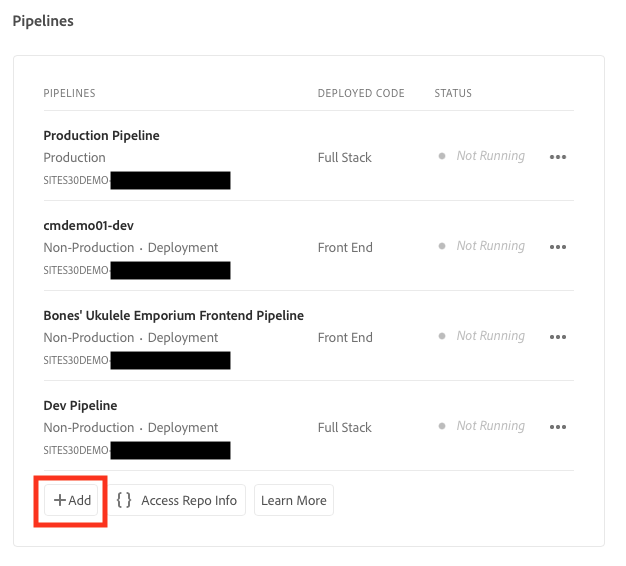
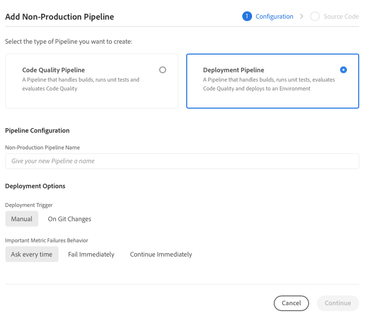

# Uw pijplijn instellen {#set-up-your-pipeline}

Maak een front-end pijplijn om de aanpassing van het thema van uw site te beheren.

## Het verhaal tot nu toe {#story-so-far}

In het vorige document van de AEM Snelle reis van de Aanmaak van de Plaats, [ creeer Plaats van Malplaatje ](create-site.md), leerde u hoe te om een plaatsmalplaatje te gebruiken om snel een AEM plaats tot stand te brengen die verder kan worden aangepast gebruikend voorste hulpmiddelen en nu zou u moeten nu:

* Begrijp hoe u AEM Sitesjablonen kunt verkrijgen.
* Leer hoe u een site maakt met een sjabloon.
* Zie hoe u de sjabloon van uw nieuwe site kunt downloaden en aan de front-end ontwikkelaar kunt leveren.

Dit artikel bouwt op die grondbeginselen voort zodat kunt u opstelling een front-end pijpleiding, die de front-end ontwikkelaar later in de reis zal gebruiken om front-end aanpassingen op te stellen.

## Doelstelling {#objective}

Dit document helpt u front-end pijpleidingen en hoe te om één te creëren om de plaatsing van het aangepaste thema van uw plaats te beheren te begrijpen. Na het lezen moet u:

* Begrijp wat een front-end pijpleiding is.
* Weet hoe u een front-end pijpleiding in Cloud Manager kunt opzetten.

## Verantwoordelijke rol {#responsible-role}

Dit deel van de reis is van toepassing op de beheerder van Cloud Manager.

## Vereisten {#requirements}

* Je moet toegang hebben tot Cloud Manager.
* U moet een lid van de **rol van de Manager van de Plaatsing** in Cloud Manager zijn.
* In Cloud Manager moet een git-repo voor de AEM worden opgezet.
   * Dit is in het algemeen al het geval voor elk actief project. Nochtans als het niet is, zie de documentatie van de Bewaarplaatsen van Cloud Manager beschikbaar onder de [ Extra sectie van Middelen ](#additional-resources).

## Wat is een voorste pijpleiding {#front-end-pipeline}

Voor-end ontwikkeling omvat de aanpassing van JavaScript, CSS, en statische middelen die het stileren van uw AEM plaats bepalen. De front-end ontwikkelaar zal in hun eigen lokale milieu&#39;s werken om deze aanpassingen te maken. Zodra zij klaar zijn, worden de veranderingen geëngageerd aan de AEM git bewaarplaats. Maar zij zijn slechts geëngageerd aan de broncode. Ze leven nog niet.

De front-end pijpleiding neemt deze geëngageerde aanpassingen en stelt hen aan een AEM milieu, over het algemeen productie of non-production milieu&#39;s op.

Op deze manier kan de ontwikkeling aan de voorzijde afzonderlijk van en parallel aan elke volledige back-end ontwikkeling op AEM werken, die zijn eigen distributiepijpleidingen heeft.

>[!NOTE]
>
>De front-end pijpleidingen kunnen JavaScript, CSS, en statische middelen slechts opstellen om uw AEM plaats te stileren. Site-inhoud, zoals pagina&#39;s of elementen, kan niet via een pijplijn worden geïmplementeerd.

## Toegang tot Cloud Manager {#login}

1. Logboek in Adobe Cloud Manager bij [ my.cloudmanager.adobe.com ](https://my.cloudmanager.adobe.com/).

1. Cloud Manager geeft een overzicht van de verschillende beschikbare programma&#39;s. Selecteer de map die u wilt beheren. Als je net met AEM as a Cloud Service begint, heb je waarschijnlijk maar één programma beschikbaar.

   

U ziet nu een overzicht van uw programma. De pagina ziet er anders uit, maar is vergelijkbaar met dit voorbeeld.

Noteer de naam van het programma dat u hebt geopend of kopieer de URL. U moet dit later aan de front-end ontwikkelaar verstrekken.

## Een voorste pijplijn maken {#create-front-end-pipeline}

Nu u Cloud Manager hebt benaderd, kunt u een pijpleiding voor front-end plaatsing tot stand brengen.

1. In de **sectie van Pijpleidingen** van de pagina van Cloud Manager, selecteer **toevoegen** knoop.

   

1. In pop-up menu dat onder **verschijnt voeg** knoop uitgezocht **toe Voeg niet-ProductiePijpleiding** voor deze reis toe.

1. Op het **lusje van de Configuratie** van **voeg niet-Productie pijplijn** dialoog toe die opent:
   * Selecteer **Pijpleiding van de Plaatsing**.
   * Verstrek de pijpleiding van een naam op het **niet-Productie gebied van de Naam van de Pijpleiding**.

    toe

1. Selecteer **verdergaan**.

1. Op het **Source Code** lusje:
   * Selecteer **Code van het Voorste Eind** als type van code om op te stellen.
   * Zorg ervoor dat het correcte milieu onder **In aanmerking komende Milieu&#39;s van de Plaatsing** wordt geselecteerd.
   * Selecteer de correcte **Bewaarplaats**.
   * Bepaal welke **Tak van het Git** de pijpleiding met zou moeten worden geassocieerd.
   * Bepaal de **Plaats van de Code** als de front-end ontwikkeling onder een bepaalde weg in de geselecteerde bewaarplaats wordt gevestigd. De standaardwaarde is de wortel van de bewaarplaats, maar vaak front-end ontwikkeling en achtereind zijn onder verschillende wegen.

   

1. Selecteer **sparen**.

De nieuwe pijpleiding wordt gecreeerd en zichtbaar in de **sectie van Pijpleidingen** van het venster van Cloud Manager. Tik op de ellips nadat u de naam van de pijplijn hebt weergegeven. U kunt dan desgewenst nog meer details bewerken of weergeven.

>[!TIP]
>
>Als u reeds vertrouwd met pijpleidingen in AEMaaCS bent en meer over de verschillen tussen de verschillende types pijpleidingen met inbegrip van verdere details over de voorste eindpijpleiding wilt leren, zie CI/CD Pijpleiding vormen - Cloud Servicen verbonden in de [ Extra hieronder sectie van Middelen ](#additional-resources).

## Volgende functies {#what-is-next}

Nu u dit gedeelte van de AEM Quick Site Creation-reis hebt voltooid, moet u:

* Begrijp wat een front-end pijpleiding is.
* Weet hoe u een front-end pijpleiding in Cloud Manager kunt opzetten.

Bouw op deze kennis voort en ga uw AEM Snelle reis van de Aanmaak van de Plaats door het document [ Toegang van de Verlening tot de Ontwikkelaar van het Front-Eind ](grant-access.md) opnieuw te herzien, waar u aan boord de front-end ontwikkelaars in Cloud Manager zult zodat zij toegang tot uw AEM plaats en pijpleiding hebben.

## Aanvullende bronnen {#additional-resources}

Terwijl het wordt geadviseerd dat u zich op het volgende deel van de Snelle reis van de Verwezenlijking van de Plaats door het document [ te herzien aanpast het Thema van de Plaats ](customize-theme.md), zijn het volgende sommige extra, facultatieve middelen die een diepere duik op sommige die concepten doen in dit document worden vermeld, maar zij worden niet vereist om op de reis verder te gaan.

* [ documentatie van Cloud Manager ](https://experienceleague.adobe.com/docs/experience-manager-cloud-service/onboarding/onboarding-concepts/cloud-manager-introduction.html) - als u meer details over de eigenschappen van Cloud Manager zou willen, kunt u de diepgaande technische documenten direct willen raadplegen.
* [ Opslagplaatsen van Cloud Manager ](/help/implementing/cloud-manager/managing-code/managing-repositories.md) - als u meer informatie over nodig hebt om git bewaarplaatsen voor uw project te vestigen en te beheren AEMaaCS, dit document zien.
* [ vorm CI/CD Pijpleiding - Cloud Servicen ](/help/implementing/cloud-manager/configuring-pipelines/introduction-ci-cd-pipelines.md) - leer meer details over vestiging pijpleidingen, zowel volledige stapel als vooreind, in dit document.
