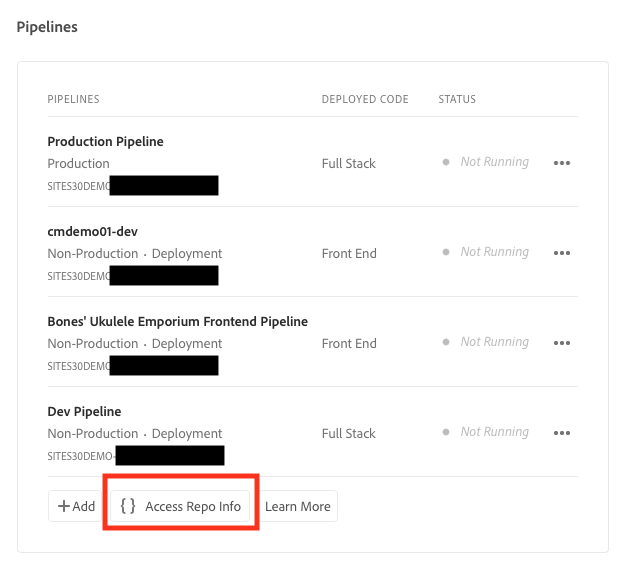

# Toegang tot Git Repository ophalen {#retrieve-access}

{{traditional-aem}}

Leer hoe de front-end ontwikkelaar Cloud Manager gebruikt om toegang te krijgen tot informatie in de git-opslagplaats.

## Het verhaal tot nu toe {#story-so-far}

Als u een front-end ontwikkelaar slechts verantwoordelijk voor de aanpassing van het plaatsthema bent, hebt u geen kennis van nodig hoe AEM opstelling was en aan de [&#x200B; Doelstelling &#x200B;](#objective) sectie van dit document kan overslaan.

Als u ook de rol van de beheerder van Cloud Manager of van AEM en front-end ontwikkelaar dient, leerde u in het vorige document van de reis van de Aanmaak van de Plaats van AEM Snelle, [&#x200B; Toegang van de Verlening tot de Front-End Ontwikkelaar &#x200B;](grant-access.md), hoe te aan boord de front-end ontwikkelaar zodat hebben zij toegang tot de git bewaarplaats, en u zou nu moeten weten:

* Een front-end ontwikkelaar toevoegen als een gebruiker.
* Hoe te om de vereiste rollen aan de front-end ontwikkelaar te verlenen.

In dit artikel wordt de volgende stap gezet om te tonen hoe de front-end ontwikkelaar de Cloud Manager-toegang gebruikt om referenties op te halen voor toegang tot de AEM git-opslagplaats.

Nu er een plaats is die op een malplaatje wordt gecreeerd, is er een pijpleidingsopstelling, wordt de front-end ontwikkelaar bewaakt en heeft alle informatie zij nodig hebben, verschuift dit artikel perspectief van de beheerders en exclusief aan de front-end ontwikkelaarrol.

## Doelstelling {#objective}

In dit document wordt uitgelegd hoe u, in de rol van de front-end ontwikkelaar, toegang kunt krijgen tot Cloud Manager en toegangsreferenties kunt ophalen naar de AEM git-opslagplaats. Na het lezen zult u:

* Begrijp op een hoog niveau wat Cloud Manager is.
* U hebt uw gegevens opgehaald voor toegang tot de AEM-kit zodat u uw aanpassingen kunt doorvoeren.

## Verantwoordelijke rol {#responsible-role}

Dit deel van de reis geldt voor de front-end ontwikkelaar.

## Vereisten {#requirements}

Met het gereedschap Snel site maken kunnen ontwikkelaars aan de voorkant onafhankelijk werken zonder kennis van AEM of hoe deze is ingesteld. Nochtans, moet de beheerder van Cloud Manager op de front-end ontwikkelaar in het projectteam en de beheerder van AEM u van wat vereiste informatie voorzien. Controleer of u de volgende informatie hebt voordat u doorgaat.

* Van de AEM-beheerder:
   * Themabronbestanden om aan te passen
   * Pad naar een voorbeeldpagina die als basis voor verwijzing moet worden gebruikt
   * Proxy-gebruikersgegevens om uw aanpassingen te testen op live AEM-inhoud
   * Voorste ontwerpvereisten
* Van de Cloud Manager-beheerder:
   * Een welkomstbericht van Cloud Manager waarin u op de hoogte wordt gesteld van toegang
   * De naam van het programma of de URL in Cloud Manager

Neem contact op met de AEM-beheerder of de Cloud Manager-beheerder als u een van deze items mist.

Aangenomen wordt dat de front-end ontwikkelaar uitgebreide ervaring heeft met front-end ontwikkelingsworkflows en gangbare geïnstalleerde gereedschappen, waaronder:

* git
* npm
* webpack
* Een voorkeurseditor

## Cloud Manager begrijpen {#understanding-cloud-manager}

Cloud Manager stelt organisaties in staat om AEM in de cloud zelf te beheren. Cloud Manager biedt een kader voor doorlopende integratie en levering (CI/CD) waarmee IT-teams en implementatiepartners sneller hun updates en wijzigingen kunnen doorvoeren, zonder verlies in prestaties of veiligheid.

Voor de front-end ontwikkelaar, is het de gateway aan:

* Toegang tot de informatie van de AEM git-opslagplaats zodat u uw aanpassingen vooraf kunt doorvoeren.
* Begin de plaatsingspijpleiding om uw aanpassingen op te stellen.

De Cloud Manager-beheerder heeft u als Cloud Manager-gebruiker aangemeld. U zou een welkome e-mail gelijkend op het volgende moeten ontvangen hebben.

Neem contact op met de Cloud Manager-beheerder als u dit e-mailbericht niet hebt ontvangen.

## Toegang tot Cloud Manager {#access-cloud-manager}

1. Logboek in Adobe Experience Cloud bij [&#x200B; my.cloudmanager.adobe.com &#x200B;](https://my.cloudmanager.adobe.com/) of klik de verbinding die in welkome e-mail wordt verstrekt.

1. Cloud Manager geeft een overzicht van de verschillende beschikbare programma&#39;s. Selecteer het bestand dat u wilt openen, zoals opgegeven door de Cloud Manager-beheerder. Als dit uw eerste front-end project voor AEMaaCS is, hebt u waarschijnlijk slechts één programma beschikbaar.

   

U ziet nu een overzicht van uw programma. De pagina ziet er anders uit, maar is vergelijkbaar met dit voorbeeld.

## Toegang tot opslagplaats ophalen {#repo-access}

1. In de **sectie van Pijpleidingen** van de pagina van Cloud Manager, selecteer de **knoop van Info van de Reparatie van de Toegang**.

   

1. Het **dialoog van Info van de Bewaarplaats 0&rbrace; &lbrace;opent.**

   

1. Selecteer **produceer wachtwoord** knoop om een wachtwoord voor zich tot stand te brengen.

1. Sla het gegenereerde wachtwoord op in een beveiligd wachtwoordbeheer. Het wachtwoord wordt nooit meer weergegeven.

1. Kopieer ook de **gebruikersbenaming** en **van de Git bevellijn** gebieden. U gebruikt deze gegevens later om toegang te krijgen tot het bericht.

1. Selecteer **dicht**.

## Volgende functies {#what-is-next}

Nu u dit deel van de AEM Quick Site Creation-reis hebt voltooid, kunt u het volgende doen:

* Begrijp op een hoog niveau wat Cloud Manager is.
* U hebt uw gegevens opgehaald voor toegang tot de AEM-kit zodat u uw aanpassingen kunt doorvoeren.

Bouw op deze kennis voort en zet uw reis van de Gemaakt van de Plaats van AEM Snelle door het document [&#x200B; te herzien pas het Thema van de Plaats &#x200B;](customize-theme.md) aan, waar u leert hoe het plaatsthema wordt gebouwd, hoe te aan te passen, en hoe te om het gebruiken van levende inhoud van AEM te testen.

## Aanvullende bronnen {#additional-resources}

Terwijl het wordt geadviseerd dat u zich op het volgende deel van de Snelle reis van de Verwezenlijking van de Plaats door het document [&#x200B; te herzien aanpast het Thema van de Plaats &#x200B;](customize-theme.md), zijn het volgende sommige extra, facultatieve middelen die een diepere duik op sommige die concepten doen in dit document worden vermeld, maar zij worden niet vereist om op de reis verder te gaan.

* [&#x200B; de Documentatie van Adobe Experience Manager Cloud Manager &#x200B;](https://experienceleague.adobe.com/docs/experience-manager-cloud-manager/using/introduction-to-cloud-manager.html) - Onderzoek de documentatie van Cloud Manager voor volledige details van zijn eigenschappen.
