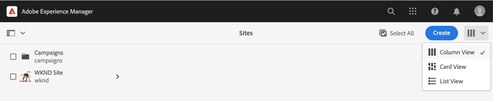
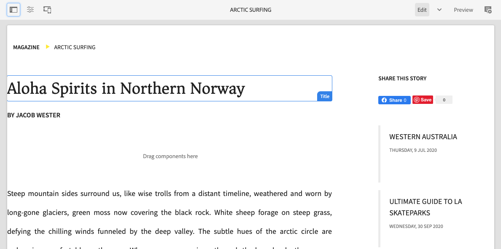

# Aan de slag met AEM Sites Translation {#getting-started}

Leer hoe u uw AEM Sites-inhoud kunt ordenen en hoe AEM vertaalgereedschappen werken.

## Het verhaal tot nu toe {#story-so-far}

In het vorige document van de AEM Sites translatietraject, [Leer over AEM Sites-inhoud en hoe u in AEM](learn-about.md) vertaalt, leerde u de basistheorie van AEM Sites en u zou nu moeten:

* Begrijp de basisbeginselen van het maken van AEM Sites-inhoud.
* Zorg dat u weet hoe AEM vertaling ondersteunt.

Dit artikel bouwt verder op die grondbeginselen zodat u begrijpt hoe AEM inhoud opslaat en beheert en hoe u AEM vertaalhulpmiddelen kunt gebruiken om die inhoud te vertalen.

## Doelstelling {#objective}

Met dit document kunt u begrijpen hoe u de inhoud van sites in AEM kunt gaan vertalen. Na het lezen moet u:

* Begrijp het belang van inhoudsstructuur voor vertaling.
* Begrijp hoe AEM inhoud opslaat.
* Wees vertrouwd met AEM vertaalhulpmiddelen.

## Eisen en voorwaarden {#requirements-prerequisites}

Er zijn een aantal vereisten voordat u begint met het vertalen van AEM inhoud.

### Kennis {#knowledge}

* Ervaar het vertalen van inhoud in een CMS
* Ervaar het gebruiken van de basiseigenschappen van grootschalig CMS
* Werken met AEM basisverwerking
* Kennis van de vertaalservice die u gebruikt
* Basiskennis hebben van de inhoud die u wilt vertalen

>[!TIP]
>
>Als u niet vertrouwd bent met het gebruiken van grote CMS als AEM, overweeg het herzien van [Basisbehandeling](/help/sites-cloud/authoring/getting-started/basic-handling.md) documentatie alvorens te werk te gaan. De documentatie voor basisverwerking maakt geen deel uit van de reis. Ga daarom na voltooiing terug naar deze pagina.

### Opties {#tools}

* Sandbox-toegang voor het testen van het vertalen van uw inhoud
* Credentials om verbinding te maken met uw voorkeursvertaalservice
* Lid zijn van de `project-administrators` groep in AEM

## Hoe AEM inhoud opslaat {#content-in-aem}

Voor de vertaalspecialist is het niet belangrijk om diepgaand te begrijpen hoe AEM inhoud beheert. Het is echter nuttig bekend te zijn met de basisbeginselen en -terminologie, aangezien u later AEM vertaalhulpmiddelen gebruikt. Het belangrijkste is dat u uw eigen inhoud begrijpt en hoe deze is gestructureerd om deze effectief te kunnen vertalen.

### Sites-console {#sites-console}

De siteconsole biedt een overzicht van de structuur van uw inhoud waardoor u eenvoudig door uw inhoud kunt navigeren en deze kunt beheren door nieuwe pagina&#39;s te maken, pagina&#39;s te verplaatsen en te kopiëren en door inhoud te publiceren.

Toegang tot de siteconsole:

1. Klik of tik in het algemene navigatiemenu op **Navigatie** -> **Sites**.
1. De siteconsole wordt geopend op het hoogste niveau van uw inhoud.
1. Zorg ervoor dat de **Kolomweergave** is geselecteerd met de weergavekiezer rechtsboven in het venster.

   

1. Als u op een item in een kolom tikt of erop klikt, wordt de onderliggende inhoud weergegeven in de hiërarchie in de kolom rechts.

   

1. Door op het selectievakje van een item in een kolom te tikken of erop te klikken, wordt dat item geselecteerd en worden de details van het geselecteerde item in de kolom rechts weergegeven, en wordt een aantal beschikbare acties voor het geselecteerde item op de bovenstaande werkbalk weergegeven.

   

1. Door op de spoorselecteur bij de bovenkant linkerzijde te tikken of te klikken, kunt u **Inhoudsboom** mening voor een boomoverzicht van uw inhoud ook tonen.

   

Met deze eenvoudige gereedschappen kunt u op intuïtieve wijze door de inhoudsstructuur navigeren.

>[!NOTE]
>
>De inhoudarchitect definieert doorgaans de inhoudsstructuur terwijl de inhoudsauteurs de inhoud binnen die structuur maken.
>
>Als vertaalspecialist is het belangrijk om eenvoudig te begrijpen hoe te om die structuur te navigeren en te begrijpen waar de inhoud wordt gevestigd.

### Pagina-editor {#page-editor}

Met de siteconsole kunt u door de inhoud navigeren en krijgt u een overzicht van de structuur. Als u de details van een afzonderlijke pagina wilt zien, moet u de site-editor gebruiken.

Een pagina bewerken:

1. Gebruik de siteconsole om een pagina te zoeken en te selecteren. Tik of klik op het selectievakje van een afzonderlijke pagina om deze te selecteren.

   

1. Tik op de optie **Bewerken** in de werkbalk.
1. De site-editor wordt geopend en de geselecteerde pagina wordt geladen voor bewerking in een nieuw browsertabblad.
1. Wanneer u de muis over inhoud beweegt of hierop tikt, worden kiezers voor afzonderlijke componenten weergegeven. Componenten zijn de bouwstenen voor slepen en neerzetten die de pagina vormen.

   

U kunt naar de plaatsenconsole terugkeren door terug naar dat lusje in uw browser op elk ogenblik te schakelen. Met behulp van de site-editor kunt u snel de inhoud van de pagina weergeven als de auteurs van de inhoud en uw publiek deze zullen zien.

>[!NOTE]
>
>De auteurs van de inhoud maken uw site-inhoud met de siteeditor.
>
>Als vertaalspecialist is het belangrijk om eenvoudig te begrijpen hoe te om de details van die inhoud te bekijken gebruikend de plaatshedacteur.

## Structuur is sleutel {#content-structure}

AEM inhoud wordt aangestuurd door de structuur ervan. AEM stelt weinig vereisten aan de inhoudsstructuur op, maar een zorgvuldige overweging van uw inhoudshiërarchie als onderdeel van de projectplanning kan vertaling veel eenvoudiger maken.

>[!TIP]
>
>Plan voor vertaling bij het allereerste begin van uw AEM project. Werk vroeg nauw samen met de projectmanager en de inhoudarchitecten.
>
>Een projectmanager voor internationalisatie kan worden verlangd als een aparte persoon die tot taak heeft te bepalen welke inhoud moet worden vertaald en wat niet, en welke vertaalde inhoud door regionale of lokale inhoudproducenten kan worden gewijzigd.

## Aanbevolen inhoudsstructuur {#recommended-structure}

Zoals eerder geadviseerd, werk met uw inhoudarchitect om de aangewezen inhoudsstructuur voor uw eigen project te bepalen. Het volgende is echter een bewezen, eenvoudige en intuïtieve structuur die heel effectief is.

Definieer een basismap voor uw project onder `/content`.

```text
/content/<your-project>
```

De taal waarin uw inhoud wordt geschreven wordt genoemd de taalwortel. In ons voorbeeld is het Engels en moet het onder dit pad liggen.

```text
/content/<your-project>/en
```

Alle projectinhoud die mogelijk moet worden gelokaliseerd, moet onder de hoofdmap van de taal worden geplaatst.

```text
/content/<your-project>/en/<your-project-content>
```

De vertalingen zouden als sibling omslagen naast de taalwortel met hun omslagnaam moeten worden gecreeerd die ISO-2 taalcode van de taal vertegenwoordigt. Duits zou bijvoorbeeld het volgende pad hebben.

```text
/content/<your-project>/de
```

>[!NOTE]
>
>Over het algemeen is de inhoudsarchitect verantwoordelijk voor het maken van deze taalmappen. Als ze niet worden gecreëerd, kunnen AEM later geen vertaalbanen creëren.

De uiteindelijke structuur kan er ongeveer als volgt uitzien.

```text
/content
    |- your-project
        |- en
            |- some
            |- exciting
            |- sites
            |- content
        |- de
        |- fr
        |- it
        |- ...
    |- another-project
    |- ...
```

Let op het specifieke pad van uw inhoud, want dit zal later nodig zijn om uw vertaling te configureren.

>[!NOTE]
>
>Het is in het algemeen de verantwoordelijkheid van de inhoudarchitect om de inhoudstructuur te definiëren, vaak in samenwerking met de vertaalspecialist.
>
>Het wordt hier nader toegelicht om de volledigheid.

## AEM {#translation-tools}

Nu u de de plaatsenconsole en redacteur en het belang van inhoudsstructuur begrijpt, kunnen wij bekijken hoe te om inhoud te vertalen. De vertaalhulpmiddelen in AEM zijn vrij krachtig, maar eenvoudig te begrijpen op hoog niveau.

* **Vertaalaansluiting**  - De aansluiting is de koppeling tussen AEM en de vertaalservice die u gebruikt.
* **Vertaalregels**  - Regels bepalen welke inhoud onder bepaalde paden moet worden vertaald.
* **Vertaalprojecten**  - Vertaalprojecten verzamelen inhoud die als één enkele vertaalinspanning zou moeten worden gericht en volgen de vooruitgang van de vertaling, die met de schakelaar in aanraking komt om de te vertalen inhoud over te brengen en het terug van de vertaaldienst te ontvangen.

U plaatst over het algemeen slechts eens uw schakelaar voor uw instantie en regels per project. Vervolgens gebruikt u vertaalprojecten om uw inhoud te vertalen en de vertalingen voortdurend bij te werken.

## Volgende functies {#what-is-next}

Nu u dit deel van de AEM Sites vertaalreis hebt voltooid, moet u:

* Begrijp het belang van inhoudsstructuur voor vertaling.
* Begrijp hoe AEM inhoud opslaat.
* Wees vertrouwd met AEM vertaalhulpmiddelen.

Bouw op deze kennis voort en zet uw AEM Sites-vertaalreis door het document [Configureer de vertaalconnector](configure-connector.md) opnieuw te bekijken, waar u leert hoe u AEM kunt verbinden met een vertaalservice.|

## Aanvullende bronnen {#additional-resources}

Terwijl het wordt geadviseerd dat u zich op het volgende deel van de vertaalreis door het document [te herzien de vertaalschakelaar ](configure-connector.md) vormt zijn het volgende enkele extra, facultatieve middelen die een diepere duik op sommige die concepten in dit document worden vermeld, maar zij worden niet vereist om op de reis verder te gaan.

* [AEM Basic Handling](/help/sites-cloud/authoring/getting-started/basic-handling.md)  - Leer de grondbeginselen van de AEM UI om comfortabel te kunnen navigeren en essentiële taken uit te voeren zoals het vinden van uw inhoud.
* [Inhoud identificeren voor vertaling](/help/sites-cloud/administering/translation/rules.md)  - Leer hoe vertaalregels inhoud identificeren die moet worden vertaald.
* [Het Vormen van het Kader](/help/sites-cloud/administering/translation/integration-framework.md)  van de Integratie van de Vertaling - leer hoe te om het Kader van de Integratie van de Vertaling te vormen om met de diensten van de derdevertaling te integreren.
* [Vertaalprojecten](/help/sites-cloud/administering/translation/managing-projects.md)  beheren - Leer hoe u zowel machine- als menselijke vertaalprojecten in AEM kunt maken en beheren.
