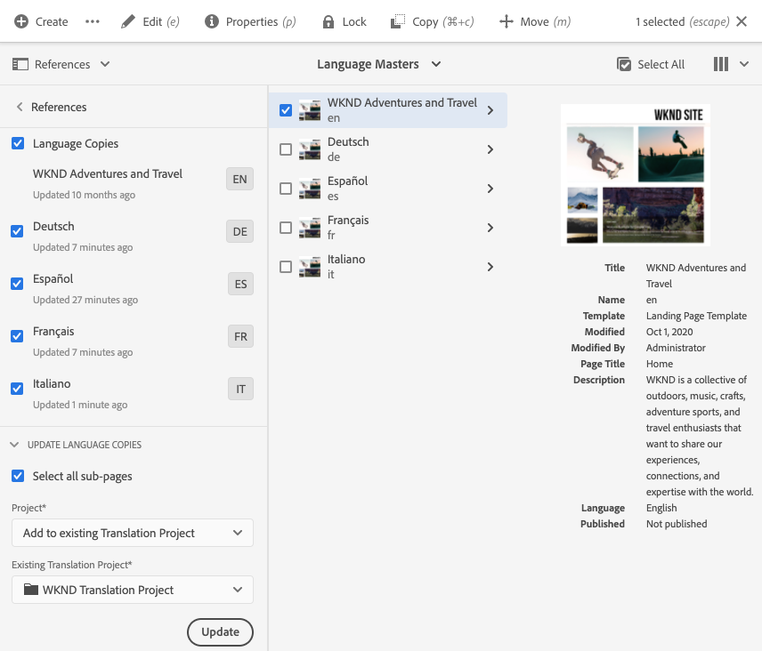

# Vertaalde inhoud publiceren {#publish-content}

Leer hoe u uw vertaalde inhoud publiceert en de vertalingen bijwerkt terwijl de inhoud wordt bijgewerkt.

## Het verhaal tot nu toe {#story-so-far}

In het vorige document van de AEM Sites-vertaalreis hebt u [Inhoud vertalen,](configure-connector.md) geleerd hoe u AEM vertaalprojecten kunt gebruiken om uw inhoud te vertalen. Nu moet u:

* Begrijp wat een vertaalproject is.
* Nieuwe vertaalprojecten kunnen maken.
* Gebruik vertaalprojecten om uw inhoud te vertalen.

Nu uw eerste vertaling is voltooid, wordt in dit artikel de volgende stap gezet voor het publiceren van die inhoud en wat u moet doen om uw vertalingen bij te werken wanneer de onderliggende inhoud in de hoofdtaalwijziging verandert.

## Doelstelling {#objective}

Dit document helpt u te begrijpen hoe te om inhoud in AEM te publiceren en hoe te om een voortdurende werkschema tot stand te brengen om uw vertalingen bijgewerkt te houden. Nadat u dit document hebt gelezen, moet u:

* Begrijp het auteur-publicatiemodel van AEM.
* Zorg dat u weet hoe u uw vertaalde inhoud publiceert.
* Een voortdurend updatemodel voor uw vertaalde inhoud kunnen implementeren.

## Auteur-publicatiemodel AEM {#author-publish}

Voordat u de inhoud publiceert, is het verstandig om AEM publicatiemodel te begrijpen. In vereenvoudigde termen verdeelt AEM gebruikers van het systeem in twee groepen.

1. Degenen die de inhoud en het systeem maken en beheren
1. Degenen die de inhoud van het systeem consumeren

AEM wordt daarom fysiek in twee gevallen gescheiden.

1. De **auteur**-instantie is het systeem waarin auteurs en beheerders van inhoud werken aan het maken en beheren van inhoud.
1. De **publish** instantie is het systeem dat de inhoud aan de consumenten levert.

Nadat inhoud op de instantie van de auteur is gemaakt, moet deze naar de instantie publish worden overgedragen om de inhoud beschikbaar te maken voor consumptie. Het proces om van auteur over te brengen om te publiceren wordt genoemd **publicatie**.

## Uw vertaalde inhoud publiceren {#publishing}

Zodra u tevreden bent met de staat van uw vertaalde inhoud, moet het worden gepubliceerd zodat kan het worden en worden betreden en worden verbruikt. Deze taak valt gewoonlijk niet onder de verantwoordelijkheid van de vertaalspecialist, maar wordt hier beschreven om de volledige werkstroom te illustreren.

>[!NOTE]
>
>Wanneer de vertaling is voltooid, informeert de vertalingsspecialist de eigenaars van de inhoud over het feit dat de vertalingen klaar zijn voor publicatie. De eigenaars van de inhoud publiceren deze vervolgens.
>
>De volgende stappen worden verstrekt voor volledigheid.

De eenvoudigste manier om de vertalingen te publiceren is aan de projectomslag te navigeren.

```text
/content/<your-project>/
```

Onder dit pad hebt u submappen voor elke vertaaltaal en kunt u kiezen welke taal u wilt publiceren.

1. Ga naar **Navigatie** -> **Sites** -> **Bestanden** en open de projectmap.
1. Hier ziet u de hoofdmap van de taal en alle andere taalmappen. Selecteer de gelokaliseerde taal of talen die u wilt publiceren.
   
1. Tik of klik op **Publicatie beheren**.
1. Controleer in het venster **Publicatie beheren** of **Publiceren** automatisch is geselecteerd onder **Action** en of **Now** is geselecteerd onder **Scheduling**. Tik of klik op **Volgende**.
   
1. Bevestig in het volgende venster **Publicatie beheren** dat het juiste pad of de juiste paden is/zijn geselecteerd. Tik of klik op **Publiceren**.
   
1. AEM bevestigt de publicatieactie met een pop-upbericht onder aan het scherm.
   

Uw vertaalde inhoud is nu gepubliceerd! Het kan nu worden betreden en worden verbruikt.

>[!TIP]
>
>U kunt bij het publiceren meerdere items selecteren (dat wil zeggen meerdere taalmappen) om meerdere vertalingen tegelijk te publiceren.

Er zijn extra opties wanneer het publiceren van uw inhoud, zoals het plannen van een publicatietijd, die buiten het werkingsgebied van deze reis zijn. Zie de sectie [Aanvullende bronnen](#additional-resources) aan het einde van het document voor meer informatie.

## Uw vertaalde inhoud bijwerken {#updating-translations}

Vertaling is zelden een eenmalige exercitie. Meestal blijven auteurs van inhoud uw inhoud toevoegen aan en wijzigen deze in de hoofdmap van de taal nadat de eerste vertaling is voltooid. Dit betekent dat u ook uw vertaalde inhoud moet bijwerken.

De specifieke projectvereisten bepalen hoe vaak u uw vertalingen moet bijwerken en welk besluitvormingsproces wordt gevolgd alvorens een update uit te voeren. Zodra u hebt besloten uw vertalingen bij te werken, is het proces in AEM zeer eenvoudig. Aangezien de eerste vertaling gebaseerd was op een vertaalproject, zijn ook updates mogelijk.

Het proces verschilt echter enigszins als u ervoor kiest om uw vertaalproject automatisch te maken of uw vertaalproject handmatig te maken.

### Een automatisch gemaakt vertaalproject bijwerken {#updating-automatic-project}

1. Navigeer naar **Navigation** -> **Middelen** -> **Bestanden**. Onthoud dat inhoud in AEM wordt opgeslagen onder `/content`.
1. Selecteer de taalwortel van uw project. In dit geval hebben we `/content/wknd/en` geselecteerd.
1. Tik op de spoorkiezer of klik op deze en toon het venster **References**.
1. Tik of klik op **Taalkopieën**.
1. Schakel het selectievakje **Taalkopieën** in.
1. Vouw de sectie **Taalkopieën bijwerken** onder in het venster Referenties uit.
1. Selecteer **Toevoegen aan een bestaand vertaalproject** in het vervolgkeuzemenu **Project**.
1. Selecteer in het vervolgkeuzemenu **Bestaand vertaalproject** het project dat u voor de eerste vertaling hebt gemaakt.
1. Tik of klik op **Bijwerken**.



De inhoud wordt toegevoegd aan het bestaande vertaalproject. Het vertaalproject weergeven:

1. Navigeer naar **Navigation** -> **Projecten**.
1. Tik of klik op het project dat u zojuist hebt bijgewerkt.
1. Tik of klik op de taal of een van de talen die u hebt bijgewerkt.

U ziet dat er een nieuwe banenkaart aan het project is toegevoegd. In dit voorbeeld is een andere Spaanse vertaling toegevoegd.


U kunt zien dat de statistieken op de nieuwe kaart verschillend zijn. Dit komt omdat AEM herkent wat er is veranderd sinds de laatste vertaling en alleen de inhoud bevat die moet worden vertaald. Dit omvat het opnieuw vertalen van bijgewerkte inhoud en het voor het eerst vertalen van nieuwe inhoud.

Vanaf dit punt kunt u uw vertaaltaak net als het origineel starten en beheren.](translate-content.md#using-translation-project)[

### Een handmatig gemaakt vertaalproject bijwerken {#updating-manual-project}

Als u een vertaling wilt bijwerken, kunt u een nieuwe taak toevoegen aan uw bestaande project die verantwoordelijk is voor het vertalen van de bijgewerkte inhoud.

1. Navigeer naar **Navigation** -> **Projecten**.
1. Tik of klik op het project dat u wilt bijwerken.
1. Tik of klik op de knop **Toevoegen** boven in het venster.
1. Tik in het venster **Tegel toevoegen** of klik op **Vertaaltaak** en **Verzenden**.

   

1. Tik op de kaart van de nieuwe vertaaltaak of klik op de chevron-knop boven aan de kaart en selecteer **Doel bijwerken** om de doeltaal van de nieuwe taak te definiëren.

   

1. In **Selecteer de Taal van het Doel** dialoog, gebruik drop-down om de taal te selecteren en te tikken of **Done** te klikken.

   

1. Als de doeltaal van uw nieuwe vertaaltaak is ingesteld, tikt u of klikt u op de knop met de ellips onder aan de taakkaart om de details van de taak weer te geven.
1. De taak is leeg wanneer deze voor het eerst wordt gemaakt. Voeg inhoud aan de baan toe door **Add** te tikken of te klikken en wegbrowser [te gebruiken zoals u vroeger het vertaalproject creeerde.](translate-content.md##manually-creating)

>[!TIP]
>
>De krachtige filters van de padbrowser kunnen ook weer nuttig zijn om alleen de inhoud te zoeken die is bijgewerkt.
>
>U kunt meer over wegbrowser in [extra middelensectie leren.](#additional-resources)

Vanaf dit punt kunt u uw vertaaltaak net als het origineel starten en beheren.](translate-content.md#using-translation-project)[

## Einde van de reis? {#end-of-journey}

Gefeliciteerd! U hebt de AEM Sites vertaalreis voltooid! Nu moet u:

* U hebt een basiskennis AEM functies voor inhoudsbeheer.
* Begrijp AEM vertaaleigenschappen en hoe zij met uw plaatsinhoud verwant.
* U kunt beginnen met het vertalen van uw eigen inhoud.

U kunt nu uw eigen inhoud in AEM vertalen. AEM is echter een krachtig hulpmiddel en er zijn veel aanvullende opties beschikbaar. Ontdek enkele extra bronnen in de sectie [Aanvullende bronnen](#additional-resources) voor meer informatie over de functies die u tijdens deze reis hebt gezien.

## Aanvullende bronnen {#additional-resources}

* [Vertaalprojecten](/help/sites-cloud/administering/translation/managing-projects.md)  beheren - Meer informatie over vertaalprojecten en aanvullende functies, zoals workflows voor menselijke vertaling en meertalige projecten.
* [Ontwerpconcepten](/help/sites-cloud/authoring/getting-started/concepts.md)  - Leer meer over de auteur en publiceer het model van AEM. Dit document is gericht op het schrijven van pagina&#39;s in plaats van op inhoudfragmenten, maar de theorie blijft van toepassing.
* [Pagina&#39;s](/help/sites-cloud/authoring/fundamentals/publishing-pages.md)  publiceren - Meer informatie over de extra functies die beschikbaar zijn wanneer u inhoud publiceert. Dit document is gericht op het schrijven van pagina&#39;s in plaats van op inhoudfragmenten, maar de theorie blijft van toepassing.
* [Ontwerpomgeving en -gereedschappen](/help/sites-cloud/authoring/fundamentals/environment-tools.md##path-selection)  - AEM biedt verschillende mechanismen voor het organiseren en bewerken van uw inhoud, waaronder een robuuste padbrowser.
