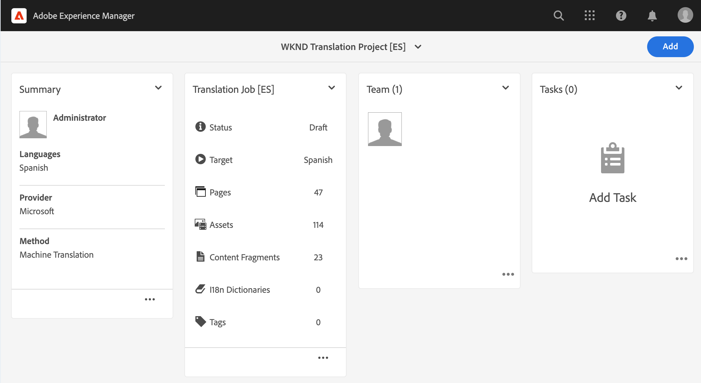
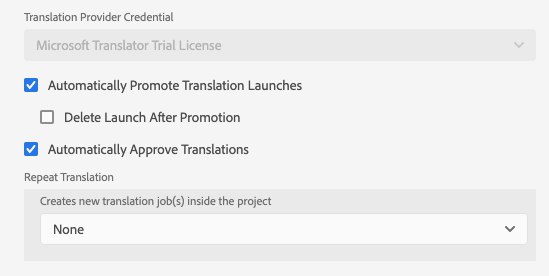

# Inhoud vertalen {#translate-content}

Gebruik de vertaalaansluiting en de regels om uw inhoud te vertalen.

## Het verhaal tot nu toe {#story-so-far}

In het vorige document van de de vertaalreis van AEM Sites, [ vorm Vertaal Regels ](translation-rules.md) u leerde hoe te om AEM vertaalregels te gebruiken om uw vertaalinhoud te identificeren. Nu moet u:

* Begrijp wat de vertaalregels doen.
* U kunt uw eigen vertaalregels definiëren.

Nu de verbindingsregels en vertaalregels zijn ingesteld, gaat dit artikel door de volgende stap voor het vertalen van uw AEM Sites-inhoud.

## Doelstelling {#objective}

Dit document helpt u begrijpen hoe te om AEM vertaalprojecten samen met de schakelaar en uw vertaalregels te gebruiken om inhoud te vertalen. Nadat u dit document hebt gelezen, moet u:

* Begrijp wat een vertaalproject is.
* U kunt nieuwe vertaalprojecten maken.
* Gebruik vertaalprojecten om uw AEM Sites-inhoud te vertalen.

## Een vertaalproject maken {#creating-translation-project}

Met vertaalprojecten kunt u de vertaling van AEM inhoud beheren. Een vertaalproject verzamelt de inhoud die op één locatie moet worden vertaald voor een centrale weergave van de vertaalwerkzaamheden.

Wanneer inhoud aan een vertaalproject wordt toegevoegd, wordt een vertaalbaan gecreeerd voor het. Taken bieden opdrachten en statusinformatie die u gebruikt om de workflows voor het vertalen van mensen en computers die op de bronnen worden uitgevoerd, te beheren.

Vertaalprojecten kunnen op twee manieren worden gemaakt:

1. Selecteer de taalwortel van de inhoud en hebben AEM automatisch tot het vertaalproject leiden dat op de inhoudspad wordt gebaseerd.
1. Maak een leeg project en selecteer handmatig de inhoud die u aan het vertaalproject wilt toevoegen

Beide zijn geldige benaderingen die doorgaans alleen verschillen op basis van de persoon die de vertaling uitvoert:

* De TPM (vertaalprojectmanager) heeft vaak de flexibiliteit nodig om de inhoud handmatig te selecteren voor het vertaalproject.
* Als de eigenaar van de inhoud ook verantwoordelijk is voor de vertaling, is het vaak gemakkelijker AEM het project automatisch te maken op basis van het geselecteerde inhoudspad.

Beide benaderingen worden in de volgende secties verkend.

### Automatisch een vertaalproject maken op basis van het inhoudspad {#automatically-creating}

Voor eigenaars van inhoud die ook verantwoordelijk zijn voor vertaling, is het vaak gemakkelijker om het vertaalproject automatisch AEM maken. AEM automatisch een vertaalproject maken op basis van het inhoudspad:

1. Navigeer aan **Navigatie** > **Plaatsen** en selecteer uw project.
1. Zoek de taalhoofdmap van uw project. Als de hoofdtaal bijvoorbeeld Engels is, `/content/<your-project>/en` .
   * Vóór de eerste vertaling is dat de andere taalomslagen lege placeholders zijn. Deze worden gewoonlijk gemaakt door de inhoudarchitect.
1. Zoek de taalhoofdmap van uw project.
1. Selecteer de spoorselecteur en toon het **paneel van Verwijzingen**.
1. Selecteer **Exemplaren van de Taal**.
1. Controleer het **checkbox van de Kopieën van de Taal 0}.**
1. Breid de sectie **Exemplaren van de Taal van de Update** bij de bodem van het verwijzingenpaneel uit.
1. In de **drop-down lijst van het Project**, uitgezocht **creeer Vertaal Project(en)**.
1. Geef een geschikte titel op voor uw vertaalproject.
1. Selecteer **Update**.


U ontvangt een bericht dat het project werd gecreeerd.

>[!NOTE]
>
>Men veronderstelt dat de noodzakelijke taalstructuur voor de vertalingstalen reeds als deel van de [ definitie van uw inhoudsstructuur is gecreeerd.](getting-started.md#content-structure) Dit moet gebeuren in samenwerking met de inhoudarchitect.
>
>Als de taalmappen niet van tevoren worden gemaakt, kunt u geen taalkopieën maken zoals beschreven in de vorige stappen.

### Handmatig een vertaalproject maken door uw inhoud te selecteren {#manually-creating}

Voor managers van vertaalprojecten, is het vaak noodzakelijk om specifieke inhoud manueel te selecteren om in een vertaalproject te omvatten. Als u een dergelijk handmatig vertaalproject wilt maken, moet u eerst een leeg project maken en vervolgens de inhoud selecteren die u aan het project wilt toevoegen.

1. Navigeer aan **Navigatie** > **Projecten**.
1. Selecteer **creeer** > **Omslag** om een omslag voor uw projecten tot stand te brengen.
   * Dit is optioneel, maar handig om uw vertaalwerkzaamheden te organiseren.
1. In **creeer het venster van het Project**, voeg a **Titel** voor de omslag toe en selecteer dan **creeer**.

   

1. Selecteer de map om de map te openen.
1. In uw nieuwe projectomslag, creeer **** > **Project**.
1. Projecten zijn gebaseerd op sjablonen. Selecteer het **malplaatje van het Project van de Vertaling** om het te selecteren en dan **daarna** te selecteren.

   

1. Op het **Basis** lusje, ga een naam voor uw nieuw project in.

   

1. Op het **Geavanceerde** lusje, gebruik de **drop-down lijst van de Taal van het Doel** om de talen te selecteren waarin uw inhoud zou moeten worden vertaald. Selecteer **creeer**.

   

1. Selecteer **Open** in de bevestigingsdialoog.

   

Het project is gemaakt, maar bevat geen inhoud om te vertalen. In de volgende sectie wordt beschreven hoe het project is gestructureerd en hoe u inhoud kunt toevoegen.

## Een vertaalproject gebruiken {#using-translation-project}

Vertaalprojecten zijn ontworpen om alle inhoud en taken in verband met een vertaalinspanning op één plaats te verzamelen, zodat uw vertaling eenvoudig en eenvoudig te beheren is.

Het vertaalproject weergeven:

1. Navigeer aan **Navigatie** > **Projecten**.
1. Selecteer het project dat in de vorige sectie werd gecreeerd (of [ creeert automatisch een Vertaal Project dat op de Weg van de Inhoud ](#automatically-creating) wordt gebaseerd of [ creeert manueel een Vertaal Project door Uw Inhoud ](#manually-creating) afhankelijk van uw situatie te selecteren).



Het project is verdeeld in meerdere kaarten.

* **Samenvatting** - Deze kaart toont de basiskopbalinformatie van het project met inbegrip van de eigenaar, de taal, en de vertaalleverancier.
* **VertaalBaan** - Deze kaart of deze kaarten tonen (tonen) een overzicht van de daadwerkelijke vertaalbaan met inbegrip van de status, het aantal activa, etc. Over het algemeen is er één taak per taal, waarbij de ISO-2-taalcode aan de taaknaam wordt toegevoegd.
   * Wanneer [ automatisch het creëren van vertaalbanen, ](#automatically-creating) AEM tot de banen asynchroon leidt en zij kunnen niet onmiddellijk binnen het project verschijnen.
* **Team** - Deze kaart toont de gebruikers die aan dit vertaalproject samenwerken. Deze reis gaat niet over dit onderwerp.
* **Taken** - de Extra taken verbonden aan het vertalen van de inhoud zoals om punten of werkschemapunten te doen. Deze reis gaat niet over dit onderwerp.

Om de vertaalstroom in AEM beter te begrijpen, is één verandering in de projectmontages nuttig. Deze stap is niet vereist voor productievertalingen, maar voor een beter begrip van het proces.

1. Voor de **Samenvatting** kaart, selecteer de elliptische knoop bij de bodem van de kaart.
1. Op het **Geavanceerde** lusje, uncheck de optie **Lanceer na Bevordering** schrappen.

   

1. Selecteer **sparen &amp; Sluiten**.

Nu kunt u uw vertaalproject gebruiken. Hoe u een vertaalproject gebruikt, hangt af van de manier waarop het is gemaakt: automatisch door AEM of handmatig.

### Een automatisch gemaakt vertaalproject gebruiken {#using-automatic-project}

Wanneer het automatisch tot stand brengen van het vertaalproject, evalueert AEM de inhoud onder de weg u selecteerde gebaseerd op de vertaalregels die u eerder bepaalde. Op basis van die evaluatie extraheert het de inhoud die vertaald moet worden naar een nieuw vertaalproject.

U kunt als volgt de details van de inhoud in dit project bekijken:

1. Selecteer de ellipsis knoop bij de bodem van de **kaart van de Taak van de Vertaling**.
1. Het **venster van de Baan van de Vertaling** maakt een lijst van alle punten in de baan.

   

1. Selecteer een regel om de details van die regel weer te geven. Houd er rekening mee dat één regel meerdere inhoudsitems kan vertegenwoordigen om te vertalen.
1. Schakel het selectievakje voor een regelitem in om andere opties weer te geven, zoals de optie om het item uit de taak te verwijderen of in de siteconsole weer te geven.

   

Typisch begint de inhoud voor de vertaalbaan in de **staat van het Ontwerp** zoals die door de **wordt vermeld 3} kolom van de Staat {in het** venster van de Baan van de Vertaling **.**

Om de vertaalbaan te beginnen, ga aan het overzicht van het vertaalproject terug en selecteer de kantorknoop bij de bovenkant van de **kaart van de VertaalBaan** en selecteer **Begin**.


AEM communiceert nu met uw vertaalconfiguratie en -connector om de inhoud naar de vertaalservice te verzenden. U kunt de vooruitgang van de vertaling bekijken door aan het **venster van de VertaalBaan** terug te keren en de **3} kolom van de Staat {van de ingangen te bekijken.**


De vertalingen van de machine keren automatisch met een staat van **Goedgekeurd** terug. Menselijke vertaling maakt meer interactie mogelijk, maar valt buiten het bereik van deze reis.

>[!TIP]
>
>De verwerking van een vertaalbaan kan wat tijd vergen, en u kunt uw vertaalpunten van de staat van **Laag** aan **Bezig Vertaling** aan **klaar voor Overzicht** zien alvorens zij bij de **Goedgekeurde** staat aankomen. Dat is te verwachten.

>[!NOTE]
>
>Als u niet de projectoptie **schrapte Lancering na Bevordering** zoals [ in de vorige sectie werd beschreven, ](#using-translation-project) vertaalde punten zullen met de **Geschrapte** staat verschijnen. Dit is normaal, omdat AEM de vertaalverslagen automatisch verwijdert zodra de vertaalde punten aankomen. De vertaalde items zijn geïmporteerd als taalkopieën, alleen de vertaalrecords zijn verwijderd omdat ze niet meer nodig zijn.
>
>Maak je geen zorgen als dit onduidelijk is. Dit zijn diepgaande details van hoe AEM werkt en niet uw begrip van de reis beïnvloedt. Als u dieper op wilt duiken hoe AEM vertalingen verwerkt, zie [ extra middelen ](#additional-resources) sectie aan het eind van dit artikel.

### Een handmatig gemaakt vertaalproject gebruiken {#using-manual-project}

Als u handmatig een vertaalproject maakt, AEM de benodigde taken, maar selecteert u niet automatisch de inhoud die u in die taken wilt opnemen. Hierdoor kan de projectbeheerder van de vertaling kiezen welke inhoud moet worden vertaald.

Inhoud toevoegen aan een vertaaltaak:

1. Selecteer de ellipsknoop bij de bodem van één van de **kaarten van de Taak van de Vertaling**.
1. Controleer of de taak geen inhoud bevat. Selecteer **toevoegen** knoop bij bovenkant van het venster en dan **Assets/Pagina&#39;s** van drop-down.

   

1. Er wordt een padbrowser geopend waarin u specifiek kunt selecteren welke inhoud u wilt toevoegen. Zoek de inhoud en selecteer deze.

   

1. Selecteer **Uitgezocht** om de geselecteerde inhoud aan de baan toe te voegen.
1. In de **Vertaal** dialoog, specificeer dat u **het Exemplaar van de Taal** wilt creëren.

   

1. De inhoud wordt nu opgenomen in de taak.

    wordt toegevoegd

1. Schakel het selectievakje voor een regelitem in om andere opties weer te geven, zoals de optie om het item uit de taak te verwijderen of in de siteconsole weer te geven.

   

1. Herhaal deze stappen om alle vereiste inhoud in de taak op te nemen.

>[!TIP]
>
>De padbrowser is een krachtig hulpmiddel waarmee u uw inhoud kunt zoeken, filteren en doorbladeren. Selecteer de **Inhoud slechts/Filters** knoop om het zijpaneel van een knevel te voorzien en geavanceerde filters zoals **Gewijzigde Datum** of **Vertaalstatus** te tonen.
>
>U kunt meer over wegbrowser in de [ extra middelensectie leren.](#additional-resources)

U kunt de voorafgaande stappen gebruiken om de noodzakelijke inhoud aan alle talen (banen) voor het project toe te voegen. Nadat u alle inhoud hebt geselecteerd, kunt u de vertaling starten.

Typisch begint de inhoud voor de vertaalbaan in de **staat van het Ontwerp** zoals die door de **wordt vermeld 3} kolom van de Staat {in het** venster van de Baan van de Vertaling **.**

Om de vertaalbaan te beginnen, ga aan het overzicht van het vertaalproject terug en selecteer de kantorknoop bij de bovenkant van de **kaart van de VertaalBaan** en selecteer **Begin**.


AEM communiceert nu met uw vertaalconfiguratie en -connector om de inhoud naar de vertaalservice te verzenden. U kunt de vooruitgang van de vertaling bekijken door aan het **venster van de VertaalBaan** terug te keren en de **3} kolom van de Staat {van de ingangen te bekijken.**


De vertalingen van de machine keren automatisch met een staat van **Goedgekeurd** terug. Menselijke vertaling maakt meer interactie mogelijk, maar valt buiten het bereik van deze reis.

>[!TIP]
>
>De verwerking van een vertaalbaan kan wat tijd vergen, en u kunt uw vertaalpunten van de staat van **Laag** aan **Bezig Vertaling** aan **klaar voor Overzicht** zien alvorens zij bij de **Goedgekeurde** staat aankomen. Dat is te verwachten.

>[!NOTE]
>
>Als u niet de projectoptie **schrapte Lancering na Bevordering** zoals [ in de vorige sectie werd beschreven, ](#using-translation-project) vertaalde punten zullen met de **Geschrapte** staat verschijnen. Dit is normaal, omdat AEM de vertaalverslagen automatisch verwijdert zodra de vertaalde punten aankomen. De vertaalde items zijn geïmporteerd als taalkopieën, alleen de vertaalrecords zijn verwijderd omdat ze niet meer nodig zijn.
>
>Maak je geen zorgen als dit onduidelijk is. Dit zijn diepgaande details van hoe AEM werkt en niet uw begrip van de reis beïnvloedt. Als u dieper op wilt duiken hoe AEM vertalingen verwerkt, zie [ extra middelen ](#additional-resources) sectie aan het eind van dit artikel.

## Vertaalde inhoud controleren {#reviewing}

[ zoals eerder gezien, ](#using-translation-project) machine vertaalde inhoud vloeit terug in AEM met het statuut van **Goedgekeurd** aangezien de veronderstelling is dat omdat de machinevertaling wordt gebruikt, geen menselijke interventie wordt vereist. Het is echter nog steeds mogelijk om de vertaalde inhoud te beoordelen.

Ga eenvoudig naar de voltooide vertaalbaan en selecteer een lijnpunt door te tikken of checkbox te klikken. Het pictogram **Voorproef in Plaatsen** wordt getoond in de hulpmiddelbar.


Selecteer dat pictogram om de vertaalde inhoud in zijn console te openen om de details van de vertaalde inhoud te zien.


U kunt de vertaalde inhoud verder aanpassen, op voorwaarde dat u de juiste toestemming hebt, maar het bewerken van inhoud valt buiten het bereik van deze reis. Zie de [ Extra sectie van Middelen ](#additional-resources) aan het eind van dit document voor meer informatie over dit onderwerp.

Het doel van het project is om alle middelen in verband met een vertaling op één plaats te verzamelen, zodat u gemakkelijk toegang hebt en een duidelijk overzicht krijgt. Zoals u echter kunt zien door de details van een vertaald item weer te geven, vloeien de vertalingen zelf terug naar de map sites van de vertaaltaal. In dit voorbeeld is de map

```text
/content/<your-project>/es
```

Als u aan deze omslag via **Navigatie** > **Plaatsen** navigeert, ziet u de vertaalde inhoud.


AEM vertaalkader ontvangt de vertalingen van de vertaalschakelaar en leidt dan automatisch tot de inhoudsstructuur die op de taalwortel wordt gebaseerd en gebruikend de vertalingen die door de schakelaar worden verstrekt.

Het is belangrijk te begrijpen dat deze inhoud niet wordt gepubliceerd en dus niet beschikbaar is voor consumptie. U leert over deze auteur-publicatiestructuur en ziet hoe u onze vertaalde inhoud kunt publiceren in de volgende stap van de vertaalreis.

## Menselijke vertaling {#human-translation}

Als uw vertaalservice voorziet in menselijke vertaling, biedt het revisieproces meer opties. Bijvoorbeeld, komen de vertalingen terug in het project met het status **Ontwerp** aan en moeten worden herzien en manueel worden goedgekeurd of verworpen.

Menselijke vertaling valt buiten het bereik van deze lokalisatietraject. Zie de [ Extra sectie van Middelen ](#additional-resources) aan het eind van dit document voor meer informatie over dit onderwerp. Naast de aanvullende goedkeuringsopties is het werkschema voor menselijke vertalingen echter hetzelfde als voor machinevertalingen die in deze reis worden beschreven.

## Volgende functies {#what-is-next}

Nu u dit deel van de AEM Sites-vertaalreis hebt voltooid, moet u:

* Begrijp wat een vertaalproject is.
* U kunt nieuwe vertaalprojecten maken.
* Gebruik vertaalprojecten om uw inhoud te vertalen.

Bouw op deze kennis voort en zet uw de vertaalreis van AEM Sites door het document [ te herzien Publish vertaalde inhoud ](publish-content.md) voort waar u leert hoe te om uw vertaalde inhoud te publiceren en hoe te om die vertalingen bij te werken aangezien uw inhoud van de taalwortel verandert.

## Aanvullende bronnen {#additional-resources}

Terwijl wordt geadviseerd dat u zich op het volgende deel van de vertaalreis door het document [ Publish vertaalde inhoud te herzien beweegt, ](publish-content.md) zijn het volgende enkele extra, facultatieve middelen die een diepere duik op sommige die concepten in dit document, maar zij worden niet vereist om op de reis verder te gaan doen.

* [ het Leiden de Projecten van de Vertaling ](/help/sites-cloud/administering/translation/managing-projects.md) - leer de details van vertaalprojecten en extra eigenschappen zoals menselijke vertaalwerkschema&#39;s en meertalige projecten.
* [ Authoring Milieu en Hulpmiddelen ](/help/sites-cloud/authoring/path-selection.md#path-selection) - AEM verstrekt diverse mechanismen om uw inhoud met inbegrip van robuuste wegbrowser te organiseren en uit te geven.
