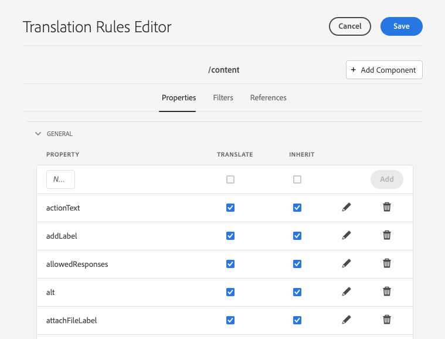

# Vertaalregels configureren {#configure-translation-rules}

Leer hoe u vertaalregels definieert om inhoud voor vertaling te identificeren.

## Het verhaal tot nu toe {#story-so-far}

In het vorige document van de de vertaalreis van AEM Sites, [&#x200B; vorm vertaalschakelaar &#x200B;](configure-connector.md) u leerde om uw vertaalschakelaar te installeren en te vormen en zou nu moeten:

* Begrijp de belangrijke parameters van het Kader van de Integratie van de Vertaling in AEM.
* Uw eigen verbinding met uw vertaalservice instellen.

Nu uw schakelaar opstelling is, neemt dit artikel u door de volgende stap van het identificeren van welke inhoud u moet vertalen.

## Doelstelling {#objective}

Dit document helpt u te begrijpen hoe u AEM vertaalregels kunt gebruiken om uw vertaalinhoud te identificeren. Nadat u dit document hebt gelezen, moet u:

* Begrijp wat de vertaalregels doen.
* U kunt uw eigen vertaalregels definiëren.

## Vertaalregels {#translation-rules}

AEM Sites-pagina&#39;s kunnen veel informatie bevatten. Afhankelijk van uw projectbehoeften, is het waarschijnlijk dat niet alle informatie binnen een pagina moet worden vertaald.

In de vertaalregels wordt aangegeven welke inhoud is opgenomen in of uitgesloten van vertaalprojecten. Wanneer de inhoud wordt vertaald, AEM de inhoud uitpakt of oogst die op deze regels wordt gebaseerd. Op die manier wordt alleen inhoud die moet worden vertaald naar de vertaaldienst verzonden.

De vertaalregels bevatten de volgende informatie:

* Het pad van de inhoud waarop de regel van toepassing is
   * De regel is ook van toepassing op de onderliggende elementen van de inhoud
* De namen van de eigenschappen die de te vertalen inhoud bevatten
   * Het bezit kan voor een specifiek middeltype of voor alle middeltypes specifiek zijn

AEM leidt automatisch tot vertaalregels voor plaatspagina&#39;s, maar omdat de vereisten van elk project verschillend zijn, is het belangrijk dat u weet hoe te om de regels zoals vereist aan uw project te herzien en aan te passen.

## Vertaalregels maken {#creating-rules}

Er kunnen meerdere regels worden gemaakt ter ondersteuning van complexe vertaalvereisten. Het ene project waaraan u werkt, vereist bijvoorbeeld dat alle paginagegevens worden vertaald, maar op een andere pagina moeten alleen beschrijvingen worden vertaald terwijl titels onvertaald blijven.

De vertaalregels worden ontworpen om dergelijke scenario&#39;s te behandelen. Nochtans in dit voorbeeld illustreren wij hoe te om regels tot stand te brengen door zich op een eenvoudige, enige configuratie te concentreren.

Er is de console van de Configuratie van de a **Vertaling** beschikbaar voor het vormen van vertaalregels.

Toegang tot dit bestand:

1. Navigeer aan **Hulpmiddelen** > **Algemeen**.
1. Selecteer **de Configuratie van de Vertaling**.

AEM maakt automatisch vertaalregels voor alle inhoud. Deze regels weergeven:

1. Selecteer de `/content` context.
1. Voor de toolbar, selecteer **uitgeven**.
1. De redacteur van de Regels van de Vertaling opent met de regels die automatisch voor de `/content` weg AEM gecreeerd.

   

1. De eigenschappen van de pagina die worden vertaald worden gevestigd onder de **Algemene** sectie van de lijst. U kunt bestaande eigenschapsnamen toevoegen of bijwerken die u expliciet wilt opnemen in de vertaling.
   1. Op het **Nieuwe gebied van het Bezit**, ga de bezitsnaam in. De opties **vertalen** en **overerven** worden automatisch gecontroleerd.
   1. Selecteer **toevoegen**.
   1. Herhaal deze stappen voor alle velden die u moet vertalen.
   1. Selecteer **sparen**.

U hebt nu uw vertaalregels geconfigureerd.

>[!NOTE]
>
>AEM maakt automatisch vertaalregels. Voor een eenvoudige vertaalopstelling of om een vertaalwerkschema te testen, is het niet noodzakelijk om nieuwe regels tot stand te brengen of zelfs de bestaande, automatisch gecreeerde regels te wijzigen. De details van deze stappen worden gepresenteerd om uit te leggen hoe de regels werken en om context te geven aan hoe AEM vertalingen verwerkt.

>[!TIP]
>
>Het is ook mogelijk om regels enkel voor uw bepaalde weg of project tot stand te brengen door te tikken of **te klikken voeg Context** knoop in de console van de Configuratie van de Vertaling toe. Dit valt buiten het bereik van deze reis.

## Geavanceerd gebruik {#advanced-usage}

Er zijn verscheidene extra eigenschappen die als deel van uw vertaalregels kunnen worden gevormd. Bovendien kunt u uw regels handmatig als XML opgeven, waardoor meer specificiteit en flexibiliteit mogelijk zijn.

Zulke eigenschappen zijn over het algemeen niet nodig begonnen uw inhoud te lokaliseren, maar u kunt over hen in de [&#x200B; Extra sectie van Middelen &#x200B;](#additional-resources) lezen als u geinteresseerd bent.

## Volgende functies {#what-is-next}

Nu u dit deel van de AEM Sites-vertaalreis hebt voltooid, moet u:

* Begrijp wat de vertaalregels doen.
* U kunt uw eigen vertaalregels definiëren.

Bouw op deze kennis voort en ga uw de vertaalreis van AEM Sites door het document [&#x200B; opnieuw te bekijken vertaal inhoud &#x200B;](translate-content.md) waar u leert hoe uw schakelaar en regels samenwerken om inhoud te vertalen.

## Aanvullende bronnen {#additional-resources}

Terwijl het wordt geadviseerd dat u zich op het volgende deel van de vertaalreis door het document [&#x200B; te herzien vertaalt inhoud &#x200B;](translate-content.md) beweegt, zijn het volgende sommige extra, facultatieve middelen die een diepere duik op sommige die concepten doen in dit document worden vermeld, maar zij worden niet vereist om op de reis verder te gaan.

* [&#x200B; identificerend Inhoud om &#x200B;](/help/sites-cloud/administering/translation/rules.md) te vertalen - leer hoe de vertaalregels inhoud identificeren die moet vertalen.
