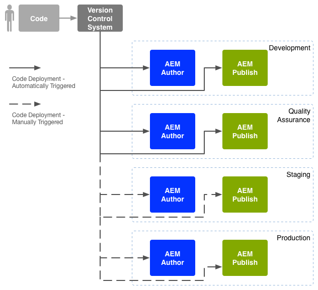

# Enterprise DevOps{#enterprise-devops}

DevOps omvat de processen, methoden en communicatie die vereist zijn om:

* Vereenvoudig de implementatie van uw software in de verschillende omgevingen.
* Vereenvoudig de samenwerking tussen de ontwikkelings-, test- en implementatieteams.

DevOps heeft tot doel problemen zoals:

* Handmatige fouten.
* vergeten elementen; bijvoorbeeld bestanden, configuratiegegevens.
* discrepanties; bijvoorbeeld tussen de lokale omgeving van een ontwikkelaar en andere omgevingen.

## Omgevingen {#environments}

Adobe Experience Manager (AEM) als Cloud Service bestaat gewoonlijk uit meerdere omgevingen die op verschillende niveaus voor verschillende doeleinden worden gebruikt:

* [Ontwikkeling](#development)
* [Kwaliteitsborging](#quality-assurance)
* [Staging](#staging)
* [Productie](#production-author-and-publish)

>[!NOTE]
>
>De productieomgeving moet minstens één auteur en één publicatieomgeving hebben.
>
>Het wordt aanbevolen dat alle andere omgevingen ook bestaan uit een auteur- en publicatieomgeving die de productieomgeving weerspiegelt en vroege tests mogelijk maakt.

### Ontwikkeling {#development}

De ontwikkelaars zijn verantwoordelijk voor het ontwikkelen en aanpassen van het voorgestelde project (website, mobiele toepassingen, DAM-implementatie, enz.) met alle vereiste functionaliteit. Ze:

* de nodige elementen te ontwikkelen en aan te passen; bijvoorbeeld sjablonen, componenten, workflows, toepassingen
* het ontwerp realiseren
* ontwikkelen van de noodzakelijke diensten en manuscripten om de vereiste functionaliteit uit te voeren

De configuratie van de [ontwikkelomgeving](/help/implementing/developing/introduction/development-guidelines.md) kan afhankelijk zijn van verschillende factoren, hoewel deze meestal bestaat uit:

* Een geïntegreerd ontwikkelingssysteem met versiecontrole om een geïntegreerde code-basis te verstrekken. Dit wordt gebruikt om code van de individuele ontwikkelomgevingen samen te voegen en te consolideren die door elke ontwikkelaar worden gebruikt.
* Een persoonlijke omgeving voor elke ontwikkelaar; gewoonlijk op hun lokale machine. Met de juiste intervallen wordt de code gesynchroniseerd met het versiebeheersysteem

Afhankelijk van de schaal van uw systeem kan de ontwikkelomgeving zowel auteur- als publicatieinstanties hebben.

### Kwaliteitsborging {#quality-assurance}

Deze omgeving wordt door het team voor kwaliteitsborging gebruikt om uw nieuwe systeem volledig te testen; zowel ontwerp als functie. De software moet zowel auteur- als publicatieomgevingen met geschikte inhoud hebben en alle noodzakelijke services bieden om een volledige reeks tests mogelijk te maken.

### Staging {#staging}

De testomgeving moet een spiegel zijn van de productieomgeving - configuratie, code en inhoud:

* Het wordt gebruikt om de manuscripten te testen die worden gebruikt om de daadwerkelijke plaatsing uit te voeren.
* Het kan voor definitieve tests (ontwerp, functionaliteit en interfaces) worden gebruikt alvorens aan de productiemilieu&#39;s op te stellen.
* Hoewel het niet altijd mogelijk is om de testomgeving identiek te maken met de productieomgeving, moet deze zo dicht mogelijk bij de prestaties en de belasting liggen.

### Productie - Auteur en Publicatie {#production-author-and-publish}

De productieomgeving bestaat uit de omgevingen die nodig zijn om uw implementatie daadwerkelijk te [ontwerpen en te publiceren](/help/sites-cloud/authoring/getting-started/concepts.md) .

Een productieomgeving bestaat uit ten minste één auteur-instantie en één publicatie-instantie:

* Een [ontwerpinstantie](#author) voor de invoer van inhoud.
* Een [publicatieexemplaar](#publish) voor inhoud die aan uw bezoekers/gebruikers ter beschikking wordt gesteld.

Afhankelijk van de schaal van het project, bestaat het vaak uit verscheidene auteur en/of publiceer instanties. Op een lager niveau kan de gegevensopslagruimte ook in meerdere gevallen worden geclusterd.

#### Auteur {#author}

Auteurinstanties bevinden zich gewoonlijk achter de interne firewall. Dit is de omgeving waarin u en uw collega&#39;s ontwerptaken uitvoeren, zoals:

* het volledige systeem beheren
* uw inhoud invoeren
* configureren van de lay-out en het ontwerp van uw inhoud
* uw inhoud activeren voor de publicatieomgeving

Inhoud die is geactiveerd, wordt in een pakket geplaatst en in de replicatiewachtrij van de auteursomgeving geplaatst. Het replicatieproces vervoert die inhoud dan naar het publicatiemilieu.

Om gegevens die in een publicatiemilieu worden geproduceerd omgekeerd te herhalen terug naar het auteursmilieu, zal een replicatieluisteraar in het auteursmilieu publiceren milieu en zal dergelijke inhoud terugwinnen van omgekeerde replicatieoutbox van het publicatiemilieu.

#### Publiceren {#publish}

Een publicatieomgeving bevindt zich gewoonlijk in de gedemilitariseerde zone (DMZ). Dit is de omgeving waarin bezoekers toegang krijgen tot uw inhoud (bijvoorbeeld via een website of in de vorm van een mobiele toepassing) en ermee communiceren; moet het openbaar zijn, of binnen uw Intranet. Een publicatieomgeving:

* bevat inhoud die is gerepliceerd vanuit de auteuromgeving
* stelt die inhoud ter beschikking van de bezoekers
* slaat gebruikersgegevens op die door uw bezoekers worden gegenereerd, zoals opmerkingen of andere formulierverzendingen
* kan worden gevormd om dergelijke gebruikersgegevens aan outbox, voor omgekeerde replicatie terug naar het auteursmilieu toe te voegen

De publicatieomgeving genereert uw inhoud dynamisch in real-time en de inhoud kan voor elke gebruiker afzonderlijk worden aangepast.

## Codeverplaatsing {#code-movement}

Code moet altijd van beneden naar boven worden doorgegeven:

* de code wordt aanvankelijk ontwikkeld op de lokale en dan geïntegreerde ontwikkelomgevingen
* gevolgd door grondig testen van de QA-omgeving(en)
* vervolgens opnieuw getest op testomgevingen
* pas dan moet de code worden geïmplementeerd in de productieomgevingen

De code (bijvoorbeeld aangepaste functionaliteit van webtoepassingen en ontwerpsjablonen) wordt meestal overgedragen door pakketten te exporteren en te importeren tussen de verschillende opslagplaatsen voor inhoud. Waar zinvol, kan deze replicatie als automatisch proces worden gevormd.

AEM als projecten van de Dienst van de Wolk teweegbrengen vaak codeplaatsing teweeg:

* Automatisch: voor overdracht naar de ontwikkelings- en QA-omgevingen.
* Handmatig: de implementatie in de staging- en productieomgevingen gebeurt op een meer beheerste en vaak handmatige manier; automatisering is echter mogelijk als dat nodig is.

## Inhoud verplaatsen {#content-movement}

Inhoud die wordt gemaakt voor productie, moet **altijd** worden geschreven voor de instantie van de productiepauteur.

Inhoud mag geen code volgen die van een lagere naar een hogere omgeving overgaat, aangezien auteurs inhoud maken op lokale computers of lagere omgevingen en het vervolgens overbrengen naar de productieomgeving geen goede praktijk is en waarschijnlijk fouten en inconsistenties zal veroorzaken.

Productie-inhoud moet van de productieomgeving naar de testomgeving worden verplaatst om ervoor te zorgen dat de testomgeving een efficiënte en nauwkeurige testomgeving biedt.

>[!NOTE]
>
>Dit betekent niet dat het opvoeren van inhoud voortdurend met productie moet worden gesynchroniseerd, zijn de regelmatige updates voldoende, maar vooral alvorens een nieuwe herhaling van code te testen. Inhoud in de kwaliteitscontrole- en ontwikkelingsomgevingen hoeft niet zo vaak te worden bijgewerkt, maar moet alleen een goede weergave van de productie-inhoud zijn.

Inhoud kan worden overgedragen:

* Tussen de verschillende omgevingen: door pakketten te exporteren en te importeren.
* Tussen verschillende instanties - door de inhoud rechtstreeks te repliceren (AEM als replicatie van de Cloud Service) (via een HTTP- of HTTPS-verbinding).

