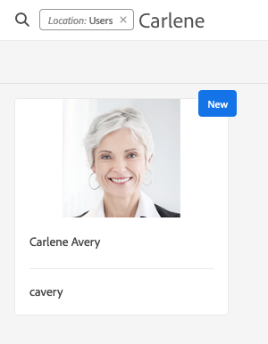

# Adobe Experience Manager als Cloud Service Foundation Readiness for Data Protection and Data Privacy Regulations {#aem-foundation-readiness-for-data-protection-and-data-privacy-regulations}

>[!WARNING]
>
>De inhoud van dit document is geen juridisch advies en is niet bedoeld als vervanging van juridisch advies.
>
>Raadpleeg de juridische afdeling van uw bedrijf voor advies over de regelgeving inzake gegevensbescherming en gegevensbescherming.

>[!NOTE]
>
>Meer informatie over het antwoord van Adobe op privacy-problemen en wat dit voor u als Adobe-klant betekent, vindt u in het Privacy Center [van](https://www.adobe.com/privacy.html)Adobe.

## Ondersteuning voor gegevensbescherming en beveiliging van AEM Foundation {#aem-foundation-data-privacy-and-protection-support}

Op het niveau van de Stichting AEM, wordt het Persoonlijke Gegevens die wordt opgeslagen gehouden in het Profiel van de Gebruiker. Daarom richt de informatie in dit artikel hoofdzakelijk hoe te om tot gebruikersprofielen toegang te hebben en te schrappen, om de toegang te richten en verzoeken te schrappen.

## Een gebruikersprofiel openen {#accessing-a-user-profile}

### Handmatige stappen {#manual-steps}

1. Open de console van het Beleid van de Gebruiker, door aan **[!UICONTROL Tools - Security - Users]** of rechtstreeks te doorbladeren aan `https://<serveraddress>:<serverport>/security/users.html`

<!--
   
-->

1. Zoek vervolgens naar de desbetreffende gebruiker door de naam in de zoekbalk boven aan de pagina te typen:

   

1. Tot slot open het gebruikersprofiel door het te klikken, dan controle onder het **[!UICONTROL Details]** lusje.

   

### HTTP API {#http-api}

Zoals vermeld, verstrekt Adobe APIs voor de toegang tot van gebruikersgegevens, om automatisering te vergemakkelijken. Er zijn verschillende typen API&#39;s die u kunt gebruiken:

**UserProperties-API**

```shell
curl -u user:password http://localhost:4502/libs/granite/security/search/profile.userproperties.json\?authId\=cavery
```

**Verkopen-API**

**De startpagina van de gebruiker opzoeken:**

```xml
curl -g -u user:password 'http://localhost:4502/libs/granite/security/search/authorizables.json?query={"condition":[{"named":"cavery"}]}'
     {"authorizables":[{"type":"user","authorizableId_xss":"cavery","authorizableId":"cavery","name_xss":"Carlene Avery","name":"Carlene Avery","home":"/home/users/we-retail/DSCP-athB1NYLBXvdTuN"}],"total":1}
```

**Gebruikersgegevens ophalen:**

Gebruikend de knoopweg van het huisbezit van de nuttige lading JSON die van het bovengenoemde bevel is teruggekeerd:

```shell
curl -u user:password  'http://localhost:4502/home/users/we-retail/DSCP-athB1NYLBXvdTuN/profile.-1.json'
```

```shell
curl -u user:password  'http://localhost:4502/home/users/we-retail/DSCP-athB1NYLBXvdTuN/profiles.-1.json'
```

## Een gebruiker uitschakelen en de bijbehorende profielen verwijderen {#disabling-a-user-and-deleting-the-associated-profiles}

### Gebruiker uitschakelen {#disable-user}

1. Open de console van het Beleid van de Gebruiker en onderzoek naar de gebruiker in kwestie, zoals hierboven beschreven.
2. Houd de muisaanwijzer boven de gebruiker en klik op het pictogram Selecteren. Het profiel wordt grijs om aan te geven dat het is geselecteerd.

3. Druk op de knop **Uitschakelen** in het bovenste menu om de gebruiker uit te schakelen:

   

4. Ten slotte, bevestig de actie.

   De gebruikersinterface geeft vervolgens aan dat de gebruikersaccount is gedeactiveerd door uit te schakelen en een vergrendeling toe te voegen aan de profielkaart:

   

### Gebruikersprofielgegevens verwijderen {#delete-user-profile-information}

>[!NOTE]
>
>Voor AEM als Cloud Service is er geen handprocedure beschikbaar van UI voor het schrappen van een gebruikersprofiel, aangezien CRXDE niet toegankelijk is.

### HTTP API {#http-api-1}

In de volgende procedures wordt het opdrachtregelprogramma `curl` gebruikt om te tonen hoe u de gebruiker kunt uitschakelen met de **[!UICONTROL cavery]** `userId` en hoe u de profielen die beschikbaar zijn op de standaardlocatie, kunt verwijderen.

**De startpagina van de gebruiker opzoeken:**

```shell
curl -g -u user:password 'http://localhost:4502/libs/granite/security/search/authorizables.json?query={"condition":[{"named":"cavery"}]}'
     {"authorizables":[{"type":"user","authorizableId_xss":"cavery","authorizableId":"cavery","name_xss":"Carlene Avery","name":"Carlene Avery","home":"/home/users/we-retail/DSCP-athB1NYLBXvdTuN"}],"total":1}
```

**De gebruiker uitschakelen:**

Gebruikend de knoopweg van het huisbezit van de nuttige lading JSON die van het bovengenoemde bevel is teruggekeerd:

```shell
curl -X POST -u user:password -FdisableUser="describe the reasons for disabling this user (Data Privacy in this case)" 'http://localhost:4502/home/users/we-retail/DSCP-athB1NYLBXvdTuN.rw.userprops.html'
```

**Gebruikersprofiel(en) verwijderen**

Het gebruiken van de knoopweg van het huisbezit van de nuttige lading JSON die van het bevel van de rekeningsontdekking en het gekende uit de knoopplaatsen van het kaderprofiel is teruggekeerd:

```shell
curl -X POST -u user:password -H "Accept: application/json,**/**;q=0.9" -d ':operation=delete' 'http://localhost:4502/home/users/we-retail/DSCP-athB1NYLBXvdTuN/profile'
```

```shell
curl -X POST -u user:password -H "Accept: application/json,**/**;q=0.9" -d ':operation=delete' 'http://localhost:4502/home/users/we-retail/DSCP-athB1NYLBXvdTuN/profile'
```
