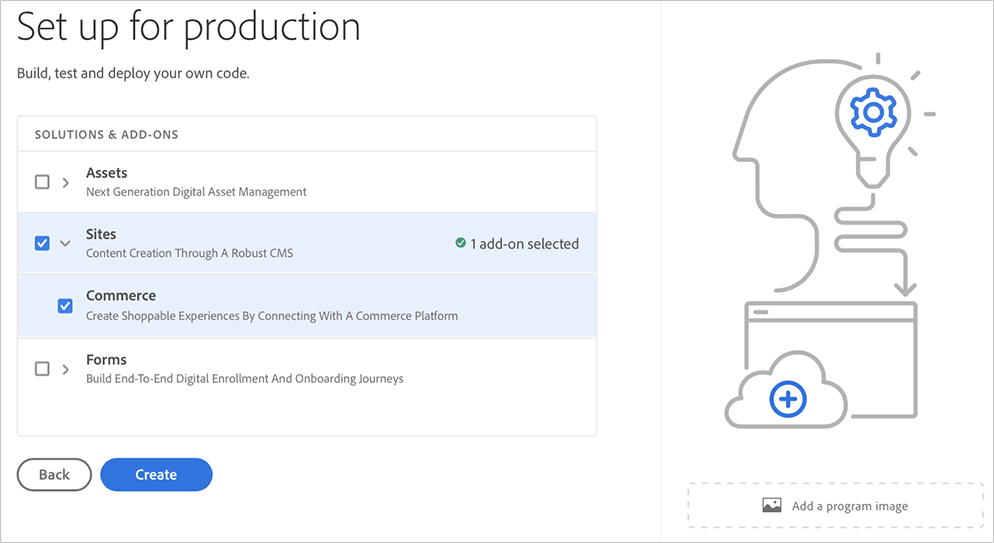

# Een productieprogramma maken {#create-production-program}

Een *Production* programma is bedoeld voor een gebruiker die vertrouwd is met AEM en Cloud Manager en klaar is om code te schrijven, te bouwen en te testen met als doel deze te implementeren in Production.

Voer de volgende stappen uit om een productieprogramma te maken:

1. Start de openingspagina van Cloud Manager en klik op **Programma toevoegen** in de rechterbovenhoek van het scherm.

   

   >[!NOTE]
   >Raadpleeg [Landing Page](/help/onboarding/what-is-required/navigate-to-cloud-manager.md) voor meer informatie over het openen van cloudbeheer voor meer informatie.

1. Selecteer **Opstelling voor Productie** in de Create tovenaar van het Programma om een Programma van de Productie tot stand te brengen. De gebruiker kan de standaardprogrammanaam goedkeuren of het uitgeven alvorens **Create** te selecteren.

   

1. De gebruiker zal oplossingen selecteren die in het programma in het scherm moeten worden opgenomen dat na het bovenstaande scherm zal worden voorgesteld. Als u de gewenste oplossing of oplossingen hebt geselecteerd, klikt u op **Maken**.

   

   Bovendien kunt u de **Commerce** toe:voegen-op optie onder **Plaatsen**, zoals aangetoond in het hieronder cijfer selecteren, en op &lt;a4 klikken/>Create **.**

   

1. Zodra u uw programmacode op de bestemmingspagina ziet, houd de aanwijzer boven het pictogram Cloud Manager om naar de pagina Cloud Manager **Overzicht** te navigeren.

   

1. De belangrijkste vraag-aan-actie kaart zal de gebruiker begeleiden om een milieu tot stand te brengen, een niet productiepijpleiding, en tenslotte een productiepijpleiding tot stand te brengen.
   

   >[!NOTE]
   >Een productieprogramma heeft geen **Auto-setup** eigenschap.
