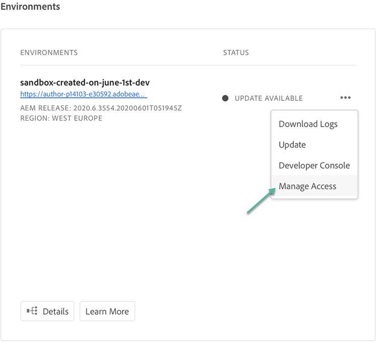

# Experience Manager as a Cloud Service openen {#navigation}

Zodra uw systeembeheerder u toegang tot Cloud Manager verleent, ontvangt u een e-mail die u naar de aanmeldingspagina van Cloud Manager stuurt die ook toegankelijk is via [Adobe Experience Cloud](https://my.cloudmanager.adobe.com/).

Nadat u zich hebt aangemeld, gaat u naar de bestemmingspagina van Cloud Manager, zoals hieronder wordt weergegeven.

## SysAdmin-taken {#sysadmin-tasks}

Een gebruiker met de rol SysAdmin heeft nu rechtstreeks toegang tot de beheerconsole om rollen en machtigingen te beheren en toegang te krijgen tot AEM-instanties.

### Rollen beheren {#manage-roles}

Als gebruiker in de rol SysAdmin, hebt u one-click toegang tot de plaats in Console **** Admin van waar de gebruikersrollen of de toestemmingen aan de Manager van de Wolk worden geleid.

Raadpleeg [Toegang tot Cloud Manager](https://docs.adobe.com/content/help/en/experience-manager-cloud-service/security/ims-support.html#accessing-cloud-manager) voor meer informatie over het toevoegen van gebruikers aan een profiel.

>[!NOTE]
>Voor sommige organisaties die vóór januari 2020 toegang hebben gekregen tot AEM als Cloud Service, worden deze doorgestuurd naar de Adobe Admin Console en moet het Product and Environment Product Profile worden geselecteerd.

1. Navigeer naar de openingspagina van Cloud Manager en klik op **Toegang** beheren.

   

1. Als u op Toegang **** beheren klikt, gaat u naar de **beheerconsole** vanwaar u de gebruikersrollen of machtigingen kunt beheren naar Cloud Manager.

   

### Toegang tot instantie Auteur beheren {#manage-access-aem}

Als gebruiker in de rol SysAdmin, hebt u one-click toegang tot de Console **** Admin van waar u aan de instantie van de Auteur kunt direct navigeren en toegang beheren.

>[!NOTE]
>Voor sommige organisaties die vóór januari 2020 toegang hebben gekregen tot AEM als Cloud Service, worden deze doorgestuurd naar de Adobe Admin Console en moet het Product and Environment Product Profile worden geselecteerd.

Raadpleeg [Toegang tot een instantie in AEM als cloudservice](https://docs.adobe.com/content/help/en/experience-manager-cloud-service/security/ims-support.html#accessing-instance-cloud-service) voor meer informatie.

1. Navigeer naar de **milieucaart** van de pagina *Overzicht* of naar de pagina **Milieu** om de optie **Toegang** beheren te gebruiken, zoals hieronder getoond in het cijfer.

   

1. Wanneer u op Toegang **** beheren klikt, gaat u naar de **beheerconsole** vanwaar u toegang hebt tot de instantie Auteur van een omgeving.

   

## Voor bestaande AMS-klanten {#existing-aem}

Als u een bestaande AMS-klant (Adobe Managed Services) bent en u toegang hebt tot Cloud Service, ziet u uw bestaande programma(&#39;s) en de knop Program **** toevoegen rechtsboven op de bestemmingspagina.

Neem contact op met uw vertegenwoordiger van Adobe als u de knop Programma **** toevoegen niet ziet en vragen hebt over toegang tot de Cloud-service.

Zie Een nieuw programma [toevoegen in de Cloud-service met bestaande programma&#39;s](/help/onboarding/getting-access-to-aem-in-cloud/first-time-login.md#existing-program) voor meer informatie.

## Voor nieuwe klanten van de cloudservice {#new-cloud-services}

Als u een nieuwe klant van de Dienst van de Wolk bent, dan zult u de **Add knoop van het Programma** op de hoogste juiste hoek van een lege het landen pagina zien. U wilt een nieuw programma toevoegen aan uw cloudservice.

Zie Een nieuw programma [toevoegen in de Cloud-service zonder bestaande programma](/help/onboarding/getting-access-to-aem-in-cloud/first-time-login.md#no-program) voor meer informatie.

