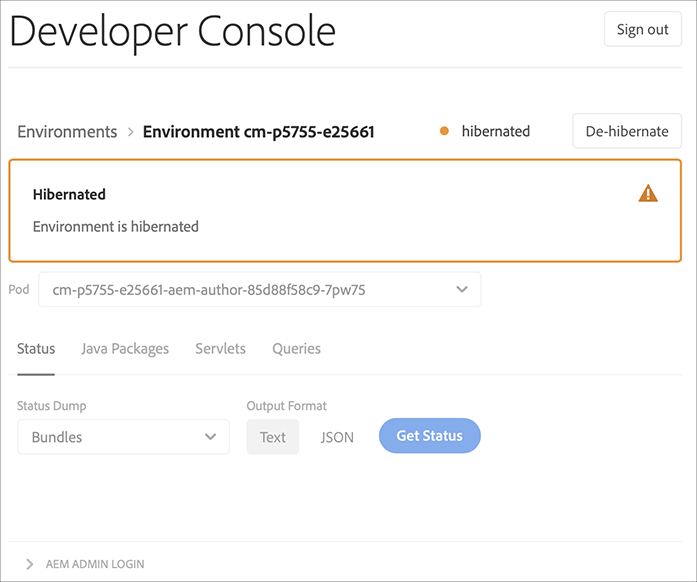

# Sandbox-programma&#39;s {#sandbox-programs}

## Inleiding {#introduction}

Een Sandbox-programma is een van de twee typen programma&#39;s die beschikbaar zijn in AEM Cloud Service, terwijl het andere een Regular-programma is.

Een zandbak wordt typisch gecreeerd om de doeleinden van opleiding, lopende demo&#39;s, enablement, of van het Bewijs van Concept (POC) te dienen. Zij zijn niet bedoeld om levend verkeer te vervoeren.

Sandbox-programma&#39;s omvatten Sites en Middelen en worden automatisch gevuld met een Git-vertakking die voorbeeldcode, een ontwikkelomgeving en een niet-productiepijplijn bevat.

Verwijs naar het [Begrip van Programma&#39;s en de Types](https://docs.adobe.com/content/help/en/experience-manager-cloud-service/onboarding/getting-access/understand-program-types.html) van Programma om meer over de Types van Programma te leren.

### Attributen van Sandbox-programma&#39;s {#attributes-sandbox}

Sandbox-programma&#39;s hebben de volgende kenmerken:

1. **Programma maken:** Het maken van het Sandbox-programma omvat automatisch:
   * opstelling van project met steekproefcode en inhoud
   * totstandbrenging van een ontwikkelomgeving
   * de aanleg van een niet-productiepijpleiding die aan ontwikkelomgeving (hoofdtak die aan ontwikkelomgeving opstelt)

1. **Oplossingen:** Sandbox-programma&#39;s omvatten AEM-sites en -middelen.

1. **AEM-updates:** AEM-updates kunnen handmatig worden toegepast op omgevingen in een Sandbox-programma en worden niet automatisch geduwd.

1. **Sluimerstand:** De milieu&#39;s in een Sandbox programma worden automatisch gehiberd als geen activiteit voor een bepaalde periode wordt ontdekt. Gesamberde omgevingen kunnen handmatig worden gedehiberteerd.

### Sandboxprogramma&#39;s maken {#creating-sandbox-program}

Met een wizard voor het maken van programma&#39;s kunt u een Sandbox-programma maken.

Raadpleeg voor meer informatie over het maken van een Sandbox-programma.

### Sandbox-omgevingen maken {#creating-sandbox-environments}

Sandbox-programma&#39;s worden automatisch in een ontwikkelomgeving geleverd op het moment dat het programma wordt gemaakt. De ontwikkelomgeving bevat standaard een auteur en een publicatielaag.

De productie-Stadium milieureeks kan manueel aan het Programma van Sandbox worden toegevoegd, wanneer de gebruiker aan opstelling een productiepijplijn klaar is.

Raadpleeg [Omgevingen](https://docs.adobe.com/content/help/en/experience-manager-cloud-service/implementing/using-cloud-manager/manage-environments.html#adding-environments) toevoegen voor meer informatie over het handmatig maken van een omgeving.

### Sandbox-omgevingen verwijderen {#deleting-sandbox-environments}

Gebruiker met de vereiste machtigingen kan een ontwikkelings- of productie-/werkgebiedomgeving of -sets verwijderen.

Als u een omgeving wilt verwijderen, raadpleegt u [Verwijderen van omgevingen](https://docs.adobe.com/content/help/en/experience-manager-cloud-service/implementing/using-cloud-manager/manage-environments.html#deleting-environment) voor meer informatie.

## Sluiende en ontsmette zandbakomgevingen {#hibernating-introduction}

De milieu&#39;s van het Programma van de zandbak gaan een *hibernatiemodus* in als geen activiteit voor een bepaalde periode wordt ontdekt.

>[!NOTE]
>De sluimerstand is uniek voor Sandbox-programmaomgevingen. Reguliere programmeeromgevingen houden geen hiberatie in.

### Sluimerstand {#hibernation-introduction}

Sluimerstand kan automatisch of handmatig plaatsvinden. Het kan tot een paar minuten duren voor de milieu&#39;s van het Programma Sandbox om een *hibernatiemodus* in te gaan. De gegevens blijven behouden tijdens de hibernatie.

Sluimerstand wordt gecategoriseerd als:

* **De automatische** milieu&#39;s van het Programma van Sandbox worden automatisch gehiberneerd na acht uren van inactiviteit, betekenend dat noch de auteur noch de publicatieservices verzoek ontvangen.

* **Handmatig**: Als gebruiker kunt u handmatig een Sandbox-programmaomgeving herbergen, hoewel dit niet verplicht is, aangezien er na een bepaalde periode (acht uur) van inactiviteit automatisch sprake zal zijn van herberging.

#### Handmatige slaapstand gebruiken {#using-manual-hibernation}

U kunt uw Sandbox-programma handmatig op twee verschillende manieren via de Developer Console herbergen:

* Detailscherm omgeving
* Omgevingsscherm

Voer de onderstaande stappen uit om uw Sandbox-programmaomgevingen handmatig te hiberneren:

1. Navigeer naar de **Developer Console**.
Raadpleeg [Developer Console](https://docs.adobe.com/content/help/en/experience-manager-cloud-service/implementing/using-cloud-manager/manage-environments.html#accessing-developer-console) (Toegang tot ontwikkelaarsconsole) voor meer informatie over toegang tot de **ontwikkelaarsconsole** vanaf de **milieukeuren** .

1. Klik op **Slaapstand**, zoals in de onderstaande afbeelding wordt getoond:

   

   Of

   Klik op **Sluimerstand** in de lijst Milieu&#39;s, zoals in de onderstaande afbeelding wordt getoond:

   

1. Klik op **Slaapstand** om de stap te bevestigen.

   

1. Wanneer de slaapstand is gelukt, wordt het volledige bericht voor uw omgeving weergegeven in het scherm **Developer Console** .

   

### De-hibernatie {#de-hibernation-introduction}

1. Navigeer naar de **Developer Console**.
Raadpleeg [Developer Console](https://docs.adobe.com/content/help/en/experience-manager-cloud-service/implementing/using-cloud-manager/manage-environments.html#accessing-developer-console) (Toegang tot ontwikkelaarsconsole) voor meer informatie over toegang tot de **ontwikkelaarsconsole** vanaf de **milieukeuren** .

   >[!IMPORTANT]
   >Toegang tot de ontwikkelaarsconsole wordt gedefinieerd door de rol **Ontwikkelaar in** Cloud Manager in de **beheerconsole**. Een gebruiker met een ontwikkelaarrol machtiging kan een Sandbox-programmaomgeving dehiberneren.

1. Klik op De- **hibernate**, zoals in onderstaande afbeelding wordt getoond:

   

   Of

   Klik op De- **hibernate** uit de lijst **Omgevingen** , zoals hieronder getoond:

   

1. Klik op **De Hibernate** om de stap te bevestigen.

   

1. U ontvangt het bericht dat het dehibernatieproces is gestart en u wordt bijgewerkt met de voortgang.

   

1. Zodra het proces voltooit, is het milieu van het Programma Sandbox opnieuw actief.

   

#### Een gedownloade omgeving openen {#accessing-hibernated-environment}

Wanneer de gebruiker om het even welke browser verzoeken tegen of de auteur of publicatielaag van een hibernated milieu, zal de gebruiker een landende pagina ontmoeten die de geminimaliseerde status van het milieu beschrijft, zoals aangetoond in het hieronder cijfer beschrijft:

Een gebruiker met de **Cloud Manager - de Rol** van de Ontwikkelaar kan op de Console **van de** Ontwikkelaar klikken om tot de ontwikkelaarsconsole toegang te hebben en het milieu te dehiberneren.

>[!NOTE]
> Voor veel functies in Cloud Manager zijn specifieke machtigingen vereist. Meer over rollen voor gebruikers leren die de beschikbaarheid van specifieke eigenschappen bepalen, verwijs[naar Add Gebruikers en Rollen](https://docs.adobe.com/content/help/en/experience-manager-cloud-service/onboarding/what-is-required/add-users-roles.html).

## AEM-updates voor Sandbox-omgevingen {#aem-updates-sandbox}

Raadpleeg de [AEM-versie-updates](https://docs.adobe.com/content/help/en/experience-manager-cloud-service/implementing/deploying/overview.html#version-updates) voor meer informatie.

Een gebruiker kan AEM-updates handmatig toepassen op de omgevingen in een Sandbox-programma.

Raadpleeg [Bijgewerkt omgeving](https://docs.adobe.com/content/help/en/experience-manager-cloud-service/implementing/using-cloud-manager/manage-environments.html#updating-dev-environment) voor meer informatie over het bijwerken van een omgeving.

>[!NOTE]
>Een *niet-productiepijpleiding* die aan het ontwikkelmilieu van belang opstelt moet worden gevormd om een handupdate pijpleiding in werking te stellen.

>[!NOTE]
>Er moet een *productiepijpleiding* worden geconfigureerd om een handmatige updatepijpleiding naar Production+Stage-omgeving te laten starten.

>[!NOTE]
>Handmatige update naar *Productie* - of *werkgebiedomgeving* werkt automatisch de andere bij. De omgeving Production+Stage moet zich op dezelfde AEM-versie bevinden.

