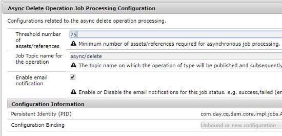

# Asynchrone bewerkingen {#asynchronous-operations}

Om negatieve gevolgen voor prestaties te verminderen, verwerkt de Manager van de Ervaring van de Adobe bepaalde langlopende en middel-intensieve verrichtingen asynchroon als achtergrondverrichtingen. Bij asynchrone verwerking worden meervoudige taken in wachtrijen geplaatst en serieel uitgevoerd, afhankelijk van de beschikbaarheid van systeembronnen.

Deze bewerkingen omvatten:

* Veel assets verwijderen
* Veel assets verplaatsen, of assets met veel verwijzingen verplaatsen
* Metadata van assets bulksgewijs exporteren/importeren
* Assets die boven de ingestelde drempelwaarde liggen, importeren vanaf een externe Experience Manager-implementatie
* Actieve exemplaren uitrollen

U kunt het statuut van asynchrone banen van het **[!UICONTROL Background Operations]** dashboard bij **Globale Navigatie** bekijken > **Hulpmiddelen** > **Algemeen** > **Banen**.

>[!NOTE]
>
>Asynchrone taken worden standaard parallel uitgevoerd. Als *`n`* het aantal CPU-cores is, kunnen standaard *`n/2`* taken parallel worden uitgevoerd. Als u aangepaste instellingen voor de taakwachtrij wilt gebruiken, wijzigt u **[!UICONTROL Async Operation Default Queue Config]** en de **Async Operation Page Move and Rollout Config** vanaf de webconsole.
>
>Voor meer informatie raadpleegt u [wachtrijconfiguraties](https://sling.apache.org/documentation/bundles/apache-sling-eventing-and-job-handling.html#queue-configurations).

## De status van asynchrone bewerkingen controleren {#monitor-the-status-of-asynchronous-operations}

Wanneer AEM een bewerking asynchroon verwerkt, ontvangt u een bericht in uw [inbox](/help/sites-cloud/authoring/inbox.md) en via e-mail (mits ingeschakeld).

Navigeer naar de pagina **[!UICONTROL Background Operations]** om de status van de asynchrone bewerkingen in detail weer te geven.

1. In de interface van de Experience Manager selecteert de uitgezochte **Globale Navigatie** > **Hulpmiddelen** > **Algemeen** > **Banen**.

1. Controleer op de pagina **[!UICONTROL Background Operations]** de details van de bewerkingen.

   

   Bekijk de waarde in de kolom **[!UICONTROL Status]** voor informatie over de voortgang van een bepaalde bewerking. Afhankelijk van de voortgang wordt een van de volgende statussen weergegeven:

   * **[!UICONTROL Active]**: De bewerking wordt verwerkt

   * **[!UICONTROL Success]**: De bewerking is voltooid

   * **[!UICONTROL Fail]** of **[!UICONTROL Error]**: De bewerking kan niet worden verwerkt

   * **[!UICONTROL Scheduled]**: De bewerking is gepland voor verwerking op een later tijdstip

1. Als u een actieve bewerking wilt stoppen, selecteert u deze in de lijst en klikt u op de werkbalk op **[!UICONTROL Stop]**.

   

1. Als u meer details wilt weergeven, bijvoorbeeld een beschrijving en logboekbestanden, selecteert u de bewerking en klikt u op **[!UICONTROL Open]** op de werkbalk.

   

   De pagina met taakdetails wordt weergegeven.

   

1. Als u de bewerking uit de lijst wilt verwijderen, selecteert u **[!UICONTROL Delete]** op de werkbalk. Klik op **[!UICONTROL Download]** om de details naar een csv-bestand te downloaden.

   >[!NOTE]
   >
   >U kunt een taak niet verwijderen als de status **Actief** of **In wachtrij** is.

## Asynchrone opties voor taakverwerking configureren {#configure}

Er zijn verscheidene opties rond asynchrone banen die kunnen worden gevormd. De volgende voorbeelden tonen hoe dit kan worden gedaan gebruikend de configuratiemanager op een lokaal ontwikkelingssysteem.

>[!NOTE]
>
>[ OSGi configuraties ](/help/implementing/deploying/configuring-osgi.md#creating-osgi-configurations) worden beschouwd als veranderlijke inhoud en om het even welke dergelijke configuraties moeten als inhoudspakket voor een productiemilieu worden opgesteld.

### Voltooide taken wissen {#purging-completed-jobs}

AEM voert elke dag om 10:00 een zuiveringstaak uit om voltooide asynchrone banen te schrappen die meer dan een dag oud zijn.

U kunt het schema wijzigen voor de opschoontaak en hoe lang details van voltooide taken bewaard blijven voordat ze worden verwijderd. U kunt ook het maximum aantal voltooide taken configureren waarvoor de details tot een gewenst tijdstip bewaard blijven.

1. Meld u aan bij de AEM webconsole van AEM SDK QuickStart Jar op `https://<host>:<port>/system/console` als beheerder.
1. Ga aan **OSGi** > **Configuratie**
1. Open de taak **[!UICONTROL Adobe Granite Async Jobs Purge Scheduled Job]**.
1. Geef het volgende op:
   * Het maximum aantal dagen waarna voltooide taken worden verwijderd.
   * Het maximum aantal taken waarvan data in de geschiedenis worden bewaard.
   * De cron-expressie waarmee wordt opgegeven wanneer de opschoning moet worden uitgevoerd.

   

1. Sla de wijzigingen op.

### Asynchrone bewerkingen voor het verwijderen van elementen configureren {#configuring-synchronous-delete-operations}

Als het aantal te verwijderen assets of mappen de drempelwaarde overschrijdt, wordt de verwijderingsbewerking asynchroon uitgevoerd.

1. Meld u aan bij de AEM webconsole van AEM SDK QuickStart Jar op `https://<host>:<port>/system/console` als beheerder.
1. Ga aan **OSGi** > **Configuratie**
1. Open vanuit de webconsole de lus **[!UICONTROL Async Process Default Queue Configuration]** .
1. Geef in het vak **[!UICONTROL Threshold number of assets]** het drempelaantal assets/mappen op voor de asynchrone verwerking van verwijderingsbewerkingen.

   

1. Schakel de optie **E-mailmeldingen inschakelen** in om e-mailmeldingen te ontvangen voor deze taakstatus. succes bijvoorbeeld, mislukt.
1. Sla de wijzigingen op.

### Asynchrone verplaatsingsbewerkingen voor middelen configureren {#configuring-asynchronous-move-operations}

Als het aantal te verplaatsen assets/mappen de drempelwaarde overschrijdt, wordt de verplaatsingsbewerking asynchroon uitgevoerd.

1. Meld u aan bij de AEM webconsole van AEM SDK QuickStart Jar op `https://<host>:<port>/system/console` als beheerder.
1. Ga aan **OSGi** > **Configuratie**
1. Open vanuit de webconsole de lus **[!UICONTROL Async Move Operation Job Processing Configuration]** .
1. Geef in het vak **[!UICONTROL Threshold number of assets/references]** het drempelaantal assets/mappen of verwijzingen op voor de asynchrone verwerkings- of verplaatsingsbewerkingen.

   

1. Schakel de optie **E-mailmeldingen inschakelen** in om e-mailmeldingen te ontvangen voor deze taakstatus. Bijvoorbeeld, succes, mislukt.
1. Sla de wijzigingen op.

### Asynchrone MSM-bewerkingen configureren {#configuring-asynchronous-msm-operations}

1. Meld u aan bij de AEM webconsole van AEM SDK QuickStart Jar op `https://<host>:<port>/system/console` als beheerder.
1. Ga aan **OSGi** > **Configuratie**
1. Open vanuit de webconsole de lus **[!UICONTROL Async Page Move Operation Job Processing Configuration]** .
1. Schakel de optie **E-mailmeldingen inschakelen** in om e-mailmeldingen te ontvangen voor deze taakstatus. Bijvoorbeeld, succes, mislukt.

   

1. Sla de wijzigingen op.

>[!MORELIKETHIS]
>
>* [ het Leiden Pagina&#39;s ](/help/sites-cloud/authoring/sites-console/managing-pages.md)
>* [Importeer/exporteer metadata van assets bulksgewijs](/help/assets/metadata-import-export.md).
>* [Connected Assets gebruiken om DAM-assets te delen vanuit externe implementaties](/help/assets/use-assets-across-connected-assets-instances.md).
