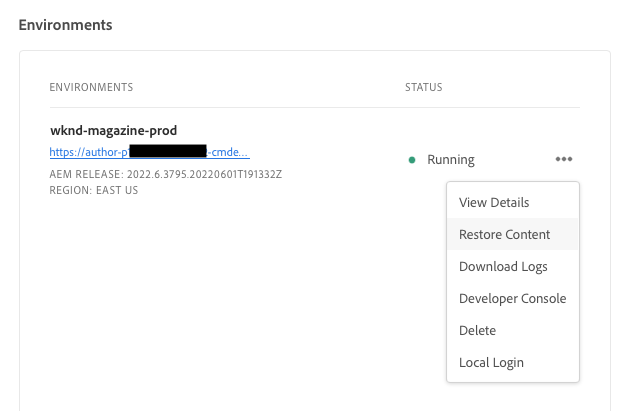

# Inhoud herstellen in AEM as a Cloud Service {#content-restore}

>[!CONTEXTUALHELP]
>id="aemcloud_golive_backuprestore"
>title="Back-up en herstel"
>abstract="Leer hoe u AEM as a Cloud Service inhoud kunt herstellen vanaf een back-up met gebruik van Cloud Manager."

Leer hoe u AEM as a Cloud Service inhoud kunt herstellen vanaf een back-up met gebruik van Cloud Manager.

## Overzicht {#overview}

Met het terugzetproces van Cloud Manager worden gegevens van back-ups van het Adobe-systeem gekopieerd en wordt de oorspronkelijke omgeving hersteld. Terugzetten wordt uitgevoerd om gegevens terug te keren die zijn verloren, beschadigd, of per ongeluk verwijderd in de oorspronkelijke staat.

Het terugzetproces beïnvloedt slechts inhoud, verlatend uw code en versie van AEM onveranderd. U kunt op elk gewenst moment een herstelbewerking van afzonderlijke omgevingen starten.

Cloud Manager biedt twee typen back-ups waarmee u inhoud kunt herstellen.

* **Punt in tijd (PIT):** Dit type herstelt van ononderbroken systeemsteunen van de laatste 24 uren van de huidige tijd.
* **Vorige week:** Dit type herstelt van systeemsteunen in de laatste zeven dagen exclusief de vorige 24 uren.

In beide gevallen blijft de versie van de aangepaste code en AEM ongewijzigd.

De prestatiesmetriek van het herstellen van inhoud in AEM als ContentService verwijzen naar de gestandaardiseerde benchmarks:

* **Doelstelling hersteltijd (RTO):** De doelstelling voor de hersteltijd varieert afhankelijk van de grootte van de opslagplaats, maar als regel geldt dat als de herstelvolgorde eenmaal is gestart, dit ongeveer 30 minuten in beslag moet nemen.
* **De doelstelling van het herstelpunt (BHP):** De herstelpuntdoelstelling is maximaal 24 uur

>[!TIP]
>
>Het is ook mogelijk om back-ups te herstellen [gebruiken van openbare API.](https://developer.adobe.com/experience-cloud/cloud-manager/reference/api/)

## Beperkingen {#limitations}

Het gebruik van het mechanisme voor zelfherstel is onderworpen aan de volgende beperkingen.

* Herstelbewerkingen zijn beperkt tot zeven dagen, wat betekent dat het niet mogelijk is om een momentopname ouder dan zeven dagen te herstellen.
* In een programma per kalendermaand zijn maximaal tien succesvolle herstelbewerkingen toegestaan in alle omgevingen.
* Nadat de omgeving is gemaakt, duurt het zes uur voordat de eerste back-upmomentopname is gemaakt. Totdat deze momentopname is gemaakt, kan geen herstel worden uitgevoerd op de omgeving.
* Een terugzetbewerking zal niet worden gestart als er een volledige stack of web tier config-pijplijn is die momenteel voor de omgeving wordt uitgevoerd.
* Een terugzetprocedure kan niet worden gestart als een andere terugzetbewerking al op dezelfde omgeving wordt uitgevoerd.
* In zeldzame gevallen kan de geselecteerde back-up vanwege de limiet van 24 uur/7 dagen voor het maken van back-ups niet langer beschikbaar zijn vanwege een vertraging tussen de datum waarop deze is geselecteerd en het moment waarop de terugzetprocedure wordt gestart.
* Gegevens uit verwijderde omgevingen gaan permanent verloren en kunnen niet worden hersteld.

## Inhoud herstellen {#restoring-content}

Bepaal eerst het tijdkader van de inhoud die u wilt herstellen. Voer vervolgens deze stappen uit om de inhoud van uw omgeving te herstellen op basis van een back-up.

>[!NOTE]
>
>Een gebruiker met de **Zakelijke eigenaar** of **Implementatiebeheer** de rol moet worden het programma geopend, om een herstellingsverrichting in werking te stellen.

1. Aanmelden bij Cloud Manager [my.cloudmanager.adobe.com](https://my.cloudmanager.adobe.com/) en selecteert u de gewenste organisatie.

1. Klik op het programma waarvoor u een terugzetbewerking wilt starten.

1. Van de **Programmaoverzicht** pagina, in de **Omgevingen** -kaart, klikt u op de knop met de ovaal naast de omgeving waarvoor u een terugzetbewerking wilt starten en selecteert u **Inhoud herstellen**.

   

   * U kunt ook rechtstreeks naar de **Inhoud herstellen** tabblad van de pagina met omgevingsdetails van een specifieke omgeving.

1. Op de **Inhoud herstellen** tabblad van de pagina met omgevingsdetails, selecteert u eerst het tijdframe van de terugzetbewerking onder het tabblad **Te herstellen tijd** vervolgkeuzelijst.

   1. Als u **Afgelopen 24 uur** de omgeving **Tijd** kunt u de exacte tijd opgeven binnen de laatste 24 uur die u wilt herstellen.

      

   1. Als u **Vorige week** de omgeving **Dag** in dit veld kunt u een datum selecteren die valt binnen de afgelopen zeven dagen, exclusief de voorafgaande 24 uur.

      

1. Wanneer u een datum selecteert of een tijd opgeeft, worden de **Back-ups beschikbaar** hieronder ziet u een lijst met beschikbare back-ups die kunnen worden hersteld

   

1. Zoek de back-up die u wilt herstellen met behulp van het informatiepictogram en bekijk informatie over de versie van de code en AEM release die in die back-up is opgenomen. Houd rekening met de gevolgen van een terugzetbewerking wanneer [kiezen van de back-up.](#choosing-the-right-backup)

   

   * De tijdstempel die voor de terugzetopties wordt weergegeven, is allemaal gebaseerd op de tijdzone van de computer van de gebruiker.

1. Klik op de knop **Herstellen** pictogram rechts van de rij die de back-up vertegenwoordigt die u wilt herstellen om het herstelproces te starten.

1. Bekijk de details op de **Inhoud herstellen** voordat u uw verzoek bevestigt door op **Herstellen**.

   

Het back-upproces wordt gestart en u kunt de status ervan bekijken in het dialoogvenster **[Activiteit herstellen](#restore-activity)** tabel. De tijd die nodig is om een terugzetbewerking te voltooien, is afhankelijk van de grootte en het profiel van de inhoud die wordt teruggezet.

Wanneer het herstel met succes wordt voltooid, zal de omgeving:

* Voer dezelfde code en AEM release uit als op het moment dat de terugzetbewerking wordt gestart.
* Dezelfde inhoud hebben die beschikbaar was op het tijdstempel van de gekozen opname, met de indexen die opnieuw zijn samengesteld om overeen te komen met de huidige code.

## De juiste reservekopie kiezen {#choosing-backup}

Hiermee herstelt u alleen de AEM inhoud. Om deze reden, moet u zorgvuldig de codeveranderingen overwegen die tussen uw gewenste herstellingspunt en de huidige tijd door te herzien zijn begaan geschiedenis tussen uw huidige begaat identiteitskaart en wordt hersteld aan.

Er zijn verschillende scenario&#39;s.

* De aangepaste code voor de omgeving en de terugzetbewerking bevinden zich in dezelfde opslagplaats en dezelfde vertakking.
* De aangepaste code voor de omgeving en de terugzetbewerking bevinden zich in dezelfde opslagplaats, maar een andere vertakking met een gemeenschappelijke &#39;commit&#39;.
* De aangepaste code voor de omgeving en het terugzetten bevinden zich op verschillende opslagplaatsen.
   * In dit geval wordt een id voor vastleggen niet weergegeven.
   * Het wordt ten zeerste aanbevolen beide opslagruimten te klonen en een bestandsvergelijkingsprogramma te gebruiken om de vertakkingen te vergelijken.

Houd er bovendien rekening mee dat een herstelbewerking ertoe kan leiden dat uw productie- en testomgevingen niet meer synchroon zijn. U bent verantwoordelijk voor de gevolgen van het herstellen van inhoud.

## Activiteit herstellen {#restore-activity}

De **Activiteit herstellen** in de tabel wordt de status weergegeven van de tien meest recente terugzetverzoeken, inclusief actieve terugzetbewerkingen.

Door op het informatiepictogram voor een back-up te klikken kunt u logboeken voor die back-up downloaden en de codedetails controleren, inclusief de verschillen tussen de momentopname en de gegevens op het moment dat de terugzetbewerking is gestart.

## Offsite back-up {#offsite-backup}

Regelmatige back-ups dekken het risico van onopzettelijke verwijderingen of technische storingen in AEM Cloud Services, maar extra risico&#39;s kunnen het gevolg zijn van een fout in een regio. Naast beschikbaarheid is het grootste risico in dergelijke regionale uitvallen een gegevensverlies.

AEM as a Cloud Service beperkt dit risico voor alle AEM productieomgevingen door alle AEM inhoud voortdurend naar een afgelegen gebied te kopiëren en deze gedurende drie maanden beschikbaar te stellen voor herstel. Dit vermogen wordt bedoeld als off-site steun.

De restauratie van AEM Cloud Services voor het opvoeren van en productieomgevingen vanaf externe back-ups wordt uitgevoerd door AEM Service Reliability Engineering in het geval van een storing in het gegevensgebied.
