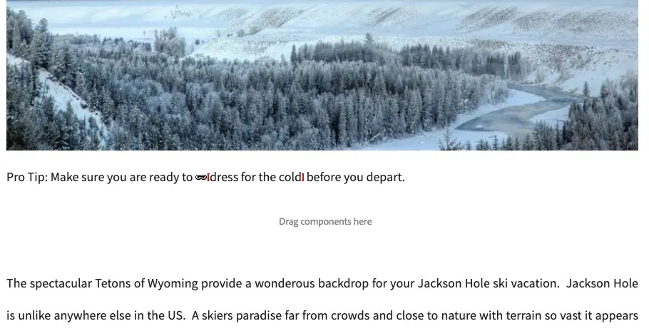
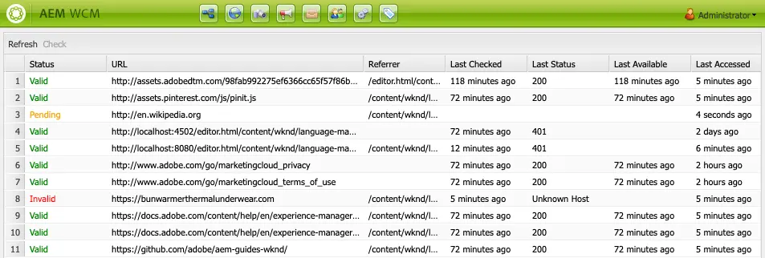

# Koppelingencontrole {#link-checker}

Leer hoe de Controleur van de Verbinding auteurs door verbindingen te bevestigen aangezien zij aan inhoud worden toegevoegd en welke configuratieopties het aanbiedt.

## Overzicht {#overview}

Inhoudsauteurs hoeven zich niet bezig te houden met het valideren van elke koppeling die ze in hun inhoud opnemen. De koppelingencontrole wordt automatisch uitgevoerd om inhoudsauteurs bij te staan met hun koppelingen, waaronder:

* Koppelingen valideren terwijl deze aan inhoud worden toegevoegd
* Een lijst met alle externe koppelingen in de inhoud weergeven
* Koppelingtransformaties uitvoeren

De controleur van de Verbinding heeft verscheidene [ configuratieopties ](#configuring) zoals het bepalen van de bevestiging van interne verbindingen, toestaand bepaalde verbindingen of verbindingspatters om van bevestiging worden weggelaten, en het bepalen van verbinding die regels herschrijven.

De controleur van de Verbinding bevestigt zowel [ interne verbindingen ](#internal) als [ externe verbindingen.](#external)

>[!NOTE]
>
>Omdat de koppelingencontrole de koppelingen van elke inhoudspagina controleert, kan de koppelingencontrole de prestaties op grote opslagplaatsen beïnvloeden. In dergelijke gevallen, kunt u moeten [ vormen hoe vaak de Controle van de Verbinding ](#configuring) loopt of [ het onbruikbaar maakt.](#disabling)

## Interne koppelingencontrole {#internal}

Interne koppelingen zijn koppelingen naar andere inhoud in uw AEM-opslagplaats. Interne koppelingen kunnen worden toegevoegd met de padkiezer, de teksteditor met tekstopmaak of met een aangepaste component. Bijvoorbeeld:

* U maakt de pagina `/content/wknd/us/en/adventures/ski-touring`
* Die pagina bevat een verbinding aan `/content/wknd/us/en/adventures/extreme-ironing` in de Component van de Tekst van a [.](https://experienceleague.adobe.com/en/docs/experience-manager-core-components/using/wcm-components/text)

Interne koppelingen worden gevalideerd zodra de auteur van de inhoud een dergelijke koppeling aan een pagina toevoegt. Als de koppeling ongeldig wordt:

* Deze wordt verwijderd uit de uitgever.
   * De koppeling zelf wordt verwijderd.
   * De tekst van de koppeling blijft behouden.
* Het wordt getoond als gebroken verbinding in de auteursinterface.

 controleert

## Controleren van externe koppeling {#external}

Externe koppelingen zijn koppelingen naar inhoud buiten uw AEM-opslagplaats. Externe koppelingen kunnen worden toegevoegd met de teksteditor met opmaak of met een aangepaste component. Bijvoorbeeld:

* U maakt de pagina `/content/wknd/us/en/adventures/ski-touring`
* Die pagina bevat een verbinding aan `https://bunwarmerthermalunderwear.com` in de Component van de Tekst van a [.](https://experienceleague.adobe.com/en/docs/experience-manager-core-components/using/wcm-components/text)

Externe koppelingen worden gevalideerd voor syntaxis en door de beschikbaarheid ervan te controleren. Deze controle wordt asynchroon gedaan bij een configureerbaar interval. Als de koppelingencontrole een externe koppeling ongeldig vindt:

* Deze wordt verwijderd uit de uitgever.
   * De koppeling zelf wordt verwijderd.
   * De tekst van de koppeling blijft behouden.
* Het wordt getoond als gebroken verbinding in de auteursinterface.

 controleert

### De werking van de externe koppelingencontrole {#external-details}

De Externe Controle van de Verbinding baseert zich op verscheidene diensten en het begrip hoe zij werken helpt u begrijpen hoe te [ de Controle van de Verbinding vormen om aan uw behoeften te voldoen.](#configuring)

1. Wanneer een inhoudsontwerper een koppeling naar een pagina opslaat, wordt een gebeurtenishandler geactiveerd.
1. De gebeurtenishandler doorloopt alle inhoud onder `/content` en controleert op nieuwe of bijgewerkte koppelingen en voegt deze toe aan een cache voor de koppelingencontrole.
1. De **Dienst van de Controle van de Verbinding van de Dag CQ** voert dan op een regelmatig programma uit om de ingangen in het geheime voorgeheugen voor geldige syntaxis te controleren.
1. De syntaxis-bevestigde verbindingen verschijnen dan in het [ Externe venster van de Controle van de Verbinding.](#external-using) Nochtans zullen zij in a **in afwachting van** staat zijn.
1. De **Taak van de Controle van de Verbinding van CQ van de Dag CQ** voert dan op een regelmatige basis uit om de verbindingen te bevestigen door een vraag van GET te maken.
1. De **Taak van CQ van de Controle van de Verbinding van de Dag CQ** werkt dan de ingangen in het [ Externe venster van de Controle van de Verbinding ](#external-using) met de resultaten van de vraag van GET bij.

### De externe koppelingencontrole gebruiken {#external-using}

De External Link Checker is een console die een overzicht biedt van alle externe koppelingen in uw AEM-inhoud. De External Link Checker gebruiken:

1. Van de Globale Navigatie, uitgezochte **Hulpmiddelen** -> **Plaatsen**.
1. Selecteer **Externe Controle van de Verbinding** en een lijst van alle externe verbindingen wordt getoond.

Elke ingang in de lijst vertegenwoordigt een externe verbinding die door de dienst van de Controleur van de Verbinding wordt ontdekt. De volgende kolommen worden weergegeven:

* **Status** - de bevestigingsstatus van de verbinding die één van het volgende kan zijn:
   * **Geldig** - de externe verbinding is bereikbaar door de Controleur van de Verbinding.
   * **in afwachting** - de externe verbinding werd toegevoegd aan plaatsinhoud, maar is nog niet bevestigd door de Controleur van de Verbinding.
   * **Ongeldig** - de externe verbinding is niet bereikbaar door de Controleur van de Verbinding.
* **URL** - de externe verbinding
* **Referrer** - de inhoudspagina die de externe verbinding bevat
   * Dit is slechts bevolkt [ als gevormd.](#configuring)
* **Laatste Gecontroleerde** - de laatste tijd de Controle van de Verbinding bevestigde de externe verbinding
   * Hoe vaak worden de verbindingen gecontroleerd [ configureerbaar.](#configuring)
* **Laatste Status** - de laatste de statuscode van HTML keerde terug toen de Verbinding het laatst controleerde verbinding
* **Laatste Beschikbare** - Tijd sinds de verbinding laatste beschikbaar aan de Controle van de Verbinding was
* **Laatste Toegelaten** - Tijd sinds de pagina met de externe verbinding werd laatst betreden in de auteursinterface

U kunt de inhoud van het venster bewerken met de twee knoppen boven aan de lijst met koppelingen:

* **verfrissen zich** - om de inhoud van de lijst te verfrissen
* **Controle** - om een individuele externe verbinding te controleren die in de lijst wordt geselecteerd

Alle andere pictogrammen in het venster Externe koppelingencontrole zijn inactief.

## De koppelingencontrole configureren {#configuring}

De koppelingencontrole is automatisch uit-de-doos beschikbaar in AEM. Nochtans, zijn er verscheidene configuraties OSGi die kunnen worden gewijzigd om zijn gedrag te veranderen:

* **de Opslagdienst van de Opslag van de Info van de Verbinding van 0&rbrace; Dag CQ - Deze dienst bepaalt de grootte van het geheime voorgeheugen van de Controleur van de Verbinding in de bewaarplaats.**
* {de Dienst van de Controle van de Verbinding van 0} Dag CQ **- Deze dienst voert asynchrone controle van de syntaxis van externe verbindingen uit.**
   * U kunt de controleperiode bepalen en welke typen koppelingen door de controleur onder andere worden overgeslagen.
* **CQ van de Verbinding van de Dag CQ Taak** - Deze dienst voert de bevestiging van GET van externe verbindingen uit.
   * Het staat afzonderlijke definities van intervallen toe om slechte en goede verbindingen onder andere opties te controleren.
* **De Transformator van de Controle van de Verbinding van de Dag CQ** - Deze dienst zet verbindingen om die op een user-defined regelreeks worden gebaseerd.

Zie het document [ Vormend OSGi ](/help/implementing/deploying/configuring-osgi.md) voor meer details op hoe te om montages te veranderen OSGi.

## De koppelingencontrole uitschakelen {#disabling}

U kunt de koppelingencontrole volledig uitschakelen. Daartoe:

1. Open de OSGi-console.
1. Bewerk de **Transformator van de Controle van de Verbinding van de Dag CQ**
1. Selecteer de optie(s) die u wilt uitschakelen:
   * **maak het Controleren** onbruikbaar - om bevestiging van verbindingen onbruikbaar te maken
   * **maak het Herschrijven** onbruikbaar - om verbindingstransformaties onbruikbaar te maken
