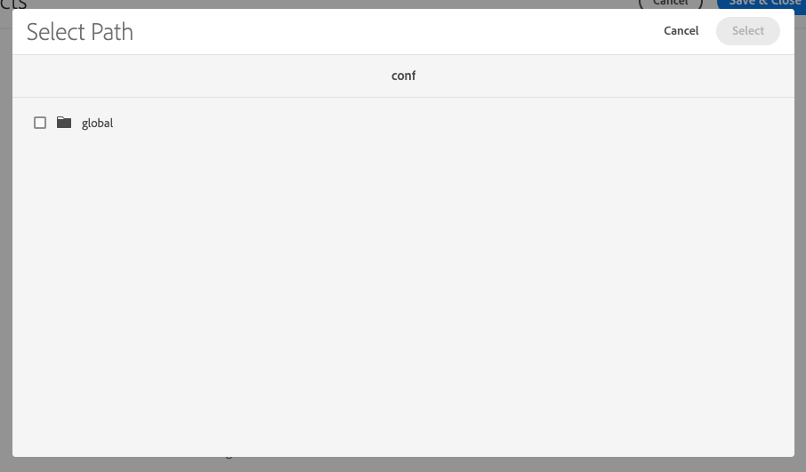

# Generieke Lucene-index verwijderen {#generic-lucene-index-removal}

Adobe is van plan om de generieke Lucene-index (`/oak:index/lucene-*`) van Adobe Experience Manager as a Cloud Service. Deze index is vervangen sinds AEM 6.5. In dit document wordt het effect van dit besluit beschreven, samen met een gedetailleerde beschrijving van de wijze waarop moet worden onderzocht of een AEM instantie wordt beïnvloed. Het bevat ook manieren om vragen te veranderen zodat blijven zij zonder de generische index van Lucene functioneren.

## Achtergrond {#background}

In AEM, zijn de volledige tekstvragen die die de volgende functies gebruiken:

* `jcr:contains()` in JCR XPATH
* `CONTAINS` in JCR-SQL2

Dergelijke vragen kunnen geen resultaten zonder een index terugkeren. In tegenstelling tot een vraag die slechts weg of bezitsbeperkingen bevat, zal een vraag die een volledige tekstbeperking bevat waarvoor geen index kan worden gevonden (en zo wordt een traversal uitgevoerd) altijd nul resultaten terugkeren.

De generieke Lucene-index (`/oak:index/lucene-*`) bestaat al sinds AEM 6.0 / Eak 1.0 om een volledige tekstzoekopdracht te bieden in de meeste repository hiërarchie, hoewel sommige paden, zoals `/jcr:system` en `/var` zijn hier altijd van uitgesloten. Deze index is echter grotendeels vervangen door indexen op meer specifieke knooppunttypen (bijvoorbeeld `damAssetLucene-*` voor de `dam:Asset` knooppunttype), die zowel volledige tekst als bezitsonderzoeken steunen.

In AEM 6.5 werd de generische index van Lucene gemerkt zoals afgekeurd, erop wijzend dat het in toekomstige versies zou worden verwijderd. Sindsdien, is WARN geregistreerd wanneer de index is gebruikt zoals geïllustreerd door het volgende logboekfragment:

```text
org.apache.jackrabbit.oak.plugins.index.lucene.LucenePropertyIndex This index is deprecated: /oak:index/lucene-2; it is used for query Filter(query=select [jcr:path], [jcr:score], * from [nt:base] as a where contains(*, 'search term') and isdescendantnode(a, '/content/mysite') /* xpath: /jcr:root/content/mysite//*[jcr:contains(.,"search term")] */ fullText="search" "term", path=/content/mysite//*). Please change the query or the index definitions.
```

In recente AEM versies, is de generische index van Lucene gebruikt om een zeer klein aantal eigenschappen te steunen. Deze worden opnieuw bewerkt om andere indexen te gebruiken of anderszins aangepast om de afhankelijkheid van deze index te verwijderen.

Zoekopdrachten voor verwijzingen, zoals in het volgende voorbeeld, moeten nu bijvoorbeeld de index gebruiken op `/oak:index/pathreference`, die alleen indexeert `String` eigenschapswaarden die overeenkomen met een reguliere expressie die naar JCR-paden zoekt.

```text
//*[jcr:contains(., '"/content/dam/mysite"')]
```

Om grotere volumes van klantengegevens te steunen, zal Adobe niet meer de generische index van Lucene op nieuwe AEM as a Cloud Service milieu&#39;s creëren. Daarnaast wordt Adobe gestart met het verwijderen van de index uit bestaande opslagruimten. [Zie de tijdlijn](#timeline) aan het einde van dit document voor meer informatie.

Adobe heeft de indexkosten al aangepast via de `costPerEntry` en `costPerExecution` eigenschappen om ervoor te zorgen dat andere indexen, zoals `/oak:index/pathreference` worden waar mogelijk bij voorkeur gebruikt.

De toepassingen van de klant die vragen gebruiken die nog van deze index afhangen zouden onmiddellijk moeten worden bijgewerkt om andere bestaande indexen te gebruiken, die kunnen worden aangepast indien nodig. U kunt ook nieuwe aangepaste indexen toevoegen aan de klanttoepassing. Volledige instructies voor indexbeheer in AEM as a Cloud Service zijn te vinden in de [indexeringsdocumentatie.](/help/operations/indexing.md)

## Betrokken bent u? {#are-you-affected}

De generische index van Lucene wordt momenteel gebruikt als reserve als geen andere volledige tekstindex een vraag kan onderhouden. Wanneer deze afgekeurde index wordt gebruikt, zal een bericht als dit op WARN niveau worden geregistreerd:

```text
org.apache.jackrabbit.oak.plugins.index.lucene.LucenePropertyIndex This index is deprecated: /oak:index/lucene-2; it is used for query Filter(query=select [jcr:path], [jcr:score], * from [nt:base] as a where contains(*, 'test') /* xpath: //*[jcr:contains(.,"test")] */ fullText="test", path=*). Please change the query or the index definitions.
```

In sommige gevallen probeert het eiken een andere volledige tekstindex te gebruiken (zoals `/oak:index/pathreference`) om de volledige tekstvraag te steunen, maar als het vraagkoord niet de regelmatige uitdrukking op de indexdefinitie aanpast, zal een bericht op WARN niveau worden geregistreerd en de vraag zal waarschijnlijk geen resultaten terugkeren.

```text
org.apache.jackrabbit.oak.query.QueryImpl Potentially improper use of index /oak:index/pathReference with queryFilterRegex (["']|^)/ to search for value "test"
```

Zodra de generische index van Lucene is verwijderd, zal een bericht zoals hieronder getoond op WARN niveau worden geregistreerd als een volledige tekstvraag van geen geschikte indexdefinitie kan de plaats bepalen:

```text
org.apache.jackrabbit.oak.query.QueryImpl Fulltext query without index for filter Filter(query=select [jcr:path], [jcr:score], * from [nt:base] as a where contains(*, 'test') /* xpath: //*[jcr:contains(.,"test")] */ fullText="test", path=*); no results will be returned
```

>[!IMPORTANT]
>
>**Actie van klant vereist**
>
> Als om het even welke bovengenoemde waarschuwingsberichten worden geregistreerd, kunt u de vraag moeten herwerken om een verschillende volledige tekstindex te gebruiken, of een nieuwe index verstrekken om de vraag te steunen.
>
>De details van de types van gebiedsdelen u zou kunnen zien en hoe te om hen te richten worden verstrekt in de volgende secties.

## Potentiële afhankelijkheden van generieke Lucene-indexen {#potential-dependencies}

Er zijn een aantal gebieden waar uw toepassingen en AEM installaties van generische indexen van Lucene zowel op auteur als publicatieinstanties afhankelijk kunnen zijn.

### Exemplaar publiceren {#publish-instance}

#### Aangepaste query&#39;s voor toepassingen {#custom-application-queries}

De gemeenschappelijkste bron van vragen die de generische index van Lucene op publiceer instantie gebruiken zal de vragen van de douanetoepassing zijn.

In de eenvoudigste gevallen kunnen deze query&#39;s zijn zonder opgegeven knooppunttype, waardoor dit wordt geïmpliceerd `nt:base` of `nt:base` expliciet vermeld, zoals:

```text
/jcr:root/content/mysite//*[jcr:contains(., 'search term')]
/jcr:root/content/mysite//element(*, nt:base)[jcr:contains(., 'search term')]
```

>[!IMPORTANT]
>
>**Actie van klant vereist**
>
>De bovengenoemde vragen zouden moeten worden gewijzigd om een aangewezen knooptype te gebruiken zoals die in de volgende sectie wordt gedetailleerd.

De query&#39;s kunnen bijvoorbeeld worden gewijzigd om resultaten te retourneren die overeenkomen met pagina&#39;s of een van de aggregaten onder de `cq:Page node`. De vraag zou dus kunnen worden:

```text
/jcr:root/content/mysite//element(*, cq:Page)[jcr:contains(., 'search term')]
```

In andere gevallen, zou een vraag een knooptype kunnen specificeren maar een volledige tekstbeperking bevatten die niet door een andere volledige tekstindex, zoals kan behandelen:

```text
/jcr:root/content/dam//element(*, dam:Asset)[jcr:contains(jcr:content/metadata/@cq:tags, 'NewsTopics:cateogries/domestic'))]
```

In dit geval heeft de query de `dam:Asset` knooppunttype, maar bevat een volledige tekstbeperking voor het relatieve `jcr:content/metadata/@cq:tags` eigenschap.

Deze eigenschap is niet gemarkeerd als geanalyseerd in het dialoogvenster `damAssetLucene` index, die de volledige tekstindex is die het meest wordt gebruikt voor query&#39;s tegen de `dam:Asset` knooppunttype. Daarom kan deze index niet voor deze vraag worden gebruikt.

Als dusdanig, valt de vraag terug op de generische volledige tekstindex waar alle inbegrepen eigenschappen zoals geanalyseerd door de vervangingsgelijke bij worden duidelijk `/oak:index/lucene-2/indexRules/nt:base/properties/prop`.

>[!IMPORTANT]
>
>**Actie van klant vereist**
>
>De `jcr:content/metadata/@cq:tags` eigenschap zoals geanalyseerd in een aangepaste versie van het dialoogvenster `damAssetLucene` De index zal in deze vraag resulteren die door deze index wordt behandeld, en geen WARN zal worden geregistreerd.

### Instantie van auteur {#author-instance}

Naast vragen in de servers van de klantentoepassing, componenten OSGi, en het teruggeven van manuscripten kan er een aantal auteur-specifieke toepassingen van de generische index van Lucene zijn.

#### Referentie zoeken {#reference-search}

Historisch is de generische index van Lucene gebruikt om verwijzings onderzoek of het zoeken naar inhoud te steunen die verwijzingen naar een andere inhoudspad bevat. Dergelijke vragen hadden reeds moeten worden bijgewerkt om de nieuwe `/oak:index/pathreference` index.

#### Zoekopdracht padveldkiezer {#picker-search}

AEM omvat een component van de douanedialoog met het Verdelen middeltype `granite/ui/components/coral/foundation/form/pathfield`, die een browser/kiezer biedt voor het selecteren van een ander AEM pad. De standaardpadveldkiezer, die wordt gebruikt wanneer er geen aangepaste `pickerSrc` wordt gedefinieerd in de inhoudsstructuur. Er wordt een zoekbalk weergegeven in het dialoogvenster.

De knooptypes waartegen om te zoeken kunnen worden gespecificeerd gebruikend `nodeTypes` eigenschap.

Op dit moment, indien nee `nodeTypes` eigenschap is aanwezig, de onderliggende zoekquery gebruikt de eigenschap `nt:base` knooptype, en daarom waarschijnlijk zal de generische index van Lucene gebruiken, typisch registrerend WARN berichten gelijkend op het volgende.

```text
20.01.2022 18:56:06.412 *WARN* [127.0.0.1 [1642704966377] POST /mnt/overlay/granite/ui/content/coral/foundation/form/pathfield/picker.result.single.html HTTP/1.1] org.apache.jackrabbit.oak.plugins.index.lucene.LucenePropertyIndex This index is deprecated: /oak:index/lucene-2; it is used for query Filter(query=select [jcr:path], [jcr:score], * from [nt:base] as a where contains(*, 'test') and isdescendantnode(a, '/content') /* xpath: /jcr:root/content//element(*, nt:base)[(jcr:contains(., 'test'))] order by @jcr:score descending */ fullText="test", path=/content//*). Please change the query or the index definitions.
```

Voordat de generieke Lucene-index wordt verwijderd, moet de `pathfield` wordt bijgewerkt, zodat het zoekvak verborgen is voor componenten die de standaardkiezer gebruiken, die geen `nodeTypes` eigenschap.

| Padveldkiezer met zoeken | Padveldkiezer zonder zoeken |
|---|---|
|  |  |

>[!IMPORTANT]
>
>**Actie van klant vereist**
>
>Als de klant de zoekfunctionaliteit in de padveldkiezer wil behouden, voert u een `nodeTypes` Het bezit zou moeten worden verstrekt die van de knooptypes een lijst maken waartegen zij zouden willen vragen. Deze kunnen als komma-gescheiden lijst van knooptypes in a worden gespecificeerd `String` eigenschap. Als geen onderzoek wordt vereist, wordt geen actie vereist van de klant.

>[!NOTE]
>
>De Inhoudsfragmentmodeleditor gebruikt een speciaal padveld met het brontype Sling `dam/cfm/models/editor/components/contentreference`.
> * Momenteel voeren deze vragen zonder gespecificeerde knooptypes uit, resulterend in WARN die wegens gebruik van de generische index van Lucene worden geregistreerd.
> * Instanties van deze componenten worden binnenkort automatisch standaard `cq:Page` en `dam:Asset` knooptypes zonder verdere klantenactie.
> * De `nodeTypes` Deze eigenschap kan worden toegevoegd om deze standaardknooppunttypen te overschrijven.


## Tijdlijn voor algemene Lucene-verwijdering {#timeline}

Adobe zal een twee-fasenbenadering nemen om de generische index van Lucene te verwijderen.

* **Fase 1** (gepland voor 31 januari 2022): Niet langer maken `/oak:index/lucene-*` over nieuwe AEM as a Cloud Service omgevingen.
* **Fase 2** (gepland voor 31 maart 2022): Verwijderen `/oak:index/lucene-*` index van bestaande AEM as a Cloud Service omgevingen.

Adobe zal de hierboven vermelde logboekberichten controleren en zal proberen om klanten te contacteren die afhankelijk van de generische index van Lucene blijven.

Als kortetermijnmatiging, zal Adobe de definities van de douaneindex direct aan klantensystemen toevoegen om functionele of prestatieskwesties als resultaat van de verwijdering van de generische index van Lucene zonodig te verhinderen.

In dergelijke gevallen krijgt de klant de bijgewerkte indexdefinitie en wordt hem geadviseerd deze op te nemen in toekomstige versies van zijn toepassing via Cloud Manager.
