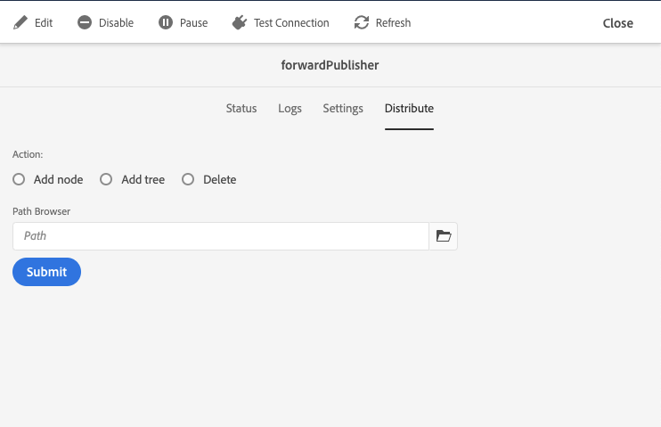

# Replicatie {#replication}

Adobe Experience Manager als Cloud Service gebruikt de [Sling Content Distribution](https://sling.apache.org/documentation/bundles/content-distribution.html) mogelijkheid om de inhoud te verplaatsen naar een pijplijnservice die op Adobe I/O wordt uitgevoerd en buiten de AEM runtime valt.

>[!NOTE]
>
>Lees [Distribution](/help/core-concepts/architecture.md#content-distribution) voor meer informatie.

## Methoden voor het publiceren van inhoud {#methods-of-publishing-content}

### Snel publiceren/publiceren - Gepland {#publish-unpublish} publiceren

Deze standaard AEM functies voor de auteurs veranderen niet met AEM Cloud Service.

### Aan en uit Tijd - de Configuratie van de trekker {#on-and-off-times-trigger-configuration}

De extra mogelijkheden van **On Tijd** en **Uit Tijd** zijn beschikbaar bij [Basislusje van Pagina-eigenschappen](/help/sites-cloud/authoring/fundamentals/page-properties.md#basic).

Om de automatische replicatie voor dit te realiseren moet u **Auto Replicate** in [OSGi configuratie](/help/implementing/deploying/configuring-osgi.md) **On Off Configuratie** toelaten:

### Boomactivering {#tree-activation}

Een boomactivering uitvoeren:

1. Navigeer in het menu AEM Start naar **Extra > Implementatie > Distributie**
2. Selecteer de kaart **forwardPublisher**
3. Eenmaal in de UI van de forwardPublisher-webconsole, **selecteer Distribute**

   
4. Selecteer het pad in de padbrowser en kies een knooppunt, structuur of verwijder het pad naar wens en selecteer **Verzenden**

## Problemen oplossen {#troubleshooting}

Om replicatie problemen op te lossen, navigeer aan de Queuws van de Replicatie in het Web UI van de Dienst van de Auteur AEM:

1. Navigeer in het menu AEM Start naar **Extra > Implementatie > Distributie**
2. Selecteer de kaart **forwardPublisher**
   
3. Controleer de wachtrijstatus die groen moet zijn
4. U kunt de verbinding met de replicatieservice testen
5. Selecteer het tabblad **Logs** waarmee de geschiedenis van inhoudspublicaties wordt weergegeven

Als de inhoud niet kon worden gepubliceerd, wordt de volledige publicatie teruggezet van de AEM-publicatieservice.
In dat geval moeten de rijen worden herzien om te bepalen welke punten de annulering van de publicatie hebben veroorzaakt. Door op een rij te klikken die een rode status toont, zou de rij met hangende punten verschijnen, waarvan enige of alle punten kunnen worden ontruimd indien nodig.
