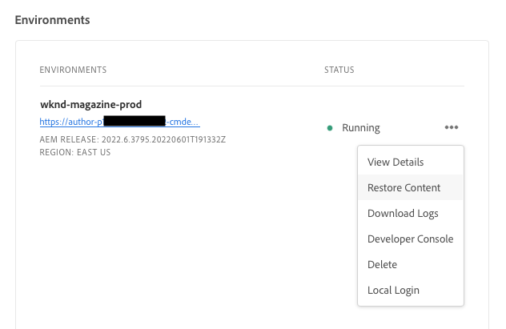
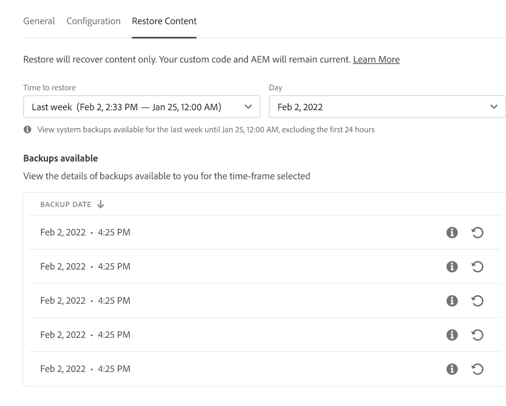
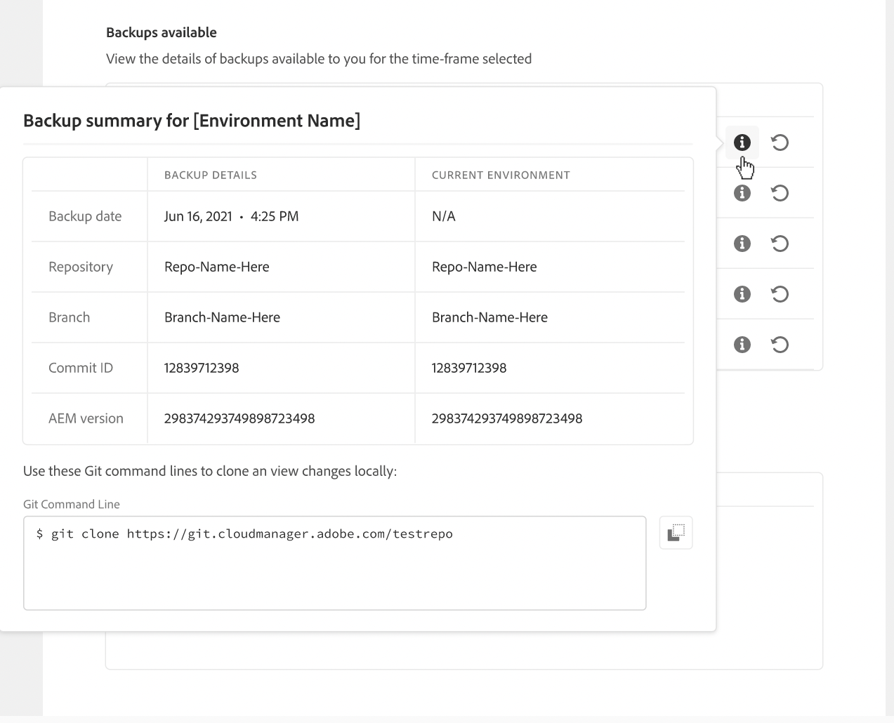

# Inhoud herstellen in AEM as a Cloud Service {#content-restore}

Leer hoe u uw AEM as a Cloud Service-inhoud kunt herstellen vanaf een back-up met Cloud Manager.

## Overzicht {#overview}

Cloud Manager, dat zelf-dienst terugzet proces kopieert gegevens van de steunen van het systeem van de Adobe en herstelt het aan zijn originele milieu. Herstel wordt uitgevoerd om gegevens terug te keren die zijn verloren, beschadigd of per ongeluk verwijderd.

Het terugzetproces beïnvloedt slechts inhoud, verlatend uw code en versie van AEM onveranderd. U kunt op elk gewenst moment een herstelbewerking van afzonderlijke omgevingen starten.

Cloud Manager biedt twee typen back-ups waarvan u de inhoud kunt herstellen.

* **punt-in-tijd (PIT):** Dit type herstelt van ononderbroken systeemsteunen van de laatste 24 uren van de huidige tijd.
* **Vorige week:** Dit type herstelt van systeemsteunen in de laatste zeven dagen exclusief vorige 24 uren.

In beide gevallen blijven de versie van de aangepaste code en de AEM ongewijzigd.

>[!TIP]
>
>Het is ook mogelijk om steunen [ te herstellen gebruikend openbare API.](https://developer.adobe.com/experience-cloud/cloud-manager/reference/api/)

>[!WARNING]
>
>* Deze functie mag alleen worden gebruikt bij ernstige problemen met code of inhoud.
>* Als u een back-up herstelt, gaan er tussen het tijdstip van de back-up en het moment recente gegevens verloren. Het opvoeren wordt ook hersteld aan de oude versie.
>* Overweeg andere selectieve herstelopties voor inhoud voordat u begint met het herstellen van inhoud.

## Opties voor het herstellen van selectieve inhoud {#selective-options}

Overweeg deze opties om de inhoud eenvoudiger te herstellen voordat u de inhoud volledig herstelt.

* Als een pakket voor de geschrapte weg beschikbaar is, installeer opnieuw het pakket gebruikend de [ Manager van het Pakket.](/help/implementing/developing/tools/package-manager.md)
* Als de geschrapte weg een pagina in Plaatsen was, gebruik de [ functie van de Boom herstellen.](/help/sites-cloud/authoring/sites-console/page-versions.md)
* Als de geschrapte weg een activa omslag was en de originele dossiers beschikbaar zijn, herupload hen via [ de console van Assets.](/help/assets/add-assets.md)
* Als de schrappingsinhoud activa was, overweeg [ terugstellend vorige versies van de activa.](/help/assets/manage-digital-assets.md)

Als geen van de bovenstaande opties werkt en de inhoud van het verwijderde pad significant is, voert u een inhoudsherstel uit zoals in de volgende secties wordt beschreven.

## Gebruikersrol maken {#user-role}

Standaard heeft geen enkele gebruiker toestemming om inhoud te herstellen in ontwikkelings-, productie- of testomgevingen. Om deze toestemming aan specifieke gebruikers of groepen na deze algemene stappen te delegeren.

1. Maak een productprofiel met een expressieve naam die verwijst naar het herstellen van inhoud.
1. Verstrek de **toestemming van de Toegang van het Programma 0} {op het vereiste programma.**
1. Verstrek de **Inhoud herstelt** toestemming op het vereiste milieu of alle milieu&#39;s van het programma, afhankelijk van uw gebruiksgeval.
1. Wijs gebruikers toe aan dat profielprofiel.

Voor details bij het beheren van toestemmingen, zie ](/help/implementing/cloud-manager/custom-permissions.md) documentatie van de Toestemmingen van de Douane 0}.[

## Inhoud herstellen {#restoring-content}

Bepaal eerst het tijdkader van de inhoud die u wilt herstellen. Voer vervolgens deze stappen uit om de inhoud van uw omgeving te herstellen op basis van een back-up.

>[!NOTE]
>
>Een gebruiker moet [ aangewezen toestemmingen ](#user-role) hebben om in werking te stellen herstelt verrichting.

1. Logboek in Cloud Manager bij [ my.cloudmanager.adobe.com ](https://my.cloudmanager.adobe.com/) en selecteer de aangewezen organisatie.

1. Klik op het programma waarvoor u een herstelbewerking wilt starten.

1. Van de **pagina van het Overzicht van het Programma**, in de **** kaart van Milieu&#39;s, klik de ellipsis knoop naast het milieu waarvoor u wilt in werking stellen herstellen en **selecteren herstellen Inhoud**.

   

   * Alternatief kunt u rechtstreeks aan **navigeren herstellen Inhoud** tabel van de pagina van milieudetails van een specifiek milieu.

1. Op het **herstellen Inhoud** lusje van de pagina van milieudetails, selecteer eerst het tijdkader van herstel onder de **Tijd om** drop-down lijst te herstellen.

   1. Als u **Laatste 24 uren** het naburige **gebied van de Tijd** selecteert laat u de nauwkeurige tijd binnen de laatste 24 te herstellen uren specificeren.

      

   1. Als u **Vorige week** het naburige **3} gebied van de Dag {selecteert laat u een datum binnen de afgelopen zeven dagen, exclusief de vorige 24 uren selecteren.**

      

1. Zodra u een datum selecteert of een tijd specificeert, toont de **beschikbare Steunen** sectie hieronder een lijst van beschikbare steunen die kunnen worden hersteld

   

1. Vind de steun u wilt herstellen door het informatiepictogram te gebruiken om informatie betreffende de versie van de code en AEM versie inbegrepen in die steun te bekijken en de implicaties van te overwegen herstelt wanneer [ de steun kiest.](#choosing-the-right-backup)

   

   * De tijdstempel die voor de terugzetopties wordt weergegeven, is allemaal gebaseerd op de tijdzone van de computer van de gebruiker.

1. Klik het **herstellen** pictogram op het rechtereind van de rij die de steun vertegenwoordigt u wilt herstellen om het herstellen proces te beginnen.

1. Herzie de details op **herstellen de dialoog van de Inhoud** alvorens uw verzoek te bevestigen door op **te klikken herstelt**.

   

Het reserveproces wordt in werking gesteld en u kunt zijn status in **[bekijken herstelt Activiteit](#restore-activity)** lijst. De tijd die nodig is om een terugzetbewerking te voltooien, is afhankelijk van de grootte en het profiel van de inhoud die wordt teruggezet.

Wanneer het herstel met succes wordt voltooid, zal de omgeving:

* Voer dezelfde code en AEM release uit als op het moment dat de terugzetbewerking wordt gestart.
* Dezelfde inhoud hebben die beschikbaar was op het tijdstempel van de gekozen opname, met de indexen die opnieuw zijn samengesteld en overeenkomen met de huidige code.

## De juiste reservekopie kiezen {#choosing-backup}

Cloud Manager-proces voor het terugzetten van zelfstandige bestanden herstelt alleen inhoud naar AEM. Om deze reden, moet u zorgvuldig codeveranderingen overwegen die tussen uw gewenste herstelt punt en de huidige tijd door te herzien begaat geschiedenis tussen huidige begaan identiteitskaart en wordt teruggegeven aan.

Er zijn verschillende scenario&#39;s.

* De aangepaste code voor de omgeving en de terugzetbewerking bevinden zich in dezelfde opslagplaats en dezelfde vertakking.
* De aangepaste code voor de omgeving en de terugzetbewerking bevinden zich in dezelfde opslagplaats, maar een andere vertakking met een gemeenschappelijke &#39;commit&#39;.
* De aangepaste code voor de omgeving en het terugzetten bevinden zich op verschillende opslagplaatsen.
   * In dit geval wordt een id voor vastleggen niet weergegeven.
   * Het wordt ten zeerste aanbevolen beide opslagruimten te klonen en een bestandsvergelijkingsprogramma te gebruiken om de vertakkingen te vergelijken.

Houd er ook rekening mee dat een herstelbewerking ertoe kan leiden dat uw productie- en testomgevingen niet meer synchroon zijn. U bent verantwoordelijk voor de gevolgen van het herstellen van inhoud.

## Activiteit herstellen {#restore-activity}

De **herstel de lijst van de Activiteit** toont het statuut van tien meest recente herstelt verzoeken met inbegrip van om het even welke actieve herstelt verrichtingen.

Door op het informatiepictogram voor een back-up te klikken, kunt u logboeken voor die back-up downloaden en de codedetails controleren, inclusief de verschillen tussen de momentopname en de gegevens op het moment dat de terugzetbewerking is gestart.

## Offsite back-up {#offsite-backup}

Regelmatige back-ups dekken het risico van onopzettelijke verwijderingen of technische storingen binnen AEM Cloud Servicen, maar extra risico&#39;s kunnen het gevolg zijn van het falen van een regio. Naast beschikbaarheid is het grootste risico in dergelijke regionale uitvallen een gegevensverlies.

AEM as a Cloud Service beperkt dit risico voor alle AEM productieomgevingen door voortdurend alle AEM inhoud naar een afgelegen gebied te kopiëren en deze gedurende drie maanden beschikbaar te stellen voor herstel. Dit vermogen wordt bedoeld als off-site steun.

De restauratie van AEM Cloud Servicen voor het opvoeren en productiemilieu&#39;s van off-site steun wordt uitgevoerd door AEM de Techniek van de Betrouwbaarheid van de Dienst in het geval van gegevensgebiedstroomonderbrekingen.

## Beperkingen {#limitations}

Het gebruik van het mechanisme voor zelfherstel is onderworpen aan de volgende beperkingen.

* Herstelbewerkingen zijn beperkt tot zeven dagen, wat betekent dat het niet mogelijk is om een momentopname ouder dan zeven dagen te herstellen.
* In een programma per kalendermaand zijn maximaal tien succesvolle herstelbewerkingen toegestaan in alle omgevingen.
* Nadat de omgeving is gemaakt, duurt het zes uur voordat de eerste back-upmomentopname is gemaakt. Totdat deze momentopname is gemaakt, kan geen herstel worden uitgevoerd op de omgeving.
* Een terugzetbewerking zal niet worden gestart als er een volledige stack of web tier config-pijplijn is die momenteel voor de omgeving wordt uitgevoerd.
* Een terugzetprocedure kan niet worden gestart als een andere terugzetbewerking al op dezelfde omgeving wordt uitgevoerd.
* In zeldzame gevallen kan de geselecteerde back-up vanwege de limiet van 24 uur/7 dagen voor het maken van back-ups niet langer beschikbaar zijn vanwege een vertraging tussen de datum waarop deze is geselecteerd en het moment waarop de terugzetprocedure wordt gestart.
* Gegevens uit verwijderde omgevingen gaan permanent verloren en kunnen niet worden hersteld.
