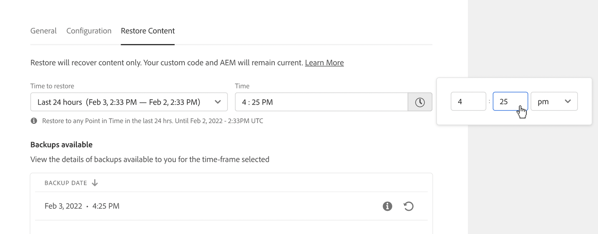

# Inhoud herstellen in AEM as a Cloud Service {#content-restore}

Leer hoe u AEM as a Cloud Service inhoud kunt herstellen vanaf een back-up met gebruik van Cloud Manager.

## Overzicht {#overview}

Met het terugzetproces voor zelfbediening van Cloud Manager worden gegevens van back-ups van het systeem van de Adobe gekopieerd en wordt de oorspronkelijke omgeving hersteld. Herstel wordt uitgevoerd om gegevens terug te keren die zijn verloren, beschadigd of per ongeluk verwijderd.

Het terugzetproces beïnvloedt slechts inhoud, verlatend uw code en versie van AEM onveranderd. U kunt op elk gewenst moment een herstelbewerking van afzonderlijke omgevingen starten.

Cloud Manager biedt twee typen back-ups waarmee u inhoud kunt herstellen.

* **Point-in-Time (PIT):** Dit type herstelt van ononderbroken systeemsteunen van de laatste 24 uren van de huidige tijd.
* **Vorige week:** Dit type herstelt van systeemsteunen in de laatste zeven dagen exclusief de vorige 24 uren.

In beide gevallen blijven de versie van de aangepaste code en de AEM ongewijzigd.

>[!TIP]
>
>Het is ook mogelijk om back-ups te herstellen [gebruiken van openbare API.](https://developer.adobe.com/experience-cloud/cloud-manager/reference/api/)

>[!WARNING]
>
>* Deze functie mag alleen worden gebruikt bij ernstige problemen met code of inhoud.
>* Als u een back-up herstelt, gaan er tussen het tijdstip van de back-up en het moment recente gegevens verloren. Het opvoeren wordt ook hersteld aan de oude versie.
>* Overweeg andere selectieve herstelopties voor inhoud voordat u begint met het herstellen van inhoud.

## Opties voor het herstellen van selectieve inhoud {#selective-options}

Overweeg deze opties om de inhoud eenvoudiger te herstellen voordat u de inhoud volledig herstelt.

* Als een pakket voor het verwijderde pad beschikbaar is, installeert u het pakket opnieuw met de [Package Manager.](/help/implementing/developing/tools/package-manager.md)
* Als het verwijderde pad een pagina in Sites was, gebruikt u de [Structuurfunctie herstellen.](/help/sites-cloud/authoring/sites-console/page-versions.md)
* Als het verwijderde pad een map met middelen was en de oorspronkelijke bestanden beschikbaar zijn, kunt u deze opnieuw uploaden via [de middelenconsole.](/help/assets/add-assets.md)
* Als de inhoud voor verwijderen elementen zijn, kunt u het volgende overwegen [vorige versies van de elementen herstellen.](/help/assets/manage-digital-assets.md)

Als geen van de bovenstaande opties werkt en de inhoud van het verwijderde pad significant is, voert u een inhoudsherstel uit zoals in de volgende secties wordt beschreven.

## Gebruikersrol maken {#user-role}

Standaard heeft geen enkele gebruiker toestemming om inhoud te herstellen in ontwikkelings-, productie- of testomgevingen. Om deze toestemming aan specifieke gebruikers of groepen na deze algemene stappen te delegeren.

1. Maak een productprofiel met een expressieve naam die verwijst naar het herstellen van inhoud.
1. Geef de **Programmatoegang** toestemming voor het vereiste programma.
1. Geef de **Inhoud herstellen** toestemming voor de vereiste omgeving of voor alle omgevingen van het programma, afhankelijk van uw gebruiksscenario.
1. Wijs gebruikers toe aan dat profielprofiel.

Voor meer informatie over het beheren van machtigingen raadpleegt u [Aangepaste machtigingen](/help/implementing/cloud-manager/custom-permissions.md) documentatie.

## Inhoud herstellen {#restoring-content}

Bepaal eerst het tijdkader van de inhoud die u wilt herstellen. Voer vervolgens deze stappen uit om de inhoud van uw omgeving te herstellen op basis van een back-up.

>[!NOTE]
>
>Een gebruiker moet [juiste machtigingen](#user-role) om een terugzetbewerking te starten.

1. Aanmelden bij Cloud Manager [my.cloudmanager.adobe.com](https://my.cloudmanager.adobe.com/) en selecteert u de gewenste organisatie.

1. Klik op het programma waarvoor u een herstelbewerking wilt starten.

1. Van de **Programmaoverzicht** pagina, in de **Omgevingen** -kaart, klikt u op de knop voor ovaal naast de omgeving waarvoor u een terugzetbewerking wilt starten en selecteert u **Inhoud herstellen**.

   

   * U kunt ook rechtstreeks naar de **Inhoud herstellen** tabblad van de pagina met omgevingsdetails van een specifieke omgeving.

1. Op de **Inhoud herstellen** tabblad van de pagina met omgevingsdetails, selecteert u eerst het tijdframe van de terugzetbewerking onder het tabblad **Te herstellen tijd** vervolgkeuzelijst.

   1. Als u **Afgelopen 24 uur** de omgeving **Tijd** in dit veld kunt u de exacte tijd opgeven binnen de laatste 24 uur die u wilt herstellen.

      

   1. Als u **Vorige week** de omgeving **Dag** in dit veld kunt u een datum in de afgelopen zeven dagen selecteren, met uitzondering van de voorafgaande 24 uur.

      

1. Wanneer u een datum selecteert of een tijd opgeeft, worden de **Back-ups beschikbaar** hieronder ziet u een lijst met beschikbare back-ups die kunnen worden hersteld

   

1. Zoek de back-up die u wilt herstellen met behulp van het informatiepictogram en bekijk informatie over de versie van de code en AEM release die in die back-up is opgenomen. Houd rekening met de gevolgen van een terugzetbewerking wanneer [kiezen van de back-up.](#choosing-the-right-backup)

   

   * De tijdstempel die voor de terugzetopties wordt weergegeven, is allemaal gebaseerd op de tijdzone van de computer van de gebruiker.

1. Klik op de knop **Herstellen** pictogram rechts van de rij die de back-up vertegenwoordigt die u wilt herstellen om het terugzetproces te starten.

1. Bekijk de details op de **Inhoud herstellen** voordat u uw verzoek bevestigt door op **Herstellen**.

   

Het back-upproces wordt gestart en u kunt de status ervan bekijken in het dialoogvenster **[Activiteit herstellen](#restore-activity)** lijst. De tijd die nodig is om een terugzetbewerking te voltooien, is afhankelijk van de grootte en het profiel van de inhoud die wordt teruggezet.

Wanneer het herstel met succes wordt voltooid, zal de omgeving:

* Voer dezelfde code en AEM release uit als op het moment dat de terugzetbewerking wordt gestart.
* Dezelfde inhoud hebben die beschikbaar was op het tijdstempel van de gekozen opname, met de indexen die opnieuw zijn samengesteld en overeenkomen met de huidige code.

## De juiste reservekopie kiezen {#choosing-backup}

Met het terugzetproces voor zelfbediening van Cloud Manager kunt u alleen inhoud terugzetten naar AEM. Om deze reden, moet u zorgvuldig codeveranderingen overwegen die tussen uw gewenste herstelt punt en de huidige tijd door te herzien begaat geschiedenis tussen huidige begaan identiteitskaart en wordt teruggegeven aan.

Er zijn verschillende scenario&#39;s.

* De aangepaste code voor de omgeving en de terugzetbewerking bevinden zich in dezelfde opslagplaats en dezelfde vertakking.
* De aangepaste code voor de omgeving en de terugzetbewerking bevinden zich in dezelfde opslagplaats, maar een andere vertakking met een gemeenschappelijke &#39;commit&#39;.
* De aangepaste code voor de omgeving en het terugzetten bevinden zich op verschillende opslagplaatsen.
   * In dit geval wordt een id voor vastleggen niet weergegeven.
   * Het wordt ten zeerste aanbevolen beide opslagruimten te klonen en een bestandsvergelijkingsprogramma te gebruiken om de vertakkingen te vergelijken.

Houd er ook rekening mee dat een herstelbewerking ertoe kan leiden dat uw productie- en testomgevingen niet meer synchroon zijn. U bent verantwoordelijk voor de gevolgen van het herstellen van inhoud.

## Activiteit herstellen {#restore-activity}

De **Activiteit herstellen** in de lijst wordt de status weergegeven van de tien meest recente terugzetverzoeken, inclusief actieve terugzetbewerkingen.

Door op het informatiepictogram voor een back-up te klikken, kunt u logboeken voor die back-up downloaden en de codedetails controleren, inclusief de verschillen tussen de momentopname en de gegevens op het moment dat de terugzetbewerking is gestart.

## Offsite back-up {#offsite-backup}

Regelmatige back-ups dekken het risico van onopzettelijke verwijderingen of technische storingen binnen AEM Cloud Servicen, maar extra risico&#39;s kunnen het gevolg zijn van het falen van een regio. Naast beschikbaarheid is het grootste risico in dergelijke regionale uitvallen een gegevensverlies.

AEM as a Cloud Service beperkt dit risico voor alle AEM productieomgevingen door alle AEM inhoud voortdurend naar een afgelegen gebied te kopiëren en deze gedurende drie maanden beschikbaar te stellen voor herstel. Dit vermogen wordt bedoeld als off-site steun.

De restauratie van AEM Cloud Servicen voor het opvoeren en productiemilieu&#39;s van off-site steun wordt uitgevoerd door AEM de Techniek van de Betrouwbaarheid van de Dienst in het geval van gegevensgebiedstroomonderbrekingen.

## Beperkingen {#limitations}

Het gebruik van het mechanisme voor zelfherstel is onderworpen aan de volgende beperkingen.

* Herstelbewerkingen zijn beperkt tot zeven dagen, wat betekent dat het niet mogelijk is om een momentopname ouder dan zeven dagen te herstellen.
* In een programma per kalendermaand zijn maximaal tien succesvolle herstelbewerkingen toegestaan in alle omgevingen.
* Nadat de omgeving is gemaakt, duurt het zes uur voordat de eerste back-upmomentopname is gemaakt. Totdat deze momentopname is gemaakt, kan geen herstel worden uitgevoerd op de omgeving.
* Een terugzetbewerking zal niet worden gestart als er een volledige stack of web tier config-pijplijn is die momenteel voor de omgeving wordt uitgevoerd.
* Een terugzetprocedure kan niet worden gestart als een andere terugzetbewerking al op dezelfde omgeving wordt uitgevoerd.
* In zeldzame gevallen kan de geselecteerde back-up vanwege de limiet van 24 uur/7 dagen voor het maken van back-ups niet langer beschikbaar zijn vanwege een vertraging tussen de datum waarop deze is geselecteerd en het moment waarop de terugzetprocedure wordt gestart.
* Gegevens uit verwijderde omgevingen gaan permanent verloren en kunnen niet worden hersteld.
