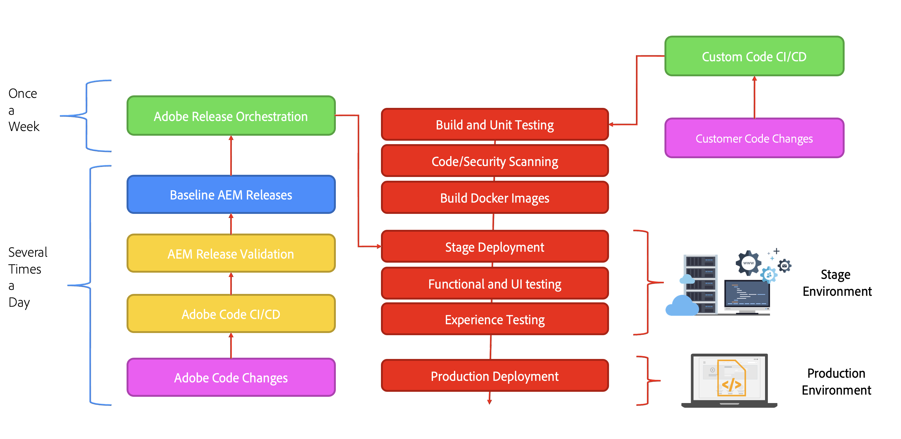

# Inleiding tot de architectuur van Adobe Experience Manager as a Cloud Service {#an-introduction-to-the-architecture-adobe-experience-manager-as-a-cloud-service}

>[!CONTEXTUALHELP]
>id="intro_aem_cloudservice_architecture"
>title="Inleiding tot AEM as a Cloud Service-architectuur"
>abstract="Op dit tabblad kunt u de nieuwe architectuur van AEM as a Cloud Service weergeven en de wijzigingen begrijpen. AEM heeft geresulteerd in een dynamische architectuur met een variabel aantal afbeeldingen, dus het is belangrijk om de tijd te nemen om de cloudarchitectuur te begrijpen."
>additional-url="https://video.tv.adobe.com/v/330542/" text="Overzicht van architectuur"

Adobe Experience Manager (AEM) as a Cloud Service biedt een reeks composable services voor het creëren en beheren van ervaringen met een hoog effect.

Deze pagina verstrekt een inleiding aan de logische architectuur, de de dienstarchitectuur, de systeemarchitectuur, en de ontwikkelingsarchitectuur voor AEM as a Cloud Service.

## Logische architectuur {#logical-architecture}

AEM as a Cloud Service bestaat uit oplossingen op hoog niveau, zoals AEM Sites, AEM Assets en AEM Forms. Deze diensten zijn vergunning individueel, maar kunnen in samenwerking worden gebruikt. Elke oplossing gebruikt een combinatie van composable diensten die door AEM as a Cloud Service worden verleend, afhankelijk van hun respectieve gebruiksgevallen.

### Programma&#39;s {#programs}

De toepassingen van AEM worden materialized in de vorm van a [&#x200B; Programma &#x200B;](/help/implementing/cloud-manager/getting-access-to-aem-in-cloud/program-types.md) dat u in de toepassing van Cloud Manager, volgens uw vergunningsrechten creeert. Deze programma&#39;s geven u volledige controle over hoe de bijbehorende toepassing van AEM wordt genoemd, gevormd en hoe de toestemmingen, in de context van een bepaald project worden toegewezen.

Als klant, wordt u gewoonlijk geïdentificeerd door Adobe als a **huurder**, ook gekend als een *organisatie IMS* (het Systeem van Identity Management). Een huurder kan zo vele programma&#39;s hebben zoals nodig, en vergunning hebben. Het is bijvoorbeeld gebruikelijk om een centraal programma voor AEM Assets te zien, terwijl AEM Sites kan worden gebruikt in meerdere programma&#39;s die aansluiten op meerdere online ervaringen.

>[!NOTE]
>
>AEM Edge Delivery Services wordt in Cloud Manager als een oplossing op het hoogste niveau aangeboden en maakt vanuit het oogpunt van licenties deel uit van de andere belangrijkste oplossingen. AEM Sites met Edge Delivery Services.

Een programma kan met om het even welke combinatie oplossingen op hoog niveau worden gevormd, en elke oplossing kan van één aan vele toe:voegen-ons steunen. Bijvoorbeeld Commerce of Screens voor AEM Sites, Dynamic Media of Brand Portal voor AEM Assets.

### Omgevingen {#environments}

Zodra een programma met de oplossingen van AEM Sites, AEM Assets of AEM Forms wordt gecreeerd, zullen de bijbehorende instanties van AEM in de vorm van AEM milieu&#39;s in dit programma worden vertegenwoordigd.

Er zijn vier soorten [&#x200B; milieu &#x200B;](/help/implementing/cloud-manager/manage-environments.md) beschikbaar met AEM as a Cloud Service:

* Productieomgeving:

   * Een productiemilieu bewaart de toepassingen voor de bedrijfsartsen en stelt de levende ervaringen in werking.

* Werkgebiedomgeving:

   * Een werkgebiedmilieu wordt gewoonlijk gekoppeld aan een productiemilieu in een 1 :1 verhouding.
   * De werkgebiedomgeving is vooral ontworpen voor automatische tests voordat wijzigingen in de toepassing worden doorgevoerd in de productieomgeving.
      * Dit is onafhankelijk van de wijzigingen die door Adobe worden geïnitieerd als onderdeel van een onderhoudsupdate of door uw code-implementaties.
      * U kunt handtests ook uitvoeren in het geval van een code-implementatie.
   * De inhoud van de werkgebiedomgeving wordt meestal gesynchroniseerd gehouden met de productie-inhoud met de functie voor het kopiëren van zelfbedieningsinhoud.
   * Prestatie- en beveiligingstests uitvoeren op de werkgebiedomgeving.  Het is even groot als de productie.
* Ontwikkelomgeving:
   * Met een ontwikkelomgeving kunnen uw ontwikkelaars AEM-toepassingen implementeren en testen onder dezelfde runtimevoorwaarden als in de fase- en productieomgeving.
   * De veranderingen gaan door een plaatsingspijpleiding toe die voor de zelfde codekwaliteit en veiligheidspoorten zoals in de pijpleidingen van de productieleiding toestaat.
   * Ontwikkelomgevingen hebben niet dezelfde grootte als stadium en productie en mogen niet worden gebruikt om prestatie- en veiligheidstests uit te voeren.
* Snelle ontwikkelomgeving (RDE):
   * Een milieu RDE staat voor snelle ontwikkelingsherhalingen toe wanneer het opstellen van nieuwe of bestaande code in de instanties RDE, zonder het gaan door een formele plaatsingspijpleiding zoals die op regelmatige ontwikkelomgevingen wordt gevonden.

### Edge Delivery Services {#logical-architecture-edge-delivery-services}

Een programma van AEM kan ook met [&#x200B; Edge Delivery Services &#x200B;](/help/edge/overview.md) worden gevormd.

Zodra gevormd, kan AEM GitHub codebewaarplaatsen van verwijzingen voorzien die voor de bouw van de ervaringen met Edge Delivery Services worden gebruikt. Dientengevolge, worden de nieuwe configuratieopties beschikbaar voor de bijbehorende ervaringen. Dit zijn onder andere het instellen van de door Adobe beheerde CDN en het benaderen van licentiemetriek of SLA-rapporten.

## Servicearchitectuur {#service-architecture}

De lijst met services op hoog niveau die in AEM as a Cloud Service kunnen worden samengesteld, kan in twee segmenten worden weergegeven: Inhoudsbeheer en Ervaring Aflevering:

Voor inhoudsbeheer, zijn er twee belangrijkste reeksen diensten voor het ontwerpen van inhoud, allebei die als *inhoudsbronnen* worden vertegenwoordigd:

* AEM Author tier:
Biedt een webinterface (met gekoppelde API&#39;s) voor het beheer van webinhoud. Dit geldt voor beide benaderingen:
   * Hoofdtekst - via de pagina-editor en de Universal Editor
   * Koploos - via de editor voor inhoudsfragmenten
* De op documenten gebaseerde ontwerplaag:
Hiermee kunt u inhoud schrijven met standaardtoepassingen, zoals:
   * Microsoft Word en Excel - via SharePoint
   * Google Docs en Sheets - via Google Drive

Voor ervaringslevering, wanneer het gebruiken van AEM Sites of AEM Forms, zijn er ook twee belangrijkste reeksen diensten, niet wederzijds - exclusief en werkend onder een gedeeld Adobe-Beheerd CDN (het Netwerk van de Levering van de Inhoud) als verschillende oorsprong:

* Het AEM-publicatieniveau:
   * Voert een farm van standaard AEM-uitgevers en -verzenders uit, waardoor webpagina&#39;s en API-inhoud (bijvoorbeeld GraphQL) die met gepubliceerde inhoud is samengesteld, dynamisch kunnen worden weergegeven.
   * Is hoofdzakelijk gebaseerd op server-zijtoepassingslogica.
* Het Edge Delivery-publicatieniveau:
   * Hiermee wordt het dynamisch weergeven van webpagina&#39;s en API-inhoud toegestaan vanuit diverse inhoudsbronnen, zoals de AEM Author-laag of de op documenten gebaseerde Authoring-laag.
   * Is gebaseerd op toepassingslogica aan de clientzijde en ontworpen voor maximale prestaties.

Er zijn ook de belangrijkste aangrenzende services:

* De Edge Delivery Assets-laag:
   * Staat de levering toe van goedgekeurde en gepubliceerde media-items van AEM Assets. Bijvoorbeeld afbeeldingen en video&#39;s.
   * Meestal wordt naar de media-items verwezen op basis van ervaringen die worden uitgevoerd op de AEM-publicatielaag, de Edge Delivery-publicatielaag of een andere Adobe Experience Cloud-toepassing die is geïntegreerd met AEM Assets.
* De AEM Preview-laag en de Edge Delivery Services Preview-laag:
   * Deze zijn ook beschikbaar voor ervaringen die zijn gemaakt met respectievelijk de publicatielaag van AEM of de publicatielaag van Edge Delivery.
   * Hiermee kunnen auteurs van inhoud inhoud in context een voorvertoning van inhoud weergeven voordat ze bewerkingen publiceren.

>[!NOTE]
>
>Standaard hebben alleen-Assets programma&#39;s geen publicatielaag of voorvertoningslaag.

Er zijn andere aangrenzende services:

* De replicatieservice:
   * Geplaatst tussen de laag voor inhoudsbeheer en de leveringslaag voor ervaring.
   * Is verantwoordelijk voor het verwerken van *publiceer* verrichtingen die door inhoudsauteurs worden uitgegeven, dan verstrekkend de gepubliceerde inhoud aan publiceren rijen (AEM of Edge Delivery).

  >[!NOTE]
  >De replicatieservice heeft een volledig nieuw ontwerp doorlopen in vergelijking met de 6.x-versies van AEM, aangezien het replicatieframework van vorige versies van AEM niet meer wordt gebruikt om inhoud te publiceren.
  >
  >De recentste architectuur is gebaseerd op a *publiceren en onderteken* benadering met op wolk-gebaseerde inhoudsrijen. Voor de AEM-publicatielijst kan een variabel aantal uitgevers zich abonneren op de publicatie-inhoud en is dit een essentieel onderdeel van het realiseren van echte en snelle automatische schaling voor AEM as a Cloud Service

* De service voor opslagplaatsen voor inhoud:
   * Wordt gebruikt door de AEM-auteurslaag.
   * Is een cloudgebaseerd exemplaar van een JCR-compatibele inhoudsopslagplaats, geïmplementeerd door de Apache Oak-technologie.
   * De persistentie van inhoud is voornamelijk gebaseerd op cloudopslag op basis van blob.
* De CI/CD-service:
   * Vertegenwoordigt de subset van Cloud Manager-functies die gewijd zijn aan het beheer van distributiepijpleidingen naar de AEM-omgevingen.
* De testservice:
   * Vertegenwoordigt de onderliggende infrastructuur die wordt gebruikt om uit te voeren:
      * functionele tests;
      * UI-tests: bijvoorbeeld op basis van Selenium- of Cypress-scripts;
      * praktijkexamens: bijvoorbeeld Lighthouse-scores;

     als deel van een plaatsingspijpleiding aan een milieu van AEM, of als deel van een trekkingsverzoek GitHub aan een de codebewaarplaats van Edge Delivery.
* De gegevensservice:
   * Is verantwoordelijk voor het blootstellen van klantgegevens zoals licentiemetriek (bijvoorbeeld inhoudsverzoeken, opslag, gebruikers) of gebruiksrapporten (zoals het aantal uploads, downloads).
   * De klantgegevens kunnen via API&#39;s en binnen gebruikersinterfaces van het product (zoals de Cloud Manager) worden weergegeven.
* De operationele telemetrieservice:
   * Is verantwoordelijk voor het verzamelen van zeer belangrijke metriek van een klantenervaring (zoals paginameningen, kernWeb vitals, omzettingsgebeurtenissen), en het antwoorden aan bijbehorende vragen (bijvoorbeeld, hoogste paginameningen voor een bepaald domein in de laatste 7 dagen).
* De Assets Compute-service:
   * is verantwoordelijk voor het verwerken van geüploade afbeeldingen, video&#39;s en documenten, bijvoorbeeld PDF- en Adobe Photoshop-bestanden. Bij verwerking kunt u Adobe AI gebruiken om metagegevens van afbeeldingen en video te extraheren (zoals beschrijvende tags of primaire kleurtonen) en vervolgens uitvoeringen genereren (zoals verschillende formaten of formaten), met toegang tot API&#39;s zoals de Adobe Photoshop- en Adobe Lightroom-API&#39;s.
* De Identity Management Service (IMS):
   * Is de centrale plaats verantwoordelijk voor het leiden en voor authentiek verklaren van gebruikers en gebruikersgroepen voor een bepaalde toepassing van Adobe Experience Cloud (bijvoorbeeld, de Cloud Manager of de auteursrij van AEM).
   * Wordt benaderd via de Adobe Admin Console.

## Systeemarchitectuur {#system-architecture}

### Tiers voor AEM-auteurs, -voorvertoningen en -publicaties {#aem-author-preview-publish-tiers}

De AEM Auteur- en Publish-lagen worden geïmplementeerd als een set Docker-containers, die worden beheerd door een standaard Container Orchestration Service. De resulterende containerarchitectuur betekent een volledig dynamisch systeem met een variabel aantal pods, afhankelijk van werkelijke activiteit (voor inhoudsbeheer) en het werkelijke verkeer (voor ervaringslevering). Zo kan AEM as a Cloud Service uw verkeerspatronen aanpassen terwijl ze veranderen.

De AEM Author-laag wordt gebruikt als een cluster van AEM-auteurspods die één enkele inhoudsopslagplaats delen. Een minimum van twee pods staat voor bedrijfscontinuïteit toe terwijl de onderhoudstaken lopen, of terwijl een plaatsingsproces gebeurt.

De AEM-publicatielijst wordt gebruikt als een farm van AEM-publicatie-instanties, elk met hun eigen inhoudopslagplaats voor gepubliceerde inhoud. Elke uitgever wordt gekoppeld aan één Apache-instantie die is uitgerust met de AEM-verzendermodule voor een geconcretiseerde weergave van de inhoud, die als oorsprong fungeert voor de door Adobe beheerde CDN. Een minimum van twee pods staat ook voor bedrijfscontinuïteit toe, maar het is niet ongebruikelijk om dit aantal in periodes van hoog verkeer te zien groeien.

De AEM Preview-laag bestaat uit één AEM-knooppunt. Dit wordt gebruikt voor kwaliteitsborging van inhoud alvorens aan te publiceren publiceert rij. Soms kunnen er downtime optreden, vooral tijdens implementaties, op de voorvertoningslaag.

### Edge Delivery Services {#system-architecture-edge-delivery-services}

De Edge Delivery Services wordt boven op een CDN en serverloze infrastructuur gebruikt om de pagina&#39;s zo goed mogelijk samen te stellen. Wanneer een middel wordt gevraagd, is de serverinfrastructuur verantwoordelijk voor het omzetten van de gepubliceerde inhoud in semantische HTML en dient als oorsprong aan CDN.

De conversie naar semantische HTML vindt plaats op basis van de gepubliceerde inhoud die wordt aangeboden op de auteurslaag van AEM of de op documenten gebaseerde ontwerpomgeving.

In het volgende diagram ziet u hoe u Sites-inhoud in Microsoft Word (Document-based Authoring) kunt bewerken en naar Edge Delivery kunt publiceren. Ook wordt met de verschillende editors de traditionele AEM-publicatiemethode weergegeven.

Aangezien Edge Delivery Services deel uitmaakt van Adobe Experience Manager en als zodanig kunnen Edge Delivery, AEM Sites en AEM Assets op hetzelfde domein naast elkaar bestaan. Dit is een veelvoorkomend geval voor het gebruik van grotere websites. Een klant kan bijvoorbeeld een bepaalde pagina met veel verkeer naar Edge Delivery Services migreren, terwijl alle andere pagina&#39;s op de AEM-publicatielijst blijven staan.

## Ontwikkelarchitectuur {#development-architecture}

### Codeopslagplaatsen {#code-repositories}

De code en de configuratie voor de projecten van AEM wordt opgeslagen in een codebewaarplaats, waarvan plaatsingspijpleidingen worden uitgegeven wanneer de veranderingen worden aangebracht. Er zijn verschillende typen gegevensopslagruimten voor code:

* AEM full stack:
   * Voor het opslaan van Java-code en OSGI-configuraties aan de serverzijde voor de AEM-auteur en -publicatielagen.
* AEM front end:
   * Voor het opslaan van client-side JS-, CSS- en HTML-code voor de AEM-auteur- en -publicatielagen.
Voor meer details op clientlibs, zie [&#x200B; Gebruikend cliënt-Kant Bibliotheken op AEM as a Cloud Service &#x200B;](/help/implementing/developing/introduction/clientlibs.md).
* AEM-weblaag:
   * Hiermee slaat u de configuratiebestanden van de verzender op voor de AEM-publicatielijst.
* AEM-configuratie:
   * Hiermee kunt u verschillende configuratieopties (zoals CDN-instellingen of instellingen voor onderhoudstaken) voor de AEM-publicatielijst en de Edge Delivery Services-publicatielijst opslaan.
* AEM edge delivery:
   * Voor het opslaan van de client-side JS-, CSS- en HTML-code voor sites die zijn gemaakt met de Edge Delivery Services

### Plaatsingspijpleidingen {#deployment-pipelines}

Ontwikkelaars en beheerders beheren de AEM as a Cloud Service-toepassing met behulp van een Continuous Integration/Continuous Delivery (CI/CD)-service, die beschikbaar wordt gesteld via de Cloud Manager. Cloud Manager stelt ook alles bloot met betrekking tot bewaking, onderhoud, probleemoplossing (bijvoorbeeld toegang tot logbestanden) en licenties.

Cloud Manager beheert alle updates van uw exemplaren van de AEM as a Cloud Service. Het is verplicht, omdat dit de enige manier is om de klanttoepassing te maken, testen en implementeren voor de auteur, de voorvertoning en de publicatielagen. Deze updates kunnen worden geactiveerd door Adobe, wanneer een nieuwe versie van de AEM Cloud Service gereed is, of door uzelf wanneer een nieuwe versie van uw toepassing gereed is.

Dit wordt uitgevoerd door een plaatsingspijpleiding, die aan elk milieu binnen een programma wordt gekoppeld. Wanneer een Cloud Manager-pijplijn wordt uitgevoerd, maakt deze een nieuwe versie van de klantapplicatie, zowel voor de authoring- als voor de publicatielaag. Dit wordt bereikt door de nieuwste klantpakketten te combineren met de nieuwste Adobe-basisafbeelding.

De plaatsingspijpleiding wordt teweeggebracht of wanneer de klanten codeveranderingen aanbrengen, of wanneer Adobe een nieuwe onderhoudsversie opstelt.

In beide gevallen wordt dezelfde set geautomatiseerde tests uitgevoerd. Het bestaat uit tests:

* door Adobe wordt bijgedragen om de productintegriteit te waarborgen
* door de klant geleverde tests
   * Functionele tests: via http-verzoeken aan de AEM-auteur of publicatielaag
   * UI-tests: gebaseerd op Selenium- of Cypress-technologie

Deze geautomatiseerde tests worden uitgevoerd in de Stage-omgeving. Daarom is het belangrijk dat de Stage-omgeving zo dicht mogelijk bij de inhoud van de Production-instantie blijft.

Zodra alle tests met succes overgaan, wordt de nieuwe code opgesteld aan het milieu van de Productie.

### Rolling updates {#rolling-updates}

De Cloud Manager automatiseert de cut-over volledig naar de nieuwste versie van de AEM-toepassing door alle serviceknoppen bij te werken aan de hand van een rollend updatepatroon. Dit betekent er **geen onderbreking** voor of de auteur of publiceer de dienst is.

## Belangrijke innovaties sinds AEM 6.x {#major-innovations-since-aem-6x}

De nieuwste architectuur voor AEM as a Cloud Service introduceert enkele fundamentele veranderingen en vernieuwingen in vergelijking met de vorige generaties (AEM 6.x en eerder):

* Alle bestanden worden rechtstreeks geüpload en via een Cloud Data Store verzonden. De bijbehorende bitstroom gaat nooit door de JVM van de AEM Author- en Publish-services. Dit betekent dat de knooppunten van de AEM-auteur- en -publicatieservices kleiner van formaat kunnen zijn en daarom beter compatibel zijn met de verwachting van snelle automatische schaling. Voor zakelijke gebruikers leidt dit tot een snellere ervaring bij het uploaden en downloaden van afbeeldingen, video en andere taken.

* Alle bewerkingen die bestaan uit het publiceren van content, bevatten nu een pijplijn die een abonnementspatroon volgt. Gepubliceerde content wordt verplaatst naar diverse wachtrijen in de pijplijn, waarop alle nodes van de publicatieservice zijn geabonneerd. Daarom hoeft de authoringlaag niets te weten over het aantal nodes in de publicatieservice; hierdoor kan de publicatielaag snel automatisch worden geschaald.

* De architectuur scheidt de applicatiecontent volledig van de applicatiecode en de configuratie. Alle code en configuraties zijn praktisch onveranderlijk en ingebouwd in de basisinstallatiekopie die wordt gebruikt om de diverse nodes van de authoring- en publicatieservices te maken. Daardoor is absoluut gegarandeerd dat alle nodes identiek zijn, en kunnen veranderingen in de code en configuratie uitsluitend globaal worden aangebracht door een Cloud Manager-pijplijn uit te voeren.

* De architectuur omvat veelvoudige microdiensten die op serverloze technologie, vooral met Adobe I/O runtime worden gebouwd

## Aanvullende informatie {#further-information}

* Programma instellen
   * [Onboarding Journaal](/help/journey-onboarding/overview.md)
   * [Programma&#39;s en programmatypen](/help/implementing/cloud-manager/getting-access-to-aem-in-cloud/program-types.md)
* Ontwikkelarchitectuur
   * [Cloud Manager-opslagplaatsen](/help/implementing/cloud-manager/managing-code/managing-repositories.md)
   * [CI/CD Pipet](/help/implementing/cloud-manager/configuring-pipelines/introduction-ci-cd-pipelines.md)
   * [Testen van de codekwaliteit](/help/implementing/cloud-manager/code-quality-testing.md)
* Edge Delivery Services:
   * [AEM as a Cloud Service - Overzicht - met Edge Delivery Services](/help/edge/overview.md)
   * [Edge Delivery Services gebruiken](/help/edge/overview.md)
   * [&#x200B; Onderzoek de onderliggende architectuur en belangrijke stukken van AEM as a Cloud Service met Edge Delivery Services &#x200B;](https://experienceleague.adobe.com/docs/experience-manager-learn/cloud-service/introduction/architecture.html)
