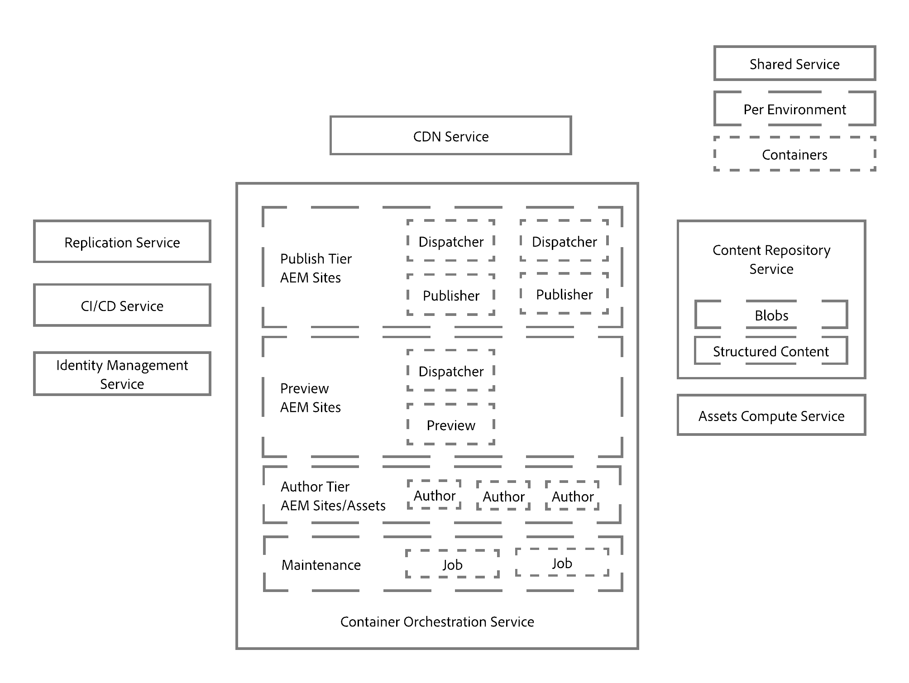
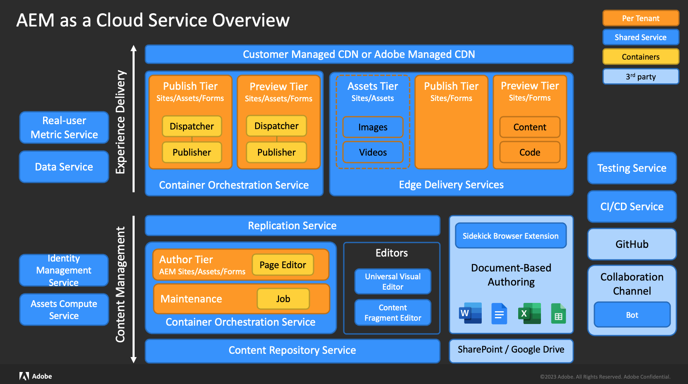

# Een inleiding tot de architectuur van Adobe Experience Manager as a Cloud Service {#an-introduction-to-the-architecture-adobe-experience-manager-as-a-cloud-service}

>[!CONTEXTUALHELP]
>id="intro_aem_cloudservice_architecture"
>title="Inleiding tot AEM as a Cloud Service architectuur"
>abstract="Op dit tabblad kunt u de nieuwe architectuur van AEM as a Cloud Service bekijken en de wijzigingen begrijpen. AEM heeft geresulteerd in een dynamische architectuur met een variabel aantal afbeeldingen, dus het is belangrijk om de tijd te nemen om te begrijpen.de cloudarchitectuur"
>additional-url="https://video.tv.adobe.com/v/330542/" text="Overzicht van architectuur"

Adobe Experience Manager (AEM) as a Cloud Service heeft geleid tot wijzigingen in de architectuur.

## Schalen {#scaling}

AEM as a Cloud Service heeft nu:

* Een dynamische architectuur met een variabel aantal AEM-installatiekopieën.

Deze architectuur:

* Wordt geschaald op basis van de *werkelijke* traffic en de *werkelijke* activiteit.

* Bevat afzonderlijke instanties die alleen worden uitgevoerd wanneer dat nodig is.

* Gebruikt modulaire applicaties.

* Heeft een authoringcluster als standaard; dit voorkomt uitvaltijd voor onderhoudstaken.

Hierdoor is automatische schaling mogelijk voor variërende gebruikspatronen:

Om dit te bereiken worden alle instanties van AEM as a Cloud Service gelijk gecreëerd, elk met dezelfde standaard formaateigenschappen in termen van het aantal nodes, toegewezen geheugen en toegewezen berekeningscapaciteit.

AEM as a Cloud Service is gebaseerd op het gebruik van een orkestratie-engine die:

* Voortdurend de status van de service controleert.

* Elk van de service-instanties dynamisch schaalt volgens de werkelijke behoeften, zowel omhoog als omlaag.

Dit:

* Geldt voor het aantal nodes, de hoeveelheid geheugen en de toegewezen CPU-capaciteit per node.

* Zorgt ervoor dat AEM as a Cloud Service zich kan aanpassen aan uw veranderende verkeerspatronen.

Het schrapen van per-huurderinstanties van de dienst is op de twee assen van toepassing:

* Horizontaal: het aantal knopen voor een bepaalde dienst wordt verhoogd of automatisch verlaagd, nog toestaand voor individuele standaardconfiguraties.

* Verticaal: toegewezen geheugen en CPU-capaciteit kunnen worden vergroot of verkleind via configuratie voor een vast aantal knooppunten om aan de individuele vereisten te voldoen.

## Omgevingen {#environments}

>[!NOTE]
>Zie voor meer informatie [Implementeren - Runmodi](/help/implementing/deploying/overview.md#runmodes)

AEM as a Cloud Service wordt beschikbaar gesteld als afzonderlijke instanties waarbij elke instantie een volledige AEM-omgeving vertegenwoordigt.

Er zijn drie soorten milieu&#39;s beschikbaar met AEM as a Cloud Service:

* **Productieomgeving**: is de host voor de applicaties van alle zakelijke gebruikers.

* **Faseomgeving**: wordt altijd gekoppeld aan één productieomgeving in een 1-op-1-relatie. De faseomgeving wordt gebruikt voor verschillende prestatie- en kwaliteitstesten voordat wijzigingen in de applicatie worden doorgevoerd in de productieomgeving.

* **Ontwikkelomgeving**: hier kunnen ontwikkelaars AEM-applicaties implementeren onder dezelfde runtimevoorwaarden als de fase- en productieomgeving.

  Zie [Omgevingen beheren](https://experienceleague.adobe.com/docs/experience-manager-cloud-service/implementing/using-cloud-manager/manage-environments.html?lang=en#using-cloud-manager) voor meer informatie .

* **Snelle ontwikkelomgeving**: maakt snelle ontwikkelherhalingen mogelijk voor foutopsporing in nieuwe of bestaande code.

## Programma&#39;s {#programs}

Elk nieuw AEM-project is altijd gebonden aan precies één specifieke codebase, waar u zowel de configuratie als de aangepaste code voor uw project kunt opslaan. Deze informatie wordt opgeslagen in een code-repository die via de gebruikelijke Git-clients toegankelijk is. De repository is voor u beschikbaar wanneer nieuwe programma&#39;s worden gemaakt.

Een AEM-programma is de container die het volgende bevat:

|  Programma-element |  Getal |
|--- |--- |
| Code-repository (Git) |  1 |
| Basisinstallatiekopie (Sites of Assets) |  1 |
| Fase- en productieomgevingset (1:1) | 0 of 1 |
| Niet-productieomgevingen (RDE, ontwikkeling of demonstratie) | 0 tot en met N |
| Pijplijn voor elke omgeving | 0 of 1 |

Er zijn aanvankelijk twee typen programma&#39;s beschikbaar voor AEM as a Cloud Service:

* AEM Cloud Sites Service

* AEM Cloud Assets Service

Beide bieden toegang tot een aantal functies en functionaliteiten. De auteurslaag zal alle Sites en Activa functionaliteit voor alle programma&#39;s bevatten, maar de programma&#39;s van Activa zullen niet een publicatielaag, noch een voorproefrij, door gebrek hebben.

## Runtimearchitectuur {#runtime-architecture}

Deze nieuwe architectuur bestaat uit verschillende hoofdonderdelen:

<!--- needs reworking -->

* Voor AEM Sites as a Cloud Service:

   * Het concept van een authoringlaag en een publicatielaag voor elke omgeving (op een hoog niveau) blijft bestaan.

   * De authoringlaag bestaat uit twee of meer nodes binnen één authoringcluster. De schaal wordt automatisch aangepast, afhankelijk van de authoringactiviteit.

      * Auteurs/makers van content melden zich aan bij de AEM-authoringlaag om content te maken, te bewerken en te beheren.

      * Aanmelding bij de authoringlaag wordt beheerd door de Adobe Identity Management Services (IMS).

      * Integratie en de verwerking van Assets maken gebruik van een specifieke Assets Compute Service.

   * De voorvertoningslaag bestaat uit één voorvertoningsknooppunt. Dit wordt gebruikt voor kwaliteitscontrole van inhoud voordat deze wordt gepubliceerd naar de publicatielijst.

   * De publicatielijst bestaat uit twee of meer knopen binnen één enkel publicatielandbouwbedrijf.

      * De knooppunten kunnen onafhankelijk van elkaar werken.

      * Elke node bestaat uit een AEM-uitgever en een webserver die is uitgerust met de AEM Dispatcher-module.

      * De schaal wordt automatisch aan het siteverkeer aangepast.

      * Door gebrek is er één enkel publiceer landbouwbedrijf in het primaire gebied, echter [extra publicatiegebieden](/help/operations/additional-publish-regions.md) mag een vergunning worden verleend.

      * Eindgebruikers of sitebezoekers bezoeken de website via de AEM Publish Service.

* Voor AEM Assets as a Cloud Service:

   * De architectuur omvat uitsluitend een authoringomgeving.

* Zowel de auteurslaag, de voorproefrij, als publiceren rij lezen en blijven inhoud van/aan de Dienst van de Bewaarplaats van de Inhoud.

   * De publicatielaag en de voorvertoningslaag lezen alleen inhoud van de persistentielaag.

   * In de authoringlaag wordt content van en naar de persistentielaag gelezen en geschreven.

   * De opslag van lobs wordt gedeeld door de publicatie, voorvertoning en auteurslagen; bestanden zijn niet *bewogen*.

   * Wanneer inhoud wordt goedgekeurd vanaf de auteurslaag, is dit een aanwijzing dat het kan worden geactiveerd, daarom aan de laag van de publicatielaag persistence worden geduwd; of naar keuze aan de voorproefrij. Dit gebeurt via de Replication Service, een middleware-pijplijn. Deze pijpleiding ontvangt de nieuwe inhoud, met de individuele publiceerdienst (of voorproefdienst) knopen die aan de inhoud intekenen die aan de pijpleiding wordt geduwd.

     >[!NOTE]
     >
     >Zie [Replicatie](/help/operations/replication.md) voor meer details.

   * Ontwikkelaars en beheerders beheren de applicatie AEM as a Cloud Service met behulp van een CI/CD-service (Continuous Integration/Continuous Delivery), die beschikbaar wordt gesteld via de [Cloud Manager](/help/overview/what-is-new-and-different.md#cloud-manager)). Dit omvat code- en configuratie-implementaties die gebruikmaken van de CCI/CD-pijplijn van de Cloud Manager. Alles wat te maken heeft met bewaking, onderhoud en probleemoplossing (bijvoorbeeld logbestanden), wordt aan klanten binnen Cloud Manager beschikbaar gesteld.

   * Toegang tot de authoring- en publicatielijsten vindt altijd plaats via een load balancer. Deze wordt altijd bijgewerkt met de actieve nodes in elke laag.

   * Voor de publicatielaag en de voorvertoningslaag is ook een CDN-service (Continuous Delivery Network) beschikbaar als eerste ingangspunt.

* Voor demonstratie-instanties van AEM as a Cloud Service wordt de architectuur vereenvoudigd tot één authoringnode. Daarom bevat de installatie niet alle kenmerken van de omgevingen voor standaardontwikkeling, fase of productie. Dit betekent ook dat er enige uitvaltijd kan zijn en dat er geen ondersteuning is voor back-up-/herstelbewerkingen.

## Implementatiearchitectuur {#deployment-architecture}

Cloud Manager beheert alle updates van de instanties van AEM as a Cloud Service. Aangezien dit de enige manier is om de klanttoepassing te maken, testen en implementeren, is dit verplicht voor zowel de auteur als de voorvertoning en de publicatielagen. Deze updates kunnen worden geactiveerd door Adobe wanneer een nieuwe versie van de AEM Cloud Service gereed is, of door de klant wanneer een nieuwe versie van hun applicatie gereed is.

Technisch gezien wordt dit geïmplementeerd volgens het concept van een implementatiepijplijn, die aan elke omgeving binnen een programma is gekoppeld. Wanneer een pijplijn van de Manager van de Wolk loopt, leidt het tot een nieuwe versie van de klantentoepassing, zowel voor de auteur, de voorproef, als publicatielagen. Dit wordt bereikt door de nieuwste klantpakketten te combineren met de nieuwste Adobe-basisinstallatiekopie. Wanneer de nieuwe installatiekopieën zijn gemaakt en met succes getest, zorgt Cloud Manager voor een volledige automatisering van de cutover naar de nieuwste versie van de installatiekopie door alle servicenodes bij te werken met een doorlopend updatepatroon. Hierdoor is er geen uitvaltijd voor de authoring- of de publicatieservice.

<!--- needs reworking -->

## Contentdistributie {#content-distribution}

Adobe Experience Manager as a Cloud Service heeft de manier veranderd waarop content wordt gepubliceerd. Met AEM as a Cloud Service wordt het replicatiekader van eerdere versies van AEM niet meer gebruikt om pagina&#39;s te publiceren (wijzigingen van de authoringinstantie verplaatsen naar publicatie-instanties).

AEM as a Cloud Service gebruikt nu de functie [Sling Content Distribution](https://sling.apache.org/documentation/bundles/content-distribution.html) om de juiste content te verplaatsen. Hierbij wordt een pijplijnservice gebruikt die wordt uitgevoerd op Adobe I/O, die buiten de AEM-runtime valt.

De installatie wordt automatisch uitgevoerd, inclusief automatische zelfconfiguratie wanneer publicatienodes tijdens runtime worden toegevoegd, verwijderd of gerecycled.

Eén verzoek tot publicatie of ongedaan maken van publicatie kan meerdere bronnen bevatten, maar retourneert slechts één status voor alle bronnen. De publicatie zal voor alle bronnen in de AEM Publish Service slagen of voor allemaal mislukken. Daardoor zijn de bronnen binnen de AEM Publish Service nooit in een inconsistente toestand.

**Architectuurdiagram voor contentdistributie op hoog niveau**

## Belangrijke ontwikkelingen {#key-evolutions}

De nieuwe architectuur voor AEM as a Cloud Service introduceert een paar fundamentele wijzigingen en vernieuwingen vergeleken bij de vorige generaties:

* Alle bestanden (blobs) worden rechtstreeks geüpload en aangeboden vanuit een gegevensopslag in de cloud. De bijbehorende bitstroom gaat nooit door de JVM van de AEM Author- en Publish-services. Hierdoor kunnen de nodes van de Author- en Publish-services van AEM kleiner zijn en beter voldoen aan de verwachting van snelle automatische schaling. Voor bedrijfsleiders leidt dit tot een snellere ervaring bij het uploaden en downloaden van afbeeldingen, video, enzovoort.

* Alle bewerkingen die bestaan uit het publiceren van content, bevatten nu een pijplijn die een abonnementspatroon volgt. Gepubliceerde content wordt verplaatst naar diverse wachtrijen in de pijplijn, waarop alle nodes van de publicatieservice zijn geabonneerd. Daarom hoeft de authoringlaag niets te weten over het aantal nodes in de publicatieservice; hierdoor kan de publicatielaag snel automatisch worden geschaald.

* Het concept van een Golden Master werd geïntroduceerd om de levenscyclus van de publicatienodes te automatiseren. De Golden Master is een gespecialiseerde publicatienode waartoe geen enkele eindgebruiker toegang heeft, en waaruit alle nodes van de publicatieservice worden gecreëerd. Onderhoudsbewerkingen zoals compressie worden uitgevoerd op de content-repository die is gekoppeld aan de Golden Master. De publicatienodes worden dagelijks gerecycled en vergen geen routineonderhoud; vroeger was voor dergelijke onderhoud uitvaltijd nodig, vooral voor de authoringinstantie.

* De architectuur scheidt de applicatiecontent volledig van de applicatiecode en de configuratie. Alle code en configuraties zijn praktisch onveranderlijk en ingebouwd in de basisinstallatiekopie die wordt gebruikt om de diverse nodes van de authoring- en publicatieservices te maken. Daardoor is absoluut gegarandeerd dat alle nodes identiek zijn, en kunnen veranderingen in de code en configuratie uitsluitend globaal worden aangebracht door een Cloud Manager-pijplijn uit te voeren.

## AEM met Edge Delivery Services {#aem-with-edge-delivery-services}

Met de toevoeging van Edge Delivery Services biedt AEM buitengewone ervaringen die de betrokkenheid en conversies stimuleren. AEM doet dit door het bieden van ervaringen met grote impact die snel bij de auteur en de ontwikkeling zijn. Edge Delivery Services zijn een set services die een snelle ontwikkelomgeving mogelijk maken waarin auteurs snel kunnen bijwerken en publiceren en nieuwe sites snel kunnen worden opgestart. Als zodanig kunt u met Edge Delivery Services de conversie verbeteren, de kosten verlagen en de snelheid van de inhoud extreem verhogen.

De bijgewerkte architectuur omvat:

* Inhoudsbeheer, nu inclusief een selectie editors:
   * Universal Visual Editor
   * Inhoudsfragmenteditor
   * Pagina-editor
   * Document gebaseerd ontwerpen; van SharePoint of Google Drive
* Ervaring met leveren, nu inclusief:
   * Edge Delivery Services
* Nevenservices voor de snelle en efficiënte levering van inhoud en code

Zie ook:

* [as a Cloud Service overzicht AEM - met Edge Delivery Services](/help/edge/overview.md)
* [Edge Delivery Services gebruiken](/help/edge/using.md)
* [Ontdek de onderliggende architectuur en belangrijke AEM die as a Cloud Service zijn met Edge Delivery Services](https://experienceleague.adobe.com/docs/experience-manager-learn/cloud-service/introduction/architecture.html)
