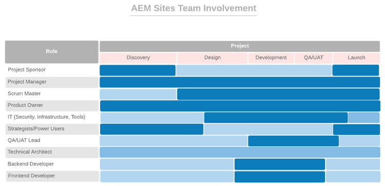

# Om te beginnen de juiste mensen in de juiste rollen krijgen {#get-the-right-people-in-the-right-roles}

>[!CONTEXTUALHELP]
>id="aemcloud_chooseteam"
>title="Kies het juiste team"
>abstract="De juiste mensen in de juiste banen zetten om uw Adobe Experience Manager-implementatie tot een succes te maken."
>additional-url="https://experienceleague.adobe.com/docs/experience-manager-cloud-service/onboarding/best-practices/aligning-kpis.html" text="KPI&#39;s uitlijnen"
>additional-url="https://experienceleague.adobe.com/docs/experience-manager-cloud-service/onboarding/best-practices/assessing-kpis.html" text="KPI&#39;s evalueren"

Het is mogelijk dat in uw organisatie verschillende afdelingen verschillende aspecten van de digitale ervaring hebben. Zonder governance is het stadium van eindeloze discussie, strijd en verwarring.

Digitaal bestuur begint met uitzoeken wie verantwoordelijk is voor wat en wie die digitaal gerichte baan doet. Mogelijk moet u een aantal strategische aannemers maken om de benodigde vaardigheden toe te voegen. Een nog grotere uitdaging is het aansturen van een cultuurverschuiving — het opbouwen van brede steun voor de nieuwe technologie en het helpen van mensen om gewend te raken aan nieuwe manieren om dingen te doen. Een belangrijk onderdeel van die inspanning is het creëren van een digitale gemeenschap, die mensen van elkaar laat leren en steunen.

Momenteel is het belangrijk dat de juiste mensen in de juiste banen worden gezet om uw Adobe Experience Manager-implementatie te helpen stimuleren. Voor elk kernproduct — Experience Manager Sites en Experience Manager Assets — heeft de Adobe een lijst van rollen verstrekt u moet vullen, samen met de vaardigheden, de niveaus van deskundigheid, en attributen die mensen in de diverse rollen effectief maken.

Uw taak deze week is om beide lijsten met uw implementatieteam te evalueren en ervoor te zorgen dat u in elke rol personen met relevante kwalificaties hebt.

## **Belangrijkste rollen voor AEM Experience Manager Sites**

Een winnend bemanningsteam heeft negen mensen op de juiste plaatsen nodig — net als uw plaatsingsteam. Uw succes met Adobe Experience Manager Sites hangt af van de kracht van uw teamleden en hoe goed ze samenwerken. Zorg ervoor u deze negen rollen hebt die aan mensen met de voorgestelde kwalificaties worden toegewezen.

| Rol | Vaardigheden | Capaciteitsniveau | Kwaliteit |
|--- |--- |--- |--- |
| Projectmanager | PMP-certificering, eenvoudige certificering, ervaring met risicobeheer | Expert | Eerlijk, consistent, verantwoordelijk, georganiseerd, positief, acceptabel, bereid om verandering te omarmen |
| Scrumstramien | ScrumMaster-certificering, mobiele certificering, ervaring met faciliteren | Expert | Consistent, creatief |
| Eigenaar van product | Gelijke certificering, diepgaand inzicht in bedrijfsbehoeften | Expert | Evenwichtig, zeker |
| IT-hoofden voor beveiliging, infrastructuur, tools | CISM-certificering, Adobe Experience Manager Component Developer-certificering | Expert | Gedetailleerd |
| Strategisten/Power-gebruikers | Kennis in Adobe Experience Manager Sites | Melding aan expert | Gelijkaardig, nieuwsgierig, grondig, open, bereid om verandering te omarmen, samenwerkend |
| QA/UAT-lead | Gelijke certificering, begrip van SDLC | Melding aan intermediair | Gedetailleerd, processtation, consistent |
| Technisch architect | Ervaring met IT-infrastructuur | Expert | Gedetailleerd, op processen gebaseerd, consistent |
| Back-end Developer | Gelijke certificering, ervaring met computerprogrammering en computerwetenschap | Melding aan intermediair | Gedetailleerd, op processen gebaseerd, consistent |
| Front-end Developer | Gelijke certificering, inzicht in HTML, CSS en JavaScript | Melding aan intermediair | Gedetailleerd, op processen gebaseerd, consistent |

Nu u weet welke rollen worden vereist, bekijk de grafiek hieronder om te zien wanneer elke rol in het implementatieproces in spel komt.

 

**Deze lijst met uw implementatieteam bekijken** en zorg ervoor dat u mensen met relevante kwalificaties in elke rol hebt. Teamleden die minder bekend zijn met Adobe Experience Cloud kunnen [Experience League](https://experienceleague.adobe.com/#recommended/solutions/experience-manager) leermiddelen om gecertificeerd te worden [Adobe digitaal leren](https://learning.adobe.com/certification.html).

## **Belangrijkste rollen voor AEM Experience Manager Assets**

Van architect tot ScrumMaster, elke rol in dit team is onmisbaar — inclusief de DAM-bibliotheek.

Mogelijk hebt u al de meeste mensen die u nodig hebt om een geslaagde Adobe Experience Manager Assets-implementatie uit te voeren. Deze lijst is vergelijkbaar met de lijst voor Adobe Experience Manager Sites, met één belangrijke toevoeging: u hebt een bibliothecaris nodig om ervoor te zorgen dat uw digitale middelen op een manier worden georganiseerd en geëtiketteerd die hen gemakkelijk maken te vinden.

| Rol | Vaardigheden | Capaciteitsniveau | Kwaliteit |
|--- |--- |--- |--- |
| Projectmanager | PMP-certificering, eenvoudige certificering, ervaring met risicobeheer | Expert | Eerlijk, consistent, verantwoordelijk, georganiseerd, positief, acceptabel, bereid om verandering te omarmen |
| Scrumstramien | ScrumMaster-certificering, mobiele certificering, ervaring met faciliteren | Expert | Consistent, creatief |
| Eigenaar van product | Gelijke certificering, diepgaand inzicht in bedrijfsbehoeften | Expert | Evenwichtig, zeker |
| IT-hoofden voor beveiliging, infrastructuur, tools | CISM-certificering, Adobe Experience Manager Component Developer-certificering | Expert | Gedetailleerd |
| Strategisten/Power-gebruikers | Kennis in Adobe Experience Manager Sites | Melding aan expert | Gelijkaardig, nieuwsgierig, grondig, open, bereid om verandering te omarmen, samenwerkend |
| QA/UAT-lead | Gelijke certificering, begrip van SDLC | Melding aan intermediair | Gedetailleerd, processtation, consistent |
| Technisch architect | Ervaring met IT-infrastructuur | Expert | Gedetailleerd, op processen gebaseerd, consistent |
| Back-end Developer | Gelijke certificering, ervaring met computerprogrammering en computerwetenschap | Melding aan intermediair | Gedetailleerd, op processen gebaseerd, consistent |
| Front-end Developer | Gelijke certificering, inzicht in HTML, CSS en JavaScript | Melding aan intermediair | Gedetailleerd, op processen gebaseerd, consistent |
| DAM Librarian | Achtergrond en graad van de biowetenschappen | Expert | Gedetailleerd, procesgestuurd, geordend |

Nu u weet welke rollen worden vereist, bekijk de grafiek hieronder om te zien wanneer elke rol in het implementatieproces in spel komt.

 

>[!TIP]
>
> Meer informatie over Adobe Experience Cloud en gebruik bronnen op [Experience League](https://experienceleague.adobe.com/#recommended/solutions/experience-manager) en worden gecertificeerd via [Adobe digitaal leren](https://learning.adobe.com/certification.html).
