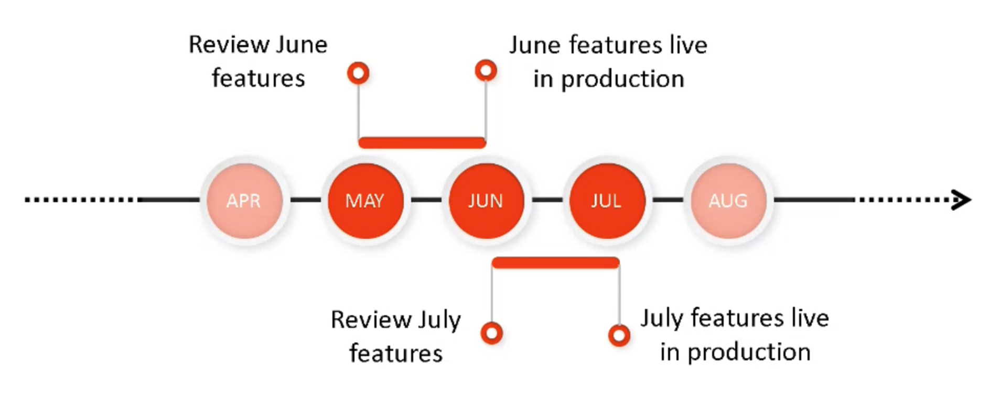

# Adobe Experience Manager as a Cloud Service Prerelease-kanaal {#prerelease-channel}

Leer hoe u het pre-releasekanaal gebruikt om een voorvertoning van aanstaande functies naar AEM as a Cloud Service te bekijken.

## Inleiding {#introduction}

Adobe Experience Manager as a Cloud Service levert nieuwe eigenschappen op een regelmatige kast, volgens de [ versie van de Experience Manager roadmap ](https://experienceleague.adobe.com/docs/experience-manager-release-information/aem-release-updates/update-releases-roadmap.html#aem-as-cloud-service).

Als u vertrouwd wilt raken met de functies die gepland zijn om live te gaan met de volgende functieversie, kunt u zich abonneren op het pre-releasekanaal. Dit kanaal is toegankelijk door uw ontwikkelomgevingen of elke sandboxomgeving te configureren. U kunt een voorvertoning weergeven van wijzigingen die toegankelijk zijn via de AEM-gebruikersinterface en code maken op basis van nieuwe prerelease-API&#39;s.

De lijst van prereleaseeigenschappen voor een bepaalde eigenschapversie wordt gepost binnen de [ versienota&#39;s ](/help/release-notes/release-notes-cloud/release-notes-current.md).

## AEM as a Cloud Service-releases {#releases}

AEM as a Cloud Service heeft twee typen releases.

* **de Versies van de Eigenschap** voegen mogelijkheden en eigenschappen aan AEM as a Cloud Service toe, bij activering
* **de Versies van het Onderhoud** voegen veiligheidsupdates, prestatiesverhogingen, en insectenmoeilijke situaties toe, en worden toegepast op een regelmatige en frequente basis.

Dit patroon verzekert ononderbroken versies zonder onderbreking van de dienst.

Met het prereleasekanaal kunt u functies voorvertonen die zijn gepland voor de aanstaande functieversie, zodat u de komende functionaliteit kunt evalueren en de mogelijke implementatie voor uw eigen projecten kunt plannen. Hiermee kunt u vooruit plannen voor de volgende release met functies.

Als het bijvoorbeeld mei is en u bent geabonneerd op het pre-releasekanaal, kunt u functies evalueren in de aanstaande release van juni.



Prerelease geeft u een het rollen venster van één maand in aanstaande eigenschappen AEMaaCS, die u tijd geven om het effect van om het even welke nieuwe eigenschappen aan uw projecten en aanpassingen te beoordelen en de introductie van plannen dergelijke eigenschappen, het testen, en gebruikersopleiding te plannen.

Voor het effectief benutten van de voordelen van het prereleasekanaal zijn vier stappen vereist.

1. [Kalenders markeren](#mark-calendars)
1. [Opmerkingen bij de release bekijken](#release-notes)
1. [Toegang tot de nieuwe functies en probeer deze](#new-features)
1. [Uw gebruikers trainen](#train-users)

## Uw kalenders markeren {#mark-calendars}

De versies van de eigenschap zijn gepland goed van tevoren en de data van de activering van de eigenschapversie worden gepubliceerd op [ Adobe Experience League ](https://experienceleague.adobe.com/docs/experience-manager-release-information/aem-release-updates/update-releases-roadmap.html#aem-as-cloud-service).

Neem nota van de versiedata zodat kunt u tijd plannen om de aanstaande eigenschappen te herzien en te testen.

## De opmerkingen bij de release bekijken {#release-notes}

Zodra u de versiedata hebt duidelijk in uw kalender, ben zeker om de [ Adobe Experience League ](/help/release-notes/release-notes-cloud/release-notes-current.md) website op de dag van de versie voor de recentste versienota&#39;s te controleren.

Elke versie gaat vergezeld van releaseopmerkingen die niet alleen nieuw zijn in die versie, maar ook de functies die beschikbaar zijn voor pre-releaseevaluatie. Lees uw kennis op voorhand en gebruik de nieuwste functies van AEMaaCS!

U kunt ook [ de bekende kwesties ](/help/release-notes/maintenance/latest.md) controleren die samen met elke versie worden gepubliceerd zodat kunt u zich van om het even welke technische kwesties bewust zijn die een uitdaging aan uw evaluatie of uiteindelijke goedkeuring van om het even welke nieuwe eigenschappen kunnen voorstellen.

## Laat het Kanaal van de Prerelease toe om tot Nieuwe Eigenschappen toegang te hebben en uit te proberen {#new-features}

Het pre-releasekanaal kan op om het even welke ontwikkeling of zandbakmilieu worden toegelaten. Prerelease kan niet worden ingeschakeld in staging- of productieomgevingen.

De pre-releasefuncties kunnen op verschillende manieren worden ervaren:

* [Cloud-omgevingen](#cloud-environments)
* [Lokale SDK](#local-sdk)

### Cloud-omgevingen {#cloud-environments}

Als u een wolkenomgeving wilt bijwerken om de pre-releaseversie te gebruiken, moet u een nieuwe omgevingsvariabele toevoegen. U kunt dit doen of gebruikend de UI van Cloud Manager of via CLI.

#### Omgevingsvariabele toevoegen met behulp van de gebruikersinterface {#add-with-ui}

1. Logboek in Cloud Manager bij [ my.cloudmanager.adobe.com ](https://my.cloudmanager.adobe.com/) en selecteer de aangewezen organisatie.

1. Navigeer naar het programma waar u prerelease wilt inschakelen.

1. Selecteer het milieu waar u prerelease wilt toelaten en tot zijn configuratie via **Programma** toegang hebben > **Milieu** > **Configuratie van het Milieu**.

1. Voeg een nieuwe [ milieuvariabele ](../implementing/cloud-manager/environment-variables.md) toe

   | Naam | Waarde | Toegepaste service | Type |
   |------|-------|-----------------|------|
   | `AEM_RELEASE_CHANNEL` | `prerelease` | Alles | Variabele |

1. Sla de wijzigingen op en vernieuw de omgeving met ingeschakelde prerelease-functieschakelingen.

   

#### Omgevingsvariabele toevoegen met CLI {#add-with-cli}

U kunt de Cloud Manager API en CLI ook gebruiken om de omgevingsvariabelen bij te werken.

* Gebruikend [ Cloud Manager API het milieu variabelen eindpunt ](https://developer.adobe.com/experience-cloud/cloud-manager/reference/api/#operation/patchEnvironmentVariables), plaats de `AEM_RELEASE_CHANNEL` milieuvariabele aan de waarde `prerelease`.

  ```text
  PATCH /program/{programId}/environment/{environmentId}/variables
  [
          {
                  "name" : "AEM_RELEASE_CHANNEL",
                  "value" : "prerelease",
                  "type" : "string"
          }
  ]
  ```

* [ CLI van Cloud Manager ](https://github.com/adobe/aio-cli-plugin-cloudmanager#aio-cloudmanagerset-environment-variables-environmentid) kan ook worden gebruikt

  ```shell
  aio cloudmanager:environment:set-variables <ENVIRONMENT_ID> --programId=<PROGRAM_ID> --variable AEM_RELEASE_CHANNEL "prerelease
  ```

De variabele kan worden verwijderd of op een andere waarde worden ingesteld als u wilt dat de omgeving wordt hersteld naar het gedrag van het gewone (niet-pre-releasekanaal) kanaal.

### Lokale SDK {#local-sdk}

U kunt nieuwe eigenschappen in de console van Plaatsen in lokale Quickstart SDK en code tegen nieuwe APIs in pre-release zien door uw Maven project te vormen om naar prerelease `API Jar` te verwijzen dat in Centrale Maven wordt gevestigd. U kunt deze prereleasefuncties ook in uw lokale ontwikkelomgeving zien door de gewone QuickStart SDK in pre-releasemodus te starten.

#### Quickstart SDK starten in pre-releasemodus {#prerelease-mode}

1. Download SDK van het portaal van de softwaredistributie en installeer zoals die in [ wordt beschreven Toegang tot AEM as a Cloud Service SDK ](/help/implementing/developing/introduction/aem-as-a-cloud-service-sdk.md).
1. Neem het argument `-r prerelease` op wanneer u de SDK Quickstart start start.

De waarde blijft behouden, zodat deze alleen bij het eerste opstarten kan worden geselecteerd. Installeer de SDK opnieuw om de opdrachtregeloptie te wijzigen.

Aangezien er tussen de maandelijkse versies van functies meerdere AEM kunnen zijn, kunt u deze nieuwe SDK&#39;s downloaden en verwijzen naar de nieuwe Jar-versies van SDK API in bepaalde projecten. De onderhoudsversies zullen geen extra prereleasefuncties toevoegen, maar zouden andere kleinere veranderingen zoals insectenmoeilijke situaties, veiligheidsmoeilijke situaties, en prestatiesverhogingen kunnen omvatten.
JavaDocs wordt gepubliceerd aan Centrale Maven.

#### Build Against the Prerelease SDK {#build-sdk}

1. Wijzig de inhoud `pom.xml` van het gemaakte project om te verwijzen naar een specifieke prerelease SDK API-jar, die wordt gepubliceerd naar Maven Central. Deze bevat een nieuwe Java API voor de prereleasefuncties en is afhankelijk van de SDK API-jar. Dezelfde versie wordt gebruikt.

   Hier ziet u bijvoorbeeld een fragment uit de sectie voor het beheer van afhankelijkheden van de bovenliggende pom dat verwijst naar de gewone API-jar:

   ```
   <dependencyManagement>
    <dependencies>
        <dependency>
            <groupId>com.adobe.aem</groupId>
            <artifactId>aem-sdk-api</artifactId>
            <version>${aem.sdk.api}</version>
            <scope>provided</scope>
        </dependency>
   ```

   En dan het gebruik in een module:

   ```
    <dependencies>
     <dependency>
         <groupId>com.adobe.aem</groupId>
         <artifactId>aem-sdk-api</artifactId>
     </dependency>
   ```

   Als u wilt overschakelen op de pre-releaseversie van SDK, wijzigt u gewoon de afhankelijkheid van `com.adobe.aem:aem-sdk-api` in `com.adobe.aem:aem-prerelease-sdk-api` , zoals hieronder wordt aangegeven:

   ```
   <dependencyManagement>
    <dependencies>
      <dependency>
            <groupId>com.adobe.aem</groupId>
            <artifactId>aem-prerelease-sdk-api</artifactId>
            <version>${aem.sdk.api}</version>
            <scope>provided</scope>
      </dependency>
   <dependencies>
      <dependency>
         <groupId>com.adobe.aem</groupId>
         <artifactId>aem-prerelease-sdk-api</artifactId>
      </dependency>
   ```

   Zoals gebruikelijk, kunnen de individuele projecten de afhankelijkheid gebruiken.

1. Distribueren naar uw lokale server.

1. Als tevreden dat het zoals plaatselijk verwacht werkt, wijs code aan een ontwikkelingstak toe en gebruik een Cloud Manager niet-productiepijplijn om aan een milieu op te stellen dat aan het prereleasekanaal intekent.

>[!CAUTION]
> 
> De `aem-prerelease-sdk-api` artifactId mag nooit worden gebruikt bij de implementatie naar het werkgebied of de productie. Gebruikt altijd `aem-sdk-api` wanneer het opstellen via de productiepijplijn. Ook de code die verwijzingen prerelease APIs niet via de productiepijplijn zou moeten worden opgesteld.

De [ AEM CS SDK bouwt Analysator in v1.0 en hoger wordt gemaakt ](https://experienceleague.adobe.com/docs/experience-manager-core-components/using/developing/archetype/build-analyzer-maven-plugin.html#developing) zal ontdekken als prerelease API in een project door de gebiedsdelen te inspecteren wordt gebruikt. Als de analysator het vindt, zal het pre-versie SDK API gebruiken om het project te analyseren.

## Uw gebruikers trainen {#train-users}

Nadat u de nieuwe functies in het prereleasekanaal hebt getest en u hebt besloten deze in uw projecten te gebruiken, moet u de gebruikers trainen.

Adobe Experience League biedt veel bronnen om AEMaaCS te leren.

* [ de documentatie AEMaaCS ](https://experienceleague.adobe.com/docs/experience-manager-cloud-service.html)
* [ Tutorials ](https://experienceleague.adobe.com/docs/experience-manager-learn/aem-tutorials/overview.html)
* [ de maandversie overzichtsvideo ](/help/release-notes/release-notes-cloud/release-notes-current.md#release-video) in de versienota&#39;s

## Overwegingen {#considerations}

Er zijn een paar punten om van nota te nemen wanneer het gebruiken van het prereleasekanaal.

* Het pre-releasekanaal bevat niet noodzakelijkerwijs alle nieuwe functies die in de volgende versie moeten worden geïmplementeerd.
* Functies in de prerelease worden onderworpen aan strenge kwaliteitsborging en zijn bedoeld om volledig te zijn in plaats van bètakwaliteit. Als u om het even welke kwesties opmerkt, rapporteer hen, enkel zoals u zou doen als u insecten in eigenschappen in een regelmatige AEM versie verdacht.
* Om te bepalen als een milieu voor het prereleasekanaal wordt gevormd, ga **ongeveer** pagina van de AEM console en controleer als het AEM versieaantal a ** achtervoegsel zoals ```Adobe Experience Manager 2021.4.5226.20210427T070726Z-210429-PRERELEASE``` omvat.


