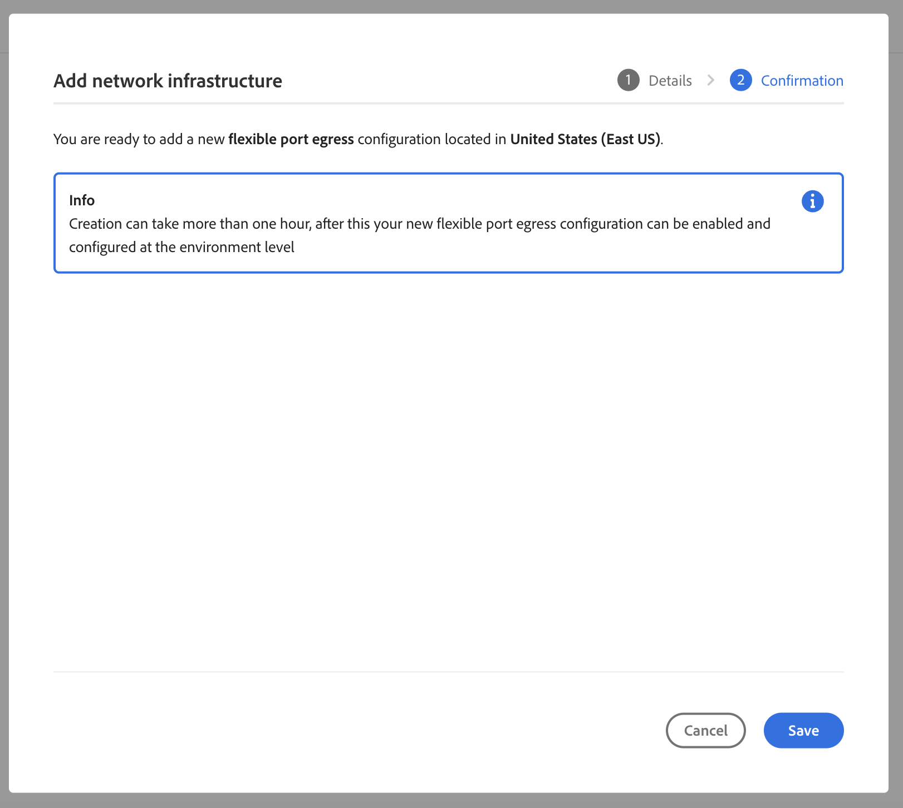
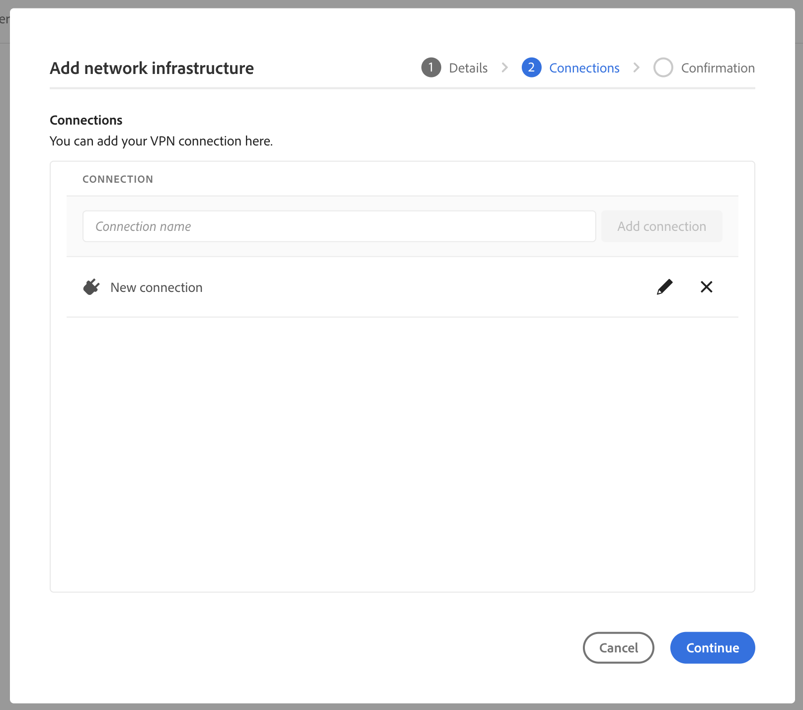
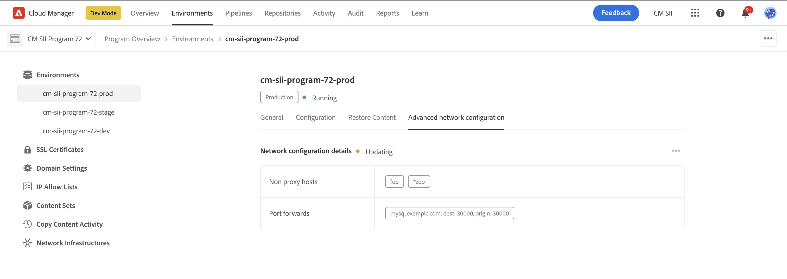

# Geavanceerde netwerken configureren voor AEM as a Cloud Service {#configuring-advanced-networking}

Dit artikel introduceert de verschillende geavanceerde voorzien van een netwerkeigenschappen in AEM as a Cloud Service, met inbegrip van zelfbediening en API levering van VPN, niet-standaardhavens, en specifieke uitgangIP adressen.

>[!TIP]
>
>Naast deze documentatie, is er ook een reeks leerprogramma&#39;s die worden ontworpen om u door elk van de geavanceerde voorzien van een netwerkopties bij deze [ plaats te lopen.](https://experienceleague.adobe.com/en/docs/experience-manager-learn/cloud-service/networking/advanced-networking)

## Overzicht {#overview}

AEM as a Cloud Service biedt de volgende geavanceerde netwerkopties:

* [ Flexibele havenuitgang ](#flexible-port-egress) - Vorm AEM as a Cloud Service om uitgaand verkeer uit niet-standaardhavens toe te staan.
* [ Dedicated egress IP adres ](#dedicated-egress-ip-address) - vorm verkeer uit AEM as a Cloud Service om uit unieke IP voort te komen.
* [ Virtueel Privé Netwerk (VPN) ](#vpn) - Beveilig verkeer tussen uw infrastructuur en AEM as a Cloud Service, als u VPN hebt.

In dit artikel worden deze opties gedetailleerd beschreven en wordt uitgelegd waarom u ze kunt gebruiken, voordat u beschrijft hoe ze zijn geconfigureerd met de Cloud Manager-gebruikersinterface en door de API te gebruiken. Het artikel sluit af met enkele gevallen van geavanceerd gebruik.

>[!CAUTION]
>
>Als u reeds provisioned met erfenis specifieke toegangstechnologie bent en één van deze geavanceerde voorzien van een netwerkopties wilt vormen, {de Zorg van de Cliënt van de Adobe van 0} contact ](https://experienceleague.adobe.com/?support-solution=Experience+Manager#home).[
>
>Het proberen om geavanceerd voorzien van een netwerk met erfenisegress technologie te vormen kan plaatsconnectiviteit beïnvloeden.

### Eisen en beperkingen {#requirements}

Bij het configureren van geavanceerde netwerkfuncties gelden de volgende beperkingen.

* Een programma kan één enkele geavanceerde voorzien van een netwerkoptie (flexibele havenuitgang, specifiek uitgang IP adres, of VPN) verstrekken.
* Het geavanceerde voorzien van een netwerk is niet beschikbaar voor [ zandbakprogramma&#39;s.](/help/implementing/cloud-manager/getting-access-to-aem-in-cloud/program-types.md)
* Een gebruiker binnen moet de **rol van de Beheerder** hebben om netwerkinfrastructuur in uw programma toe te voegen en te vormen.
* De productieomgeving moet worden gemaakt voordat netwerkinfrastructuur in uw programma kan worden toegevoegd.
* Uw netwerkinfrastructuur moet zich in het zelfde gebied bevinden zoals het primaire gebied van uw productiemilieu.
   * In het geval waar uw productiemilieu [ extra heeft publiceer gebieden ](/help/implementing/cloud-manager/manage-environments.md#multiple-regions), kunt u een andere netwerkinfrastructuur creëren die elk extra gebied weerspiegelt.
   * U mag geen netwerkinfrastructuur maken die groter is dan het maximumaantal regio&#39;s dat in uw productieomgeving is geconfigureerd.
   * U kunt zo vele netwerkinfrastructuur als beschikbare gebieden in uw productiemilieu bepalen, maar de nieuwe infrastructuur moet het zelfde type zijn zoals de eerder gecreeerde infrastructuur.
   * Wanneer u meerdere infrastructuren maakt, kunt u alleen die gebieden selecteren waar geen geavanceerde netwerkinfrastructuur is gemaakt.

### Geavanceerde netwerken configureren en inschakelen {#configuring-enabling}

Het gebruik van geavanceerde netwerkfuncties vereist twee stappen:

1. Configuratie van de geavanceerde voorzien van een netwerkoptie, of [ flexibele havenuitgang, ](#flexible-port-egress) [ specifiek adres van uitgangIP, ](#dedicated-egress-ip-address) of [ VPN, ](#vpn) eerst op het programmaniveau moet worden gedaan.
1. Om te worden gebruikt, moet de geavanceerde voorzien van een netwerkoptie [ dan worden toegelaten op het milieuniveau.](#enabling)

Beide stappen kunnen worden uitgevoerd met de gebruikersinterface van Cloud Manager of de Cloud Manager-API.

* Wanneer het gebruiken van Cloud Manager UI, betekent dit het creëren van geavanceerde netwerkconfiguraties gebruikend een tovenaar op het programmaniveau en dan het uitgeven van elk milieu waar u de configuratie wilt toelaten.

* Wanneer u de Cloud Manager API gebruikt, wordt het API-eindpunt van `/networkInfrastructures` aangeroepen op programmaniveau om het gewenste type geavanceerde netwerken te declareren. Het wordt gevolgd door een vraag aan het `/advancedNetworking` eindpunt voor elke milieu om de infrastructuur toe te laten en milieu-specifieke parameters te vormen.

## Flexibele poortuitgang {#flexible-port-egress}

Met deze geavanceerde netwerkfunctie kunt u AEM as a Cloud Service zo configureren dat het verkeer wordt geopend via andere poorten dan HTTP (poort 80) en HTTPS (poort 443), die standaard zijn geopend.

>[!TIP]
>
>Wanneer het beslissen tussen flexibele havenuitgang en specifiek uitgangIP adres, wordt het geadviseerd u flexibele havenuitgang kiest als een specifiek IP adres niet wordt vereist. De reden hiervoor is dat Adobe de prestaties van flexibel poortegress-verkeer kan optimaliseren.

>[!NOTE]
>
>Na het aanmaken kunnen de flexibele typen poortegress-infrastructuren niet worden bewerkt. De enige manier om configuratiewaarden te veranderen is hen te schrappen en te ontspannen.

### UI-configuratie {#configuring-flexible-port-egress-provision-ui}

1. Logboek in Cloud Manager bij [ my.cloudmanager.adobe.com ](https://my.cloudmanager.adobe.com/) en selecteer de aangewezen organisatie.

1. Op de **[Mijn console van Programma&#39;s](/help/implementing/cloud-manager/navigation.md#my-programs)**, selecteer het programma.

1. Van de **pagina van het Overzicht van het Programma**, navigeer aan het **milieu&#39;s** lusje en selecteer **Infrastructuur van het Netwerk** in het linkerpaneel.

   

1. In **voeg de tovenaar van de netwerkinfrastructuur** toe, selecteer **Flexibele havenuitgang** en het gebied waar het van het **Gebied** drop-down menu zou moeten worden gecreeerd en klik **verdergaan**.

   

1. Het **lusje van de Bevestiging** vat uw selectie en de volgende stappen samen. Klik **sparen** om de infrastructuur tot stand te brengen.

   

Een nieuw verslag verschijnt onder de **rubriek van de Infrastructuur van het Netwerk** in het zijpaneel met inbegrip van details van het type van infrastructuur, status, gebied, en milieu&#39;s waarop het is toegelaten.


>[!NOTE]
>
>Het creëren van de infrastructuur voor flexibele havenuitgang kan tot een uur duren waarna het op het milieuniveau kan worden gevormd.

### API-configuratie {#configuring-flexible-port-egress-provision-api}

Eenmaal per programma wordt het eindpunt van de POST `/program/<programId>/networkInfrastructures` aangeroepen, waarbij alleen de waarde `flexiblePortEgress` voor de parameter en het gebied `kind` wordt doorgegeven. Het eindpunt reageert met `network_id` en andere informatie, waaronder de status.

Eenmaal geroepen, duurt het typisch ongeveer 15 minuten voor de voorzien van een netwerkinfrastructuur. Een vraag aan het Cloud Manager [ eindpunt van de GET van de netwerkinfrastructuur ](https://developer.adobe.com/experience-cloud/cloud-manager/reference/api/#operation/getNetworkInfrastructure) zou een status van **klaar** tonen.

>[!TIP]
>
>De volledige reeks parameters, nauwkeurige syntaxis, en belangrijke informatie als welke parameters niet later kunnen worden veranderd, [ kan in de API documentatie worden van verwijzingen voorzien.](https://developer.adobe.com/experience-cloud/cloud-manager/reference/api/#operation/createNetworkInfrastructure)

### Verkeer dat {#flexible-port-egress-traffic-routing}

Voor HTTP of https verkeer die naar havens buiten 80 of 443 gaan zou een volmacht moeten worden gevormd gebruikend de volgende gastheer en havenmilieuvariabelen:

* voor HTTP: `AEM_PROXY_HOST` / `AEM_HTTP_PROXY_PORT ` (standaardwaarde voor `proxy.tunnel:3128` in AEM releases &lt; 6094)
* voor HTTPS: `AEM_PROXY_HOST` / `AEM_HTTPS_PROXY_PORT ` (standaardwaarde voor `proxy.tunnel:3128` in AEM releases &lt; 6094)

Hier ziet u bijvoorbeeld een voorbeeldcode voor het verzenden van een aanvraag naar `www.example.com:8443` :

```java
String url = "www.example.com:8443"
String proxyHost = System.getenv().getOrDefault("AEM_PROXY_HOST", "proxy.tunnel");
int proxyPort = Integer.parseInt(System.getenv().getOrDefault("AEM_HTTPS_PROXY_PORT", "3128"));
HttpClient client = HttpClient.newBuilder()
      .proxy(ProxySelector.of(new InetSocketAddress(proxyHost, proxyPort)))
      .build();
 
HttpRequest request = HttpRequest.newBuilder().uri(URI.create(url)).build();
HttpResponse<String> response = client.send(request, BodyHandlers.ofString());
```

Als u niet-standaard Java™-netwerkbibliotheken gebruikt, configureert u proxy&#39;s met de bovenstaande eigenschappen voor al het verkeer.

Niet-http/s-verkeer met doelen via poorten die zijn gedeclareerd in de parameter `portForwards` moet verwijzen naar een eigenschap met de naam `AEM_PROXY_HOST` , samen met de toegewezen poort. Bijvoorbeeld:

```java
DriverManager.getConnection("jdbc:mysql://" + System.getenv("AEM_PROXY_HOST") + ":53306/test");
```

De lijst hieronder beschrijft verkeer dat verplettert:

<table>
<thead>
  <tr>
    <th>Verkeer</th>
    <th>Doelvoorwaarde</th>
    <th>Poort</th>
    <th>Verbinding</th>
    <th>Voorbeeld van externe bestemming</th>
  </tr>
</thead>
<tbody>
  <tr>
    <td><b>HTTP- of https-protocol</b></td>
    <td>Standaard http/s-verkeer</td>
    <td>80 of 443</td>
    <td>Toegestaan</td>
    <td></td>
  </tr> 
  <tr>
    <td></td>
    <td>Niet-standaardverkeer (op andere havens buiten 80 of 443) door http volmacht die gebruikend de volgende omgevingsvariabele en het aantal van de volmachtshaven wordt gevormd. Declareer niet de bestemmingshaven in de Cloud Manager API vraag portForwards parameter:<br><ul>
     <li>AEM_PROXY_HOST (gebrek aan ` proxy.tunnel ` in AEM versies &lt; 6094)</li>
     <li>AEM_HTTPS_PROXY_PORT (standaard poort 3128 in AEM releases &lt; 6094)</li>
    </ul>
    <td>Poorten buiten 80 of 443</td>
    <td>Toegestaan</td>
    <td>example.com:8443</td>
  </tr>
  <tr>
    <td></td>
    <td>Niet-standaardverkeer (op andere havens buiten havens 80 of 443) die geen HTTP volmacht gebruiken</td>
    <td>Poorten buiten 80 of 443</td>
    <td>Geblokkeerd</td>
    <td></td>
  </tr>
  <tr>
    <td><b>Niet-http of niet-https</b></td>
    <td>Client maakt verbinding met de omgevingsvariabele <code>AEM_PROXY_HOST</code> met behulp van een <code>portOrig</code> die is gedeclareerd in de API-parameter <code>portForwards</code> .</td>
    <td>Alle</td>
    <td>Toegestaan</td>
    <td><code>mysql.example.com:3306</code></td>
  </tr>
  <tr>
    <td></td>
    <td>Alles</td>
    <td>Alle</td>
    <td>Geblokkeerd</td>
    <td><code>db.example.com:5555</code></td>
  </tr>
</tbody>
</table>

#### Configuratie Apache/Dispatcher {#apache-dispatcher}

De instructie `mod_proxy` van de laag AEM Cloud Service Apache/Dispatcher kan worden geconfigureerd met de hierboven beschreven eigenschappen.

```
ProxyRemote "http://example.com:8080" "http://${AEM_PROXY_HOST}:3128"
ProxyPass "/somepath" "http://example.com:8080"
ProxyPassReverse "/somepath" "http://example.com:8080"
```

```
SSLProxyEngine on //needed for https backends
 
ProxyRemote "https://example.com:8443" "http://${AEM_PROXY_HOST}:3128"
ProxyPass "/somepath" "https://example.com:8443"
ProxyPassReverse "/somepath" "https://example.com:8443"
```

## IP-adres van speciale egress {#dedicated-egress-ip-address}

Een specifiek IP adres kan veiligheid verbeteren wanneer het integreren met verkopers SaaS (als een verkoper van CRM) of andere integratie buiten AEM as a Cloud Service die een lijst van gewenste personen van IP adressen aanbieden. Door het specifieke IP adres aan de lijst van gewenste personen toe te voegen, zorgt het ervoor dat slechts het verkeer van AEM Cloud Service wordt toegelaten om in de externe dienst te stromen. Dit is naast verkeer van om het even welke andere toegestane IPs.

Het zelfde specifieke IP wordt toegepast op alle programma&#39;s in uw organisatie van de Adobe en voor alle milieu&#39;s in elk van uw programma&#39;s. Het is van toepassing op zowel auteur- als Publish-services.

Zonder de specifieke IP toegelaten adreseigenschap, verkeer dat uit AEM as a Cloud Service komt door een reeks IPs stroomt die met andere klanten van AEM as a Cloud Service wordt gedeeld.

Het vormen van specifiek uitgang IP adres is gelijkaardig aan [ flexibele havenuitgang.](#flexible-port-egress) Het belangrijkste verschil is dat na configuratie, het verkeer altijd van specifieke, unieke IP zal weggaan. Om dat IP te vinden, gebruik DNS resolver om het IP adres te identificeren verbonden aan `p{PROGRAM_ID}.external.adobeaemcloud.com`. Het IP adres wordt verwacht niet te veranderen, maar als het moet veranderen, wordt het geavanceerde bericht verstrekt.

>[!TIP]
>
>Wanneer het beslissen tussen flexibele havenuitgang en specifiek uitgangIP adres, kies flexibele havenuitgang als een specifiek IP adres niet wordt vereist. De reden hiervoor is dat Adobe de prestaties van flexibel poortegress-verkeer kan optimaliseren.

>[!NOTE]
>
>Als u provisioned met een specifieke uitgang IP vóór 2021.09.30 (namelijk vóór de versie van September 2021) was, steunt uw specifieke uitgangIP eigenschap slechts havens HTTP en HTTPS.
>
>Dit omvat HTTP/1.1 en HTTP/2 wanneer gecodeerd. Ook, kan één specifiek uitgang eindpunt met om het even welk doel slechts over HTTP/HTTPS op havens 80/443 spreken respectievelijk.

>[!NOTE]
>
>Zodra gecreeerd, kunnen de specifieke IP van de uitgang de types van adresinfrastructuur niet worden uitgegeven. De enige manier om configuratiewaarden te veranderen is hen te schrappen en te ontspannen.

>[!INFO]
>
>Als een specifieke egress IP wordt gevormd, zal het door:sturen van de Splunk de dynamische egress waaiers blijven gebruiken. Splunk door:sturen kan niet worden gevormd om een specifieke uitgang IP te gebruiken.

### UI-configuratie {#configuring-dedicated-egress-provision-ui}

1. Logboek in Cloud Manager bij [ my.cloudmanager.adobe.com ](https://my.cloudmanager.adobe.com/) en selecteer de aangewezen organisatie.

1. Op de **[Mijn console van Programma&#39;s](/help/implementing/cloud-manager/navigation.md#my-programs)**, selecteer het programma.

1. Van de **pagina van het Overzicht van het Programma**, navigeer aan het **milieu&#39;s** lusje en selecteer **Infrastructuur van het Netwerk** in het linkerpaneel.

   

1. In **voeg de tovenaar van de netwerkinfrastructuur** toe die begint, **het Dedicated IP adres van de uitgang** en het gebied waar het van het **gebied** drop-down menu zou moeten worden gecreeerd en **klikt gaat** verder.

   

1. Het **lusje van de Bevestiging** vat uw selectie en de volgende stappen samen. Klik **sparen** om de infrastructuur tot stand te brengen.

   

Een nieuw verslag verschijnt onder de **rubriek van de Infrastructuur van het Netwerk** in het zijpaneel met inbegrip van details van het type van infrastructuur, status, gebied, en milieu&#39;s waarop het is toegelaten.


>[!NOTE]
>
>Het creëren van de infrastructuur voor flexibele havenuitgang kan tot een uur duren waarna het op het milieuniveau kan worden gevormd.

### API-configuratie {#configuring-dedicated-egress-provision-api}

Eenmaal per programma wordt het eindpunt van de POST `/program/<programId>/networkInfrastructures` aangeroepen, waarbij alleen de waarde `dedicatedEgressIp` voor de parameter en het gebied `kind` wordt doorgegeven. Het eindpunt reageert met `network_id` en andere informatie, waaronder de status.

Eenmaal geroepen, duurt het typisch ongeveer 15 minuten voor de voorzien van een netwerkinfrastructuur. Een vraag aan het Cloud Manager [ eindpunt van de GET van de netwerkinfrastructuur ](https://developer.adobe.com/experience-cloud/cloud-manager/reference/api/#operation/getNetworkInfrastructure) zou een status van **klaar** tonen.

>[!TIP]
>
>De volledige reeks parameters, nauwkeurige syntaxis, en belangrijke informatie als welke parameters niet later kunnen worden veranderd, [ kan in de API documentatie worden van verwijzingen voorzien.](https://developer.adobe.com/experience-cloud/cloud-manager/reference/api/#operation/createNetworkInfrastructure)

### Verkeer dat {#dedicated-egress-ip-traffic-routing}

HTTP- of https-verkeer wordt door een vooraf geconfigureerde proxy geleid, op voorwaarde dat deze standaard Java™-systeemeigenschappen voor proxyconfiguraties gebruiken.

Niet-http/s-verkeer met doelen via poorten die zijn gedeclareerd in de parameter `portForwards` moet verwijzen naar een eigenschap met de naam `AEM_PROXY_HOST` , samen met de toegewezen poort. Bijvoorbeeld:

```java
DriverManager.getConnection("jdbc:mysql://" + System.getenv("AEM_PROXY_HOST") + ":53306/test");
```

<table>
<thead>
  <tr>
    <th>Verkeer</th>
    <th>Doelvoorwaarde</th>
    <th>Poort</th>
    <th>Verbinding</th>
    <th>Voorbeeld van externe bestemming</th>
  </tr>
</thead>
<tbody>
  <tr>
    <td><b>HTTP- of https-protocol</b></td>
    <td>Verkeer naar Azure- of Adobe-services</td>
    <td>Alle</td>
    <td>Via de gedeelde clusterIPs (niet specifieke IP)</td>
    <td>adobe.io<br>api.windows.net</td>
  </tr>
  <tr>
    <td></td>
    <td>Host die overeenkomt met de parameter <code>nonProxyHosts</code></td>
    <td>80 of 443</td>
    <td>Via de gedeelde cluster-IP's</td>
    <td></td>
  </tr>
  <tr>
    <td></td>
    <td>Host die overeenkomt met de parameter <code>nonProxyHosts</code></td>
    <td>Poorten buiten 80 of 443</td>
    <td>Geblokkeerd</td>
    <td></td>
  </tr>
  <tr>
    <td></td>
    <td>Door de volmachtsconfiguratie van HTTP, die door gebrek voor verkeer http/s gebruikend standaardJava™ HTTP- cliëntbibliotheek wordt gevormd</td>
    <td>Alle</td>
    <td>Door specifieke uitgang IP</td>
    <td></td>
  </tr>
  <tr>
    <td></td>
    <td>Hiermee negeert u http-proxyconfiguratie (bijvoorbeeld wanneer deze expliciet wordt verwijderd uit de standaard Java™ HTTP client-bibliotheek of wanneer een Java™-bibliotheek wordt gebruikt die de standaardproxyconfiguratie negeert)</td>
    <td>80 of 443</td>
    <td>Via de gedeelde cluster-IP's</td>
    <td></td>
  </tr>
  <tr>
    <td></td>
    <td>Hiermee negeert u http-proxyconfiguratie (bijvoorbeeld wanneer deze expliciet wordt verwijderd uit de standaard Java™ HTTP client-bibliotheek of wanneer een Java™-bibliotheek wordt gebruikt die de standaardproxyconfiguratie negeert)</td>
    <td>Poorten buiten 80 of 443</td>
    <td>Geblokkeerd</td>
    <td></td>
  </tr>
  <tr>
    <td><b>Niet-http of niet-https</b></td>
    <td>De client maakt verbinding met de variabele <code>AEM_PROXY_HOST</code> env met behulp van een <code>portOrig</code> die is gedeclareerd in de API-parameter <code>portForwards</code></td>
    <td>Alle</td>
    <td>Door specifieke uitgang IP</td>
    <td><code>mysql.example.com:3306</code></td>
  </tr>
  <tr>
    <td></td>
    <td>Alles</td>
    <td></td>
    <td>Geblokkeerd</td>
    <td></td>
  </tr>
</tbody>
</table>

### Functiegebruik {#feature-usage}

De functie is compatibel met Java™-code of bibliotheken die resulteren in uitgaand verkeer, op voorwaarde dat deze standaard Java™-systeemeigenschappen gebruiken voor proxyconfiguraties. In de praktijk moet dit ook de meest gangbare bibliotheken omvatten.

Hieronder ziet u een codevoorbeeld:

```java
public JSONObject getJsonObject(String relativePath, String queryString) throws IOException, JSONException {
  String relativeUri = queryString.isEmpty() ? relativePath : (relativePath + '?' + queryString);
  URL finalUrl = endpointUri.resolve(relativeUri).toURL();
  URLConnection connection = finalUrl.openConnection();
  connection.addRequestProperty("Accept", "application/json");
  connection.addRequestProperty("X-API-KEY", apiKey);

  try (InputStream responseStream = connection.getInputStream(); Reader responseReader = new BufferedReader(new InputStreamReader(responseStream, Charsets.UTF_8))) {
    return new JSONObject(new JSONTokener(responseReader));
  }
}
```

Sommige bibliotheken vereisen expliciete configuratie om standaard Java™ systeemeigenschappen voor volmachtsconfiguraties te gebruiken.

Een voorbeeld dat Apache HttpClient gebruikt die expliciete vraag aan vereist
[`HttpClientBuilder.useSystemProperties()` ](https://hc.apache.org/httpcomponents-client-4.5.x/current/httpclient/apidocs/org/apache/http/impl/client/HttpClientBuilder.html) of gebruik
[`HttpClients.createSystem()` ](https://hc.apache.org/httpcomponents-client-4.5.x/current/httpclient/apidocs/org/apache/http/impl/client/HttpClients.html#createSystem()) :

```java
public JSONObject getJsonObject(String relativePath, String queryString) throws IOException, JSONException {
  String relativeUri = queryString.isEmpty() ? relativePath : (relativePath + '?' + queryString);
  URL finalUrl = endpointUri.resolve(relativeUri).toURL();

  HttpClient httpClient = HttpClientBuilder.create().useSystemProperties().build();
  HttpGet request = new HttpGet(finalUrl.toURI());
  request.setHeader("Accept", "application/json");
  request.setHeader("X-API-KEY", apiKey);
  HttpResponse response = httpClient.execute(request);
  String result = EntityUtils.toString(response.getEntity());
}
```

### Foutopsporingsoverwegingen {#debugging-considerations}

Om te bevestigen dat het verkeer inderdaad op het verwachte specifieke IP adres, controlelogboeken binnen de bestemmingsdienst, als beschikbaar gaat. Anders, kan het nuttig zijn om uit te roepen aan de het zuiveren dienst zoals [ https://ifconfig.me/ip ](https://ifconfig.me/ip), die het roepende IP adres terugkeert.

## Virtual Private Network (VPN) {#vpn}

VPN staat het verbinden met een infrastructuur op-gebouw of gegevenscentrum van de auteur toe, publiceert, of voorproefinstanties. Dit kan bijvoorbeeld handig zijn om de toegang tot een database te beveiligen. Het staat ook het verbinden met verkopers SaaS zoals een verkoper van CRM toe die VPN steunt of het verbinden van een collectief netwerk met de auteur van AEM as a Cloud Service, voorproef, of publiceer instantie.

De meeste apparaten van VPN met technologie IPSec worden gesteund. Raadpleeg de informatie in de **RouteBased configuratieinstructies** kolom in [ deze lijst van apparaten.](https://learn.microsoft.com/en-us/azure/vpn-gateway/vpn-gateway-about-vpn-devices#devicetable) Configureer het apparaat zoals beschreven in de tabel.

>[!NOTE]
>
>Hieronder volgt een beperking van een VPN-infrastructuur:
>
>* De steun wordt beperkt tot één enkele verbinding van VPN
>* Het Splunk door:sturen vermogen is niet mogelijk over een verbinding van VPN.
>* DNS Resolvers moeten in de ruimte van het Adres van de Gateway worden vermeld om privé gastheernamen op te lossen.

### UI-configuratie {#configuring-vpn-ui}

1. Logboek in Cloud Manager bij [ my.cloudmanager.adobe.com ](https://my.cloudmanager.adobe.com/) en selecteer de aangewezen organisatie.

1. Op de **[Mijn console van Programma&#39;s](/help/implementing/cloud-manager/navigation.md#my-programs)**, selecteer het programma.

1. Van de **pagina van het Overzicht van het Programma**, navigeer aan het **milieu&#39;s** lusje en selecteer **Infrastructuur van het Netwerk** in het linkerpaneel.

   

1. In **voeg netwerkinfrastructuur** tovenaar toe die begint, **Virtuele privé netwerk** selecteert en de noodzakelijke informatie verstrekt alvorens **te klikken gaat** verder.

   * **Gebied** - dit is het gebied waarin de infrastructuur zou moeten worden gecreeerd.
   * **Ruimte van het Adres** - de adresruimte kan slechts één /26 CIDR (64 IP adressen) of grotere IP waaier in uw eigen ruimte zijn.
      * Deze waarde kan later niet worden gewijzigd.
   * **DNS Informatie** - dit is een lijst van verre DNS resolvers.
      * Druk op `Enter` na het invoeren van een DNS-serveradres om een ander adres toe te voegen.
      * Klik op `X` na een adres om het te verwijderen.
   * **Gedeelde Sleutel** - dit is uw VPN preshared sleutel.
      * Selecteer **tonen gedeelde sleutel** om de sleutel te openbaren zodat kunt u zijn waarde tweemaal controleren.

   

1. Op het **lusje van Verbindingen** van de tovenaar, verstrek de naam van de a **Verbinding** om uw verbinding van VPN te identificeren en **te klikken voegt Verbinding** toe.

    toe

1. In **voeg verbinding** dialoog toe, bepaal uw verbinding van VPN, dan klik **sparen**.

   * **naam van de Verbinding** - dit is een beschrijvende naam van uw verbinding van VPN, die u in de vorige stap verstrekte en kan hier worden bijgewerkt.
   * **Adres** - dit is het apparaatIP van VPN adres.
   * **ruimte van het Adres** - dit zijn de IP adreswaaiers aan route door VPN.
      * Druk op `Enter` na het invoeren van een bereik om een ander bereik toe te voegen.
      * Klik op `X` na een bereik om het te verwijderen.
   * **IP het Beleid van de Veiligheid** - pas van de standaardwaarden zoals vereist aan

   

1. De dialoog sluit en u keert aan het **lusje van Verbindingen** van de tovenaar terug. Klik **verdergaan**.

   

1. Het **lusje van de Bevestiging** vat uw selectie en de volgende stappen samen. Klik **sparen** om de infrastructuur tot stand te brengen.

   

Een nieuw verslag verschijnt onder de **rubriek van de Infrastructuur van het Netwerk** in het zijpaneel met inbegrip van details van het type van infrastructuur, status, gebied, en milieu&#39;s waarop het is toegelaten.

### API-configuratie {#configuring-vpn-api}

Eenmaal per programma wordt het eindpunt POST `/program/<programId>/networkInfrastructures` aangeroepen. Het gaat in een lading van configuratieinformatie over. Die informatie omvat de waarde van **vpn** voor de `kind` parameter, het gebied, de adresruimte (lijst van CIDRs - merk op dat dit niet later kan worden gewijzigd), DNS oplossers (voor het oplossen van namen in uw netwerk). Het omvat ook de verbindingsinformatie van VPN zoals gatewayconfiguratie, gedeelde sleutel van VPN, en het IP veiligheidsbeleid. Het eindpunt reageert met `network_id` en andere informatie, waaronder de status.

Zodra geroepen, duurt het typisch van 45 door 60 minuten voor de voorzien van een netwerkinfrastructuur om worden provisioned. De methode GET in de API kan worden aangeroepen om de status te retourneren, die uiteindelijk wordt gespiegeld van `creating` naar `ready` . Raadpleeg de API-documentatie voor alle staten.

>[!TIP]
>
>De volledige reeks parameters, nauwkeurige syntaxis, en belangrijke informatie als welke parameters niet later kunnen worden veranderd, [ kan in de API documentatie worden van verwijzingen voorzien.](https://developer.adobe.com/experience-cloud/cloud-manager/reference/api/#operation/createNetworkInfrastructure)

### Verkeer dat {#vpn-traffic-routing}

De lijst beschrijft hieronder verkeer dat verplettert.

<table>
<thead>
  <tr>
    <th>Verkeer</th>
    <th>Doelvoorwaarde</th>
    <th>Poort</th>
    <th>Verbinding</th>
    <th>Voorbeeld van externe bestemming</th>
  </tr>
</thead>
<tbody>
  <tr>
    <td><b>HTTP- of https-protocol</b></td>
    <td>Verkeer naar Azure- of Adobe-services</td>
    <td>Alle</td>
    <td>Via de gedeelde clusterIPs (niet specifieke IP)</td>
    <td>adobe.io<br>api.windows.net</td>
  </tr>
  <tr>
    <td></td>
    <td>Host die overeenkomt met de parameter <code>nonProxyHosts</code></td>
    <td>80 of 443</td>
    <td>Via de gedeelde cluster-IP's</td>
    <td></td>
  </tr>
  <tr>
    <td></td>
    <td>Host die overeenkomt met de parameter <code>nonProxyHosts</code></td>
    <td>Poorten buiten 80 of 443</td>
    <td>Geblokkeerd</td>
    <td></td>
  </tr>
  <tr>
    <td></td>
    <td>Als IP in het <i> de gatewayadres van VPN </i> ruimtewaaier, en door de volmachtsconfiguratie van http valt (die door gebrek voor verkeer van http/s gebruikend standaardJava™ HTTP- cliëntbibliotheek wordt gevormd)</td>
    <td>Alle</td>
    <td>Door VPN</td>
    <td><code>10.0.0.1:443</code><br>Het kan ook een hostname zijn.</td>
  </tr>
  <tr>
    <td></td>
    <td>Als IP niet in de <i> waaier van het gatewayadres van VPN </i> valt, en door de volmachtsconfiguratie van http (die door gebrek voor verkeer http/s gebruikend standaard Java™ HTTP- cliëntbibliotheek wordt gevormd)</td>
    <td>Alle</td>
    <td>Door specifieke uitgang IP</td>
    <td></td>
  </tr>
  <tr>
    <td></td>
    <td>Hiermee negeert u http-proxyconfiguratie (bijvoorbeeld als deze expliciet wordt verwijderd uit de standaard Java™ HTTP client-bibliotheek of als Java™-bibliotheek wordt gebruikt waarin de standaardproxyconfiguratie wordt genegeerd)
</td>
    <td>80 of 443</td>
    <td>Via de gedeelde cluster-IP's</td>
    <td></td>
  </tr>
  <tr>
    <td></td>
    <td>Hiermee negeert u http-proxyconfiguratie (bijvoorbeeld als deze expliciet wordt verwijderd uit de standaard Java™ HTTP client-bibliotheek of als Java™-bibliotheek wordt gebruikt waarin de standaardproxyconfiguratie wordt genegeerd)</td>
    <td>Poorten buiten 80 of 443</td>
    <td>Geblokkeerd</td>
    <td></td>
  </tr>
  <tr>
    <td><b>Niet-http of niet-https</b></td>
    <td>Als IP in de <i> waaier van het gatewayadres van VPN </i> valt en de cliënt verbindt met <code>AEM_PROXY_HOST</code> env variabele gebruikend <code>portOrig</code> gedeclareerd in de <code>portForwards</code> API parameter</td>
    <td>Alle</td>
    <td>Door VPN</td>
    <td><code>10.0.0.1:3306</code><br>Het kan ook een hostname zijn.</td>
  </tr>
  <tr>
    <td></td>
    <td>Als IP niet in de <i> 1} waaier van het gatewayadres van VPN {valt en de cliënt verbindt met <code>AEM_PROXY_HOST</code> env variabele gebruikend <code>portOrig</code> gedeclareerd in de <code>portForwards</code> API parameter</i></td>
    <td>Alle</td>
    <td>Door specifieke uitgang IP</td>
    <td></td>
  </tr>
  <tr>
    <td></td>
    <td>Alles</td>
    <td>Alle</td>
    <td>Geblokkeerd</td>
    <td></td>
  </tr>
</tbody>
</table>

### Nuttige domeinen voor configuratie {#vpn-useful-domains-for-configuration}

Het hieronder diagram verstrekt een visuele vertegenwoordiging van een reeks domeinen en bijbehorende IPs die voor configuratie en ontwikkeling nuttig zijn. De lijst verder onder het diagram beschrijft die domeinen en IPs.


<table>
<thead>
  <tr>
    <th>Domeinpatroon</th>
    <th>Onder "AEM" wordt verstaan:</th>
    <th>Ingress (naar AEM) betekent</th>
  </tr>
</thead>
<tbody>
  <tr>
    <td><code>p{PROGRAM_ID}.external.adobeaemcloud.com</code></td>
    <td>Specifiek IP van de uitgang adres voor verkeer dat naar Internet eerder dan door privé netwerken gaat </td>
    <td>De verbindingen van VPN zouden bij CDN zoals komend van dit IP tonen. Om verbindingen van VPN slechts toe te staan om in AEM te gaan, vorm Cloud Manager om dit IP slechts toe te staan en alles anders te blokkeren. Zie de "Beperk toegang tot de verbindingen van VPN"sectie voor meer details.</td>
  </tr>
  <tr>
    <td><code>p{PROGRAM_ID}.{REGION}-gateway.external.adobeaemcloud.com</code></td>
    <td>NVT</td>
    <td>IP van de gateway van VPN op de AEM kant. Uw team van de netwerktechniek kan dit gebruiken om slechts de verbindingen van VPN aan uw gateway van VPN van een specifiek IP adres toe te staan. </td>
  </tr>
  <tr>
    <td><code>p{PROGRAM_ID}.{REGION}.inner.adobeaemcloud.net</code></td>
    <td>IP van verkeer dat van de AEM kant van VPN aan uw kant komt. Dit kan in uw configuratie worden gevoegd op lijst van gewenste personen om ervoor te zorgen dat de verbindingen slechts van AEM worden gemaakt.</td>
    <td>Als u de toegang van VPN tot AEM wilt toestaan, zou u DNS van CNAME ingangen moeten vormen om uw douanedomein en/of <code>author-p{PROGRAM_ID}-e{ENVIRONMENT_ID}.adobeaemcloud.com</code> en/of <code>publish-p{PROGRAM_ID}-e{ENVIRONMENT_ID}.adobeaemcloud.com</code> aan dit in kaart te brengen.</td>
  </tr>
</tbody>
</table>

### VPN beperken tot Ingress-verbindingen {#restrict-vpn-to-ingress-connections}

Als u slechts de toegang van VPN tot AEM wilt toestaan, kunnen de milieu lijsten van gewenste personen in Cloud Manager worden gevormd zodat slechts IP die door `p{PROGRAM_ID}.external.adobeaemcloud.com` wordt bepaald om met het milieu wordt toegestaan te spreken. Dit kan de zelfde manier zoals om het even welke andere op IP-Gebaseerde lijst van gewenste personen in Cloud Manager worden gedaan.

Als de regels op weg-gebaseerd moeten zijn, gebruik standaardHTTP- richtlijnen op het niveau van Dispatcher om bepaalde IPs te ontkennen of toe te staan. Zij zouden ervoor moeten zorgen dat de gewenste wegen bij CDN ook niet cacheable zijn zodat het verzoek altijd aan oorsprong krijgt.

#### Voorbeeld van HTTP-configuratie {#httpd-example}

```
Order deny,allow
Deny from all
Allow from 192.168.0.1
Header always set Cache-Control private
```

## Geavanceerde netwerkconfiguraties inschakelen voor omgevingen {#enabling}

Zodra u een geavanceerde voorzien van een netwerkoptie voor een programma hebt gevormd, of [ flexibele havenuitgang ](#flexible-port-egress), [ specifiek uitgangIP adres ](#dedicated-egress-ip-address), of [ VPN ](#vpn), om het te gebruiken, moet u het op het milieuniveau toelaten.

Wanneer u een geavanceerde voorzien van een netwerkconfiguratie voor een milieu toelaat, kunt u facultatieve haven ook toelaten door:sturen en niet volmachtsgastheren. De parameters zijn configureerbaar per milieu om flexibiliteit aan te bieden.

* **Haven die** door:sturen - de Haven die regels door:sturen zou voor om het even welke bestemmingshavens buiten 80/443 moeten worden verklaard, maar slechts als het niet gebruiken van HTTP of HTTPS protocol.
   * De haven die regels door:sturen wordt bepaald door de reeks bestemmingsgastheren (namen of IP en havens) te specificeren.
   * De cliëntverbinding die haven 80/443 over http/https gebruikt moet volmachtsmontages in hun verbinding nog gebruiken om de eigenschappen van geavanceerd voorzien van een netwerk toe te passen op de verbinding.
   * Voor elke bestemmingsgastheer, moet u de voorgenomen bestemmingshaven aan een haven van 30000 door 30999 in kaart brengen.
   * De haven die regels door:sturen is beschikbaar voor alle geavanceerde voorzien van een netwerktypes.

* **de Gastheren van de Niet-Volmacht** - de Gastheren van de Niet-volmacht laten u een reeks gastheren verklaren die door een gedeelde IPs adreswaaier eerder dan specifieke IP zou moeten leiden.
   * Dit kan nuttig zijn aangezien het verkeer dat door gedeelde IPs wordt behandeld verder kan worden geoptimaliseerd.
   * De gastheren van de niet-volmacht zijn slechts beschikbaar voor specifiek uitgangIP adres en VPN geavanceerde voorzien van een netwerktypes.

>[!NOTE]
>
>U kunt geen geavanceerde voorzien van een netwerkconfiguratie voor een milieu toelaten als het milieu in **het Bijwerken** status is.

### UI-interface inschakelen {#enabling-ui}

1. Logboek in Cloud Manager bij [ my.cloudmanager.adobe.com ](https://my.cloudmanager.adobe.com/) en selecteer de aangewezen organisatie.

1. Op de **[Mijn console van Programma&#39;s](/help/implementing/cloud-manager/navigation.md#my-programs)**, selecteer het programma.

1. Van de **pagina van het Overzicht van het 0} Programma, navigeer aan het** milieu **lusje en selecteer het milieu waar u de geavanceerde voorzien van een netwerkconfiguratie onder de** milieu&#39;s **rubriek in het linkerpaneel wilt toelaten.** Dan selecteer het **Geavanceerde lusje van de netwerkconfiguratie** van het geselecteerde milieu en klik **netwerkinfrastructuur** toelaten.

    toelaten

1. Het **vormt geavanceerde voorzien van een netwerkdialoog** opent.

1. Op de **niet volmachtsgastheren** tabel, voor specifieke uitgangIP adressen en VPNs, kunt u naar keuze een reeks gastheren bepalen. Deze bepaalde gastheren zouden door een gedeelde IPs adreswaaier eerder dan specifieke IP moeten worden verpletterd, door de gastheernaam in het **gebied van de Gastheer van de Niet-Volmacht te verstrekken** en **te klikken voeg** toe.

   * De host wordt toegevoegd aan de lijst met hosts op het tabblad.
   * Herhaal deze stap als u meerdere hosts wilt toevoegen.
   * Klik op de X rechts van de rij als u een host wilt verwijderen.
   * Dit lusje is niet beschikbaar voor flexibele configuraties van de havenuitgang.

   

1. Op de **Haven door:sturen** tabel, kunt u naar keuze haven bepalen door:sturen regels voor om het even welke bestemmingshavens buiten 80/443 als het gebruiken van HTTP of HTTPS. Verstrek a **Naam**, **Haven Orig**, en **Poort Dest** en klik **toevoegen**.

   * De regel wordt toegevoegd aan de lijst met regels op het tabblad.
   * Herhaal deze stap als u meerdere regels wilt toevoegen.
   * Klik op de X rechts van de rij als u een regel wilt verwijderen.

   

1. Klik **sparen** in de dialoogdoos zodat kunt u de configuratie op het milieu toepassen.

De geavanceerde voorzien van een netwerkconfiguratie wordt toegepast op het geselecteerde milieu. Terug op het **lusje van Milieu&#39;s**, kunt u de details van de configuratie zien die op het geselecteerde milieu en hun status wordt toegepast.

 wordt gevormd

### De API inschakelen {#enabling-api}

Om een geavanceerde voorzien van een netwerkconfiguratie voor een milieu toe te laten, moet het `PUT /program/<program_id>/environment/<environment_id>/advancedNetworking` eindpunt per milieu worden aangehaald.

De API moet binnen een paar seconden reageren, wat de status `updating` aangeeft. Na ongeveer 10 minuten, toont een vraag aan het de milieu GET van Cloud Manager eindpunt een status van `ready`, erop wijzend dat de update aan het milieu wordt toegepast.

Per milieuhaven die regels door:sturen kan worden bijgewerkt door het `PUT /program/{programId}/environment/{environmentId}/advancedNetworking` eindpunt, en met inbegrip van de volledige reeks configuratieparameters, eerder dan een ondergroep aan te halen.

Het specifieke IP adres van de uitgang en VPN de gevorderde voorzien van een netwerktypes steunen a `nonProxyHosts` parameter. Dit laat u een reeks gastheren verklaren die door een gedeelde IPs adreswaaier eerder dan specifieke IP zou moeten leiden. De `nonProxyHost` URL&#39;s volgen mogelijk de patronen van `example.com` of `*.example.com` , waarbij jokertekens alleen aan het begin van het domein worden ondersteund.

Zelfs als er geen milieu verkeer zijn dat regels (gastheren of omleidingen) verplettert, `PUT /program/<program_id>/environment/<environment_id>/advancedNetworking` moet nog worden geroepen, enkel met een lege lading.

>[!TIP]
>
>De volledige reeks parameters, nauwkeurige syntaxis, en belangrijke informatie als welke parameters niet later kunnen worden veranderd, [ kan in de API documentatie worden van verwijzingen voorzien.](https://developer.adobe.com/experience-cloud/cloud-manager/reference/api/#operation/createNetworkInfrastructure)

## Geavanceerde netwerkconfiguraties in omgevingen bewerken en verwijderen {#editing-deleting-environments}

Na [ toelatend geavanceerde voorzien van een netwerkconfiguraties aan milieu&#39;s, ](#enabling) kunt u de details van die configuraties bijwerken of hen schrappen.

>[!NOTE]
>
>U kunt netwerkinfrastructuur niet uitgeven als het de status **Creërend** heeft, **Bijwerkend**, of **Deleting**.

### Bewerken of verwijderen met de gebruikersinterface {#editing-ui}

1. Logboek in Cloud Manager bij [ my.cloudmanager.adobe.com ](https://my.cloudmanager.adobe.com/) en selecteer de aangewezen organisatie.

1. Op de **[Mijn console van Programma&#39;s](/help/implementing/cloud-manager/navigation.md#my-programs)**, selecteer het programma.

1. Van de **pagina van het Overzicht van het 0} Programma, navigeer aan het** milieu **lusje en selecteer het milieu waar u de geavanceerde voorzien van een netwerkconfiguratie onder de** milieu&#39;s **rubriek in het linkerpaneel wilt toelaten.** Dan selecteer het **Geavanceerde lusje van de netwerkconfiguratie** van het geselecteerde milieu en klik de ellipsis knoop.

   

1. In het elliptische menu, uitgezocht of **geef** uit of **schrap**.

   * Als u **kiest geef** uit, werk de informatie per de stappen bij die in de vorige sectie worden beschreven, [ toelatend het Gebruiken van UI, ](#enabling-ui) en klik **sparen**.
   * Als u **Schrapping** kiest, bevestig de schrapping in de **dialoog van de het netwerkconfiguratie van de Schrapping** met **Schrapping** of abort met **annuleert**.

De veranderingen worden weerspiegeld op het **Milieu** lusje.

### Bewerken of verwijderen met de API {#editing-api}

Als u geavanceerde netwerken voor een bepaalde omgeving wilt verwijderen, roept u `DELETE [/program/{programId}/environment/{environmentId}/advancedNetworking]()` aan.

>[!TIP]
>
>De volledige reeks parameters, nauwkeurige syntaxis, en belangrijke informatie als welke parameters niet later kunnen worden veranderd, [ kan in de API documentatie worden van verwijzingen voorzien.](https://developer.adobe.com/experience-cloud/cloud-manager/reference/api/#operation/createNetworkInfrastructure)

## De netwerkinfrastructuur van een programma bewerken en verwijderen {#editing-deleting-program}

Zodra de netwerkinfrastructuur voor een programma wordt gecreeerd, slechts kunnen de beperkte eigenschappen worden uitgegeven. Als u het niet meer vereist, kunt u de geavanceerde voorzien van een netwerkinfrastructuur voor uw volledig programma schrappen.

>[!NOTE]
>
>Hieronder volgt een beperking voor het bewerken en verwijderen van netwerkinfrastructuur:
>
>* Met Verwijderen wordt alleen de infrastructuur verwijderd als de geavanceerde netwerken van alle omgevingen zijn uitgeschakeld.
>* U kunt netwerkinfrastructuur niet uitgeven als het de status **Creërend** heeft, **Bijwerkend**, of **Deleting**.
>* Slechts kan VPN geavanceerd voorzien van een netwerkinfrastructuurtype worden uitgegeven zodra gecreeerd en dan slechts beperkte gebieden.
>* Om veiligheidsredenen, moet de **Gedeelde sleutel** altijd worden verstrekt wanneer het uitgeven van een geavanceerde het voorzien van een netwerkinfrastructuur van VPN, zelfs als u niet de sleutel zelf uitgeeft.

### Bewerken en verwijderen met de gebruikersinterface {#delete-ui}

1. Logboek in Cloud Manager bij [ my.cloudmanager.adobe.com ](https://my.cloudmanager.adobe.com/) en selecteert de aangewezen organisatie

1. Op de **[Mijn console van Programma&#39;s](/help/implementing/cloud-manager/navigation.md#my-programs)**, selecteer het programma.

1. Van de **pagina van het Overzicht van het Programma**, navigeer aan het **milieu&#39;s** lusje en selecteer **de rubriek van de Infrastructuur van het Netwerk** in het linkerpaneel. Klik vervolgens op de ovaalknop naast de infrastructuur die u wilt verwijderen.

   

1. In het elliptische menu, uitgezocht of **geef** uit of **schrap**.

1. Als u **kiest geef** uit, **geeft de** tovenaar van de netwerkinfrastructuur {open. Bewerk de vereiste bewerkingen volgens de stappen die worden beschreven bij het maken van de infrastructuur.

1. Als u **Schrapping** kiest, bevestig de schrapping in het **3} de dialoogvakje van de het netwerkconfiguratie van de Schrapping {met** Schrapping **of aborteer met** annuleert **.**

De veranderingen worden weerspiegeld op het **Milieu** lusje.

### Bewerken en verwijderen met de API {#delete-api}

Om **te schrappen** de netwerkinfrastructuur voor een programma, haalt `DELETE /program/{program ID}/networkinfrastructure/{networkinfrastructureID}` aan.

## Het wijzigen van het infrastructuurtype voor geavanceerde netwerken van een programma {#changing-program}

Het is slechts mogelijk om één type van geavanceerde voorzien van een netwerkinfrastructuur te hebben die voor een programma tegelijkertijd wordt gevormd, moet de geavanceerde voorzien van een netwerkinfrastructuur of flexibele havenuitgang, specifiek IP adres van de uitgang, of VPN.

Als u besluit dat u een ander geavanceerd type van voorzien van een netwerkinfrastructuur dan reeds hebt gevormd, schrap bestaande, en creeer andere. Ga als volgt te werk:

1. [Verwijder geavanceerde netwerken in alle omgevingen.](#editing-deleting-environments)
1. [Verwijder de geavanceerde netwerkinfrastructuur.](#editing-deleting-program)
1. Creeer het geavanceerde type van voorzien van een netwerkinfrastructuur u nu vereist, of [ flexibel havenuitgang, ](#flexible-port-egress) [ specifiek uitgangIP adres, ](#dedicated-egress-ip-address) of [ VPN.](#vpn)
1. [Geavanceerde netwerken op milieuniveau inschakelen.](#enabling)

>[!WARNING]
>
> Deze procedure resulteert in een onderbreking van de geavanceerde voorzien van een netwerkdiensten tussen schrapping en recreatie.
> Als de onderbreking significante bedrijfsgevolgen zou veroorzaken, contacteer klantensteun voor hulp, beschrijvend wat reeds is gecreeerd en de reden voor de verandering.

## Geavanceerde netwerkconfiguratie voor andere Publish-regio&#39;s {#advanced-networking-configuration-for-additional-publish-regions}

Wanneer een extra gebied aan een milieu wordt toegevoegd dat reeds gevormd geavanceerd voorzien van een netwerk heeft, publiceert het verkeer van het extra gebied dat de geavanceerde voorzien van een netwerkregelroute door het primaire gebied door gebrek aanpast. Nochtans, als het primaire gebied niet beschikbaar wordt, wordt het geavanceerde voorzien van een netwerkverkeer gelaten vallen als het geavanceerde voorzien van een netwerk niet in het extra gebied is toegelaten. Als u de latentie wilt optimaliseren en de beschikbaarheid wilt verhogen in het geval dat een van de gebieden een onderbreking ondergaat, is het noodzakelijk om geavanceerde netwerken voor de extra publicatiegebieden toe te laten. In de volgende secties worden twee verschillende scenario&#39;s beschreven.

>[!NOTE]
>
>Alle gebieden delen [ milieu geavanceerde voorzien van een netwerkconfiguratie ](https://developer.adobe.com/experience-cloud/cloud-manager/reference/api/#tag/Environment-Advanced-Networking-Configuration), zodat is het niet mogelijk om verkeer aan verschillende bestemmingen te leiden die op het gebied worden gebaseerd het verkeer uit weggaat.

### Specifieke IP van de Eis Adressen {#additional-publish-regions-dedicated-egress}

#### Geavanceerde netwerken zijn al ingeschakeld in het primaire gebied {#already-enabled}

Als een geavanceerde voorzien van een netwerkconfiguratie reeds in het primaire gebied wordt toegelaten, volg deze stappen:

1. Als u onderaan uw infrastructuur zodat het specifieke AEM IP adres wordt gevoegd op lijst van gewenste personen, maak tijdelijk onbruikbaar ontkent regels in die infrastructuur. Als dit niet wordt gedaan, is er een korte periode waarin de verzoeken van de IP van het nieuwe gebied adressen door uw eigen infrastructuur worden ontkend. Dit is niet noodzakelijk als u onderaan uw infrastructuur door middel van een FQDN (FullyQualified Domain Name), ({0, bijvoorbeeld) hebt gesloten, omdat alle AEM gebieden geavanceerd voorzien van een netwerkverkeer van zelfde FQDN ontspannen`p1234.external.adobeaemcloud.com`
1. Creeer programma-scoped voorzien van een netwerkinfrastructuur voor het secundaire gebied door een vraag van de POST aan Cloud Manager creeert de Infrastructuur API van het Netwerk, zoals die in geavanceerde voorzien van een netwerkdocumentatie wordt beschreven. Het enige verschil in de configuratie JSON van de nuttige lading met betrekking tot primair gebied is het gebiedsbezit
1. Als uw infrastructuur door IP moet worden gesloten om AEM verkeer toe te staan, voeg IPs toe die `p1234.external.adobeaemcloud.com` aanpassen. Er zou één per regio moeten zijn.

#### Geavanceerde netwerken nog niet geconfigureerd in een regio {#not-yet-configured}

De procedure is grotendeels vergelijkbaar met de voorgaande instructies. Nochtans, als het productiemilieu nog niet voor geavanceerd voorzien van een netwerk is toegelaten, is er een kans om de configuratie te testen door het in een het opvoeren milieu eerst toe te laten:

1. Creeer voorzien van een netwerkinfrastructuur voor alle gebieden door de vraag van de POST aan [ Cloud Manager creeert de Infrastructuur API van het Netwerk ](https://developer.adobe.com/experience-cloud/cloud-manager/reference/api/#tag/Network-infrastructure/operation/createNetworkInfrastructure). Het enige verschil in de configuratie JSON van de nuttige lading met betrekking tot primair gebied is het gebiedbezit.
1. Voor de het opvoeren milieu, laat en vormt het milieu scoped geavanceerde voorzien van een netwerk toe door `PUT api/program/{programId}/environment/{environmentId}/advancedNetworking` in werking te stellen. Voor meer informatie, zie de API documentatie [ hier ](https://developer.adobe.com/experience-cloud/cloud-manager/reference/api/#tag/Environment-Advanced-Networking-Configuration/operation/enableEnvironmentAdvancedNetworkingConfiguration)
1. Sluit indien nodig externe infrastructuur af, bij voorkeur met FQDN (bijvoorbeeld `p1234.external.adobeaemcloud.com` ). U kunt het anders doen door IP adres
1. Als het het opvoeren milieu zoals verwacht werkt, laat en vormt de milieu-scoped geavanceerde voorzien van een netwerkconfiguratie voor productie toe.

#### VPN {#vpn-regions}

De procedure is bijna identiek aan de specifieke IP van de uitgang adresinstructies. Het enige verschil is dat naast het gebiedsbezit dat verschillend van het primaire gebied wordt gevormd, het `connections.gateway` gebied naar keuze kan worden gevormd. De configuratie kan aan een verschillend eindpunt leiden van VPN dat door uw organisatie wordt in werking gesteld, geografisch dichter aan het nieuwe gebied.

## Problemen oplossen

Gelieve te worden geadviseerd dat de volgende punten als informatieve richtlijnen worden verstrekt en beste praktijken voor het oplossen van problemen omvatten. Deze aanbevelingen zijn bedoeld als hulp bij het effectief diagnosticeren en oplossen van problemen.

### Verbinding samenvoegen {#connection-pooling-advanced-networking}

Verbindingspooling is een techniek die wordt gemaakt en onderhouden om een bewaarplaats van verbindingen te creëren, die klaar voor onmiddellijk gebruik door om het even welke draad staan die hen kan vereisen. Veel technieken voor het bundelen van verbindingen zijn te vinden op verschillende online platforms en bronnen, elk met zijn unieke verdiensten en overwegingen. Wij moedigen onze klanten aan om deze methodologieën te onderzoeken om één te identificeren het meest compatibel met de architectuur van hun systeem.

Het uitvoeren van een aangewezen verbinding het groeperen strategie is een pro-actieve maatregel om een gemeenschappelijk toezicht in systeemconfiguratie te verbeteren, die vaak tot suboptimale prestaties leidt. Door correct een verbindingspool te vestigen, kan Adobe Experience Manager (AEM) de efficiency van externe vraag verbeteren. Dit vermindert niet alleen middelverbruik maar ook het risico van de dienstverstoringen en vermindert de waarschijnlijkheid om ontbroken verzoeken te ontmoeten wanneer het communiceren met stroomopwaartse servers.

In het licht van deze informatie, adviseert de Adobe het herbeoordelen van uw huidige AEM configuratie en overweegt de opzettelijke opneming van verbinding het groeperen samen met de Geavanceerde montages van het Voorzien van een netwerk. Door het beheer van het aantal parallelle verbindingen en het minimaliseren van de mogelijkheid van verkoop, leiden deze maatregelen tot een vermindering van het risico dat proxyservers hun verbindingsgrenzen bereiken. Deze strategische uitvoering is dan ook bedoeld om de kans te verkleinen dat verzoeken geen externe eindpunten bereiken.

#### Veelgestelde vragen over verbindingslimieten

Bij gebruik van Advanced Networking is het aantal verbindingen beperkt om stabiliteit in verschillende omgevingen te garanderen en te voorkomen dat lagere omgevingen de beschikbare verbindingen uitputten.

De verbindingen zijn beperkt tot 1000 per AEM instantie en het alarm wordt verzonden naar klanten wanneer het aantal 750 bereikt.

##### Is de verbindingsgrens die slechts op uitgaand verkeer uit niet-standaardhavens of op al uitgaand verkeer wordt toegepast?

De grens is slechts voor verbindingen die Geavanceerde Voorzien van een netwerk gebruiken (uitgang op niet-standaardhavens, gebruikend specifieke uitgang IP, of VPN).

##### We zien geen significant verschil in het aantal uitgaande verbindingen. Waarom ontvangen we nu de kennisgeving?

Als de klant dynamisch verbindingen creeert (bijvoorbeeld, één of meerdere voor elk verzoek), kan een toename in verkeer de verbindingen veroorzaken om te pieken.

##### Is het mogelijk dat we in het verleden een vergelijkbare situatie hebben meegemaakt zonder dat we op de hoogte zijn gesteld?

Waarschuwingen worden alleen verzonden wanneer de zachte limiet is bereikt.

##### Wat gebeurt er als de maximumgrens wordt bereikt?

Wanneer de harde grens wordt bereikt, zullen de nieuwe toegangsverbindingen van AEM door Geavanceerde Voorzien van een netwerk (uitgang op niet-standaardhavens, gebruikend specifieke uitgang IP, of VPN) worden gelaten vallen om tegen een aanval van Dos te beschermen.

##### Kan de limiet worden verhoogd?

Nee, het hebben van een groot aantal verbindingen kan een aanzienlijke invloed op de prestaties hebben en een DoS voor alle pods en omgevingen.

##### Worden de verbindingen automatisch gesloten door het AEM na een bepaalde periode?

Ja, verbindingen worden op JVM-niveau gesloten en verschillende punten in de netwerkinfrastructuur. Dit zal echter te laat zijn voor elke productiedienst. De verbindingen zouden uitdrukkelijk moeten worden gesloten wanneer niet meer nodig of teruggekeerd aan de pool wanneer het gebruiken van verbinding het groeperen. Anders zal het verbruik van hulpbronnen te hoog zijn en kan dit leiden tot uitputting van de middelen.

##### Als de maximale verbindingslimiet is bereikt, heeft dit gevolgen voor licenties en leidt dit tot extra kosten?

Nee, er zijn geen licenties of kosten verbonden aan deze limiet. Het is een technische grens.

##### Hoe dicht staan we bij de grens? Wat is de maximumgrens?

De waarschuwing wordt geactiveerd wanneer de verbindingen groter zijn dan 750. De maximumgrens is 1000 verbindingen per AEM instantie.

##### Is deze grens van toepassing op VPNs?

Ja, is de grens op verbindingen van toepassing gebruikend het Geavanceerde Voorzien van een netwerk, met inbegrip van VPNs.

##### Als wij een Dedicated IP van de Eis gebruiken, zal deze grens nog van toepassing zijn?

Ja, is de grens nog van toepassing als het gebruiken van een specifieke uitgang IP.
