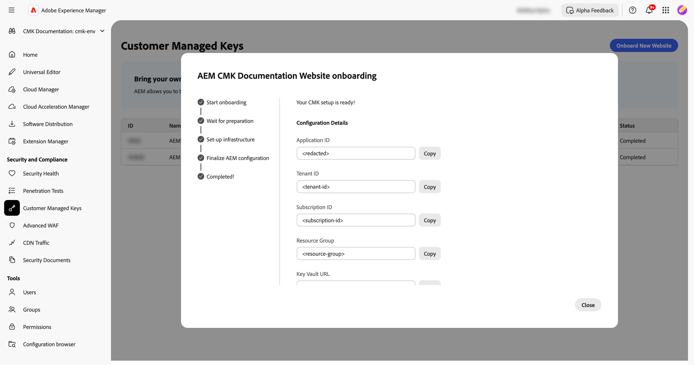

# Setup van door klanten beheerde sleutels voor AEM as a Cloud Service {#customer-managed-keys-for-aem-as-a-cloud-service}

AEM as a Cloud Service slaat de klantgegevens momenteel op in Azure Blob Storage en MongoDB, waarbij standaard door de leverancier beheerde coderingssleutels worden gebruikt om gegevens te beveiligen. Terwijl deze opstelling aan de veiligheidsbehoeften van vele organisaties voldoet, kunnen de ondernemingen in gereglementeerde industrieën of die die verbeterde gegevensveiligheid vereisen grotere controle over hun encryptiepraktijken zoeken. Voor organisaties die prioriteit geven aan gegevensbeveiliging, compatibiliteit en de mogelijkheid om hun coderingssleutels te beheren, biedt de CMK-oplossing (Customer Managed Keys) een essentiële verbetering.

## Het probleem dat wordt opgelost {#the-problem-being-solved}

Door de provider beheerde sleutels kunnen zorgen veroorzaken voor bedrijven die extra privacy en integriteit nodig hebben. Zonder controle over zeer belangrijk beheer, staan de organisaties voor uitdagingen in het voldoen aan nalevingsvereisten, het uitvoeren van het beleid van de douaneveiligheid, en het verzekeren van volledige gegevensveiligheid.

De introductie van Customer Managed Keys (CMK) lost deze problemen op door AEM-klanten volledige controle te geven over hun coderingssleutels. Door verificatie via de Microsoft Entra ID (voorheen Azure Active Directory) maakt AEM CS veilig verbinding met de Azure Key Vault van de klant, zodat deze de levenscyclus van de coderingssleutels kan beheren, waaronder het maken, roteren en intrekken van sleutels.

CMK biedt verschillende voordelen:

* **Gegevens van de Controle en de Encryptie van de Toepassing:** verhoog veiligheid met direct beheer van uw toepassing van AEM en gegevens cryptografische sleutels.
* **verhoogt Vertrouwelijkheid en Integriteit:** Verminder de waarschijnlijkheid van onopzettelijke toegang en onthulling van gevoelige of merkgebonden gegevens met volledig encryptiebeheer.
* **Azure Key Vault Support:** Met het gebruik van Azure Key Vault kunt u belangrijke opslag, bewerkingen met betrekking tot geheimen verwerken en belangrijke rotaties uitvoeren.

Door CMK aan te nemen, kunnen klanten de controle over hun gegevensbeveiliging en encryptiepraktijken verhogen, de veiligheid verbeteren en risico&#39;s verlichten, terwijl zij van de scalability en de flexibiliteit van AEM CS blijven genieten.

Met AEM as a Cloud Service kunt u uw eigen coderingssleutels gebruiken om gegevens in rust te coderen. Deze handleiding bevat stappen voor het instellen van een door de klant beheerde sleutel (CMK) in Azure Key Vault voor AEM as a Cloud Service.

>[!WARNING]
>
>Nadat u CMK hebt ingesteld, kunt u niet terugkeren naar de toetsen die door het systeem worden beheerd. U bent verantwoordelijk voor het veilig beheren van uw sleutels en het bieden van toegang tot uw Key Vault-, Key- en CMK-app in Azure om te voorkomen dat de toegang tot uw gegevens verloren gaat.

U zult ook door de volgende stappen voor het creëren van en het vormen van de vereiste infrastructuur worden geleid:

1. Uw omgeving instellen
1. Een toepassings-id verkrijgen van Adobe
1. Een nieuwe bronnengroep maken
1. Een sleutelvault maken
1. Adobe toegang verlenen tot de sleutelkluis
1. Een coderingssleutel maken

U moet de URL van de sleutelkluis, de naam van de coderingssleutel en informatie over de sleutelvault delen met Adobe.

## Uw omgeving instellen {#setup-your-environment}

De Azure Command Line Interface (CLI) is de enige vereiste voor deze gids. Als u niet reeds geïnstalleerde Azure CLI hebt, volg hier de officiële installatieinstructies [ ](https://learn.microsoft.com/en-us/cli/azure/install-azure-cli).

Meld u aan bij uw CLI met `az login` voordat u verder gaat met de rest van deze handleiding.

>[!NOTE]
>
>Terwijl deze gids Azure CLI gebruikt, is het mogelijk om de zelfde verrichtingen via de Azure console uit te voeren. Als u liever de Azure-console gebruikt, gebruikt u de onderstaande opdrachten als referentie.


## Het CMK-configuratieproces voor AEM as a Cloud Service starten {#request-cmk-for-aem-as-a-cloud-service}

U moet de configuratie CMK (Customer Managed Keys) voor uw AEM as a Cloud Service-omgeving aanvragen via de gebruikersinterface. Om dit te doen, navigeer aan de Veiligheid UI van het Huis van AEM, onder de **Klant Beheerde Sleutels** sectie.
U kunt dan beginnen het onboarding proces door op het **Begin te klikken onboarding** knoop.


## Een toepassings-id verkrijgen van Adobe {#obtain-an-application-id-from-adobe}

Na het starten van het instapproces wordt een Entra-toepassings-id geleverd door Adobe. Deze toepassings-id is nodig voor de rest van de handleiding en wordt gebruikt om een serviceprincipal te maken waarmee Adobe toegang heeft tot uw sleutelkluis. Als u nog geen toepassings-id hebt, moet u wachten tot deze door Adobe is opgegeven.


Nadat het verzoek is voltooid, kunt u de toepassings-id zien in de CMK-interface.


## Een nieuwe bronnengroep maken {#create-a-new-resource-group}

Creeer een nieuwe middelgroep in een plaats van uw keus.

```powershell
# Choose a location and a name for the resource group.
$location="<AZURE LOCATION>"
$resourceGroup="<RESOURCE GROUP>"

# Create the resource group.
az group create --location $location --resource-group $resourceGroup
```

Als u al een middelgroep hebt, voel vrij om het in plaats daarvan te gebruiken. In de rest van deze handleiding worden de locatie van de resourcegroep en de naam ervan aangeduid met respectievelijk `$location` en `$resourceGroup` .

## Een belangrijke vault maken {#create-a-key-vault}

U moet een sleutelkluis maken voor de coderingssleutel. De sleutelvault moet ontruimingsbescherming hebben toegelaten. De zuiveringsbescherming is noodzakelijk voor het coderen van gegevens in rust van andere Azure diensten. Toegang tot een openbaar netwerk moet zijn ingeschakeld om ervoor te zorgen dat de Adobe-services toegang hebben tot de sleutelkluis.

>[!IMPORTANT]
>Het maken van de Key Vault met Public Network Access is uitgeschakeld. Hiermee wordt afgedwongen dat alle belangrijke vaultbewerkingen, zoals het maken van sleutels of het roteren, moeten worden uitgevoerd vanuit een omgeving die toegang heeft tot het netwerk van KeyVault, bijvoorbeeld een VM die toegang heeft tot de KeyVault.

```powershell
# Reuse this information from the previous step.
$location="<AZURE LOCATION>"
$resourceGroup="<RESOURCE GROUP>"

# Choose a name for the key vault.
$keyVaultName="<KEY VAULT NAME>"

# Create the key vault.
az keyvault create `
  --location $location `
  --resource-group $resourceGroup `
  --name $keyVaultName `
  --default-action=Allow `
  --enable-purge-protection `
  --enable-rbac-authorization `
  --public-network-access Enabled
```

## Adobe Access verlenen voor de Key Vault {#grant-adobe-access-to-the-key-vault}

In deze stap geeft u Adobe via een Entra-toepassing toegang tot de keyvault. De id van de Entra-toepassing had al door Adobe moeten worden verstrekt.

Eerst, moet u een de diensthoofd tot stand brengen in bijlage aan de toepassing van de Entra en aan het toewijzen **Zeer belangrijke Uitvault Reader** en **Zeer belangrijke Server Crypto van de Gebruiker** rollen. De rollen zijn beperkt tot de sleutelkluis die in deze gids wordt gecreeerd.

```powershell
# Reuse this information from the previous steps.
$resourceGroup="<RESOURCE GROUP>"
$keyVaultName="<KEY VAULT NAME>"

# The application ID is provided by Adobe.
$appId="<APPLICATION ID>"

# Retrieve the ID of the key vault.
$keyVaultId=(az keyvault show --resource-group $resourceGroup --name $keyVaultName --query id --output tsv)

# Create a new service principal.
$servicePrincipalId=(az ad sp create --id $appId --query id --out tsv)

# Assign the roles to the service principal.
az role assignment create --assignee $servicePrincipalId --role "Key Vault Reader" --scope $keyVaultId
az role assignment create --assignee $servicePrincipalId --role "Key Vault Crypto User" --scope $keyVaultId
```

## Een coderingssleutel maken {#create-an-encryption-key}

Tot slot kunt u een encryptiesleutel in uw zeer belangrijke vault tot stand brengen. Gelieve te merken op dat u de **Zeer belangrijke rol van de Medewerker van Crypto** zult nodig hebben om deze stap te voltooien. Als de het programma geopende gebruiker deze rol niet heeft, contacteer uw systeembeheerder om deze rol te hebben die aan u wordt verleend of vraag iemand die reeds die rol heeft om deze stap voor u te voltooien.

Netwerktoegang tot de sleutelkluis is is vereist om de coderingssleutel te maken. Controleer eerst of u toegang hebt tot de sleutelvault en ga verder met het maken van de sleutel:

```powershell
# Reuse this information from the previous steps.
$keyVaultName="<KEY VAULT NAME>"

# Choose a name for your key.
$keyName="<KEY NAME>"

# Create the key.
az keyvault key create --vault-name $keyVaultName --name $keyName
```

## De belangrijkste vaultgegevens delen {#share-the-key-vault-information}

U bent nu allemaal ingesteld. U hoeft slechts enkele vereiste informatie te delen via de CMK-interface, die het configuratieproces van de omgeving start.

```powershell
# Reuse this information from the previous steps.
$resourceGroup="<RESOURCE GROUP>"
$keyVaultName="<KEY VAULT NAME>"

# Retrieve the URL of your key vault.
$keyVaultUri=(az keyvault show --name $keyVaultName `
    --resource-group $resourceGroup `
    --query properties.vaultUri `
    --output tsv)

# In addition we would need the tenantId and the subscriptionId in order to setup the connection.
$tenantId=(az keyvault show --name $keyVaultName `
    --resource-group $resourceGroup `
    --query properties.tenantId `
    --output tsv)
$subscriptionId="<Subscription ID>"
```
Geef deze informatie op in de CMK-gebruikersinterface:


## Implicaties van het Herhalen van Zeer belangrijke Toegang {#implications-of-revoking-key-access}

Het intrekken of uitschakelen van de toegang tot de Key Vault-, Key- of CMK-toepassing kan leiden tot aanzienlijke onderbrekingen, zoals het doorbreken van wijzigingen in de activiteiten van uw platform. Zodra deze sleutels worden onbruikbaar gemaakt, kunnen de gegevens in Platform ontoegankelijk worden, en om het even welke stroomafwaartse verrichtingen die op deze gegevens baseren zullen ophouden te functioneren. Het is van cruciaal belang dat u de downstreameffecten volledig begrijpt voordat u wijzigingen aanbrengt in uw sleutelconfiguraties.

Als u besluit om de toegang van het Platform tot uw gegevens in te trekken, kunt u dit doen door de gebruikersrol verbonden aan de toepassing uit Key Vault binnen Azure te verwijderen.

## Volgende stappen {#next-steps}

Nadat u de vereiste informatie in de CMK-interface hebt opgegeven, start Adobe het configuratieproces voor uw AEM as a Cloud Service-omgeving. Dit proces kan enige tijd duren en u wordt op de hoogte gesteld zodra het is voltooid.


## CMK-instelling voltooien {#complete-the-cmk-setup}

Zodra het configuratieproces wordt voltooid, zult u de status van uw opstelling CMK in UI kunnen zien. U kunt ook de sleutelvault en de encryptiesleutel zien.


## Vragen en ondersteuning {#questions-and-support}

Neem contact met ons op als u vragen hebt, vragen hebt of hulp nodig hebt bij de installatie van door Klant beheerde sleutels voor AEM as a Cloud Service. Adobe Support kan u helpen met alle vragen die u hebt.
