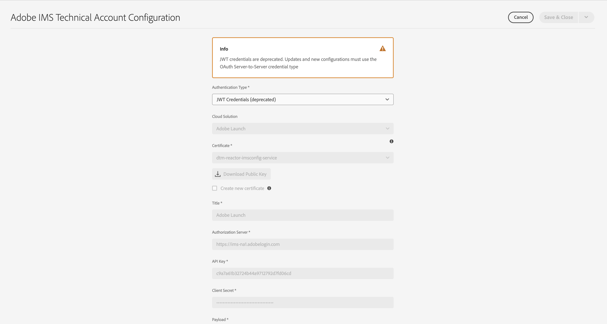

# IMS-integratie instellen voor AEM as a Cloud Service {#setting-up-ims-integrations-for-aemaacs}

>[!NOTE]
>
>Auto-provisioned JWT configuraties zouden niet manueel moeten worden gemigreerd, aangezien zij automatisch door Adobe zullen worden behandeld.

Adobe Experience Manager (AEM) as a Cloud Service kan met vele andere Adobe oplossingen worden geïntegreerd. Bijvoorbeeld Adobe Target, Adobe Analytics en andere.

De integratie gebruikt een integratie IMS, die met S2S OAuth wordt gevormd.

* Nadat u het volgende hebt gemaakt:

   * [Referenties in de Developer Console](#credentials-in-the-developer-console)

* Dan kunt u:

   * Een (nieuw) maken [OAuth-configuratie](#creating-oauth-configuration)

   * [Een bestaande JWT-configuratie migreren naar een OAuth-configuratie](#migrating-existing-JWT-configuration-to-oauth)

>[!CAUTION]
>
>Eerder werden configuraties gemaakt met [JWT-referenties die nu zijn afgekeurd in de Adobe Developer-console](/help/security/jwt-credentials-deprecation-in-adobe-developer-console.md).
>
>Dergelijke configuraties kunnen niet meer worden gemaakt of bijgewerkt, maar kunnen worden gemigreerd naar OAuth-configuraties.

## Referenties in de Developer Console {#credentials-in-the-developer-console}

Als eerste stap moet u de OAuth geloofsbrieven in de Console van Adobe Developer vormen.

Raadpleeg de documentatie bij de Developer Console, afhankelijk van uw vereisten, voor meer informatie over hoe u dit kunt doen:

* Overzicht:

   * [Server-naar-server verificatie](https://developer.adobe.com/developer-console/docs/guides/authentication/ServerToServerAuthentication/)

* Een nieuwe OAuth-referentie maken:

   * [OAuth Server-to-Server referentie implementatiegids](https://developer.adobe.com/developer-console/docs/guides/authentication/ServerToServerAuthentication/implementation/)

* Een bestaande JWT-referentie migreren naar een OAuth-referentie:

   * [Migratie van JWT-referentie (Service Account) naar OAuth Server-to-Server-referentie](https://developer.adobe.com/developer-console/docs/guides/authentication/ServerToServerAuthentication/migration/)

Bijvoorbeeld:

## Een OAuth-configuratie maken {#creating-oauth-configuration}

Een nieuwe Adobe IMS-integratie maken met OAuth:

1. Navigeer in AEM naar **Gereedschappen**, **Beveiliging**, **Adobe IMS-integratie**.

1. Selecteren **Maken**.

1. Voltooi de configuratie op basis van de gegevens van de [Ontwerpconsole](https://developer.adobe.com/developer-console/docs/guides/authentication/ServerToServerAuthentication/implementation/). Bijvoorbeeld:

   

1. **Opslaan** uw wijzigingen.

## Een bestaande JWT-configuratie migreren naar een OAuth-configuratie {#migrating-existing-JWT-configuration-to-oauth}

Een bestaande Adobe IMS-integratie migreren op basis van JWT-referenties:

>[!NOTE]
>
>Dit voorbeeld toont een Configuratie van IMS van de Lancering.

1. Navigeer in AEM naar **Gereedschappen**, **Beveiliging**, **Adobe IMS-integratie**.

1. Selecteer de JWT-configuratie die moet worden gemigreerd. JWT-configuraties worden gemarkeerd met de waarschuwing **JWT Credentials (afgekeurd)**.

1. Selecteren **Eigenschappen**:

   

1. De configuratie wordt geopend als alleen-lezen:

   

1. Selecteren **OAuth** van de **Type verificatie** vervolgkeuzelijst:

   

1. De beschikbare eigenschappen worden bijgewerkt. Gebruik de gegevens in de Developer Console om deze te voltooien:

   

1. Gebruiken **Opslaan en sluiten** om uw updates voort te zetten.
Wanneer u op de console terugkeert **JWT Credentials (afgekeurd)** de waarschuwing is verdwenen.
