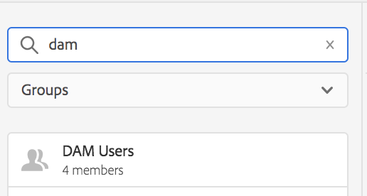
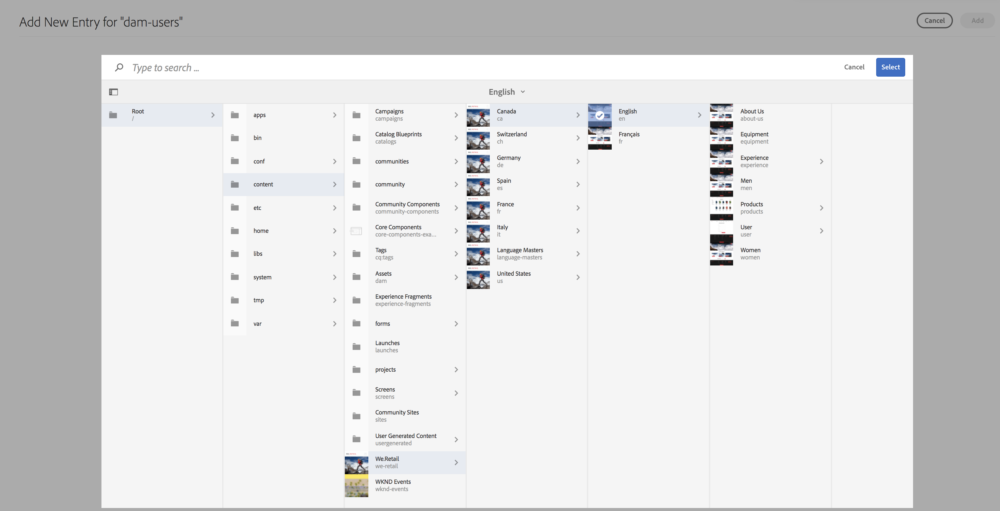
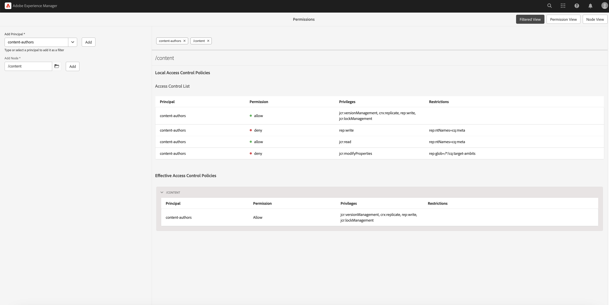

# Hoofdweergave voor beheer van machtigingen {#principal-view-for-permissions-management}

## Overzicht {#overview}

AEM introduceert machtigingenbeheer voor gebruikers en groepen. De belangrijkste functionaliteit blijft het zelfde als klassieke UI, maar is gebruikersvriendelijker en efficiënter.

## De interface openen {#accessing-the-ui}

Het nieuwe op UI-Gebaseerde toestemmingenbeheer wordt betreden door de kaart van Toestemmingen onder Veiligheid zoals hieronder getoond:

De nieuwe mening maakt het gemakkelijker om de volledige reeks voorrechten en beperkingen voor een bepaald hoofd op alle wegen te bekijken waar de Toestemmingen uitdrukkelijk zijn verleend. Hierdoor is het niet nodig om naar

CRXDE om geavanceerde voorrechten en beperkingen te beheren. Het is in dezelfde visie geconsolideerd.

Er is een filter dat de gebruiker toestaat om het type van hoofden te selecteren om **Gebruikers** te bekijken, **Groepen**, of **allen** en onderzoek naar om het even welk hoofd **.**

## Machtigingen weergeven voor een principal {#viewing-permissions-for-a-principal}

In het linkerframe kunnen gebruikers omlaag schuiven om een hoofd te zoeken of naar een groep of een gebruiker te zoeken op basis van het geselecteerde filter, zoals hieronder wordt getoond:

Als u op de naam klikt, worden aan de rechterkant de toegewezen machtigingen weergegeven. Het toestemmingenvenster toont de lijst van de Ingangen van het Toegangsbeheer op specifieke wegen samen met gevormde beperkingen.

## Het toevoegen van nieuw Ingang van het Toegangsbeheer voor Principal {#adding-new-access-control-entry-for-a-principal}

De nieuwe toestemmingen kunnen worden toegevoegd door een Toegang toe te voegen die ingaat. Klik eenvoudig toevoegen ACE knoop.

 toe

Dit brengt het hieronder getoonde venster omhoog, is de volgende stap een weg te kiezen waar de toestemming moet worden gevormd.

Hier, wordt een weg geselecteerd waar u een toestemming voor **dam-gebruikers** kunt vormen:

Nadat het pad is geselecteerd, gaat de workflow terug naar dit scherm, waar de gebruiker een of meer rechten kan selecteren uit de beschikbare naamruimten (zoals `jcr` , `rep` of `crx` ), zoals hieronder wordt weergegeven.

U kunt rechten toevoegen door te zoeken in het tekstveld en vervolgens te selecteren in de lijst.

>[!NOTE]
>
>Voor een volledige lijst van voorrechten en beschrijvingen, zie [ Gebruiker, Groep, en het Beleid van de Rechten van de Toegang ](https://experienceleague.adobe.com/en/docs/experience-manager-65/content/security/user-group-ac-admin#access-right-management).

 

Nadat de lijst met bevoegdheden is geselecteerd, kan de gebruiker het machtigingstype Weigeren of Toestaan kiezen, zoals hieronder wordt weergegeven.

 

## Beperkingen gebruiken {#using-restrictions}

Naast de lijst met bevoegdheden en het machtigingstype op een bepaald pad, kunt u met dit scherm ook beperkingen voor fijnkorrelig toegangsbeheer toevoegen, zoals hieronder wordt getoond:

 toe

>[!NOTE]
>
>Voor meer informatie over wat elke beperking betekent, zie [ de Documentatie van Jackrabbit Oak ](https://jackrabbit.apache.org/oak/docs/security/authorization/restriction.html).

U kunt beperkingen toevoegen zoals hieronder wordt weergegeven door het type beperking te kiezen, de waarde in te voeren en op het pictogram **+** te klikken.

 

Het nieuwe ACE wordt weerspiegeld in de Lijst van het Toegangsbeheer zoals hieronder getoond. `jcr:write` is een geaggregeerde bevoegdheid die `jcr:removeNode` bevat die hierboven is toegevoegd, maar die hieronder niet wordt weergegeven als een bevoegdheid die onder `jcr:write` valt.

## ACE&#39;s bewerken {#editing-aces}

De Ingangen van het Toegangsbeheer kunnen worden uitgegeven door een hoofd te selecteren en ACE te kiezen die u wilt uitgeven.

Bijvoorbeeld, hier kunt u de hieronder ingang voor **dam-gebruikers** uitgeven door het potloodpictogram op het recht te klikken:

 toe

Het bewerkingsscherm wordt weergegeven met de geconfigureerde ACE&#39;s die vooraf zijn geselecteerd. U kunt deze verwijderen door op het kruispictogram naast de ACE&#39;s te klikken of u kunt nieuwe bevoegdheden toevoegen voor het opgegeven pad, zoals hieronder wordt weergegeven.

 uit

Hier wordt het `addChildNodes` voorrecht toegevoegd voor **dam-gebruikers** op de bepaalde weg.

 toe

De veranderingen kunnen worden bewaard door **te klikken sparen** knoop op bovenkant recht, en de veranderingen worden weerspiegeld in de nieuwe toestemmingen voor **dam-gebruikers** zoals hieronder getoond:

## ACE&#39;s verwijderen {#deleting-aces}

De Ingangen van het Toegangsbeheer kunnen worden geschrapt om alle toestemmingen te verwijderen die aan een hoofd op een specifieke weg worden gegeven. Het pictogram X naast ACE kan worden gebruikt om het te schrappen zoals hieronder getoond:

 

## Machtigingen weergeven {#permissions-view}

### Weergave TouchUI-machtigingen {#touch-ui-permisions-view}

Beheerders hebben behoefte aan meer korrelige controle en zichtbaarheid in machtigingstoewijzingen op knooppuntniveau voor betere beveiliging en beheer binnen AEM. Eerder, slechts was een op hoofd-gebaseerde mening van toestemmingen beschikbaar, die de capaciteit beperken om te zien hoe ACLs wordt toegepast op specifieke knopen of gefilterde meningen. Het nieuwe knooppunt en de gefilterde weergave bieden een gedetailleerd en gecontextualiseerd perspectief van machtigingstoewijzingen, waardoor betere beheer en controle van beveiligingsconfiguraties mogelijk zijn. Deze functie verbetert het beheerderstoezicht en vereenvoudigt het beheer van machtigingen, verbetert de beveiliging, beperkt misverstanden en stroomlijnt de toegangscontroles van gebruikers in AEM.

U kunt tot de Toestemmingen toegang hebben aanraak UI mening door op **Hulpmiddelen te klikken - Veiligheid - Toestemmingen**, zoals hieronder getoond:

Zodra u de mening van Toestemmingen lanceert, kunt u op **Mening van de Knoop** of **Gefilterde Mening** in de hogere juiste hoek van het scherm afhankelijk van uw het bekijken voorkeur klikken.

#### Knooppuntweergave

In deze mening, wordt ACLs voorgesteld voor elke individuele Knoop (weg). Het verstrekt informatie over:

Lokale ACLs voor de geselecteerde Knoop.
Effectieve ACLs, die ACLs omvat die op elke ouderKnoop tot de wortel (&quot;/&quot;) wordt toegepast.
De gebruikers hebben de optie om ACLs toe te voegen, te verwijderen of bij te werken. Wanneer een weg wordt geklikt, toont de linkerruit zijn kinderen, terwijl de rechterkant een lijstmening van alle ACLs verbonden aan die weg voorstelt.

#### Gefilterde weergave

In deze weergave kunnen gebruikers efficiënt naar machtigingen zoeken op een opgegeven pad en op bepaalde principes. In deze weergave kunnen gebruikers eenvoudig bepalen welk type machtigingen aan een groep principes voor het geselecteerde pad is verleend.
Bovendien, verstrekt de Gefilterde Mening inzichten in Effectieve ACLs. Het toont ACLs verbonden aan de ouderknoop van de geselecteerde weg, met inachtneming van het geselecteerde hoofd en om het even welke gemeenschappelijke hoofden.

### De weergave Bevoegdheden browser opslagplaats {#the-repository-browser-permissions-view}

De toestemmingenmening kan ook via [ Browser van de Bewaarplaats ](/help/implementing/developing/tools/repository-browser.md) worden betreden.

U hebt toegang tot dit bestand door:

1. Het openen van de console van de Ontwikkelaar, klikkend op Browser van de Bewaarplaats **tabel, en dan op** open Browser van de Bewaarplaats ****

   

1. Zodra in Browser van de Bewaarplaats, klik op **Toestemmingen** tabel

   

**Nota**: Om de toestemmingen te bekijken, worden de beheerderrechten vereist. Volg de hier vermelde stappen  om tot de toestemmingen toegang te hebben.

## Klassieke UI Privilege-combinaties {#classic-ui-privilege-combinations}

De nieuwe toestemmingenUI gebruikt uitdrukkelijk de basisreeks voorrechten in plaats van vooraf bepaalde combinaties die niet echt de nauwkeurige onderliggende voorrechten weerspiegelen die werden verleend.

Het veroorzaakte verwarring over wat precies wordt gevormd. De volgende lijst maakt een lijst van de afbeelding tussen de voorrechtcombinaties van Klassieke UI aan de daadwerkelijke voorrechten die hen vormen:

<table>
 <tbody>
  <tr>
   <th>Klassieke UI Privilege-combinaties</th>
   <th>Rechten UI-bevoegdheid</th>
  </tr>
  <tr>
   <td>Lezen</td>
   <td><code>jcr:read</code></td>
  </tr>
  <tr>
   <td>Wijzigen</td>
   <td>
<code>jcr:modifyProperties</code>
 
<code>jcr:lockManagement</code>
 
<code>jcr:versionManagement</code>
 </td>
  </tr>
  <tr>
   <td>Maken</td>
   <td>
<code>jcr:addChildNodes</code>
 
<code>jcr:nodeTypeManagement</code>
 </td>
  </tr>
  <tr>
   <td>Verwijderen</td>
   <td>
<code>jcr:removeNode</code>
 
<code>jcr:removeChildNodes</code>
 </td>
  </tr>
  <tr>
   <td>ACL lezen</td>
   <td><code>jcr:readAccessControl</code></td>
  </tr>
  <tr>
   <td>ACL bewerken</td>
   <td><code>jcr:modifyAccessControl</code></td>
  </tr>
  <tr>
   <td>Repliceren</td>
   <td><code>crx:replicate</code></td>
  </tr>
 </tbody>
</table>
