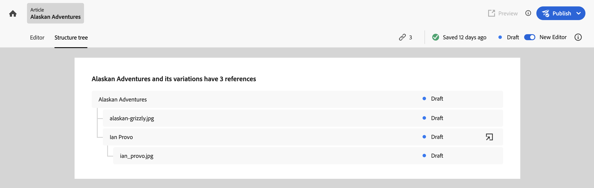

# Structuur van inhoudsfragment analyseren {#analyzing-content-fragments-structure}

Inhoudsfragmenten zijn ontworpen voor [Levering zonder koppen met GraphQL](/help/sites-cloud/administering/content-fragments/content-delivery-with-graphql.md). Dit betekent dat ze een structuur met meerdere lagen kunnen hebben.

Experience Manager (AEM) biedt verschillende methoden voor het weergeven en analyseren van de structuur van uw fragmenten.

## Verwijzingen {#references}

De structuur wordt opgebouwd gebruikend Verwijzingen:

* [Gegevenstypen voor verwijzingen worden gedefinieerd in het inhoudsfragmentmodel](/help/sites-cloud/administering/content-fragments/content-fragment-models.md#using-references-to-form-nested-content)
* Bij het ontwerpen kunt u het volgende doen:
   * [Deze verwijzingen beheren](/help/sites-cloud/administering/content-fragments/authoring.md##manage-references)
   * [Bovenliggende verwijzingen van het fragment zoeken](/help/sites-cloud/administering/content-fragments/managing.md#parent-references-fragment)

## Structuurelboom {#structure-tree}

Open de **Structuurelboom** van de redacteurstoolbar om de hiërarchische structuur van het Inhoudsfragment, en zijn verwijzingen te tonen. Gebruik het koppelingspictogram om verwijzingen te openen.

Bijvoorbeeld:

