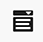

# Inhoudsfragmenten ontwerpen {#authoring-content-fragments}

Het ontwerpen van inhoudsfragmenten is zowel gericht op de levering zonder kop als op het ontwerpen van pagina&#39;s.

Er zijn twee editors beschikbaar voor inhoudsfragmenten. De editor die in deze sectie wordt beschreven:

* is ontwikkeld voor inhoud zonder kop (hoewel het voor alle scenario&#39;s kan worden gebruikt)
* is beschikbaar via **Inhoudsfragmenten** console

Deze editor biedt:

* [Automatisch opslaan](#saving-autosaving)om te voorkomen dat bewerkingen per ongeluk verloren gaan.
* [In line uploaden van elementen als inhoudsverwijzingen](#reference-images), zonder ze eerst naar Asset DAM te moeten uploaden.
* [Variaties genereren](#generate-variations-ai) gebruiken om het maken van inhoud te versnellen op basis van aanwijzingen.
* [Voorvertoning](#preview-content-fragment) van de gerenderde ervaring die door het inhoudsfragment wordt geleverd.
* Vermogen [Publiceren](#publish-content-fragment) en [Publiceren ongedaan maken](#unpublish-content-fragment) uit de editor.
* Vermogen [gekoppelde taalkopieën bekijken en openen](#view-language-copies) in de editor.
* Vermogen [versiedetails weergeven](#view-version-history) in de editor. U kunt ook terugkeren naar een geselecteerde versie.
* Vermogen [bovenliggende verwijzingen weergeven en openen](#view-parent-references).
* Een hiërarchische weergave van het inhoudsfragment en de bijbehorende verwijzingen met de opdracht [Structuurelboom](#structure-tree).

>[!WARNING]
>
>De editor die in deze sectie wordt beschreven, is *alleen* beschikbaar in het *online* Adobe Experience Manager (AEM) as a Cloud Service.

## Inhoudsfragmenteditor {#content-fragment-editor}

Wanneer u de Inhoudsfragmenteditor voor het eerst opent, ziet u vier hoofdgebieden:

* bovenste werkbalk: voor belangrijke informatie en handelingen
   * een koppeling naar de Content Fragment Console (pictogram Start)
   * informatie over het model en de map
   * koppelingen naar [Voorvertoning (als het standaard URL-voorvertoningspatroon is geconfigureerd voor het model)](/help/sites-cloud/administering/content-fragments/content-fragment-models.md#content-fragment-model-properties)
   * [Publiceren](#publish-content-fragment), en [Publiceren ongedaan maken](#unpublish-content-fragment) handelingen
   * een optie om alles weer te geven **Bovenliggende verwijzingen** (koppelingspictogram)
   * het fragment **[Status](/help/sites-cloud/administering/content-fragments/managing.md#statuses-content-fragments)** en laatst opgeslagen gegevens
   * een schakeloptie voor het overschakelen naar de oorspronkelijke (op elementen gebaseerde) editor

     >[!WARNING]
     >
     >De oorspronkelijke editor wordt op hetzelfde tabblad geopend. Het wordt afgeraden beide editors tegelijk te openen.

* linkerdeelvenster: toont de **[Variaties](#variations)** voor het inhoudsfragment en de bijbehorende **Velden**:
   * deze koppelingen kunnen worden gebruikt om [navigeren door de structuur van het inhoudsfragment](#navigate-structure)
* rechterdeelvenster: tabbladen voor presentaties [eigenschappen (metagegevens) en tags weergeven](#view-properties-tags), informatie over de [versiehistorie](#view-version-history)en informatie over [taalkopieën](#view-language-copies)
   * in de **Eigenschappen** kunt u de **Titel** en **Beschrijving** voor het fragment, of **Variatie**
* centraal deelvenster: geeft de daadwerkelijke velden en inhoud van de geselecteerde variatie weer
   * kunt u de inhoud bewerken
   * indien **Tijdelijke aanduiding voor tab** de velden worden gedefinieerd binnen het model dat ze hier worden weergegeven en kunnen worden gebruikt voor navigatie; ze worden horizontaal weergegeven of als een vervolgkeuzelijst.

  >[!NOTE]
  >
  >Afhankelijk van definities in het onderliggende model kunnen velden worden onderworpen aan bepaalde typen [Validatie](/help/assets/content-fragments/content-fragments-models.md#validation).

## Navigeren door de structuur van het inhoudsfragment {#navigate-structure}

één inhoudsfragment;

* Bestaat uit twee niveaus:

   * **[Variaties](#variations)** van het inhoudsfragment
   * **Velden** - gedefinieerd door het inhoudsfragmentmodel en gebruikt door elke variatie

* Kan verschillende verwijzingen bevatten.

### Variaties en velden {#variations-and-fields}

In het linkerpaneel kunt u zien:

* de lijst van **[Variaties](#variations)** die voor dit fragment zijn gemaakt:
   * **Hoofd** De variatie die aanwezig is wanneer het inhoudsfragment voor het eerst wordt gemaakt, kunt u later andere varianten toevoegen
   * u kunt gebruiken produceert Variaties (#generate-Variaties) om een snel gebaseerde malplaatje te gebruiken dat de Adobe voor een specifiek gebruiksgeval heeft gecreeerd.
   * u kunt [een variatie maken](#create-variation)
* de **Velden** in het fragment en de variaties ervan:
   * het pictogram geeft de [Gegevenstype](/help/sites-cloud/administering/content-fragments/content-fragment-models.md#data-types)
   * de tekst is de veldnaam
   * deze vormen samen een directe koppeling naar de inhoud van het veld in het centrale venster (voor de huidige variatie)

### Koppelingen volgen {#follow-links}

In verschillende delen van de editor ziet u het koppelingspictogram. Hiermee kunt u het weergegeven item openen, bijvoorbeeld een Content Fragment Model, een Parent Reference of een fragment waarnaar wordt verwezen:

### Structuurelboom {#structure-tree}

Open de **Structuurelboom** van de redacteurstoolbar om de hiërarchische structuur van het Inhoudsfragment, en zijn verwijzingen te tonen. Gebruik de koppelingspictogrammen om naar de referenties te navigeren.

>[!NOTE]
>
>Zie [Structuur van inhoudsfragment analyseren - boomstructuur](/help/sites-cloud/administering/content-fragments/analysis.md#structure-tree) voor meer informatie .

## Opslaan en automatisch opslaan {#saving-autosaving}

<!-- CHECK: cannot be saved, no undo, redo -->

Bij elke update die u maakt, wordt het inhoudsfragment automatisch opgeslagen. De laatst opgeslagen tijd wordt weergegeven in de bovenste werkbalk.

## Variaties {#variations}

[Variaties](/help/sites-cloud/administering/content-fragments/overview.md#main-and-variations) zijn een belangrijk kenmerk van AEM inhoudsfragmenten. Hiermee kunt u kopieën van de **Hoofd** inhoud voor gebruik op specifieke kanalen, en scenario&#39;s, die tot hoofdloze levering van inhoud en pagina creatie nog flexibeler maken.

Vanuit de editor kunt u:

* [Variaties maken](#create-variation) van de **Hoofd** content

* [AI variaties genereren gebruiken](#generate-variations-ai) om Generative AI te gebruiken om een snel gebaseerde sjabloon te gebruiken die Adobe voor een specifiek gebruiksgeval heeft gemaakt.

* Selecteer de gewenste variatie voor het bewerken van de inhoud

* [Naam van variatie wijzigen](#rename-variation)

* [Een variatie verwijderen](#delete-variation)

### Een variatie maken {#create-variation}

Een variatie van het inhoudsfragment maken:

1. Selecteer in het linkerdeelvenster de optie **plusteken** (**Variatie maken**, dat recht heeft op **Variaties**.

   >[!NOTE]
   >
   >Nadat u de eerste variatie hebt gemaakt, worden bestaande variaties in hetzelfde deelvenster weergegeven.

   

1. Voer een **Titel** voor uw variatie, en **Beschrijving** indien gewenst:

   

1. **Maken** de wijziging. De naam wordt weergegeven in de lijst.

### De naam van een variatie wijzigen {#rename-variation}

De naam van een **Variatie**:

1. Selecteer de gewenste variatie.

1. Open de **Eigenschappen** in het rechterdeelvenster.

1. De wijziging bijwerken **Titel**.

1. Druk op **Retourneren** of naar een ander veld gaan om de wijziging automatisch op te slaan. De titel wordt bijgewerkt in het gedeelte **Variaties** aan de linkerkant.

### Variaties maken met GenAI met Variaties genereren {#generate-variations-ai}

Gebruik Generatieve variaties om generatieve AI te gebruiken om het maken van inhoud te versnellen.

De generatieve variaties gebruiken in de Inhoudsfragmenteditor:

1. Open de Inhoudsfragmenteditor. In de kopbal zult u het ingangspunt vinden om Variaties te produceren:

   

1. Variaties genereren wordt geopend op een nieuw tabblad. In de linkertrack ziet u de AEM Cloud-instantie en het inhoudsfragment waarvoor u inhoud maakt. Selecteer de vraag u wilt gebruiken of een nieuwe herinnering creëren.

   >[!NOTE]
   >
   >De beschikbare sjablonen voor herinneringen voor Adoben zijn nu beperkt, maar in toekomstige versies wordt meer toegevoegd.

   

1. Genereer inhoud door de vragen in te vullen. Het inhoudsmodel van het fragment wordt automatisch gebruikt om inhoud te genereren met GenAI.

   >[!NOTE]
   >
   >Momenteel ondersteunen we alleen tekstvelden.

   

1. Selecteer de variant die u wilt genereren en selecteer &quot;variatie exporteren&quot;. Bevestig de naam van de variatie van het inhoudsfragment en selecteer een van de volgende opties:

   * **Exporteren**: exporteer variatie naar Inhoudsfragment en blijf in de toepassing Variatie genereren.
   * **Exporteren en openen**: exporteer de variatie naar Inhoudsfragment en open een nieuw tabblad waarop het Inhoudsfragment wordt weergegeven met de nieuwe variatie van GenAI.

     

1. Gegenereerde variaties worden weergegeven in de hoofdeditor voor contentfragmenten.

   

Meer informatie over Variaties genereren [hier](https://experienceleague.adobe.com/en/docs/experience-manager-cloud-service/content/generative-ai/generate-variations).

### Een wijziging verwijderen {#delete-variation}

Een variatie van het inhoudsfragment verwijderen:

    >[!OPMERKING]
    >
    >U kunt **Main** niet verwijderen.

1. Selecteer de variatie.

1. In de **Variatie** selecteert u het verwijderingspictogram (prullenbak):

   

1. Er wordt een dialoogvenster geopend. Selecteren **Verwijderen** om de actie te bevestigen.

## Tekstvelden met meerdere regels bewerken - Onbewerkte tekst of Markering {#edit-multi-line-text-fields-plaintext-markdown}

**[Tekst met meerdere regels](/help/sites-cloud/administering/content-fragments/content-fragment-models.md#data-types)** velden kunnen een van de volgende drie indelingen hebben:

* Onbewerkte tekst
* [Markering](/help/sites-cloud/administering/content-fragments/markdown.md)
* [RTF](#edit-multi-line-text-fields-rich-text)

Velden die zijn gedefinieerd als Onbewerkte tekst of Markeringen, hebben een eenvoudig tekstvak, zonder opmaakopties (op het scherm):

## Tekstvelden met meerdere regels bewerken - RTF {#edit-multi-line-text-fields-rich-text}

Voor **[Tekst met meerdere regels](/help/sites-cloud/administering/content-fragments/content-fragment-models.md#data-types)** velden die zijn gedefinieerd als **RTF** Er zijn verschillende functies beschikbaar:

* Bewerk de inhoud:
   * Ongedaan maken/Opnieuw
   * Plakken/Plakken als tekst
   * Kopiëren
   * Alinea-indeling selecteren
   * Tabel maken/beheren
   * Tekst opmaken; vet, cursief, onderstrepen, kleur
   * Alinea-uitlijning instellen
   * Lijsten maken/beheren; genummerd met opsommingstekens
   * Tekst inspringen; verkleinen, vergroten
   * Huidige opmaak wissen
   * Koppelingen invoegen
   * Verwijzingen naar afbeeldingselementen selecteren en invoegen
   * Speciale tekens toevoegen
* [Editor op volledig scherm](#full-screen-editor-rich-text) - schakelen tussen volledig scherm en in-flow
* [Statistieken](#statistics-rich-text)
* [Vergelijken en synchroniseren](#compare-and-synchronize-rich-text)

Bijvoorbeeld:

>[!NOTE]
>
>Tekstvelden met meerdere regels worden ook aangegeven door de juiste [pictogram](#fields-datatypes-icons) in de **Velden** deelvenster.

### Volledige schermeditor - RTF-tekst {#full-screen-editor-rich-text}

De volledige-schermredacteur biedt de zelfde het uitgeven opties aan zoals wanneer in-stroom - maar biedt meer ruimte voor de tekst aan.

Bijvoorbeeld:

### Statistieken - RTF {#statistics-rich-text}

De handeling **Statistieken** Hiermee geeft u een gegevensbereik over de tekst weer in een veld met meerdere regels.

Bijvoorbeeld:

### Vergelijken en synchroniseren - RTF-tekst {#compare-and-synchronize-rich-text}

De handeling **Ververgelijken** is beschikbaar voor velden met meerdere regels als u een **Variatie** openen.

Hiermee opent u het veld Meerdere regels op volledig scherm en:

* geeft de inhoud voor beide weer **Hoofd** en de huidige **Variatie** tegelijkertijd, met vermelding van eventuele verschillen

* verschillen worden aangegeven door kleur:

   * groen geeft de toegevoegde inhoud aan (aan de variatie)
   * rood geeft aan dat inhoud is verwijderd (uit de variatie)
   * blauw geeft vervangen tekst aan

* verstrekt **Sync** handeling die de inhoud synchroniseert vanuit **Hoofd** op de huidige wijziging

   * indien **Hoofd** is bijgewerkt, worden deze wijzigingen overgedragen naar de wijziging
   * als de wijziging is bijgewerkt, worden deze wijzigingen overschreven door de inhoud van **Hoofd**

  >[!CAUTION]
  >
  >Synchronisatie is alleen beschikbaar voor het kopiëren van wijzigingen *van **Hoofd**de wijziging*.
  >
  >Wijzigingen overbrengen *van een wijziging naar **Hoofd*** is niet beschikbaar als optie.

Bijvoorbeeld, een scenario waar de variatie inhoud volledig was herschreven, zodat zal een synchronisatie die nieuwe inhoud met de inhoud van vervangen **Hoofd**:

## Referenties beheren {#manage-references}

### Fragmentverwijzingen {#fragment-references}

[Fragmentverwijzingen](/help/sites-cloud/administering/content-fragments/content-fragment-models.md#fragment-reference-nested-fragments) kan worden gebruikt om:

* [een verwijzing naar een bestaand inhoudsfragment maken](#create-reference-existing-content-fragment)
* [een inhoudsfragment maken en ernaar verwijzen](#create-reference-content-fragment)

#### Een verwijzing naar een bestaand inhoudsfragment maken {#create-reference-existing-content-fragment}

Een verwijzing naar een bestaand inhoudsfragment maken:

1. Selecteer het veld.
1. Selecteren **Bestaande fragment toevoegen**.
1. Selecteer het gewenste fragment in de fragmentkiezer.

   >[!NOTE]
   >
   >U mag slechts één fragment tegelijk selecteren.

#### Een inhoudsfragment en verwijzing maken {#create-reference-content-fragment}

U kunt ook [selecteren **Nieuw fragment maken** om de **Maken** dialoogvenster](/help/sites-cloud/administering/content-fragments/managing.md#creating-a-content-fragment). Wanneer het fragment is gemaakt, wordt er naar dit fragment verwezen.

### Content References {#content-references}

[Content References](/help/sites-cloud/administering/content-fragments/content-fragment-models.md#content-reference) worden gebruikt om naar andere AEM inhoudstypen te verwijzen, zoals afbeeldingen, pagina&#39;s en Experience Fragments.

#### Referentieafbeeldingen {#reference-images}

In **Content Reference** velden die u kunt allebei:

* referentieelementen die al in de gegevensopslagruimte bestaan
* uploadt hen rechtstreeks aan het gebied; dit vermijdt de behoefte om **Activa** te uploaden console

  >[!NOTE]
  >
  >Een afbeelding rechtstreeks uploaden naar de **Content Reference** veld, it **moet**:
  >
  >* een **Hoofdpad** gedefinieerd (in de [Inhoudsfragmentmodel](/help/sites-cloud/administering/content-fragments/content-fragment-models.md#content-reference)). Hiermee geeft u aan waar de afbeelding wordt opgeslagen.
  >* include **Afbeelding** in de lijst met toegestane inhoudstypen

U kunt een element toevoegen door:

* het nieuwe elementbestand rechtstreeks (bijvoorbeeld vanaf uw bestandssysteem) naar het **Content Reference** field
* gebruiken **Element toevoegen** actie, en selecteer dan of **Zoeken in middelen** of **Uploaden** om de juiste kiezer voor u te openen:

  

#### Referentiepagina&#39;s {#reference-pages}

Verwijzingen naar AEM pagina&#39;s, Experience Fragments of andere inhoudstypen toevoegen:

1. Selecteren **Inhoudspad toevoegen**.

1. Voeg het vereiste pad toe aan het invoerveld.

1. Bevestigen met **Toevoegen**.

### Bovenliggende verwijzingen weergeven {#view-parent-references}

Als u het koppelingspictogram op de bovenste werkbalk selecteert, wordt een lijst met alle bovenliggende verwijzingen geopend.

Bijvoorbeeld:

Er wordt een venster geopend met een overzicht van alle verwante referenties. Als u een verwijzing wilt openen, selecteert u de naam of titel of het koppelingspictogram.

Bijvoorbeeld:

## Eigenschappen en labels weergeven {#view-properties-tags}

Op het tabblad Eigenschappen van het rechterdeelvenster kunnen eigenschappen (metagegevens) en tags worden weergegeven. De eigenschappen kunnen zijn:

* voor de **Inhoudsfragment** - als **Hoofd** is momenteel geselecteerd
* voor een specifieke **Variatie**

### Eigenschappen en tags bewerken {#edit-properties-tags}

Op het tabblad Eigenschappen (rechterdeelvenster) kunt u ook het volgende bewerken:

* **Titel**
* **Beschrijving**
* **Tags**: gebruiken van de drop-down lijst, of de selectiedialoog

  

### Het model van het inhoudsfragment openen {#open-content-fragment-model}

Wanneer u **Hoofd** geselecteerd wordt de naam van het onderliggende inhoudsfragmentmodel weergegeven in de sectie Eigenschappen. Als u het koppelingspictogram selecteert, wordt het model op een apart tabblad geopend.

Bijvoorbeeld:

## Versiehistorie weergeven {#view-version-history}

In de **Versiehistorie** in het rechterdeelvenster worden de details van de huidige en vorige versies weergegeven:

>[!NOTE]
>
>Er wordt een nieuwe versie gemaakt wanneer het inhoudsfragment wordt gepubliceerd.

### Versie vergelijken {#compare-version}

Voor een inhoudsfragment kunt u een vorige versie vergelijken met de huidige versie.

Een vorige versie vergelijken met de huidige versie:

1. Selecteer het pictogram met drie punten naast de versie.

1. Selecteren **Ververgelijken**.

Hiermee opent u een weergave waarin de verschillen tussen de huidige versie van de inhoud en de geselecteerde vorige versie van het inhoudsfragment worden weergegeven. Van de **Variaties met wijzigingen** kunt u selecteren om de verschillen met de hoofdinhoud en/of inhoud van een variatie te zien.

Verschillen worden aangegeven met kleur:

* Groen: geeft inhoud aan die is toegevoegd (aan de huidige versie)
* Rood: geeft aan dat inhoud is verwijderd (uit de huidige versie)

### Versie herstellen {#revert-version}

U kunt terugkeren naar elke gewenste versie.

Een specifieke versie herstellen:

1. Selecteer het pictogram met drie punten naast de versie.

1. Selecteren **Vorige versie**.

## De taalkopieën bekijken {#view-language-copies}

In de **Taaleigenschappen** tabdetails van eventuele bijbehorende taalkopieën worden weergegeven. Als u een koppelingspictogram selecteert, wordt de kopie op een apart tabblad geopend.

Bijvoorbeeld:

>[!NOTE]
>
>Voor meer informatie over het vertalen van een inhoudsfragment en het maken van taalkopieën raadpleegt u de [AEM doorsnedenloze vertaalreis](/help/journey-headless/translation/overview.md).

## Voorvertoning van fragment weergeven {#preview-content-fragment}

De inhoudsfragmenteditor biedt auteurs de mogelijkheid om een voorvertoning van hun bewerkingen weer te geven in een externe frontendtoepassing.

Als u deze functie wilt gebruiken, moet u eerst:

* Werk met uw IT-team om de externe frontendtoepassing in te stellen die het inhoudsfragment rendert door de JSON-uitvoer te verbruiken.
* Wanneer de externe frontend-toepassing is ingesteld, wordt **URL-standaardvoorvertoningspatroon** moet worden gedefinieerd als [eigenschap van het juiste inhoudsfragmentmodel](/help/sites-cloud/administering/content-fragments/content-fragment-models.md#properties).

Wanneer de URL is gedefinieerd, wordt **Voorvertoning** is actief. U kunt deze knop selecteren om de externe toepassing te starten (op een afzonderlijk tabblad) om het inhoudsfragment te renderen.

## Fragment publiceren {#publish-content-fragment}

U kunt **Publiceren** het fragment naar een van de volgende items:

* Voorbeeldexemplaar
* Instantie publiceren

U kunt het fragment publiceren vanuit de editor of de console. Zie [Een fragment publiceren en voorvertonen](/help/sites-cloud/administering/content-fragments/managing.md#publishing-and-previewing-a-fragment) voor volledige informatie.

## Publicatie van het fragment ongedaan maken {#unpublish-content-fragment}

U kunt **Publiceren ongedaan maken** het fragment van uw:

* Voorbeeldexemplaar
* Instantie publiceren

U kunt de publicatie van het fragment ongedaan maken vanuit de editor of de console. Zie [Publicatie van een fragment ongedaan maken](/help/sites-cloud/administering/content-fragments/managing.md#unpublishing-a-fragment) voor volledige informatie.

## Velden, gegevenstypen en pictogrammen {#fields-datatypes-icons}

De **Velden** worden alle velden in het inhoudsfragment weergegeven. Het pictogram geeft het **[Gegevenstype](/help/sites-cloud/administering/content-fragments/content-fragment-models.md#data-types)**:

<table style="table-layout:auto">
 <tbody>
  <tr>
   <td>
<b>Tekst met één regel</b>
 </td>
   <td>
  
</td>
  </tr>
  <tr>
   <td>
<b>Tekst met meerdere regels</b>
 </td>
   <td>
  
</td>
  </tr>
  <tr>
   <td>
<b>Getal</b>
 </td>
   <td>
  
</td>
  </tr>
  <tr>
   <td>
<b>Boolean</b>
 </td>
   <td>
  
</td>
  </tr>
  <tr>
   <td>
<b>Datum en tijd</b>
 </td>
   <td>
  
</td>
  </tr>
  <tr>
   <td>
<b>Opsomming</b>
 </td>
   <td>
  
</td>
  </tr>
  <tr>
   <td>
<b>Tags</b>
 </td>
   <td>
  
</td>
  </tr>
  <tr>
   <td>
<b>Content Reference</b>
 </td>
   <td>
  
</td>
  </tr>
  <tr>
   <td>
<b>Fragmentverwijzing</b>
 </td>
   <td>
  
</td>
  </tr>
  <tr>
   <td>
<b>JSON-object</b>
 </td>
   <td>
  
</td>
  </tr>
  <tr>
   <td>
<b>Tijdelijke aanduiding voor tab</b>

Hoewel niet vertegenwoordigd door een daadwerkelijk pictogram, wordt een <b>Tijdelijke aanduiding voor tab</b> wordt weergegeven in het linkerdeelvenster.  Het wordt ook weergegeven in het centrale deelvenster, horizontaal zoals weergegeven of in een vervolgkeuzelijst (als er te veel zijn om horizontaal te tonen).
 </td>
   <td>
  
</td>
  </tr>
 </tbody>
</table>

## Goed om te weten {#good-to-know}

* U moet een inhoudsfragment bewerken [de juiste machtigingen](/help/implementing/developing/extending/content-fragments-customizing.md#asset-permissions). Neem contact op met de systeembeheerder als er problemen optreden.

  Als u bijvoorbeeld geen `edit` de toestemmingen de redacteur zullen read-only zijn.

* Een inhoudsfragmentmodel kan vaak gegevensvelden definiëren met de naam **Titel** en **Beschrijving**. Als deze velden bestaan, zijn het door de gebruiker gedefinieerde velden en kunnen deze worden bijgewerkt in het dialoogvenster *centraal panel* wanneer u het fragment bewerkt.

  Het inhoudsfragment en de variaties ervan hebben ook metagegevensvelden (eigenschappen voor variatie) die worden genoemd **Titel** en **Beschrijving**. Deze velden maken integraal deel uit van elk inhoudsfragment en worden in eerste instantie gedefinieerd wanneer het fragment wordt gemaakt. Deze kunnen worden bijgewerkt in het dialoogvenster *rechterdeelvenster* wanneer u het fragment bewerkt.

* Zie de documentatie bij Middelen voor volledige informatie over de [oorspronkelijke editor voor inhoudsfragmenten](/help/assets/content-fragments/content-fragments-variations.md) - het is verkrijgbaar bij **Activa** en de **Inhoudsfragmenten** console.

* Uw projectteam kan de redacteur indien nodig aanpassen. Zie [De console en Editor voor inhoudsfragmenten aanpassen](/help/implementing/developing/extending/content-fragments-console-and-editor.md) voor nadere bijzonderheden.
