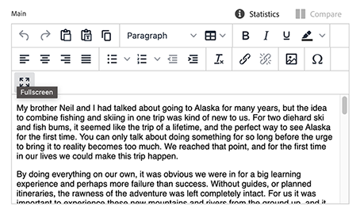
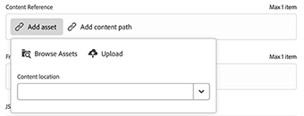
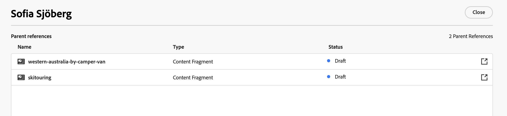

# Inhoudsfragmenten ontwerpen {#authoring-content-fragments}

Het ontwerpen van inhoudsfragmenten is zowel gericht op de levering zonder kop als op het ontwerpen van pagina&#39;s.

Er zijn twee editors beschikbaar voor inhoudsfragmenten. De editor die in deze sectie wordt beschreven:

* is ontwikkeld voor inhoud zonder kop (hoewel het voor alle scenario&#39;s kan worden gebruikt)
* is beschikbaar bij de **console van de Fragmenten van de Inhoud**

Deze editor biedt:

* [ auto-sparen ](#saving-autosaving), om toevallig verlies van uitgeeft te verhinderen.
* [ In-line het uploaden van activa als inhoudsverwijzingen ](#reference-images), zonder het moeten hen aan Activa DAM eerst uploaden.
* [ produceer Variaties ](#generate-variations-ai) om Generatieve AI te gebruiken om inhoudsverwezenlijking te versnellen die op herinneringen wordt gebaseerd.
* [ Voorproef ](#preview-content-fragment) van de teruggegeven ervaring die door het Fragment van de Inhoud wordt geleverd.
* Capaciteit om [ te publiceren ](#publish-content-fragment) en [&#128279;](#unpublish-content-fragment) van de redacteur ongedaan te maken.
* Capaciteit aan [ mening, en open, bijbehorende taalexemplaren ](#view-language-copies) in de redacteur.
* Mogelijkheid aan [ details van de meningsversie ](#view-version-history) in de redacteur. U kunt ook terugkeren naar een geselecteerde versie.
* Capaciteit aan [ mening, en open, ouderverwijzingen ](#view-parent-references).
* Een hiërarchische mening van het Fragment van de Inhoud, en zijn verwijzingen, gebruikend de [ boom van de Structuur ](#structure-tree).

>[!WARNING]
>
>De redacteur die in deze sectie wordt beschreven is *slechts* beschikbaar in [ Verenigde Shell ](/help/overview/aem-cloud-service-on-unified-shell.md); zo *online* Adobe Experience Manager (AEM) as a Cloud Service, niet een lokale instantie.

## Inhoudsfragmenteditor {#content-fragment-editor}

Wanneer u de Inhoudsfragmenteditor voor het eerst opent, ziet u vier hoofdgebieden:

* bovenste werkbalk: voor belangrijke informatie en handelingen
   * een koppeling naar de Content Fragment Console (pictogram Start)
   * informatie over het model en de map
   * verbindingen aan [ Voorproef (als het StandaardPatroon van de Voorproef URL voor het model wordt gevormd) ](/help/sites-cloud/administering/content-fragments/managing-content-fragment-models.md#model-properties)
   * [ publiceer ](#publish-content-fragment), en [ unpublish ](#unpublish-content-fragment) acties
   * een optie om alle **Verwijzingen van de Ouder** (verbindingspictogram) te tonen
   * het fragment **[Status](/help/sites-cloud/administering/content-fragments/managing.md#statuses-content-fragments)**, en laatst bewaarde informatie
   * een schakeloptie voor het overschakelen naar de oorspronkelijke (op Assets gebaseerde) editor

     >[!WARNING]
     >
     >De oorspronkelijke editor wordt op hetzelfde tabblad geopend. Het wordt afgeraden beide editors tegelijk te openen.

* linkerpaneel: toont de **[Variaties](#variations)** voor het Fragment van de Inhoud, en zijn **Gebieden**:
   * deze verbindingen kunnen worden gebruikt om [ de structuur van het Fragment van de Inhoud te navigeren ](#navigate-structure)
* juist paneel: stelt lusjes [ voor die de eigenschappen (meta-gegevens) en markeringen ](#view-properties-tags) tonen, informatie over de [ versiegeschiedenis ](#view-version-history), en informatie met betrekking tot om het even welke [ taalexemplaren ](#view-language-copies)
   * in het **lusje van Eigenschappen** kunt u de **Titel** en **Beschrijving** voor het fragment bijwerken, of **Variatie**
   * In het **lusje van Commentaren** kunt u toevoegen, en lezen, commentaren helpen u met andere auteurs samenwerken
* centraal deelvenster: geeft de daadwerkelijke velden en inhoud van de geselecteerde variatie weer
   * kunt u de inhoud bewerken
      * wanneer gevormd (als veelvoud) in het model, staan diverse gegevenstypes u toe **&#x200B;**&#x200B;instanties van het relevante gebied toevoegen
   * als **de gebieden van Tijdelijke aanduiding van het Lusje** worden bepaald binnen het model zij hier en worden getoond:
      * kan worden gebruikt voor navigatie
      * wordt horizontaal weergegeven of als een vervolgkeuzelijst

  >[!NOTE]
  >
  >Afhankelijk van definities in het onderliggende model, kunnen de gebieden aan bepaalde types van [ Bevestiging ](/help/assets/content-fragments/content-fragments-models.md#validation) onderworpen zijn.

## Navigeren door de structuur van het inhoudsfragment {#navigate-structure}

één inhoudsfragment;

* Bestaat uit twee niveaus:

   * **[Variaties](#variations)** van het Fragment van de Inhoud
   * **Gebieden** - die door het Model van het Fragment van de Inhoud worden bepaald, en door elke variatie worden gebruikt

* Kan verschillende verwijzingen bevatten.

### Variaties en velden {#variations-and-fields}

In het linkerpaneel kunt u zien:

* de lijst van **[Variaties](#variations)** die voor dit fragment zijn gecreeerd:
   * **Hoofd** is de Variatie die aanwezig is wanneer het Fragment van de Inhoud eerst wordt gecreeerd, kunt u anderen later toevoegen
   * u kunt gebruiken produceert Variaties (#generate-Variaties) om een op herinnering gebaseerde malplaatje te gebruiken dat Adobe voor een specifiek gebruiksgeval heeft gecreeerd.
   * u kunt ook [ tot een Variatie ](#create-variation) leiden
* de **Gebieden** binnen het fragment, en zijn variaties:
   * het pictogram wijst op het [ Type van Gegevens ](/help/sites-cloud/administering/content-fragments/content-fragment-models.md#data-types)
   * de tekst is de veldnaam
   * deze vormen samen een directe koppeling naar de inhoud van het veld in het centrale venster (voor de huidige variatie)

### Koppelingen volgen {#follow-links}

In verschillende delen van de editor ziet u het koppelingspictogram. Dit pictogram kan worden gebruikt om het weergegeven item te openen, bijvoorbeeld een Content Fragment Model, een Parent Reference of een fragment waarnaar wordt verwezen:

### Structuurelboom {#structure-tree}

Open het **lusje van de boom van de Structuur** van de redacteurstoolbar om de hiërarchische structuur van het Fragment van de Inhoud, en zijn verwijzingen te tonen. Gebruik de koppelingspictogrammen om naar de referenties te navigeren.

>[!NOTE]
>
>Zie [ Analyserend de Structuur van het Fragment van de Inhoud - de boom van de Structuur ](/help/sites-cloud/administering/content-fragments/analysis.md#structure-tree) voor meer details.

## Opslaan en automatisch opslaan {#saving-autosaving}

<!-- CHECK: cannot be saved, no undo, redo -->

Bij elke update die u maakt, wordt het inhoudsfragment automatisch opgeslagen. De laatst opgeslagen tijd wordt weergegeven in de bovenste werkbalk.

## Variaties {#variations}

[ de Variaties ](/help/sites-cloud/administering/content-fragments/overview.md#main-and-variations) zijn een significante eigenschap van de Fragmenten van de Inhoud van AEM. Zij staan u toe om exemplaren van de **Belangrijkste** inhoud voor gebruik op specifieke kanalen, en scenario&#39;s tot stand te brengen en uit te geven, makend koploze inhoudslevering en pagina het schrijven nog flexibeler.

Vanuit de editor kunt u:

* [ creeer variaties ](#create-variation) van de **Belangrijkste** inhoud

* [ het Gebruik produceert Variaties AI ](#generate-variations-ai) om Generatieve AI te gebruiken om een snel gebaseerd malplaatje te gebruiken dat Adobe voor een specifiek gebruiksgeval heeft gecreeerd.

* Selecteer de gewenste variatie voor het bewerken van de inhoud

* [Naam van variatie wijzigen](#rename-variation)

* [Een variatie verwijderen](#delete-variation)

### Een variatie maken {#create-variation}

Een variatie van het inhoudsfragment maken:

1. In het linkerpaneel, selecteer het **plusteken** (**creeer variatie**) die rechts van **Variaties** is.

   >[!NOTE]
   >
   >Nadat u de eerste variatie hebt gemaakt, worden bestaande variaties in hetzelfde deelvenster weergegeven.

   

1. In de dialoog, ga a **Titel** voor uw variatie in, en a **Beschrijving** als gewild:

   

1. **creeer** de variatie. De naam wordt weergegeven in de lijst.

### De naam van een variatie wijzigen {#rename-variation}

Om a **Verandering** anders te noemen:

1. Selecteer de gewenste variatie.

1. Open het **lusje van Eigenschappen** in het juiste paneel.

1. Werk de variatie **Titel** bij.

1. Of druk **Terugkeer** of beweging aan een ander gebied om de verandering auto-sparen. De titel wordt bijgewerkt in het **paneel van Variaties** op de linkerzijde.

### Variaties maken met GenAI met Variaties genereren {#generate-variations-ai}

Gebruik Generatieve variaties om generatieve AI te gebruiken om het maken van inhoud te versnellen.

Open de Inhoudsfragmenteditor om het ingangspunt te zoeken voor het genereren van variaties.

Zie [ Variaties produceren - in AEM Editors ](/help/generative-ai/generate-variations-integrated-editor.md) geïntegreerd om meer te leren.

### Een wijziging verwijderen {#delete-variation}

Een variatie van het inhoudsfragment verwijderen:

    >[ !NOTA] 
    > 
    >U kunt niet **Main** schrappen.

1. Selecteer de variatie.

1. In het **paneel van de Variatie**, selecteer het schrappingspictogram (het Afval kan):

   

1. Er wordt een dialoogvenster geopend. Selecteer **Schrapping** om de actie te bevestigen.

## Tekstvelden met meerdere regels bewerken - Onbewerkte tekst of Markering {#edit-multi-line-text-fields-plaintext-markdown}

[&#128279;](/help/sites-cloud/administering/content-fragments/content-fragment-models.md#data-types)**de gebieden van de 0&rbrace; Meerdere lijntekst &lbrace;kunnen één van drie formaten hebben:**

* Onbewerkte tekst
* [Markering](/help/sites-cloud/administering/content-fragments/markdown.md)
* [RTF](#edit-multi-line-text-fields-rich-text)

Velden die zijn gedefinieerd als Onbewerkte tekst of Markeringen, hebben een eenvoudig tekstvak, zonder opmaakopties (op het scherm):

## Tekstvelden met meerdere regels bewerken - RTF {#edit-multi-line-text-fields-rich-text}

Voor **[Meerdere lijntekst](/help/sites-cloud/administering/content-fragments/content-fragment-models.md#data-types)** gebieden die als **Rijke Tekst** worden bepaald, zijn diverse eigenschappen beschikbaar:

* Bewerk de inhoud:
   * Ongedaan maken/Opnieuw
   * Plakken/Plakken als tekst
   * Kopiëren
   * Alinea-indeling selecteren
   * Tabel maken/beheren
   * Tekst opmaken; vet, cursief, onderstrepen, kleur
   * Alinea-uitlijning instellen
   * Lijsten maken/beheren; genummerd met opsommingstekens
   * Tekst inspringen; verkleinen, vergroten
   * Huidige opmaak wissen
   * Koppelingen invoegen
   * Verwijzingen naar afbeeldingselementen selecteren en invoegen
   * Speciale tekens toevoegen
* [ volledig-het schermredacteur ](#full-screen-editor-rich-text) - knevel tussen volledig-scherm en in-stroom
* [Statistieken](#statistics-rich-text)
* [Vergelijken en synchroniseren](#compare-and-synchronize-rich-text)

Bijvoorbeeld:

>[!NOTE]
>
>De veelvoudige gebieden van de lijntekst worden ook vermeld door het aangewezen [ pictogram ](#fields-datatypes-icons) in het **paneel van Gebieden**.

### Volledige schermeditor - RTF-tekst {#full-screen-editor-rich-text}

De volledige-schermredacteur biedt de zelfde het uitgeven opties aan zoals wanneer in-stroom - maar biedt meer ruimte voor de tekst aan.

Bijvoorbeeld:

### Statistieken - RTF {#statistics-rich-text}

De actie **Statistieken** toont een waaier van informatie over de tekst op een Meerdere lijngebied.

Bijvoorbeeld:

### Vergelijken en synchroniseren - RTF-tekst {#compare-and-synchronize-rich-text}

De actie **vergelijkt** is beschikbaar voor Meerdere lijngebieden wanneer u open de Verandering van de a **&#x200B;**&#x200B;hebt.

Hiermee opent u het veld Meerdere regels op volledig scherm en:

* toont de inhoud voor zowel **Hoofd** als de huidige **Verandering** parallel, met om het even welke benadrukte verschillen

* verschillen worden aangegeven door kleur:

   * groen geeft de toegevoegde inhoud aan (aan de variatie)
   * rood geeft aan dat inhoud is verwijderd (uit de variatie)
   * blauw geeft vervangen tekst aan

* verstrekt de **Synchronisatie** actie, die de inhoud van **Hoofd** aan de huidige variatie synchroniseert

   * als **Hoofd** is bijgewerkt, dan zullen deze veranderingen worden overgebracht naar de variatie
   * als de variatie is bijgewerkt, dan zullen deze veranderingen door de inhoud van **Hoofd** worden overschreven

  >[!CAUTION]
  >
  >De synchronisatie is slechts beschikbaar om veranderingen *van **Hoofd**&#x200B;aan de variatie* te kopiëren.
  >
  >Het overbrengen van veranderingen *van een variatie aan **Hoofd*** is niet beschikbaar als optie.

Bijvoorbeeld, een scenario waar de variatieinhoud volledig was herschreven, zodat zal een synchronisatie die nieuwe inhoud met de inhoud van **Hoofd** vervangen:

## Referenties beheren {#manage-references}

### Fragmentverwijzingen {#fragment-references}

[ de Verwijzingen van het Fragment ](/help/sites-cloud/administering/content-fragments/content-fragment-models.md#fragment-reference-nested-fragments) kunnen worden gebruikt om:

* [een verwijzing naar een bestaand inhoudsfragment maken](#create-reference-existing-content-fragment)
* [een inhoudsfragment maken en ernaar verwijzen](#create-reference-content-fragment)

#### Een verwijzing naar een bestaand inhoudsfragment maken {#create-reference-existing-content-fragment}

Een verwijzing naar een bestaand inhoudsfragment maken:

1. Selecteer het veld.
1. Selecteer **toevoegen bestaand fragment**.
1. Selecteer het gewenste fragment in de fragmentkiezer.

   >[!NOTE]
   >
   >U mag slechts één fragment tegelijk selecteren.

#### Een inhoudsfragment en verwijzing maken {#create-reference-content-fragment}

Alternatief kunt u [ selecteren **nieuw fragment** creëren om **te openen creeer** dialoog ](/help/sites-cloud/administering/content-fragments/managing.md#creating-a-content-fragment). Wanneer het fragment is gemaakt, wordt er naar dit fragment verwezen.

### Content References {#content-references}

[ Verwijzingen van de Inhoud ](/help/sites-cloud/administering/content-fragments/content-fragment-models.md#content-reference) worden gebruikt om andere inhoudstypes van AEM, zoals beelden, pagina&#39;s, en de Fragmenten van de Ervaring van verwijzingen te voorzien.

#### Referentieafbeeldingen {#reference-images}

In **de gebieden van de Verwijzing van de Inhoud** kunt u:

* verwijzingselementen die al in uw lokale opslagplaats bestaan
* referentiemiddelen die zich in een externe opslagplaats bevinden
* uploadt activa rechtstreeks aan het gebied; dit vermijdt de behoefte om de **Assets** console te gebruiken om te uploaden

  >[!NOTE]
  >
  >Om een beeld aan het **gebied van de Verwijzing van de Inhoud direct te uploaden**, moet het **&#x200B;**:
  >
  >* hebben a **Weg van de Weg van de Weg van de Wortel** bepaald (in het [ Model van het Fragment van de Inhoud ](/help/sites-cloud/administering/content-fragments/content-fragment-models.md#content-reference)). Hiermee geeft u aan waar de afbeelding wordt opgeslagen.
  >* omvat **Beeld** in de lijst van toegelaten inhoudstypes

##### Referentie lokale Assets {#reference-local-assets}

Als u naar een lokaal element wilt verwijzen, kunt u:

* belemmering en laat vallen het nieuwe activadossier direct (bijvoorbeeld, van uw dossiersysteem) in het **gebied van de Verwijzing van de Inhoud**
* gebruik **activa** actie toevoegen, dan uitgezocht of **doorbladeren Assets** of **uploadt** om de aangewezen selecteur voor u te openen om te gebruiken:

   toe

##### Referentie externe Assets {#reference-remote-assets}

Verwijzen naar externe elementen:

1. Specificeer de verre **Bewaarplaats** wanneer het doorbladeren voor activa:

   

2. Na de selectie kunt u de locatie zien in de elementgegevens:

   

###### Externe Assets - Beperkingen {#remote-assets-limitations}

Er zijn enkele beperkingen wanneer wordt verwezen naar externe middelen:

* Slechts [ goedgekeurde ](/help/assets/approve-assets.md) activa zijn beschikbaar voor verwijzing van een verre bewaarplaats van Activa.

* Als een element waarnaar wordt verwezen, wordt verwijderd uit de externe opslagplaats, resulteert dit in een verbroken Content Reference.

* Alle opslagplaatsen voor leveringsmiddelen waartoe de gebruiker toegang heeft, zijn beschikbaar voor selectie. De beschikbare lijst kan niet worden beperkt.

* Zowel de AEM-instantie als de externe gegevensopslagruimte moeten dezelfde versie hebben.

* Er worden geen metagegevens van middelen weergegeven via de API voor beheer of de API voor levering. U moet de API voor metagegevens van middelen gebruiken om de metagegevens van de elementen op te halen:

   * de individuele activa meta-gegevens: [ https://adobe-aem-assets-delivery.redoc.ly/#operation/getAssetMetadata](https://adobe-aem-assets-delivery.redoc.ly/#operation/getAssetMetadata)

   * krijg bulkmeta-gegevensinformatie gebruikend (experimenteel) onderzoek API: [ https://adobe-aem-assets-delivery-experimental.redoc.ly/#operation/search ](https://adobe-aem-assets-delivery-experimental.redoc.ly/#operation/search)

>[!NOTE]
>
>Zie ook [ AEM GraphQL API voor gebruik met de Fragmenten van de Inhoud - Dynamische Media voor OpenAPI activa steun (Verre Assets) ](/help/headless/graphql-api/content-fragments.md#dynamic-media-for-openapi-asset-support)

#### Referentiepagina&#39;s {#reference-pages}

Verwijzingen naar AEM-pagina&#39;s, Experience Fragments of andere soorten inhoud toevoegen:

1. Selecteer **toevoegen inhoudsweg**.

1. Voeg het vereiste pad toe aan het invoerveld.

1. Bevestig met **toevoegt**.

>[!NOTE]
>
>Dit mag niet worden gebruikt voor verwijzingen naar:
>
>* De Fragmenten van de inhoud - gebruik de Verwijzing van het a [ Fragment ](#fragment-references)
>* Beelden - gebruik [ Beelden van de Verwijzing ](#reference-images)

### Bovenliggende verwijzingen weergeven {#view-parent-references}

Als u het koppelingspictogram op de bovenste werkbalk selecteert, wordt een lijst met alle bovenliggende verwijzingen geopend.

Bijvoorbeeld:

Er wordt een venster geopend met een overzicht van alle verwante referenties. Als u een verwijzing wilt openen, selecteert u de naam of titel of het koppelingspictogram.

Bijvoorbeeld:

## Eigenschappen en labels weergeven {#view-properties-tags}

Op het tabblad Eigenschappen van het rechterdeelvenster kunnen eigenschappen (metagegevens) en tags worden weergegeven. De eigenschappen kunnen zijn:

* voor het **Fragment van de Inhoud** - als **Hoofd** momenteel wordt geselecteerd
* voor een specifieke **Variatie**

### Eigenschappen en tags bewerken {#edit-properties-tags}

Op het tabblad Eigenschappen (rechterdeelvenster) kunt u ook het volgende bewerken:

* **Titel**
* **Beschrijving**
* **Markeringen**: het gebruiken van de drop-down lijst, of de selectiedialoog

  

### Het model van het inhoudsfragment openen {#open-content-fragment-model}

Wanneer u **Hoofd** hebt geselecteerd, wordt de naam van het onderliggende Model van het Fragment van de Inhoud getoond in de eigenschappen sectie. Als u het koppelingspictogram selecteert, wordt het model op een apart tabblad geopend.

Bijvoorbeeld:

## Versiehistorie weergeven {#view-version-history}

In het **de geschiedenislusje van de Versie** van het juiste paneel, worden de details van huidige, en vorige, versies getoond:

>[!NOTE]
>
>Er wordt een nieuwe versie gemaakt wanneer het inhoudsfragment wordt gepubliceerd.

### Versie vergelijken {#compare-version}

Voor een inhoudsfragment kunt u een vorige versie vergelijken met de huidige versie.

Een vorige versie vergelijken met de huidige versie:

1. Selecteer het pictogram met drie punten naast de versie.

1. Selecteer **vergelijken**.

Hiermee opent u een weergave waarin de verschillen tussen de huidige versie van de inhoud en de geselecteerde vorige versie van het inhoudsfragment worden weergegeven. Van de **Variaties met veranderingen** drop-down, kunt u selecteren om verschillen van de Belangrijkste inhoud en/of inhoud van een Variatie te zien.

Verschillen worden aangegeven met kleur:

* Groen: geeft inhoud aan die is toegevoegd (aan de huidige versie)
* Rood: geeft aan dat inhoud is verwijderd (uit de huidige versie)

### Versie herstellen {#revert-version}

U kunt terugkeren naar elke gewenste versie.

Een specifieke versie herstellen:

1. Selecteer het pictogram met drie punten naast de versie.

1. Selecteer **terugkeren**.

## De taalkopieën bekijken {#view-language-copies}

In de **eigenschappen van de Taal** lusjedetails van om het even welke verwante taalexemplaren worden getoond. Als u een koppelingspictogram selecteert, wordt de kopie op een apart tabblad geopend.

Bijvoorbeeld:

>[!NOTE]
>
>Voor meer details over het vertalen van een Fragment van de Inhoud, en het creëren van taalexemplaren, zie de [ Hoofdloze Vertaalreis van AEM ](/help/journey-headless/translation/overview.md).

## Opmerkingen over het fragment {#commenting-on-your-fragment}

Om u toe te laten om in-product en in-context samen te werken, verstrekt het **lusje van Commentaren** in het juiste paneel de volgende mogelijkheden:

* Een nieuwe opmerking toevoegen
* Specifieke gebruikers in een opmerking labelen
   * Ze ontvangen een melding met een koppeling om het fragment rechtstreeks te openen
* Als een bestaande opmerking
* Een opmerking beantwoorden
* Uw opmerkingen opmaken; basisopmaak is beschikbaar
* Een tekstzoekopdracht uitvoeren met bestaande opmerkingen
* Een bestaande opmerking bewerken
* Opmerkingen verwijderen

>[!NOTE]
>
>Deze commentaren zijn niet zichtbaar als [ Annotaties in de originele redacteur ](/help/assets/content-fragments/content-fragments-managing.md#annotating-a-content-fragment), noch in de [ Chronologie van de console van Assets ](/help/assets/content-fragments/content-fragments-managing.md#timeline-for-content-fragments).

## Voorvertoning van fragment weergeven {#preview-content-fragment}

De inhoudsfragmenteditor biedt auteurs de mogelijkheid om een voorvertoning van hun bewerkingen weer te geven in een externe frontendtoepassing.

Als u deze functie wilt gebruiken, moet u eerst:

* Werk met uw IT-team om de externe frontendtoepassing in te stellen die het inhoudsfragment rendert door de JSON-uitvoer te verbruiken.
* Wanneer de externe frontend toepassing opstelling is, moet het **StandaardPatroon van de Voorproef URL** als a [ bezit van het aangewezen Model van het Fragment van de Inhoud worden bepaald ](/help/sites-cloud/administering/content-fragments/managing-content-fragment-models.md#model-properties).

Wanneer URL is bepaald, is de **knoop van de Voorproef** actief. U kunt deze knop selecteren om de externe toepassing te starten (op een afzonderlijk tabblad) om het inhoudsfragment te renderen.

## Fragment publiceren {#publish-content-fragment}

U kunt **publiceren** uw fragment aan of uw:

* Voorbeeldexemplaar
* Instantie publiceren

U kunt het fragment publiceren vanuit de editor of de console. Zie [ het Publiceren en het Voorvertonen van een Fragment ](/help/sites-cloud/administering/content-fragments/managing.md#publishing-and-previewing-a-fragment) voor volledige details.

## Publicatie van het fragment ongedaan maken {#unpublish-content-fragment}

U kunt **ook unpublish** uw fragment van of uw:

* Voorbeeldexemplaar
* Instantie publiceren

U kunt de publicatie van het fragment ongedaan maken vanuit de editor of de console. Zie [ Unpublishing een fragment ](/help/sites-cloud/administering/content-fragments/managing.md#unpublishing-a-fragment) voor volledige details.

## Velden, gegevenstypen en pictogrammen {#fields-datatypes-icons}

Het **paneel van Gebieden** maakt een lijst van alle gebieden binnen het Fragment van de Inhoud. Het pictogram wijst op het **[Type van Gegevens](/help/sites-cloud/administering/content-fragments/content-fragment-models.md#data-types)**:

<table style="table-layout:auto">
 <tbody>
  <tr>
   <td>
<b>Tekst met één regel</b>
 </td>
   <td>
  
</td>
  </tr>
  <tr>
   <td>
<b>Tekst met meerdere regels</b>
 </td>
   <td>
  
</td>
  </tr>
  <tr>
   <td>
<b>Getal</b>
 </td>
   <td>
  
</td>
  </tr>
  <tr>
   <td>
<b>Boolean</b>
 </td>
   <td>
  
</td>
  </tr>
  <tr>
   <td>
<b>Datum en tijd</b>
 </td>
   <td>
  
</td>
  </tr>
  <tr>
   <td>
<b>Opsomming</b>
 </td>
   <td>
  
</td>
  </tr>
  <tr>
   <td>
<b>Tags</b>
 </td>
   <td>
  
</td>
  </tr>
  <tr>
   <td>
<b>Content Reference</b>
 </td>
   <td>
  
</td>
  </tr>
  <tr>
   <td>
<b>Fragmentverwijzing</b>
 </td>
   <td>
  
</td>
  </tr>
  <tr>
   <td>
<b>JSON-object</b>
 </td>
   <td>
  
</td>
  </tr>
  <tr>
   <td>
<b>Tijdelijke aanduiding voor tab</b>

Hoewel niet vertegenwoordigd door een werkelijk pictogram, wordt Placeholder van het a <b> Lusje </b> vertegenwoordigd in het linkerpaneel.   het wordt ook vertegenwoordigd in het centrale paneel, of horizontaal zoals getoond, of in een drop-down lijst (wanneer er teveel zijn om horizontaal te tonen).
 </td>
   <td>
  
</td>
  </tr>
 </tbody>
</table>

## Goed om te weten {#good-to-know}

* Om een Fragment van de Inhoud uit te geven hebt u [ de aangewezen toestemmingen ](/help/implementing/developing/extending/content-fragments-customizing.md#asset-permissions) nodig. Neem contact op met de systeembeheerder als er problemen optreden.

  Als u bijvoorbeeld geen `edit` -machtigingen hebt, is de editor alleen-lezen.

* Een model van het Fragment van de Inhoud kan gegevensgebieden vaak bepalen genoemd **Titel** en **Beschrijving**. Als deze gebieden bestaan, zijn zij user-defined gebieden en kunnen in het *centrale paneel* worden bijgewerkt wanneer het uitgeven van het fragment.

  Het tevreden Fragment, en zijn variaties, hebben ook meta-gegevensgebieden (de eigenschappen van de Variatie) geroepen **Titel** en **Beschrijving**. Deze velden maken integraal deel uit van elk inhoudsfragment en worden in eerste instantie gedefinieerd wanneer het fragment wordt gemaakt. Zij kunnen in het *juiste paneel* worden bijgewerkt wanneer het uitgeven van het fragment.

* Zie de documentatie van Assets voor volledige informatie over de [ originele redacteur van het Fragment van de Inhoud ](/help/assets/content-fragments/content-fragments-variations.md) - het is beschikbaar van zowel de **Assets** console als de **console van de Fragmenten van de Inhoud**.

* Uw projectteam kan de redacteur indien nodig aanpassen. Zie [ het Aanpassen van de Console en de Redacteur van het Fragment van de Inhoud ](/help/implementing/developing/extending/content-fragments-console-and-editor.md) voor verdere details.
