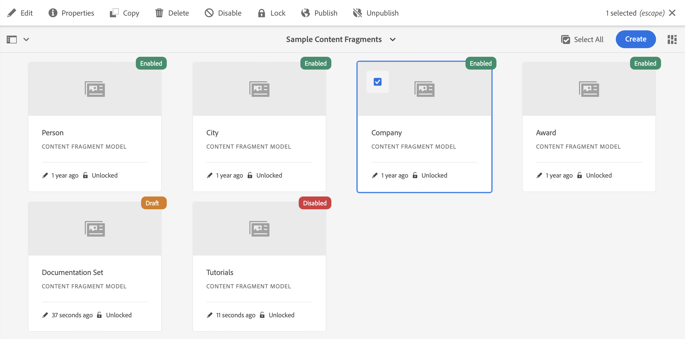

# Modellen van inhoudsfragmenten {#content-fragment-models}

>[!IMPORTANT]
>
>Verschillende kenmerken van de modellen van inhoudsfragmenten zijn beschikbaar via het programma Early adopter.
>
>Om de status te zien, en hoe te om toe te passen als u geinteresseerd bent, controleer de [ Nota&#39;s van de Versie ](/help/release-notes/release-notes-cloud/release-notes-current.md).

De Modellen van het Fragment van de inhoud in Adobe Experience Manager (AEM) bepalen as a Cloud Service de structuur voor de inhoud van uw [ Fragmenten van de Inhoud ](/help/sites-cloud/administering/content-fragments/overview.md). Deze fragmenten kunnen vervolgens worden gebruikt voor het ontwerpen van pagina&#39;s of als basis voor inhoud zonder kop.

U kunt als volgt modellen van inhoudsfragmenten gebruiken:

1. [Functionaliteit van inhoudsfragmentmodel inschakelen voor uw instantie](/help/sites-cloud/administering/content-fragments/setup.md)
1. [ creeer ](#creating-a-content-fragment-model), en [ vorm ](#defining-your-content-fragment-model), uw Modellen van het Fragment van de Inhoud
1. [ laat uw Modellen van het Fragment van de Inhoud ](#enabling-disabling-a-content-fragment-model) voor gebruik toe wanneer het creëren van de Fragmenten van de Inhoud
1. [ sta uw Modellen van het Fragment van de Inhoud op de vereiste omslagen van Assets ](#allowing-content-fragment-models-assets-folder) toe door **Beleid** te vormen.

## Een inhoudsfragmentmodel maken {#creating-a-content-fragment-model}

1. Navigeer aan **Hulpmiddelen**, **Algemene**, dan open **Modellen van het Fragment van de Inhoud**.
1. Navigeer aan de omslag aangewezen aan uw [ configuratie, of subconfiguration ](/help/sites-cloud/administering/content-fragments/setup.md).
1. Het gebruik **creeert** om de tovenaar te openen.

   >[!CAUTION]
   >
   >Als het [ gebruik van de modellen van het Fragment van de Inhoud niet ](/help/sites-cloud/administering/content-fragments/setup.md) is toegelaten, **creeer** optie zal niet beschikbaar zijn.

1. Specificeer de **ModelTitel**.
U kunt diverse eigenschappen ook bepalen; bijvoorbeeld, voeg **Markeringen** toe, a **Beschrijving**, laat model **toe** om [ het model ](#enabling-disabling-a-content-fragment-model) toe als vereist en bepaalt
   **Standaard het Patroon van URL van de Voorproef**.

   >[!NOTE]
   >
   >Zie [ Model van het Fragment van de Inhoud - Eigenschappen ](#content-fragment-model-properties) voor volledige details.

   

1. Het gebruik **creeert** om het lege model te bewaren. Een bericht wijst op het succes van de actie, kunt u **Open** selecteren om het model onmiddellijk uit te geven, of **Gedaan** om aan de console terug te keren.

>[!CAUTION]
>
>Als u meerdere fragmenten waarnaar wordt verwezen, wilt opvragen, is het niet aan te raden dat de verschillende fragmentmodellen veldnamen met dezelfde naam hebben, maar verschillende typen.
>
>Voor verdere details zie [ AEM GraphQL API voor gebruik met de Fragmenten van de Inhoud - Beperkingen ](/help/headless/graphql-api/content-fragments.md#limitations)

### Inhoudsfragmentmodel - eigenschappen {#content-fragment-model-properties}

Deze eigenschappen worden bepaald wanneer u een model creeert, en kunnen later met de **optie van Eigenschappen** voor het Model van het Fragment van de Inhoud worden uitgegeven:

* **Basis**
   * **ModelTitel**
   * **Markeringen**
   * **Beschrijving**
   * **laat model** toe
   * **Standaard het Patroon van URL van de Voorproef**
De redacteur van het Fragment van de Inhoud staat auteurs toe om **** hun inhoud in een externe frontend toepassing voor te vertonen. Zodra de **Dienst van de Voorproef** wordt gevormd, voeg URL voor de frontend toepassing toe.

     De voorbeeld-URL moet dit patroon volgen:
    `https://<preview_url>?param=${expression}`

     Beschikbare expressies zijn:

      * `${contentFragment.path}`
      * `${contentFragment.model.path}`
      * `${contentFragment.model.name}`
      * `${contentFragment.variation}`
      * `${contentFragment.id}`

   * **upload Beeld**

<!-- CHECK: currently under FT -->
<!--
* **GraphQL**
  Define names relevant for GraphQL.
  Changing the GraphQL API Name, or Query field names will impact client applications.
  * **API Name**
    Represents the GraphQL type and query field names in the GraphQL schema.
  * **Single Query Field Name**
    Represents the GraphQL single query field name in the GraphQL schema.
  * **Multiple Query Field Name**
    Represents the GraphQL multiple query field name in the GraphQL schema.
-->

## Het model van het inhoudsfragment definiëren {#defining-your-content-fragment-model}

Het model van het Fragment van de Inhoud bepaalt effectief de structuur van de resulterende Fragmenten van de Inhoud gebruikend een selectie van **[Types van Gegevens](#data-types)**. Gebruikend de modelredacteur kunt u instanties van de gegevenstypes toevoegen, dan hen vormen om de vereiste gebieden tot stand te brengen:

>[!CAUTION]
>
>Het bewerken van een model dat al wordt gebruikt door bestaande inhoudsfragmenten kan van invloed zijn op die afhankelijke fragmenten.

1. Navigeer aan **Hulpmiddelen**, **Algemene**, dan open **Modellen van het Fragment van de Inhoud**.

1. Navigeer naar de map met het model van het inhoudsfragment.
1. Open het vereiste model voor **uitgeven**; gebruik of de snelle actie, of selecteer het model en toen de actie van de toolbar.

   Zodra open de modelredacteur toont:

   * links: velden al gedefinieerd
   * rechts: **datatypen** voor het maken van velden (en **eigenschappen** voor gebruik als er velden zijn gemaakt)

   >[!NOTE]
   >
   >Wanneer een gebied als **Vereist** wordt bepaald, wordt het **Etiket** dat in de linkerruit wordt vermeld duidelijk met een asterix (**&#42;**).


1. **om een Gebied** toe te voegen

   * Sleep een vereist gegevenstype naar de vereiste locatie voor een veld:

      tot stand te brengen

   * Zodra een gebied aan het model is toegevoegd, toont het juiste paneel de **Eigenschappen** die voor dat bepaalde gegevenstype kunnen worden bepaald. Hier kunt u definiëren wat voor dat veld is vereist.

      * Vele eigenschappen zijn duidelijk-verklarend, voor extra details zie [ Eigenschappen ](#properties).
      * Het typen a **Etiket van het Gebied** auto-voltooit de **Naam van het Bezit** - als leeg, en het kan achteraf manueel worden bijgewerkt.

        >[!CAUTION]
        >
        Wanneer manueel het bijwerken van de naam van het bezit **** voor een gegevenstype, moeten de namen *slechts* a-z, a-z, 0-9 en onderstrepingsteken &quot;_&quot;als speciaal karakter bevatten.
        >
        Als modellen die in eerdere versies van AEM zijn gemaakt, ongeldige tekens bevatten, verwijdert of werkt u die tekens bij.

     Bijvoorbeeld:

     

1. **om een Gebied** te verwijderen

   Selecteer het vereiste veld en selecteer vervolgens het prullenbakpictogram. U wordt gevraagd de actie te bevestigen.

   

1. Voeg alle vereiste velden toe en definieer de bijbehorende eigenschappen, zoals vereist. Bijvoorbeeld:

   

1. Selecteer **sparen** om de definitie voort te zetten.

## Gegevenstypen {#data-types}

Voor het definiëren van uw model zijn verschillende gegevenstypen beschikbaar:

* **Enige lijntekst**
   * Een veld toevoegen voor één regel tekst; de maximumlengte kan worden gedefinieerd
   * Het veld kan zo worden geconfigureerd dat fragmentauteurs nieuwe instanties van het veld kunnen maken

* **Meerdere lijntekst**
   * Een tekstgebied dat RTF-tekst, platte tekst of Markering kan zijn
   * Het veld kan zo worden geconfigureerd dat fragmentauteurs nieuwe instanties van het veld kunnen maken

  >[!NOTE]
  >
  Of het tekstgebied Rijke Tekst, Onbewerkte Tekst, of Markting is, wordt bepaald in het model door het bezit **StandaardType**.
  >
  Dit formaat kan niet van de [ redacteur van het Fragment van de Inhoud ](/help/sites-cloud/administering/content-fragments/authoring.md) worden veranderd, maar slechts van het Model.

* **Aantal**
   * Een numeriek veld toevoegen
   * Het veld kan zo worden geconfigureerd dat fragmentauteurs nieuwe instanties van het veld kunnen maken

* **Van Boole**
   * Een Booleaans selectievakje toevoegen

* **Datum en tijd**
   * Een datum- en/of tijdveld toevoegen

* **Opsomming**
   * Een set selectievakjes, keuzerondjes of vervolgkeuzelijsten toevoegen
      * U kunt de opties specificeren beschikbaar aan de fragmentauteur

* **Markeringen**
   * Hiermee kunnen auteurs van fragmenten gebieden met tags openen en selecteren
* **Verwijzing van het Fragment**
   * Verwijzingen andere Fragmenten van de Inhoud; kan worden gebruikt om [ genestelde inhoud ](#using-references-to-form-nested-content) tot stand te brengen
   * Het gegevenstype kan worden geconfigureerd om fragmentauteurs toe te staan:
      * Bewerk het fragment waarnaar wordt verwezen rechtstreeks.
      * Een nieuw inhoudsfragment maken op basis van het juiste model
      * Nieuwe instanties van het veld maken
   * De verwijzing geeft het pad naar de resource waarnaar wordt verwezen aan, bijvoorbeeld `/content/dam/path/to/resource`
* **Verwijzing van het Fragment (UUID)**
   * Verwijzingen andere Fragmenten van de Inhoud; kan worden gebruikt om [ genestelde inhoud ](#using-references-to-form-nested-content) tot stand te brengen
   * Het gegevenstype kan worden geconfigureerd om fragmentauteurs toe te staan:
      * Bewerk het fragment waarnaar wordt verwezen rechtstreeks.
      * Een nieuw inhoudsfragment maken op basis van het juiste model
      * Nieuwe instanties van het veld maken
   * In de redacteur, specificeert de verwijzing de weg aan het referenced middel; intern wordt de verwijzing gehouden als universeel unieke identiteitskaart (UUID) die verwijzingen het middel
      * U hoeft de UUID niet te weten; in de fragmenteditor kunt u naar het vereiste fragment bladeren

* **Verwijzing van de Inhoud**
   * Verwijzingen andere inhoud, van om het even welk type; kan worden gebruikt om [ te creëren genestelde inhoud ](#using-references-to-form-nested-content)
   * Als er naar een afbeelding wordt verwezen, kunt u ervoor kiezen een miniatuur weer te geven
   * Het veld kan zo worden geconfigureerd dat fragmentauteurs nieuwe instanties van het veld kunnen maken
   * De verwijzing geeft het pad naar de resource waarnaar wordt verwezen aan, bijvoorbeeld `/content/dam/path/to/resource`
* **Verwijzing van de Inhoud (UUID)**
   * Verwijzingen andere inhoud, van om het even welk type; kan worden gebruikt om [ te creëren genestelde inhoud ](#using-references-to-form-nested-content)
   * Als er naar een afbeelding wordt verwezen, kunt u ervoor kiezen een miniatuur weer te geven
   * Het veld kan zo worden geconfigureerd dat fragmentauteurs nieuwe instanties van het veld kunnen maken
   * In de redacteur, specificeert de verwijzing de weg aan het referenced middel; intern wordt de verwijzing gehouden als universeel unieke identiteitskaart (UUID) die verwijzingen het middel
      * U hoeft de UUID niet te weten; in de fragmenteditor kunt u naar de vereiste elementbron bladeren

* **voorwerp JSON**
   * Hiermee stelt u de auteur van inhoudsfragment in staat JSON-syntaxis in te voeren in de overeenkomende elementen van een fragment.
      * Om AEM toe te staan direct JSON op te slaan die u van een andere dienst hebt gekopieerd/gekleefd.
      * De JSON wordt doorgegeven en uitvoer als JSON in GraphQL.
      * Neemt JSON-syntaxismarkering, automatisch aanvullen en foutmarkering op in de inhoudsfragmenteditor.

* **Placeholder van het Lusje**
   * Hiermee kunt u tabbladen invoeren die u kunt gebruiken bij het bewerken van de inhoud van het inhoudsfragment.
      * Deze worden getoond als verdelers in de modelredacteur, scheidend secties van de lijst van inhoudstypes. Elke instantie vertegenwoordigt het begin van een nieuw lusje.
      * In de fragmenteditor wordt elke instantie weergegeven als een tab.

     >[!NOTE]
     >
     Dit gegevenstype wordt alleen gebruikt voor opmaak en wordt genegeerd door het schema AEM GraphQL.

## Eigenschappen {#properties}

Vele eigenschappen zijn voor zichzelf verklarend, voor bepaalde eigenschappen zijn hieronder meer details te vinden:

* **de Naam van het Bezit**

  Wanneer manueel het bijwerken van dit bezit voor een gegevenstype, moeten de namen **** *slechts* a-z, a-z, 0-9 en onderstrepingsteken &quot;_&quot;als speciaal karakter bevatten.

  >[!CAUTION]
  >
  Als modellen die in eerdere versies van AEM zijn gemaakt, ongeldige tekens bevatten, verwijdert of werkt u die tekens bij.

* **geeft terug als**

  De verschillende opties voor het realiseren/renderen van het veld in een fragment. Hierdoor kunt u vaak definiëren of de auteur één exemplaar van het veld ziet of meerdere exemplaren mag maken. Wanneer **Veelvoudig Gebied** wordt gebruikt kunt u het minimum en maximumaantal punten bepalen - zie [ Bevestiging ](#validation) voor verdere details.

* **Etiket van het Gebied**
Het ingaan van het Etiket van het a **Gebied** autogenerate a **Naam van het Bezit**, die dan manueel kan worden bijgewerkt indien nodig.

* **Bevestiging**
De fundamentele bevestiging is beschikbaar door mechanismen zoals het **Vereiste** bezit. Sommige gegevenstypen hebben extra validatievelden. Zie [ Bevestiging ](#validation) voor verdere details.

* Voor het datatype **Tekst met meerdere regels** is het mogelijk het **standaardtype** als volgt te definiëren:

   * **Rijke Tekst**
   * **Markering**
   * **Onbewerkte Tekst**

  Als gespecificeerd niet, wordt de standaardwaarde **Rijke Tekst** gebruikt voor dit gebied.

  Het veranderen van het **StandaardType** in een model van het Fragment van de Inhoud zal slechts op bestaand, verwant, het Fragment van de Inhoud van kracht worden nadat dat fragment in de redacteur wordt geopend en wordt bewaard.

* **Uniek**
De inhoud (voor het specifieke veld) moet uniek zijn in alle inhoudsfragmenten die op basis van het huidige model zijn gemaakt.

  Dit wordt gebruikt om ervoor te zorgen dat inhoudsauteurs geen inhoud kunnen herhalen die al in een ander fragment van hetzelfde model is toegevoegd.

  Bijvoorbeeld, het 1} gebied van de a **Enige lijntekst {in het Model van het Fragment van de Inhoud kan niet de waarde `Japan` in twee afhankelijke Fragmenten van de Inhoud hebben.**`Country` Er wordt een waarschuwing weergegeven wanneer de tweede instantie wordt geprobeerd.

  >[!NOTE]
  >
  Er wordt gezorgd voor uniformiteit per taalwortel.

  >[!NOTE]
  >
  De variaties kunnen de zelfde *unieke* waarde zoals variaties van het zelfde fragment hebben, maar niet de zelfde waarde zoals die in om het even welke variatie van andere fragmenten wordt gebruikt.

* Zie **[Verwijzing van de Inhoud](#content-reference)** voor meer details over dat specifieke gegevenstype en zijn eigenschappen.

* Zie **[Verwijzing van het Fragment (Genestelde Fragments)](#fragment-reference-nested-fragments)** voor meer details over dat specifieke gegevenstype en zijn eigenschappen.

* **Vertaalbaar**

  Het controleren van **Vertaalbare** checkbox op een gebied in de Modelredacteur van het Fragment van de Inhoud:

   * Controleer of de eigenschapsnaam van het veld wordt toegevoegd aan de vertaalconfiguratie, context `/content/dam/<sites-configuration>`, als deze nog niet aanwezig is.
   * Voor GraphQL: stel een eigenschap `<translatable>` in het veld Inhoudsfragment in op `yes` om GraphQL-queryfilter toe te staan voor JSON-uitvoer met alleen vertaalbare inhoud.

## Validatie {#validation}

Verschillende gegevenstypen bieden nu de mogelijkheid om validatievereisten te definiëren voor het tijdstip waarop inhoud wordt ingevoerd in het resulterende fragment:

* **Enige lijntekst**
   * Vergelijk met een vooraf gedefinieerde regex.
* **Aantal**
   * Controleren op specifieke waarden.
* **Verwijzing van de Inhoud**
   * Testen op specifieke typen inhoud.
   * Er kan alleen worden verwezen naar elementen van een opgegeven bestandsgrootte of kleiner.
   * Er kan alleen worden verwezen naar afbeeldingen met een vooraf gedefinieerde breedte en/of hoogte (in pixels).
* **Verwijzing van het Fragment**
   * Testen op een specifiek model van een inhoudsfragment.
* **Min Aantal Punten** / **Max Aantal Punten**

  De gebieden die als a **Veelvoudig Gebied** zijn bepaald (die met **worden geplaatst teruggeven als**) hebben de opties:

   * **Min Aantal Punten**
   * **Max Aantal Punten**

  Deze worden bevestigd in de [ Redacteur van het Fragment van de Inhoud ](/help/sites-cloud/administering/content-fragments/authoring.md).

## Referenties gebruiken om geneste inhoud te vormen {#using-references-to-form-nested-content}

Inhoudsfragmenten kunnen geneste inhoud vormen met een van de volgende gegevenstypen:

* [Content Reference](#content-reference)
   * Verstrekt een eenvoudige verwijzing naar andere inhoud; van om het even welk type.
   * Verstrekt door de gegevenstypes:
      * **Verwijzing van de Inhoud** - gebaseerd weg
      * **Verwijzing van de Inhoud (UUID)** - gebaseerd UUID
   * Kan worden geconfigureerd voor een of meerdere verwijzingen (in het resulterende fragment).

* [ Verwijzing van het Fragment ](#fragment-reference-nested-fragments) (Geneste Fragmenten)
   * Verwijzingen naar andere fragmenten, afhankelijk van de opgegeven modellen.
   * Verstrekt door de gegevenstypes:
      * **Verwijzing van het Fragment** - gebaseerd weg
      * **Verwijzing van het Fragment (UUID)** - gebaseerd UUID
   * Hiermee kunt u gestructureerde gegevens opnemen/ophalen.

     >[!NOTE]
     >
     Deze methode is van bijzonder belang wanneer u [ Zwaarloze Levering van de Inhoud gebruikend de Fragmenten van de Inhoud met GraphQL ](/help/sites-cloud/administering/content-fragments/content-delivery-with-graphql.md) gebruikt.
   * Kan worden geconfigureerd voor een of meerdere verwijzingen (in het resulterende fragment).

>[!NOTE]
>
Zie [ bevorderen uw Fragmenten van de Inhoud voor Verwijzingen UUID ](/help/headless/graphql-api/uuid-reference-upgrade.md) voor verdere informatie over de Verwijzing van de Inhoud/van het Fragment en de Verwijzing van de Inhoud/van het Fragment (UUID), en bevordering aan de op UUID-Gebaseerde gegevenstypes.

>[!NOTE]
>
AEM heeft terugkerende bescherming voor:
>
* Content References
Hierdoor wordt voorkomen dat de gebruiker een verwijzing naar het huidige fragment toevoegt en kan dit leiden tot een leeg dialoogvenster van de kiezer voor fragmentverwijzing.
>
* Fragmentverwijzingen in GraphQL
Wanneer u een diepe query maakt die meerdere Content Fragments retourneert waarnaar door elkaar wordt verwezen, retourneert deze null bij de eerste instantie.

>[!CAUTION]
>
Als u meerdere fragmenten waarnaar wordt verwezen, wilt opvragen, is het niet aan te raden dat de verschillende fragmentmodellen veldnamen met dezelfde naam hebben, maar verschillende typen.
>
Voor verdere details zie [ AEM GraphQL API voor gebruik met de Fragmenten van de Inhoud - Beperkingen ](/help/headless/graphql-api/content-fragments.md#limitations)

### Content Reference {#content-reference}

De **Verwijzing van de Inhoud** en **Verwijzing van de Inhoud (UUID)** gegevenstypes staan u toe om inhoud van een andere bron terug te geven; bijvoorbeeld, beeld, pagina of het Fragment van de Ervaring.

Naast de standaardeigenschappen kunt u opgeven:

* Het **Weg van de Wortel**, dat specificeert, of vertegenwoordigt, waar om het even welke referenced inhoud op te slaan
  >[!NOTE]
  >
  Dit is verplicht als u afbeeldingen in dit veld rechtstreeks wilt uploaden en ernaar wilt verwijzen wanneer u de Content Fragment-editor gebruikt.
  >
  Zie [ de Beelden van de Verwijzing ](/help/sites-cloud/administering/content-fragments/authoring.md#reference-images) voor verdere details.

* De inhoudstypen waarnaar kan worden verwezen
  >[!NOTE]
  >
  Deze moeten **Beeld** omvatten als u direct beelden op dit gebied wilt uploaden en van verwijzingen voorzien wanneer het gebruiken van de redacteur van het Fragment van de Inhoud.
  >
  Zie [ de Beelden van de Verwijzing ](/help/sites-cloud/administering/content-fragments/authoring.md#reference-images) voor verdere details.

* Beperkingen voor bestandsgrootten
* Als naar een afbeelding wordt verwezen:
   * Miniatuur tonen
   * Hoogte- en breedtebeperkingen voor afbeeldingen


### Fragmentverwijzing (geneste fragmenten) {#fragment-reference-nested-fragments}

De **Verwijzing van het Fragment** en **Verwijzing van het Fragment (UUID)** gegevenstypes kunnen één, of meer, de Fragmenten van de Inhoud van verwijzingen voorzien. Deze functie is met name van belang wanneer u inhoud ophaalt die u in uw app wilt gebruiken, aangezien u gestructureerde gegevens met meerdere lagen kunt ophalen.

Bijvoorbeeld:

* Een model dat details voor een werknemer bepaalt; met inbegrip van:
   * Een verwijzing naar het model dat de werkgever (onderneming) definieert

```xml
type EmployeeModel {
    name: String
    firstName: String
    company: CompanyModel
}

type CompanyModel {
    name: String
    street: String
    city: String
}
```

>[!NOTE]
>
De Verwijzingen van het fragment zijn van bijzonder belang voor [ Zwaarloze Levering van de Inhoud gebruikend de Fragmenten van de Inhoud met GraphQL ](/help/sites-cloud/administering/content-fragments/content-delivery-with-graphql.md).

Naast de standaardeigenschappen kunt u definiëren:

* **geeft terug als**:

   * **multifield** - de fragmentauteur kan veelvoudige, individuele, verwijzingen creëren

   * **fragmentreference** - staat de fragmentauteur toe om één enkele verwijzing naar een fragment te selecteren

* **ModelType**
U kunt meerdere modellen selecteren. Wanneer u verwijzingen toevoegt aan een inhoudsfragment, moeten fragmenten waarnaar wordt verwezen, met deze modellen zijn gemaakt.

* **Weg van de Wortel**
Hiermee geeft u een hoofdpad op of vertegenwoordigt u dit voor alle fragmenten waarnaar wordt verwezen.

* **staat het Maken van het Fragment toe**

  Hierdoor kan de auteur van het fragment een fragment maken op basis van het juiste model.

   * **fragmentreferencecomposite** - staat de fragmentauteur toe om een samenstelling te bouwen, door veelvoudige fragmenten te selecteren

  

>[!NOTE]
>
Er is een terugkerend beschermingsmechanisme ingesteld. Het is de gebruiker niet toegestaan het huidige inhoudsfragment in de fragmentverwijzing te selecteren en leidt mogelijk tot een leeg dialoogvenster van de kiezer voor fragmentverwijzing.
>
Ook fragmentverwijzingen worden in GraphQL herhaaldelijk beschermd. Als u een diepe vraag over twee Fragments creeert van de Inhoud die elkaar van verwijzingen voorzien, keert het ongeldig terug.

## Een inhoudsfragmentmodel in- of uitschakelen {#enabling-disabling-a-content-fragment-model}

U kunt of **toelaten** of **** uw Modellen van het Fragment van de Inhoud, voor volledige controle over hun gebruik onbruikbaar maken.

### Een inhoudsfragmentmodel inschakelen {#enabling-a-content-fragment-model}

Nadat een model is gemaakt, moet het zijn ingeschakeld zodat het:

* Deze optie is beschikbaar voor selectie wanneer u een inhoudsfragment maakt.
* Er kan vanuit een inhoudsfragmentmodel naar worden verwezen.
* Is beschikbaar aan GraphQL; zo wordt het schema geproduceerd.

Een model inschakelen dat is gemarkeerd als:

* **Ontwerp** : nieuw (nooit toegelaten).
* **Gehandicapten** : is specifiek onbruikbaar gemaakt.

U gebruikt **toelaten** optie van één van beiden:

* De bovenste werkbalk als het vereiste model is geselecteerd.
* De corresponderende snelle actie (mouse-over het vereiste model).

 toe

### Een inhoudsfragmentmodel uitschakelen {#disabling-a-content-fragment-model}

Een model kan ook worden uitgeschakeld, zodat:

* Het model is niet meer beschikbaar als basis voor het creëren van *nieuwe* Fragmenten van de Inhoud.
* Echter:
   * Het GraphQL-schema wordt steeds gegenereerd en kan nog steeds worden opgevraagd (om te voorkomen dat JSON API wordt beïnvloed).
   * Om het even welke die Inhoudsfragmenten van het model worden gebaseerd kunnen nog van het eindpunt van GraphQL worden gevraagd en zijn teruggekeerd.
* Er kan niet meer naar het model worden verwezen, maar bestaande verwijzingen blijven ongewijzigd en kunnen nog steeds worden opgevraagd en geretourneerd vanaf het GraphQL-eindpunt.

Om een Model onbruikbaar te maken dat als **Toegelaten** wordt gemarkeerd, gebruikt u **onbruikbaar maken** optie van of:

* De bovenste werkbalk als het vereiste model is geselecteerd.
* De corresponderende snelle actie (mouse-over het vereiste model).

 onbruikbaar

## Modellen voor inhoudsfragmenten toestaan in uw Assets-map {#allowing-content-fragment-models-assets-folder}

Om inhoudsbeheer uit te voeren, kunt u **Beleid** op de omslag van Assets vormen om te controleren welke Modellen van het Fragment van de Inhoud voor de verwezenlijking van het Fragment in die omslag worden toegestaan.

>[!NOTE]
>
Het mechanisme is gelijkaardig aan [ toestaand paginasjablonen ](/help/sites-cloud/authoring/page-editor/templates.md#allowing-a-template-author) voor een pagina, en zijn kinderen, in geavanceerde eigenschappen van een pagina.

Om het **Beleid** voor **toegelaten Modellen van het Fragment van de Inhoud te vormen**:

1. Navigeer en open **Eigenschappen** voor de vereiste omslag van Assets.

1. Open het **Beleid** lusje, waar u kunt vormen:

   * **Overgenomen van`<folder>`**

     Het beleid wordt automatisch geërft wanneer het creëren van nieuwe kindomslagen; het beleid kan (en de erfenis gebroken) worden opnieuw gevormd als subfolders modellen moeten toestaan verschillend aan de ouderomslag.

   * **Toegestane Modellen van het Fragment van de Inhoud door Weg**

     U kunt meerdere modellen toestaan.

   * **Toegestane Modellen van het Fragment van de Inhoud door Markering**

     U kunt meerdere modellen toestaan.

   

1. **sparen** om het even welke veranderingen.

De modellen van inhoudsfragmenten die zijn toegestaan voor een map, worden als volgt opgelost:
* Het **Beleid** voor **Toegestane Modellen van het Fragment van de Inhoud**.
* Als dit leeg is, kunt u het beleid bepalen met behulp van de overervingsregels.
* Als de overervingsketen geen resultaat levert, dan bekijk de **Cloud Servicen** configuratie voor die omslag (ook eerst direct en dan via overerving).
* Als geen van de bovenstaande resultaten worden behaald, zijn er geen modellen toegestaan voor die map.

## Een inhoudsfragmentmodel verwijderen {#deleting-a-content-fragment-model}

>[!CAUTION]
>
Het verwijderen van een model van een inhoudsfragment kan invloed hebben op afhankelijke fragmenten.

Een model van een inhoudsfragment verwijderen:

1. Navigeer aan **Hulpmiddelen**, **Algemene**, dan open **Modellen van het Fragment van de Inhoud**.

1. Navigeer naar de map met het model van het inhoudsfragment.
1. Selecteer uw model, dat door **wordt gevolgd Schrapping** van de toolbar.

   >[!NOTE]
   >
   Als naar het model wordt verwezen, wordt een waarschuwing gegeven, zodat u aangewezen actie kunt nemen.

## Een inhoudsfragmentmodel publiceren {#publishing-a-content-fragment-model}

Modellen van inhoudsfragmenten moeten worden gepubliceerd wanneer/voordat afhankelijke inhoudsfragmenten worden gepubliceerd.

Een model van een inhoudsfragment publiceren:

1. Navigeer aan **Hulpmiddelen**, **Algemene**, dan open **Modellen van het Fragment van de Inhoud**.

1. Navigeer naar de map met het model van het inhoudsfragment.
1. Selecteer uw model, dat door **wordt gevolgd Publish** van de toolbar.
De gepubliceerde status wordt getoond in de console.

   >[!NOTE]
   >
   Als u een inhoudsfragment publiceert waarvoor het model nog niet is gepubliceerd, wordt dit in een selectielijst aangegeven en wordt het model met het fragment gepubliceerd.

## Publicatie van een inhoudsfragmentmodel ongedaan maken {#unpublishing-a-content-fragment-model}

Modellen van inhoudsfragmenten kunnen ongepubliceerd zijn als naar deze modellen niet wordt verwezen door fragmenten.

Publicatie van een inhoudsfragmentmodel ongedaan maken:

1. Navigeer aan **Hulpmiddelen**, **Algemene**, dan open **Modellen van het Fragment van de Inhoud**.

1. Navigeer naar de map met het model van het inhoudsfragment.
1. Selecteer uw model, dat door **wordt gevolgd unpublish** van de toolbar.
De gepubliceerde status wordt vermeld in de console.

Als u de publicatie probeert ongedaan te maken van een model dat momenteel wordt gebruikt door een of meer fragmenten, wordt een foutwaarschuwing weergegeven. Bijvoorbeeld:


Het bericht stelt voor dat u het [ paneel van Verwijzingen ](/help/sites-cloud/authoring/basic-handling.md#references) controleert om verder te onderzoeken:


## Vergrendelde (gepubliceerde) modellen van inhoudsfragmenten {#locked-published-content-fragment-models}

Deze functie biedt beheer voor modellen van inhoudsfragmenten die zijn gepubliceerd.

### De uitdaging {#the-challenge}

* Met Content Fragment Models wordt het schema voor GraphQL-query&#39;s in AEM bepaald.

   * AEM GraphQL-schema&#39;s worden gemaakt zodra een Content Fragment Model is gemaakt en kunnen bestaan in zowel auteur- als publicatieomgevingen.

   * Schema&#39;s bij publiceren zijn het meest kritiek aangezien zij de basis voor levende levering van inhoud van het Fragment van de Inhoud in formaat JSON verstrekken.

* Er kunnen zich problemen voordoen wanneer modellen van inhoudsfragmenten worden gewijzigd of met andere woorden worden bewerkt. Dit betekent dat het schema verandert, wat op zijn beurt bestaande vragen van GraphQL kan beïnvloeden.

* Het toevoegen van nieuwe velden aan een inhoudsfragmentmodel mag (gewoonlijk) geen nadelige effecten hebben. Als u echter bestaande gegevensvelden wijzigt (bijvoorbeeld hun naam) of velddefinities verwijdert, worden bestaande GraphQL-query&#39;s verbroken wanneer deze velden worden aangevraagd.

### De vereisten {#the-requirements}

* Gebruikers bewust maken van de risico&#39;s bij het bewerken van modellen die al worden gebruikt voor de levering van live-inhoud (met andere woorden, modellen die zijn gepubliceerd).

* Ook, om onbedoelde veranderingen te vermijden.

Één van beide criteria zou vragen kunnen breken als de gewijzigde modellen opnieuw worden gepubliceerd.

### De oplossing {#the-solution}

Om deze kwesties te richten, zijn de Modellen van het Fragment van de Inhoud *gesloten* in een LEZEN-ONLY wijze op auteur - zodra zij zijn gepubliceerd. Deze status wordt vermeld door **Vergrendelde**:


Wanneer het model **Vergrendeld** (op LEZEN-ONLY wijze) is, kunt u de inhoud en de structuur van modellen zien maar u kunt hen niet uitgeven.

U kunt **Vergrendelde** modellen van of de console, of modelredacteur beheren:

* Console

  Van de console, kunt u de LEZEN-ONLY wijze met **leiden ontgrendelt** en **ontgrendelt** acties in de toolbar:

  

   * U kunt **een model ontgrendelen** om uitgeeft toe te laten.

     Als u **** selecteert ontgrendel wordt een waarschuwing getoond, en u moet de **ontgrendelen** actie bevestigen:
     

     Vervolgens kunt u het model openen en bewerken.

   * U kunt **het model ook** Slot achteraf.
   * Het herpubliceren van het model keert het onmiddellijk aan **Vergrendelde** (LEZEN-ONLY) wijze terug.

* Modeleditor

   * Wanneer u een model opent dat wordt gesloten zult u worden gewaarschuwd, en met drie acties voorgesteld: **annuleert**, **Gelezen Mening**, **geeft** uit:

     

   * Als u **Mening slechts** selecteert, kunt u de inhoud en de structuur van het model zien:

     

   * Als u **uitgezocht geef** uit, kunt u uw updates uitgeven en opslaan:

     

     >[!NOTE]
     >
     Mogelijk staat er nog een waarschuwing boven aan het scherm, maar dat is wanneer het model al wordt gebruikt door bestaande inhoudsfragmenten.

   * **annuleert** keert u aan de console terug.
