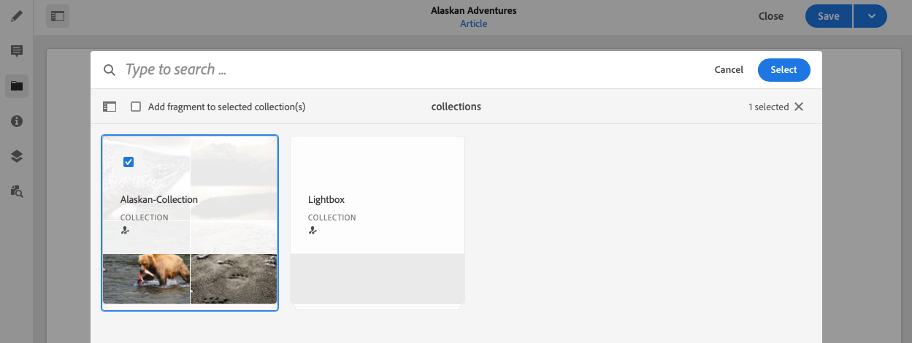
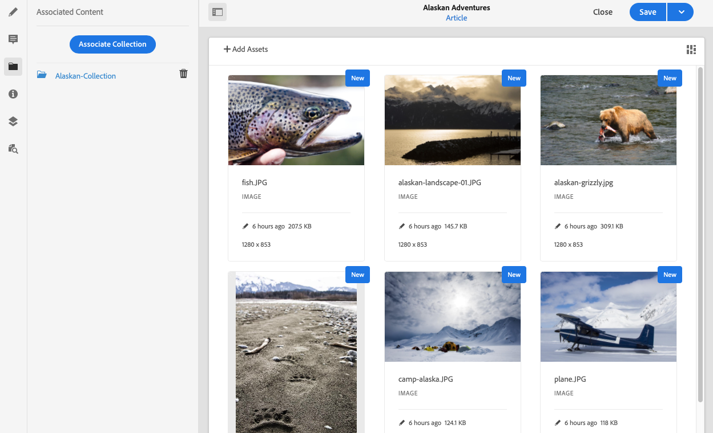

# Gekoppelde inhoud{#associated-content}

AEM de functie Gekoppelde inhoud biedt de verbinding, zodat elementen optioneel met het fragment kunnen worden gebruikt wanneer het aan een inhoudspagina wordt toegevoegd, door [een reeks elementen bieden die toegankelijk zijn wanneer het inhoudsfragment op een pagina wordt gebruikt;](/help/sites-cloud/authoring/fundamentals/content-fragments.md#using-associated-content) en de tijd die nodig is om het juiste middel te zoeken, te verkorten. Dit biedt ook flexibiliteit voor het leveren van inhoud zonder kop.

## Gekoppelde inhoud toevoegen {#adding-associated-content}

>[!NOTE]
>
>Er zijn verschillende methoden om toe te voegen [visuele elementen (bv. afbeeldingen)](/help/sites-cloud/administering/content-fragments/content-fragments.md#fragments-with-visual-assets) op het fragment en/of de pagina.

Als u de koppeling wilt maken, moet u eerst [media-elementen toevoegen aan een verzameling](/help/assets/manage-collections.md). Daarna kunt u:

1. Open uw fragment en selecteer **Gekoppelde content** in het zijpaneel.

   

1. Afhankelijk van het feit of er al verzamelingen zijn gekoppeld of niet, selecteert u een van de volgende opties:

   * **Inhoud koppelen** - dit wordt de eerste bijbehorende verzameling
   * **Verzameling koppelen** - bijbehorende verzamelingen zijn al geconfigureerd

1. Selecteer de gewenste verzameling.

   U kunt optioneel het fragment zelf toevoegen aan de geselecteerde verzameling. dit is het volgen van hulpmiddelen .

   

1. Bevestigen (met **Selecteren**). De verzameling wordt weergegeven als gekoppeld.

   

## Gekoppelde inhoud bewerken {#editing-associated-content}

Nadat u een verzameling hebt gekoppeld, kunt u:

* **Verwijderen** de associatie.
* **Elementen toevoegen** naar de collectie.
* Selecteer een element voor verdere actie.
* Bewerk het element.
