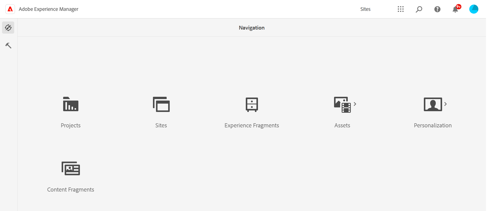
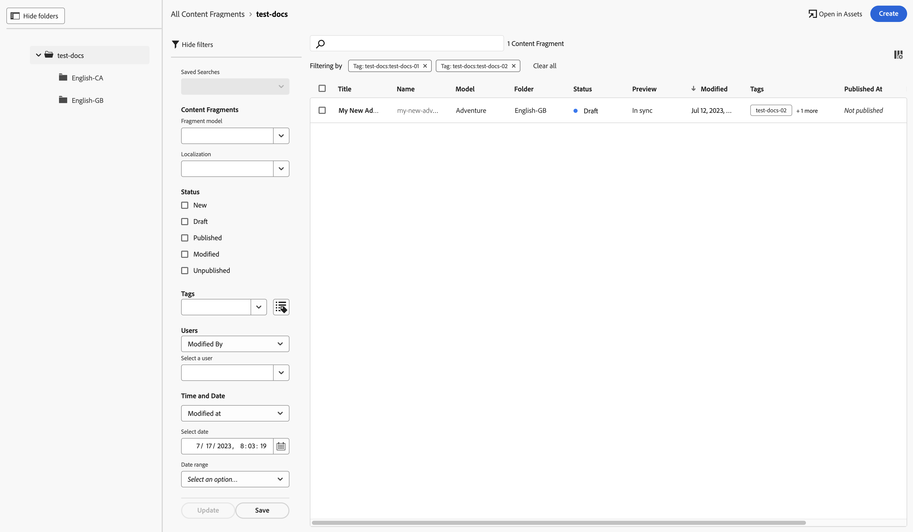
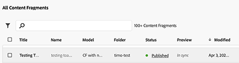

# Console voor inhoudsfragmenten  {#content-fragments-console}

Leer hoe de console van de Fragmenten van de Inhoud toegang tot uw Fragments van de Inhoud optimaliseert, die u, hen helpen tot stand brengen zoeken en leiden door administratieve acties zoals te voeren publiceren, unpublish, exemplaar.

De console van de Fragmenten van de Inhoud wordt gewijd aan het beheren van, het zoeken naar, en het creëren van de Fragmenten van de Inhoud. Het is geoptimaliseerd voor gebruik in een context zonder kop, maar wordt ook gebruikt bij het maken van Content Fragments voor gebruik in paginaontwerp.

>[!NOTE]
>
>Op deze console worden alleen inhoudsfragmenten weergegeven. Andere elementtypen, zoals afbeeldingen en video&#39;s, worden niet weergegeven.

>[!NOTE]
>
>Toegang tot uw inhoudsfragmenten is momenteel mogelijk via:
>
>* dit **Inhoudsfragmenten** console
>* de **Activa** console - zie [Inhoudsfragmenten beheren](/help/assets/content-fragments/content-fragments-managing.md)

>[!NOTE]
>
>Een selectie van [sneltoetsen beschikbaar voor gebruik in deze console](/help/sites-cloud/administering/content-fragments/content-fragments-console-keyboard-shortcuts.md).

>[!NOTE]
>
>Uw projectteam kan de console indien nodig aanpassen. Zie [De console voor inhoudsfragmenten aanpassen](/help/implementing/developing/extending/content-fragment-console-customizing.md) voor nadere bijzonderheden.

De console van de Fragmenten van de Inhoud kan direct van het hoogste niveau van de Globale Navigatie worden betreden:

## Basisstructuur en verwerking van de console {#basic-structure-handling-content-fragments-console}

Selecteren **Inhoudsfragmenten** opent de console in een nieuw lusje.

Hier kunt u zien dat er drie hoofdgebieden zijn:

* De bovenste werkbalk
   * Biedt standaard AEM
   * Ook uw IMS-organisatie tonen
* Het linkerdeelvenster
   * Hier kunt u de mappenstructuur verbergen of weergeven
   * U kunt een specifieke vertakking van de boomstructuur selecteren
   * Dit kan worden aangepast om geneste mappen weer te geven
* Het hoofd-/rechterdeelvenster - vanaf hier kunt u:
   * Zie de lijst met alle inhoudsfragmenten in de geselecteerde vertakking van de structuur:
      * De locatie wordt aangegeven door de broodkruimels; deze kunnen ook worden gebruikt om de locatie te wijzigen
      * Inhoudsfragmenten uit de geselecteerde map en alle onderliggende mappen worden weergegeven:
         * [Verschillende informatiegebieden](#selectuse-available-columns) over een inhoudsfragment koppelingen verschaft. Afhankelijk van het veld kunnen deze koppelingen:
            * Open het gewenste fragment in de editor
            * Informatie over verwijzingen weergeven
            * Informatie weergeven over taalversies van het fragment
            * Snel filteren op een geselecteerde tag
      * Door muis-over op de kolomkopballen te gebruiken, worden een drop-down actieselector, en breedteschuiven, getoond. Hiermee kunt u het volgende doen:
         * Sorteren - selecteer de gewenste actie voor oplopend of aflopend. De volledige tabel wordt op basis van die kolom gesorteerd. Sorteren is alleen beschikbaar voor de desbetreffende kolommen.
         * De grootte van de kolom wijzigen - met de actie of de breedtegraadregelaars

## Handelingen {#actions}

Binnen de console is er een reeks acties die u kunt gebruiken, of direct, of na het selecteren van een specifiek fragment:

* Verschillende acties zijn rechtstreeks [beschikbaar via de console](#available-actions)
* U kunt [Selecteer een of meer inhoudsfragmenten om de juiste handelingen weer te geven](#actions-selected-content-fragment)

### Handelingen (niet geselecteerd) {#actions-unselected}

Bepaalde acties zijn beschikbaar via de console, zonder een specifiek inhoudsfragment te selecteren:

* **[Maken](/help/sites-cloud/administering/content-fragments/content-fragments-managing.md#creating-a-content-fragment)** een nieuw inhoudsfragment
* [Filter](#filtering-fragments) de Inhoudsfragmenten op basis van een selectie van voorspelling en sla het filter op voor toekomstig gebruik
* [Zoeken](#searching-fragments) de inhoudsfragmenten
* [De tabelweergave aanpassen om geselecteerde kolommen met informatie weer te geven](#select-available-columns)
* Gebruiken **Openen in elementen** om de huidige locatie in het dialoogvenster **Activa** console

  >[!NOTE]
  >
  >De **Activa** -console wordt gebruikt om toegang te krijgen tot elementen, zoals afbeeldingen, video&#39;s, enz.  U hebt toegang tot deze console:
  >
  >* met de **Openen in elementen** koppeling (in de console Inhoudsfragmenten)
  >* rechtstreeks vanuit het globale navigatievenster

### Handelingen voor een (geselecteerd) inhoudsfragment {#actions-selected-content-fragment}

Als u een specifiek fragment selecteert, wordt een werkbalk geopend die is toegespitst op de acties die beschikbaar zijn voor dat fragment. U kunt ook meerdere fragmenten selecteren. De selectie van acties wordt dienovereenkomstig aangepast.

* **Open**
* **[Publiceren](/help/sites-cloud/administering/content-fragments/content-fragments-managing.md#publishing-and-previewing-a-fragment)** (en **[Publiceren ongedaan maken](/help/sites-cloud/administering/content-fragments/content-fragments-managing.md#unpublishing-a-fragment)**)
* **Kopiëren**
* **Verplaatsen**
* **Naam wijzigen**
* **[Verwijderen](/help/sites-cloud/administering/content-fragments/content-fragments-managing.md#deleting-a-fragment)**

>[!NOTE]
>
>Handelingen zoals Publiceren, Publiceren ongedaan maken, Verwijderen, Verplaatsen, Naam wijzigen, Kopiëren, een asynchrone taak activeren. De voortgang van die taak kan worden gecontroleerd via de interface AEM Async Jobs.

## De informatie die over uw inhoudsfragmenten wordt verstrekt {#information-content-fragments}

Het hoofd/juiste paneel (lijstmening) van de console verstrekt een waaier van informatie over uw Fragments van de Inhoud. Sommige punten verstrekken ook directe verbindingen aan verdere acties en/of informatie:

* **Naam**
   * Hier vindt u een koppeling waarmee u het fragment in de editor kunt openen.
* **Model**
   * Alleen informatie.
   * Kan worden gebruikt voor [Snel filteren](#fast-filtering#fast-filtering)
* **Map**
   * Verstrekt een verbinding om de omslag in de console te openen.
Als u de muis boven de mapnaam houdt, wordt het JCR-pad weergegeven.
* **Status**
   * Alleen informatie.
   * Kan worden gebruikt voor [Snel filteren](#fast-filtering#fast-filtering)
* **Voorvertoning**
   * Alleen informatie:
      * **synchroon**: Inhoudsfragment wordt gesynchroniseerd op het tabblad **Auteur** en **Voorvertoning** diensten.
      * **Niet meer gesynchroniseerd**: Inhoudsfragment is niet meer synchroon op het tabblad **Auteur** en **Voorvertoning** diensten. U moet **Publiceren** tot **Voorvertoning** om ervoor te zorgen dat beide instanties weer synchroon zijn.
      * leeg: het inhoudsfragment bestaat niet in het dialoogvenster **Voorvertoning** service.
* **gewijzigd**
   * Alleen informatie.
* **Gewijzigd door**
   * Alleen informatie.
   * Kan worden gebruikt voor [Snel filteren](#fast-filtering#fast-filtering).
* **Tags**
   * Alleen informatie.
   * Hiermee worden alle codes weergegeven die betrekking hebben op het inhoudsfragment. Dit zijn zowel de Hoofd- als eventuele variaties.
   * Kan worden gebruikt voor [Snel filteren](#fast-filtering#fast-filtering).
* **Gepubliceerd op**
   * Alleen informatie.
* **Gepubliceerd door**
   * Alleen informatie.
   * Kan worden gebruikt voor [Snel filteren](#fast-filtering#fast-filtering).
* **Verwezen door**
   * Verstrekt een verbinding die een dialoog opent die van alle ouderverwijzingen van dat fragment een lijst maakt; met inbegrip van het van verwijzingen voorzien van de Fragmenten van de Inhoud, de Fragmenten van de Ervaring en pagina&#39;s. Als u een specifieke verwijzing wilt openen, klikt u op de knop **Titel** in het dialoogvenster.

     

* **Taal**

   * Geeft de landinstelling van het inhoudsfragment aan, samen met het totale aantal landinstellingen/taalkopieën dat aan het inhoudsfragment is gekoppeld.

     

      * Klik/tik op de telling om een dialoog te openen die alle taalexemplaren toont. Als u een specifieke taalkopie wilt openen, klikt u op de knop **Titel** in het dialoogvenster.

        

## Beschikbare kolommen selecteren {#select-available-columns}

Zoals met andere consoles kunt u de kolommen vormen die zichtbaar, en beschikbaar voor actie zijn:

Hiermee wordt een lijst weergegeven met kolommen die u kunt verbergen of weergeven:

## Fragmenten filteren {#filtering-fragments}

Het deelvenster Filter biedt de volgende opties:

* een selectie van de voorspelling;
   * inclusief modellen van inhoudsfragmenten, lokalisatie, tags, statusvelden, enzovoort
   * een of meer voorspelden kunnen worden geselecteerd en gecombineerd om het filter te maken
* de mogelijkheid **Opslaan** uw configuratie
* de optie om een opgeslagen zoekfilter op te halen voor hergebruik

Als deze optie is geselecteerd, wordt **Filteren met** worden weergegeven (onder het vak Zoeken). Ze kunnen van daaruit worden geschrapt. Bijvoorbeeld:

### Snel filteren {#fast-filtering}

U kunt ook een voorspelling selecteren door op een specifieke kolomwaarde in de lijst te klikken. U kunt een of meer waarden selecteren om voorspellingen te combineren.

Selecteer bijvoorbeeld **Gepubliceerd** in de **Status** kolom:

>[!NOTE]
>
>Snel filteren wordt alleen ondersteund voor de **Model**, **Status**, **Gewijzigd door**, **Tags**, en **Gepubliceerd door** kolommen.

Na de selectie wordt de voorspelling weergegeven als een filtervoorspelling en wordt de lijst dienovereenkomstig gefilterd:

## Fragmenten zoeken {#searching-fragments}

Het zoekvak ondersteunt zoeken in volledige tekst. Voer de zoektermen in het zoekvak in:

De geselecteerde resultaten worden weergegeven:

Het zoekvak biedt ook snelle toegang tot **Recente inhoudsfragmenten** en **Opgeslagen zoekopdrachten**:

