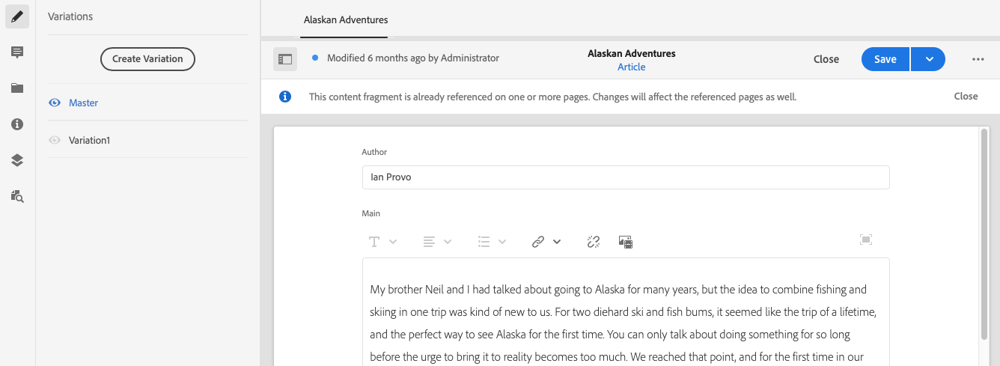

# Contentfragmenten beheren {#managing-content-fragments}

Leer hoe u de **Inhoudsfragmenten** -console voor het beheren van AEM inhoudsfragmenten. Deze kunnen worden gebruikt voor het ontwerpen van pagina&#39;s of als basis voor inhoud zonder kop.

Na het definiëren van uw [Modellen van inhoudsfragmenten](#creating-a-content-model) U kunt deze [Inhoudsfragmenten maken](#creating-a-content-fragment).

De [Inhoudsfragmenteditor](#opening-the-fragment-editor) biedt diverse [modi](#modes-in-the-content-fragment-editor) om u in staat te stellen:

* [De inhoud bewerken](#editing-the-content-of-your-fragment) en [Variaties beheren](#creating-and-managing-variations-within-your-fragment)
* [Uw fragment notities aanbrengen](/help/sites-cloud/administering/content-fragments/content-fragments-variations.md#annotating-a-content-fragment)
* [Inhoud koppelen aan uw fragment](#associating-content-with-your-fragment)
* [De metagegevens configureren](#viewing-and-editing-the-metadata-properties-of-your-fragment)
* [De boomstructuur weergeven](/help/sites-cloud/administering/content-fragments/content-fragments-structure-tree.md)
* [Voorvertoning van de JSON-representatie](/help/sites-cloud/administering/content-fragments/content-fragments-json-preview.md)

>[!NOTE]
>
>Inhoudsfragmenten kunnen worden gebruikt:
>
>* bij het ontwerpen van pagina&#39;s; zie [Pagina&#39;s ontwerpen met inhoudsfragmenten](/help/sites-cloud/authoring/fundamentals/content-fragments.md).
>* for [Aflevering van inhoud zonder kop met gebruik van inhoudsfragmenten met GraphQL](/help/sites-cloud/administering/content-fragments/content-fragments-graphql.md).

>[!NOTE]
>
>Inhoudsfragmenten worden opgeslagen als **Activa**. Zij worden hoofdzakelijk beheerd vanuit de **Inhoudsfragmenten** console, maar kan ook vanuit de **Activa** console.

## Inhoudsfragmenten maken {#creating-content-fragments}

### Een inhoudsmodel maken {#creating-a-content-model}

[Inhoudsfragmentmodellen](/help/sites-cloud/administering/content-fragments/content-fragments-models.md) kunnen worden ingeschakeld en gemaakt voordat u inhoudsfragmenten met gestructureerde inhoud maakt.

### Een inhoudsfragment maken {#creating-a-content-fragment}

Een inhoudsfragment maken:

1. Van de **Inhoudsfragmenten** console, selecteren **Maken** (rechtsboven).

   >[!NOTE]
   >
   >Als u de locatie van het nieuwe fragment vooraf wilt definiëren, navigeert u naar de map waar u het fragment wilt maken of kunt u de locatie opgeven tijdens het maken.

1. De **Nieuw inhoudsfragment** wordt geopend, vanaf hier kunt u het volgende opgeven:

   * **Locatie** - deze wordt automatisch ingevuld met de huidige locatie, maar u kunt desgewenst een andere locatie selecteren
   * **Inhoudsfragmentmodel** - selecteer in de vervolgkeuzelijst het model dat u als basis voor het fragment wilt gebruiken
   * **Titel**
   * **Naam** - dit wordt automatisch voltooid op basis van de **Titel**, maar u kunt deze desgewenst bewerken
   * **Beschrijving**

   

1. Selecteren **Maken**, of **Maken en openen** om uw definitie voort te zetten.

## Handelingen voor een inhoudsfragment in de inhoudsfragmentconsole {#actions-content-fragment-console}

In de **Inhoudsfragmenten** een reeks acties beschikbaar is voor uw inhoudsfragmenten op de werkbalk:

* **Openen in elementen**
* **Maken**
* De **Verwezen door** de kolom biedt ook een directe koppeling om alle bovenliggende verwijzingen van dat fragment weer te geven; inclusief verwijzen naar inhoudsfragmenten, ervaringsfragmenten en pagina&#39;s.
* Als u de muis boven de mapnaam houdt, wordt het JCR-pad weergegeven.

Nadat u het fragment hebt geselecteerd, zijn alle relevante handelingen beschikbaar:

* **Open**
* **Publiceren** (en **Publiceren ongedaan maken**)
* **Kopiëren**
* **Verplaatsen**
* **Naam wijzigen**
* **Verwijderen**

>[!NOTE]
>
>Handelingen zoals Publiceren, Publiceren ongedaan maken, Verwijderen, Verplaatsen, Naam wijzigen, Kopiëren, een asynchrone taak activeren. De voortgang van die taak kan worden gecontroleerd via de interface AEM Async Jobs.

## De weergave in de console Inhoudsfragmenten aanpassen {#viewing-content-fragment-console}

De console toont informatie over de inhoudsfragmenten - in de huidige omslag en alle kindomslagen.

U kunt de weergegeven informatie aanpassen met de **Tabel aanpassen** pictogram:

Hierdoor wordt de **Tabel aanpassen** het dialoogvenster waarin u de beschikbare kolommen kunt selecteren of deselecteren:

## Zoeken en filteren in de console voor inhoudsfragmenten {#search-filter-content-fragment-console}

U kunt de Inhoudsfragmenten zoeken en/of filteren die in de console moeten worden weergegeven.

U kunt:

* Selecteer de vereiste map
* Selecteer de filters met de **Filters tonen** en het zoekvak parallel gebruiken:

Er zijn filters beschikbaar:

De filters en zoekcombinatie kunnen ook worden opgeslagen voor latere referentie.

## De fragmenteditor openen {#opening-the-fragment-editor}

Uw fragment openen voor bewerken:

>[!CAUTION]
>
>Als u een inhoudsfragment wilt bewerken, hebt u [de juiste machtigingen](/help/implementing/developing/extending/content-fragments-customizing.md#asset-permissions). Neem contact op met de systeembeheerder als er problemen optreden.

1. Gebruik de **Inhoudsfragmenten** -console om naar de locatie van het inhoudsfragment te navigeren.
1. Open het fragment voor bewerking door het fragment te selecteren en vervolgens **Openen** op de werkbalk.

1. De fragmenteditor wordt geopend. Breng de gewenste wijzigingen aan:

   

1. Nadat u wijzigingen hebt aangebracht, kunt u **Opslaan**, **Opslaan en sluiten** of **Sluiten** zoals vereist.

   >[!NOTE]
   >
   >**Opslaan en sluiten** is beschikbaar via **Opslaan** vervolgkeuzelijst.

   >[!NOTE]
   >
   >Beide **Opslaan en sluiten** en **Sluiten** sluit de editor af - zie [Opslaan, sluiten en versies](#save-close-and-versions) voor volledige informatie over de werking van de verschillende opties voor inhoudsfragmenten.

## Modi en handelingen in de Inhoudsfragmenteditor {#modes-actions-content-fragment-editor}

Er zijn verschillende modi en acties beschikbaar in de Inhoudsfragmenteditor.

### Modi in de Content Fragment Editor {#modes-in-the-content-fragment-editor}

Navigeer door de verschillende modi met de pictogrammen in het zijpaneel:

* Variaties: [De inhoud bewerken](#editing-the-content-of-your-fragment) en [Uw variaties beheren](#creating-and-managing-variations-within-your-fragment)

* [Annotaties](/help/sites-cloud/administering/content-fragments/content-fragments-variations.md#annotating-a-content-fragment)
* [Gekoppelde inhoud](#associating-content-with-your-fragment)
* [Metagegevens](#viewing-and-editing-the-metadata-properties-of-your-fragment)
* [Boomstructuur](/help/sites-cloud/administering/content-fragments/content-fragments-structure-tree.md)
* [Voorvertoning](/help/sites-cloud/administering/content-fragments/content-fragments-json-preview.md)

### Werkbalkhandelingen in de Inhoudsfragmenteditor {#toolbar-actions-in-the-content-fragment-editor}

Sommige functies in de bovenste werkbalk zijn beschikbaar in meerdere modi:

* Er wordt een bericht weergegeven wanneer al naar het fragment wordt verwezen op een inhoudspagina. U kunt **Sluiten** het bericht.

* Het zijpaneel kan worden verborgen of weergegeven met de opdracht **Zijpaneel in-/uitschakelen** pictogram.

* Onder de fragmentnaam ziet u de naam van de component [Inhoudsfragmentmodel](/help/sites-cloud/administering/content-fragments/content-fragments-models.md) gebruikt voor het maken van het huidige fragment:

   * De naam is ook een verbinding die de modelredacteur zal openen.

* Zie de status van het fragment; bijvoorbeeld informatie over het tijdstip waarop deze is gemaakt, gewijzigd of gepubliceerd. De status heeft ook een kleurcode:

   * **Nieuw**: grijs
   * **Concept**: blauw
   * **Gepubliceerd**: groen
   * **Gewijzigd**: oranje
   * **gedeactiveerd**: rood

* **Opslaan** verleent toegang tot **Opslaan en sluiten** optie.

* De drie stippen (**...**) biedt toegang tot extra handelingen:
   * **Paginaverwijzingen bijwerken**
      * Hiermee werkt u alle paginaverwijzingen bij.
   * **[Snel publiceren](#publishing-and-referencing-a-fragment)**
   * **[Publicatie beheren](#publishing-and-referencing-a-fragment)**

<!--
This updates any page references and ensures that the Dispatcher is flushed as required. -->

## Opslaan, sluiten en versies {#save-close-and-versions}

>[!NOTE]
>
>Versies kunnen ook [gemaakt, vergeleken en teruggezet vanaf de tijdlijn](/help/sites-cloud/administering/content-fragments/content-fragments-managing.md#timeline-for-content-fragments).

De editor heeft verschillende opties:

* **Opslaan** en **Opslaan en sluiten**

   * **Opslaan** slaat de laatste wijzigingen op en blijft deze in de editor.
   * **Opslaan en sluiten** slaat de laatste wijzigingen op en sluit de editor af.

   >[!CAUTION]
   >
   >Als u een inhoudsfragment wilt bewerken, hebt u [de juiste machtigingen](/help/implementing/developing/extending/content-fragments-customizing.md#asset-permissions). Neem contact op met de systeembeheerder als er problemen optreden.

   >[!NOTE]
   >
   >Het is mogelijk om in de redacteur te blijven, makend een reeks veranderingen, alvorens te bewaren.

   >[!CAUTION]
   >
   >Naast het eenvoudig opslaan van uw wijzigingen, werken de acties ook verwijzingen bij en zorgen ervoor dat de Dispatcher wordt leeggemaakt zoals vereist. Deze wijzigingen kunnen enige tijd in beslag nemen. Hierdoor kan de prestaties van een groot/complex/zwaar geladen systeem worden beïnvloed.
   >
   >Houd hier rekening mee wanneer u **Opslaan en sluiten** en voert u vervolgens snel de fragmenteditor opnieuw in om verdere wijzigingen aan te brengen en op te slaan.

* **Sluiten**

   Sluit de editor af zonder de laatste wijzigingen op te slaan (dat wil zeggen sinds de laatste **Opslaan**).

AEM tijdens het bewerken van het inhoudsfragment automatisch versies maken om ervoor te zorgen dat eerdere inhoud kan worden hersteld als u de wijzigingen annuleert (met **Sluiten** zonder opslaan):

1. Wanneer een inhoudsfragment wordt geopend om te bewerken, wordt op het bestaan van een cookie-token gecontroleerd dat aangeeft of een *bewerksessie* bestaat:

   1. Als het token wordt gevonden, wordt het fragment beschouwd als onderdeel van de bestaande bewerkingssessie.
   2. Als het token *niet* beschikbaar is en de gebruiker begint met het bewerken van inhoud, wordt een versie gemaakt en wordt een token voor deze nieuwe bewerkingssessie verzonden naar de client, waar deze in een cookie wordt opgeslagen.

2. Terwijl er een *actief* tijdens het bewerken van de sessie wordt de inhoud die wordt bewerkt automatisch om de 600 seconden opgeslagen (standaard).

   >[!NOTE]
   >
   >Het auto sparen interval is configureerbaar gebruikend `/conf` mechanisme.
   >
   >Standaardwaarde, zie:
   >  `/libs/settings/dam/cfm/jcr:content/autoSaveInterval`

3. Als de gebruiker de bewerking annuleert, wordt de versie die aan het begin van de bewerkingssessie is gemaakt, hersteld en wordt de token verwijderd om de bewerkingssessie te beëindigen.
4. Als de gebruiker selecteert om **Opslaan** de bewerkingen, de bijgewerkte elementen/variaties worden voortgezet en het token wordt verwijderd om de bewerkingssessie te beëindigen.

## De inhoud van het fragment bewerken {#editing-the-content-of-your-fragment}

Als u het fragment hebt geopend, kunt u de opdracht [Variaties](/help/sites-cloud/administering/content-fragments/content-fragments-variations.md) gebruiken om uw inhoud te ontwerpen.

## Variaties maken en beheren in uw fragment {#creating-and-managing-variations-within-your-fragment}

Nadat u de Master inhoud hebt gemaakt, kunt u [Variaties](/help/sites-cloud/administering/content-fragments/content-fragments-variations.md) van die inhoud.

## Inhoud koppelen aan uw fragment {#associating-content-with-your-fragment}

U kunt ook [gekoppelde inhoud](/help/sites-cloud/administering/content-fragments/content-fragments-assoc-content.md) met een fragment. Dit biedt een verbinding zodat elementen (d.w.z. afbeeldingen) (optioneel) met het fragment kunnen worden gebruikt wanneer het aan een inhoudspagina wordt toegevoegd.

## De metagegevens (eigenschappen) van het fragment weergeven en bewerken {#viewing-and-editing-the-metadata-properties-of-your-fragment}

U kunt de eigenschappen van een fragment weergeven en bewerken met de opdracht [Metagegevens](/help/sites-cloud/administering/content-fragments/content-fragments-metadata.md) tab.

## Een fragment publiceren en ernaar verwijzen {#publishing-and-referencing-a-fragment}

>[!CAUTION]
Als het fragment op een model is gebaseerd, moet u ervoor zorgen dat de [model is gepubliceerd](/help/sites-cloud/administering/content-fragments/content-fragments-models.md#publishing-a-content-fragment-model).
Als u een inhoudsfragment publiceert waarvoor het model nog niet is gepubliceerd, wordt dit in een selectielijst aangegeven en wordt het model met het fragment gepubliceerd.

Inhoudsfragmenten moeten worden gepubliceerd voor gebruik in de publicatieomgeving. Dit gebeurt met de standaardfunctionaliteit Middelen

* Van de **Publiceren** op de werkbalk van het dialoogvenster [Content Fragments-console](#actions-content-fragment-console)
   * **Nu** - na bevestiging wordt het fragment onmiddellijk gepubliceerd
   * **Schema** - u kunt de datum en tijd selecteren waarop het fragment wordt gepubliceerd

   Indien nodig moet u de **Activeringsdatum** en welke verwijzingen naar publiceren. Bijvoorbeeld:
   

* Van de [Inhoudsfragmenteditor](#toolbar-actions-in-the-content-fragment-editor)
   * [**Snel publiceren**](/help/assets/manage-publication.md#quick-publish)
   * [**Publicatie beheren**](/help/assets/manage-publication.md#manage-publication)

Wanneer u [Een pagina publiceren die het fragment gebruikt](/help/sites-cloud/authoring/fundamentals/content-fragments.md#publishing); het fragment wordt weergegeven in de paginaverwijzingen.

>[!CAUTION]
Nadat een fragment is gepubliceerd en/of waarnaar wordt verwezen, geeft AEM een waarschuwing weer wanneer een auteur het fragment opent om opnieuw te bewerken. Hiermee wordt u gewaarschuwd dat wijzigingen in het fragment ook van invloed zijn op de pagina&#39;s waarnaar wordt verwezen.

## Publicatie van een fragment ongedaan maken {#unpublishing-a-fragment}

Als u de publicatie van inhoudsfragmenten ongedaan wilt maken, selecteert u een of meer fragmenten en vervolgens **Publiceren ongedaan maken**.

>[!NOTE]
De **Publiceren ongedaan maken** actie is zichtbaar wanneer gepubliceerde fragmenten beschikbaar zijn.

>[!CAUTION]
Als er al vanuit een ander fragment of een pagina naar het fragment wordt verwezen, wordt er een waarschuwingsbericht weergegeven en moet u bevestigen dat u wilt doorgaan.

## Een fragment verwijderen {#deleting-a-fragment}

Een fragment verwijderen:

1. In de **Inhoudsfragmenten** navigeren naar de locatie van het inhoudsfragment.
2. Selecteer het fragment.

   >[!NOTE]
   De **Verwijderen** Handeling is niet beschikbaar als een snelle handeling.

3. Selecteren **Verwijderen** op de werkbalk.
4. Bevestig de **Verwijderen** handeling.

   >[!CAUTION]
   Als er al vanuit een ander fragment of een pagina naar het fragment wordt verwezen, wordt er een waarschuwingsbericht weergegeven en moet u bevestigen dat u wilt doorgaan met een **Verwijderen forceren**. Het fragment wordt samen met de bijbehorende component voor contentfragmenten uit alle contentpagina&#39;s verwijderd.

## Tijdlijn voor inhoudsfragmenten {#timeline-for-content-fragments}

>[!NOTE]
Deze functionaliteit is alleen beschikbaar in het dialoogvenster **Activa** console

Naast de standaardopties [Tijdlijn](/help/assets/manage-digital-assets.md#timeline) biedt zowel informatie als acties die specifiek zijn voor inhoudsfragmenten:

* Informatie weergeven over versies, opmerkingen en annotaties
* Handelingen voor versies

   * **[Deze versie herstellen](#reverting-to-a-version)** (selecteer een bestaand fragment en selecteer vervolgens een specifieke versie)

   * **[Vergelijken met huidige](#comparing-fragment-versions)** (selecteer een bestaand fragment en selecteer vervolgens een specifieke versie)

   * Voeg een **Label** en/of **Opmerking** (selecteer een bestaand fragment en selecteer vervolgens een specifieke versie)

   * **Opslaan als versie** (selecteer een bestaand fragment en klik vervolgens op de pijl omhoog onder aan de tijdlijn)

* Handelingen voor annotaties

   * **Verwijderen**

>[!NOTE]
Opmerkingen zijn:
* Standaardfunctionaliteit voor alle elementen
* Gemaakt in tijdlijn
* Verwant aan het fragmentelement
>
Annotaties (voor inhoudsfragmenten) zijn:
* Opgegeven in de fragmenteditor
* Specifiek voor een geselecteerd tekstsegment binnen het fragment
>

Bijvoorbeeld:

## Fragmentversies vergelijken {#comparing-fragment-versions}

>[!NOTE]
Deze functionaliteit is alleen beschikbaar in het dialoogvenster **Activa** console

De **Vergelijken met huidige** actie is beschikbaar via [Tijdlijn](/help/sites-cloud/administering/content-fragments/content-fragments-managing.md#timeline-for-content-fragments) nadat u een specifieke versie hebt geselecteerd.

Hiermee wordt het volgende geopend:

* de **Huidig** (laatste) versie (links)

* de geselecteerde versie **v&lt;*x.y*>** (rechts)

Zij worden naast elkaar weergegeven, waarbij:

* Eventuele verschillen worden gemarkeerd

   * Verwijderde tekst - rood
   * Ingevoegde tekst - groen
   * Vervangen tekst - blauw

* Met het pictogram voor volledig scherm kunt u elke versie afzonderlijk openen. dan terug naar de parallelle weergave
* U kunt **Vorige versie** naar de specifieke versie
* **Gereed** zult u aan de console terugkeren

>[!NOTE]
U kunt de fragmentinhoud niet bewerken wanneer u fragmenten vergelijkt.

## Een versie herstellen  {#reverting-to-a-version}

>[!NOTE]
Deze functionaliteit is alleen beschikbaar in het dialoogvenster **Activa** console

U kunt terugkeren naar een specifieke versie van het fragment:

* Rechtstreeks vanuit de [Tijdlijn](/help/sites-cloud/administering/content-fragments/content-fragments-managing.md#timeline-for-content-fragments).

   Selecteer de gewenste versie en klik vervolgens op **Deze versie herstellen** handeling.

* while [een versie vergelijken met de huidige versie](/help/sites-cloud/administering/content-fragments/content-fragments-managing.md#comparing-fragment-versions) u **Vorige versie** naar de geselecteerde versie.

