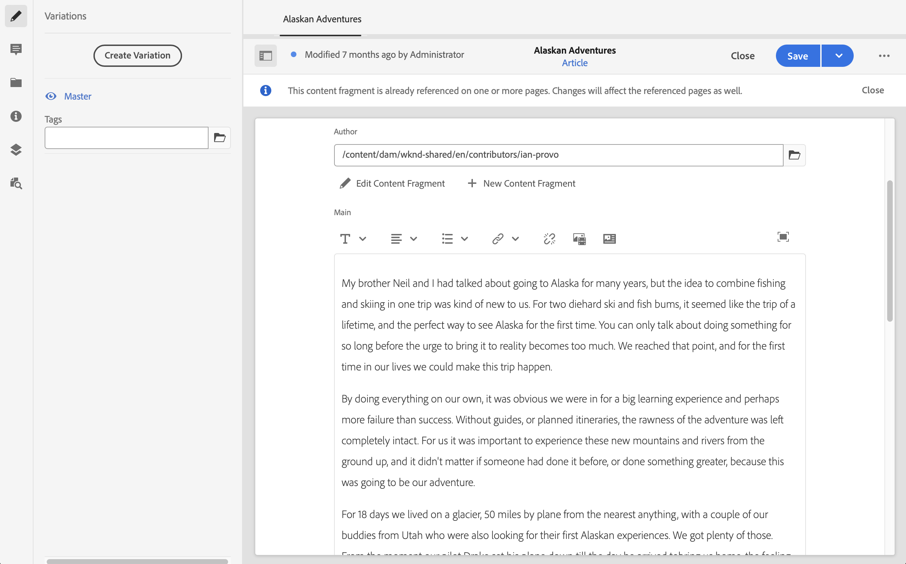
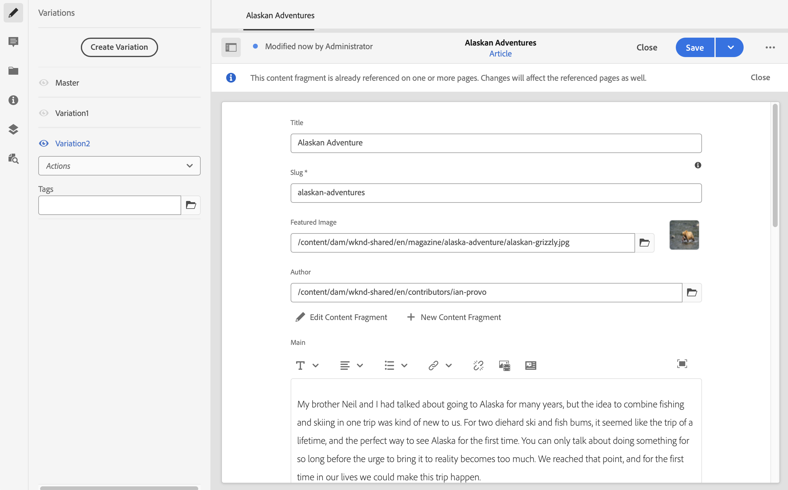

# Variaties - Authoring van content voor fragmenten{#variations-authoring-fragment-content}

[Variaties](/help/sites-cloud/administering/content-fragments/content-fragments.md#constituent-parts-of-a-content-fragment) zijn een belangrijk kenmerk van AEM inhoudsfragmenten, aangezien u hiermee kopieën van de master inhoud kunt maken en bewerken voor gebruik op specifieke kanalen en/of scenario&#39;s, waardoor zowel het ontwerpen van pagina&#39;s als het leveren van inhoud zonder kop nog flexibeler wordt.

Van de **Variaties** tabblad kunt u:

* [Voer de inhoud in](#authoring-your-content) voor het fragment,
* [Variaties maken en beheren](#managing-variations) van de **Master** inhoud,

Voer een reeks andere acties uit afhankelijk van het gegevenstype dat wordt uitgegeven; bijvoorbeeld:

* [Visuele elementen in een fragment invoegen](#inserting-assets-into-your-fragment) (afbeeldingen)

* Selecteren tussen [RTF](#rich-text), [Onbewerkte tekst](#plain-text) en [Markering](#markdown) voor bewerking

* [Inhoud uploaden](#uploading-content)

* [Belangrijkste statistieken weergeven](#viewing-key-statistics) (over tekst met meerdere regels)

* [Tekst samenvatten](#summarizing-text)

* [Variaties synchroniseren met Master inhoud](#synchronizing-with-master)

>[!CAUTION]
>
>Nadat een fragment is gepubliceerd en/of waarnaar wordt verwezen, geeft AEM een waarschuwing weer wanneer een auteur het fragment opent om opnieuw te bewerken. Hiermee wordt u gewaarschuwd dat wijzigingen in het fragment ook van invloed zijn op de pagina&#39;s waarnaar wordt verwezen.

## Inhoud ontwerpen {#authoring-your-content}

Wanneer u het inhoudsfragment opent voor bewerking, worden de **Variaties** is standaard geopend. Hier kunt u de inhoud ontwerpen, voor Master of andere variaties. Het gestructureerde fragment bevat verschillende velden van diverse gegevenstypen die zijn gedefinieerd in het inhoudsmodel.

Bijvoorbeeld:

U kunt:

* direct wijzigingen aanbrengen in het dialoogvenster **Variaties** tab

   * elk gegevenstype biedt verschillende bewerkingsopties

* for **Tekst met meerdere regels** velden die u ook kunt openen [full-screen redacteur](#full-screen-editor) tot:

   * Selecteer de [Indeling](#formats)
   * zie meer bewerkingsopties (voor [RTF](#rich-text) bestandsindeling)
   * toegang tot een reeks [handelingen](#actions)

* Voor **Fragmentverwijzing** velden **[Inhoudsfragment bewerken](#fragment-references-edit-content-fragment)** Deze optie kan beschikbaar zijn, afhankelijk van de modeldefinitie.

### Volledige schermeditor {#full-screen-editor}

Als u een tekstveld met meerdere regels bewerkt, kunt u de volledige schermeditor openen. Tik of klik in de werkelijke tekst en selecteer vervolgens het volgende handelingspictogram:

Hiermee wordt de teksteditor voor het volledige scherm geopend:

De teksteditor voor volledig scherm biedt:

* Toegang tot verschillende [handelingen](#actions)
* Afhankelijk van de [format](#formats), aanvullende opmaakopties ([RTF](#rich-text))

### Acties {#actions}

De volgende acties zijn ook beschikbaar (voor alle [formaten](#formats)) als de volledige-schermeditor (d.w.z. tekst met meerdere regels) is geopend:

* Selecteer [format](#formats) ([RTF](#rich-text), [Onbewerkte tekst,](#plain-text) [Markering](#markdown))

* [Inhoud uploaden](#uploading-content)

* [Tekststatistieken tonen](#viewing-key-statistics)

* [Synchroniseren met Master](#synchronizing-with-master) (bij het bewerken van een variatie)

* [Tekst samenvatten](#summarizing-text)

### Indelingen {#formats}

De opties voor het bewerken van tekst met meerdere regels zijn afhankelijk van de geselecteerde indeling:

* [RTF](#rich-text)
* [Onbewerkte tekst](#plain-text)
* [Markering](#markdown)

De indeling kan worden geselecteerd in de schermvullende editor.

### RTF {#rich-text}

Met RTF-bewerkingen kunt u de volgende opmaken:

* Vet
* Cursief
* Onderstrepen
* Uitlijning: links, midden, rechts
* Lijst met opsommingstekens
* Genummerde lijst
* Inspringing: toename, afname
* Hyperlinks maken/verbreken
* Tekst/tekst uit Word plakken
* Een tabel invoegen
* Alineastijl: Alinea, kopje 1/2/3
* [Element invoegen](#inserting-assets-into-your-fragment)
* Open de volledige-schermredacteur, waar de volgende het formatteren opties beschikbaar zijn:
   * Zoeken
   * Zoeken/vervangen
   * Spellingcontrole
   * [Annotaties](/help/sites-cloud/administering/content-fragments/content-fragments-variations.md#annotating-a-content-fragment)
* [Inhoudsfragment invoegen](#inserting-content-fragment-into-your-fragment); beschikbaar als uw **Tekst met meerdere regels** veld is geconfigureerd met **Fragmentverwijzing toestaan**.

De [handelingen](#actions) zijn ook toegankelijk van de volledig-schermredacteur.

### Onbewerkte tekst {#plain-text}

Met platte tekst kunt u snel inhoud invoeren zonder opmaak- of markeringsgegevens. U kunt de volledige-schermeditor ook voor meer informatie openen [handelingen](#actions).

>[!CAUTION]
>
>Als u **Tekst zonder opmaak** selecteert, gaan opmaak, markdown en/of assets die u hebt ingevoegd in **Tekst met opmaak** of **Markdown** verloren.

### Markering {#markdown}

>[!NOTE]
>
>Zie voor meer informatie de [Markering](/help/sites-cloud/administering/content-fragments/content-fragments-markdown.md) documentatie.

Hierdoor kunt u de tekst opmaken met behulp van een markering. U kunt het volgende definiëren:

* Koppen
* Alinea&#39;s en regeleinden
* Koppelingen
* Afbeeldingen
* Aanhalingstekens blokkeren
* Lijsten
* Nadruk
* Codeblokken
* backslash-eces

U kunt de volledige-schermeditor ook voor meer informatie openen [handelingen](#actions).

>[!CAUTION]
>
>Als u tussen **Tekst met opmaak** en **Markdown** schakelt, kunt u onverwachte effecten met Blokcitaten en Codeblokken ervaren, aangezien deze twee opmaakindelingen verschillen in hoe zij worden behandeld.

### Fragmentverwijzingen {#fragment-references}

Als het Content Fragment-model fragmentverwijzingen bevat, hebben de auteurs van het fragment mogelijk aanvullende opties:

* [Inhoudsfragment bewerken](#fragment-references-edit-content-fragment)
* [Nieuw inhoudsfragment](#fragment-references-new-content-fragment)

#### Inhoudsfragment bewerken {#fragment-references-edit-content-fragment}

De optie **Inhoudsfragment bewerken** wordt dat fragment geopend in een nieuw editor tabblad (binnen hetzelfde browsertabblad).

Het oorspronkelijke tabblad opnieuw selecteren (bijvoorbeeld **Little Pony Inc.**), wordt dit secundaire tabblad gesloten (in dit geval, **Adam Smith**).

#### Nieuw inhoudsfragment {#fragment-references-new-content-fragment}

De optie **Nieuw inhoudsfragment** Hiermee kunt u een volledig nieuw fragment maken. Hiervoor wordt een variant van de wizard voor het maken van inhoudsfragmenten geopend in de editor.

U kunt dan een nieuw fragment maken door:

1. Navigeer naar en selecteer de gewenste map.
1. Selecteren **Volgende**.
1. Eigenschappen specificeren; bijvoorbeeld **Titel**.
1. Selecteren **Maken**.
1. Tot slot:
   1. **Gereed** wordt teruggezet (naar het oorspronkelijke fragment) en verwijst naar het nieuwe fragment.
   1. **Openen** verwijst naar het nieuwe fragment en opent het nieuwe fragment, voor bewerking, op een nieuw browsertabblad.

### Belangrijkste statistieken weergeven {#viewing-key-statistics}

Wanneer de volledige-schermeditor open is, zal de actie **Tekststatistieken** allerlei informatie over de tekst tonen.

Bijvoorbeeld:

### Inhoud uploaden {#uploading-content}

Als u het maken van inhoudsfragmenten wilt vereenvoudigen, kunt u tekst uploaden die is voorbereid in een externe editor en deze rechtstreeks aan het fragment toevoegen.

### Tekst samenvatten {#summarizing-text}

Samenvattende tekst is ontworpen om gebruikers te helpen de lengte van hun tekst te beperken tot een vooraf gedefinieerd aantal woorden, terwijl de hoofdpunten en de algemene betekenis behouden blijven.

>[!NOTE]
>
>Op technisch niveau handhaaft het systeem de zinnen die het beschouwt als het leveren van de *beste verhouding tussen informatiedichtheid en uniciteit* volgens specifieke algoritmen.

>[!CAUTION]
>
>Het inhoudsfragment moet een geldige taalmap (ISO-code) hebben als voorouder. dit wordt gebruikt om het te gebruiken taalmodel te bepalen.
>
>Bijvoorbeeld: `en/` zoals in het volgende pad:
>
>  `/content/dam/my-brand/en/path-down/my-content-fragment`

>[!CAUTION]
Engels is beschikbaar buiten de box.
Andere talen zijn beschikbaar als Pakketten van het Model van de Taal van de Distributie van de Software:
* [Frans (fr)](https://experience.adobe.com/#/downloads/content/software-distribution/en/aem.html?package=/content/software-distribution/en/details.html/content/dam/aem/public/adobe/packages/cq630/product/smartcontent-model-fr)
* [Duits (de)](https://experience.adobe.com/#/downloads/content/software-distribution/en/aem.html?package=/content/software-distribution/en/details.html/content/dam/aem/public/adobe/packages/cq630/product/smartcontent-model-de)
* [Italiaans (it)](https://experience.adobe.com/#/downloads/content/software-distribution/en/aem.html?package=/content/software-distribution/en/details.html/content/dam/aem/public/adobe/packages/cq630/product/smartcontent-model-it)
* [Spaans (es)](https://experience.adobe.com/#/downloads/content/software-distribution/en/aem.html?package=/content/software-distribution/en/details.html/content/dam/aem/public/adobe/packages/cq630/product/smartcontent-model-es)
>

1. Selecteren **Master** of de vereiste wijziging.
1. Open de editor voor het volledige scherm.

1. Selecteren **Tekst samenvatten** op de werkbalk.

   

1. Geef het doelaantal woorden op en selecteer **Start**:
1. De oorspronkelijke tekst wordt naast de voorgestelde samenvatting weergegeven:

   * Alle zinnen die moeten worden verwijderd, worden rood gemarkeerd met doorhaling.
   * Klik op een gemarkeerde zin om deze in de samengevatte inhoud te houden.
   * Klik op een niet-gemarkeerde zin om deze te verwijderen.

1. Selecteren **Samenvatten** om de wijzigingen te bevestigen.

1. De oorspronkelijke tekst wordt naast de voorgestelde samenvatting weergegeven:

   * Alle zinnen die moeten worden verwijderd, worden rood gemarkeerd met doorhaling.
   * Klik op een gemarkeerde zin om deze in de samengevatte inhoud te houden.
   * Klik op een niet-gemarkeerde zin om deze te verwijderen.
   * De samenvattingsstatistieken worden weergegeven: **Werkelijk** en **Doel**-
   * U kunt **Voorvertoning** de wijzigingen.

   

### Een inhoudsfragment annoteren {#annotating-a-content-fragment}

Een fragment annoteren:

1. Selecteren **Master** of de vereiste wijziging.

1. Open de editor voor het volledige scherm.

1. De **Annoteren** is beschikbaar in de bovenste werkbalk. U kunt desgewenst tekst selecteren.

   

1. Er wordt een dialoogvenster geopend. Hier kunt u uw annotatie invoeren.

   

1. Selecteren **Toepassen** in het dialoogvenster.

   

   Als de annotatie is toegepast op geselecteerde tekst, blijft die tekst gemarkeerd.

   

1. Sluit de volledige-schermredacteur, de annotaties worden nog benadrukt. Als deze optie is geselecteerd, wordt een dialoogvenster geopend waarin u de annotatie verder kunt bewerken.

1. Selecteren **Opslaan**.

1. Sluit de volledige-schermredacteur, de annotaties worden nog benadrukt. Als deze optie is geselecteerd, wordt een dialoogvenster geopend waarin u de annotatie verder kunt bewerken.

   

### Annotaties weergeven, bewerken, verwijderen {#viewing-editing-deleting-annotations}

Annotaties:

* Deze worden aangegeven door de markering in de tekst, zowel in de modus Volledig scherm als in de normale modus van de editor. Alle details van een annotatie kunnen vervolgens worden weergegeven, bewerkt en/of verwijderd door op de gemarkeerde tekst te klikken, waarna het dialoogvenster opnieuw wordt geopend.

   >[!NOTE]
   Er is een keuzekiezer beschikbaar als er meerdere annotaties zijn toegepast op één stuk tekst.

* Wanneer u de volledige tekst verwijdert waarop de annotatie is toegepast, wordt de annotatie ook verwijderd.

* Kan worden weergegeven en verwijderd door het selectievakje **Annotaties** in de fragmenteditor.

   

* Kan worden weergegeven en verwijderd in [Tijdlijn](/help/sites-cloud/administering/content-fragments/content-fragments-managing.md#timeline-for-content-fragments) voor het geselecteerde fragment.

### Elementen invoegen in uw fragment {#inserting-assets-into-your-fragment}

U kunt toevoegen om het ontwerpen van inhoudsfragmenten te vereenvoudigen [Activa](/help/assets/manage-digital-assets.md) (afbeeldingen) rechtstreeks naar het fragment.

Ze worden zonder opmaak toegevoegd aan de alineasequentie van het fragment. de opmaak kan worden uitgevoerd wanneer de [fragment wordt gebruikt of er wordt naar verwezen op een pagina](/help/sites-cloud/authoring/fundamentals/content-fragments.md).

>[!CAUTION]
Deze elementen kunnen niet worden verplaatst of verwijderd op een pagina waarnaar wordt verwezen. Dit moet gebeuren in de fragmenteditor.
Opmaak van het element (bv. grootte) moet echter plaatsvinden in het dialoogvenster [paginaeditor](/help/sites-cloud/authoring/fundamentals/content-fragments.md). De representatie van het element in de fragmenteditor is uitsluitend bedoeld voor het ontwerpen van de inhoudsstroom.

>[!NOTE]
Er zijn verschillende methoden om toe te voegen [afbeeldingen](/help/sites-cloud/administering/content-fragments/content-fragments.md#fragments-with-visual-assets) op het fragment en/of de pagina.

1. Plaats de cursor op de positie waar u de afbeelding wilt toevoegen.
1. Gebruik het pictogram **Asset invoegen** om het zoekdialoogvenster te openen.

   

1. In het dialoogvenster kunt u:

   * navigeren naar het vereiste element in DAM
   * zoeken naar de middelen in DAM

   Selecteer het gewenste element door op de miniatuur te klikken.

1. Gebruik **Selecteren** om de asset op de huidige locatie toe te voegen aan het alineasysteem van het contentfragment.

   >[!CAUTION]
   Als u na het toevoegen van een asset de indeling wijzigt in:
   * **Tekst zonder opmaak**: wordt de asset volledig uit het fragment verwijderd.
   * **Markdown**: is de asset niet zichtbaar, maar blijft deze aanwezig wanneer u terugkeert naar **Tekst met opmaak**.

### Een inhoudsfragment invoegen in uw fragment {#inserting-content-fragment-into-your-fragment}

U kunt ook een ander inhoudsfragment aan het fragment toevoegen om het maken van inhoudsfragmenten te vereenvoudigen.

Deze worden als referentie toegevoegd op de huidige locatie in het fragment.

>[!NOTE]
Deze optie is beschikbaar als **Tekst met meerdere regels** is geconfigureerd met **Fragmentverwijzing toestaan**.

>[!CAUTION]
Deze elementen kunnen niet worden verplaatst of verwijderd op een pagina waarnaar wordt verwezen. Dit moet gebeuren in de fragmenteditor.
Opmaak van het element (bv. grootte) moet echter plaatsvinden in het dialoogvenster [paginaeditor](/help/sites-cloud/authoring/fundamentals/content-fragments.md). De representatie van het element in de fragmenteditor is uitsluitend bedoeld voor het ontwerpen van de inhoudsstroom.

>[!NOTE]
Er zijn verschillende methoden om toe te voegen [afbeeldingen](/help/sites-cloud/administering/content-fragments/content-fragments.md#fragments-with-visual-assets) op het fragment en/of de pagina.

1. Plaats de cursor op de positie waar u het fragment wilt toevoegen.
1. Gebruik de **Inhoudsfragment invoegen** om het zoekdialoogvenster te openen.

   

1. In het dialoogvenster kunt u:

   * navigeer naar het gewenste fragment in de map Middelen
   * zoeken naar het fragment

   Selecteer het gewenste fragment door op de miniatuur te klikken.

1. Gebruiken **Selecteren** om een verwijzing naar het geselecteerde inhoudsfragment toe te voegen aan het huidige inhoudsfragment (op de huidige locatie).

   >[!CAUTION]
   Als u na het toevoegen van een verwijzing naar een ander fragment de opmaak wijzigt in:
   * **Onbewerkte tekst**: de verwijzing gaat volledig verloren uit het fragment.
   * **Markering**: de referentie blijft .

## Variaties beheren {#managing-variations}

### Een variatie maken {#creating-a-variation}

Met variaties kunt u de **Master** inhoud en variëren naar gelang van het doel (indien vereist).

Een nieuwe variatie maken:

1. Open het fragment en controleer of het zijpaneel zichtbaar is.
1. Selecteren **Variaties** in de pictogrambalk in het zijpaneel.
1. Selecteren **Variatie maken**.
1. Er wordt een dialoogvenster geopend waarin u de **titel** en de **beschrijving** voor de nieuwe variatie kunt opgeven.
1. Selecteer **Toevoegen**. De **fragmentmaster** wordt gekopieerd naar de nieuwe variatie, die nu kan worden [bewerkt](#editing-a-variation).

   >[!NOTE]
   Bij het maken van een nieuwe variatie is dit altijd **Master** dat wordt gekopieerd, niet de variatie die momenteel open is.

### Een variatie bewerken {#editing-a-variation}

U kunt wijzigingen aanbrengen in de inhoud van de variatie nadat:

* [Uw variatie maken](#creating-a-variation).
* Een bestaand fragment openen en vervolgens de gewenste variant in het zijpaneel selecteren.

### De naam van een variatie wijzigen {#renaming-a-variation}

Een bestaande variatie een andere naam geven:

1. Open het fragment en selecteer **Variaties** in het zijpaneel.
1. Selecteer de gewenste variatie.
1. Selecteren **Naam wijzigen** van de **Handelingen** vervolgkeuzelijst.

1. Voer in het dialoogvenster dat verschijnt de nieuwe **titel** en/of **beschrijving** in.

1. Bevestig de **Naam wijzigen** handeling.

>[!NOTE]
Dit heeft alleen invloed op de variatie **Titel**.

### Een variatie verwijderen {#deleting-a-variation}

Een bestaande wijziging verwijderen:

1. Open het fragment en selecteer **Variaties** in het zijpaneel.
1. Selecteer de gewenste variatie.
1. Selecteren **Verwijderen** van de **Handelingen** vervolgkeuzelijst.

1. Bevestig de **Verwijderen** in het dialoogvenster.

>[!NOTE]
U kunt niet verwijderen **Master**.

### Synchroniseren met Master {#synchronizing-with-master}

**Master** maakt integraal deel uit van een inhoudsfragment en bevat per definitie de master kopie van de inhoud, terwijl de variaties de afzonderlijke bijgewerkte en op maat gemaakte versies van die inhoud bevatten. Wanneer Master wordt bijgewerkt, is het mogelijk dat deze wijzigingen ook relevant zijn voor de variaties en daarom aan hen moeten worden doorgegeven.

Wanneer u een variatie bewerkt, hebt u toegang tot de handeling voor het synchroniseren van het huidige element van de variatie met Master. Op deze manier kunt u automatisch wijzigingen kopiëren die u hebt aangebracht in de Master variatie.

>[!CAUTION]
De synchronisatie is alleen beschikbaar om wijzigingen *van **Master**naar de variatie* te kopiëren.
Alleen het huidige element van de variatie wordt gesynchroniseerd.
Synchronisatie werkt alleen op het datatype **Tekst met meerdere regels**.
Het overbrengen van wijzigingen *van een variatie naar **master*** is niet beschikbaar als optie.

1. Open het inhoudsfragment in de fragmenteditor. Zorg ervoor dat de **Master** is bewerkt.

1. Selecteer een specifieke variant en kies vervolgens de gewenste synchronisatiehandeling uit:

   * de **Handelingen** keuzelijst - **Huidig element synchroniseren met master**

      

   * de werkbalk van de volledige schermweergave - **Synchroniseren met master**

      

1. Master en de variatie wordt naast elkaar weergegeven:

   * groen geeft de inhoud aan die is toegevoegd (aan de variatie)
   * rood geeft aan dat inhoud is verwijderd (uit de variatie)
   * blauw geeft vervangen tekst aan

   

1. Selecteren **Synchroniseren**, wordt de wijziging bijgewerkt en weergegeven.
