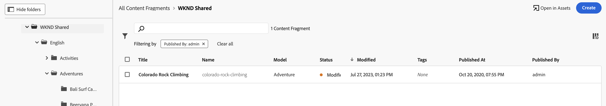

# Inhoudsfragmenten beheren {#managing-content-fragments}

Leer hoe te om uw **Fragmenten van de Inhoud** in Adobe Experience Manager (AEM) as a Cloud Service, van de specifieke [ console van de Fragmenten van de Inhoud ](#content-fragments-console), en [ redacteur van het Fragment van de Inhoud ](/help/sites-cloud/administering/content-fragments/authoring.md#content-fragment-editor) te beheren. Deze inhoudsfragmenten kunnen worden gebruikt als basis voor inhoud zonder kop of voor het ontwerpen van pagina&#39;s.

>[!NOTE]
>
>Deze pagina behandelt de sectie van de console die (slechts) de Fragments van de vertoningen van de Inhoud. Zie voor andere deelvensters:
>
>* [ het Leiden Modellen van het Fragment van de Inhoud ](/help/sites-cloud/administering/content-fragments/managing-content-fragment-models.md)
>* [ het Bekijken van en het Leiden Assets in de Console van Fragmenten van de Inhoud ](/help/sites-cloud/administering/content-fragments/assets-content-fragments-console.md)

Na het bepalen van uw [ Modellen van het Fragment van de Inhoud ](#creating-a-content-model) kunt u deze gebruiken:

* [ creeer uw Fragmenten van de Inhoud ](#creating-a-content-fragment).
* Dan open de [ Redacteur van het Fragment van de Inhoud ](#opening-the-fragment-editor) aan [ auteur uw inhoud en beheer uw Variaties ](#editing-the-content-of-your-fragment).
* [Tags beheren](#manage-tags)
* [De eigenschappen (metagegevens) weergeven en bewerken](#viewing-and-editing-properties)
* [De boomstructuur weergeven](/help/sites-cloud/administering/content-fragments/authoring.md#structure-tree)

>[!NOTE]
>
>Inhoudsfragmenten kunnen worden gebruikt:
>
>* voor [ Hoofdloze Levering van de Inhoud gebruikend de Fragmenten van de Inhoud met GraphQL ](/help/sites-cloud/administering/content-fragments/content-delivery-with-graphql.md),
>* wanneer het ontwerpen van pagina&#39;s; zie [ het Authoring van de Pagina met de Fragmenten van de Inhoud ](/help/sites-cloud/authoring/fragments/content-fragments.md).

>[!NOTE]
>
>De Fragmenten van de inhoud worden opgeslagen als **Assets**. Zij worden hoofdzakelijk geleid van de **console van de Fragmenten van de Inhoud**, maar kunnen ook van de [ Assets ](/help/assets/content-fragments/content-fragments-managing.md) console worden geleid.

## Basisstructuur en verwerking van inhoudsfragmenten in de console {#basic-structure-handling-content-fragments-console}

U kunt het uiterst linkerpaneel van de [ console van de Fragmenten van de Inhoud ](/help/sites-cloud/administering/content-fragments/overview.md#content-fragments-console) gebruiken om **Fragmenten van de Inhoud** als middeltype te selecteren om te bekijken, te doorbladeren en te leiden:


Het selecteren van **de Fragmenten van de Inhoud** opent de console in een nieuw lusje.


Hier kunt u zien dat er drie hoofdgebieden zijn:

* De bovenste werkbalk
   * Biedt standaard AEM-functionaliteit
   * Ook uw IMS-organisatie tonen
   * Verstrekt diverse [ acties ](#actions-unselected)
* Het linkerdeelvenster
   * Hier kunt u koppelingen naar de deelvensters comprimeren of uitbreiden
   * Hier kunt u de mappenstructuur verbergen of weergeven
   * U kunt een specifieke vertakking van de boomstructuur selecteren
   * Dit kan worden aangepast om geneste mappen weer te geven
   * Naast de Fragmenten van de Inhoud, kunt u [ Modellen van het Fragment van de Inhoud ](/help/sites-cloud/administering/content-fragments/managing-content-fragment-models.md) of [ Assets ](/help/sites-cloud/administering/content-fragments/assets-content-fragments-console.md) bekijken; u kunt, verbindingen aan de panelen ook comprimeren of uitbreiden
* Het hoofd-/rechterdeelvenster - vanaf hier kunt u:
   * Zie de lijst met alle inhoudsfragmenten in de geselecteerde vertakking van de structuur:
      * Inhoudsfragmenten uit de geselecteerde map en alle onderliggende mappen worden weergegeven:
         * De plaats wordt aangegeven door de broodkruimels; deze kunnen ook worden gebruikt om de plaats te veranderen:
      * [Informatie wordt weergegeven over elk fragment](#information-content-fragments)
         * [U kunt selecteren welke kolommen u wilt weergeven](#select-columns-console)
      * [ de Diverse gebieden van informatie ](#information-content-fragments) over een Fragment van de Inhoud verstrekken verbindingen; afhankelijk van het gebied, kunnen deze:
         * Open het gewenste fragment in de editor
         * Informatie over verwijzingen weergeven
         * Informatie weergeven over taalversies van het fragment
      * [ Bepaalde andere gebieden van informatie ](#information-content-fragments) over een Fragment van de Inhoud kan voor [ Snelle het Filtreren ](#fast-filtering) worden gebruikt:
         * Selecteer een waarde in de kolom en deze wordt direct toegepast als filter
         * Het snelle filtreren wordt gesteund voor het **Model**, **Status**, **Gewijzigd door**, **Markeringen** en **Gepubliceerd door** kolommen.
      * Als u de muisaanwijzer op de kolomkoppen gebruikt, worden een vervolgkeuzelijst met handelingen en schuifregelaars voor de breedte weergegeven. Met deze opties kunt u:
         * Sorteren - selecteer de gewenste actie voor oplopend of aflopend
Hiermee wordt de hele tabel gesorteerd op basis van die kolom. Sorteren is alleen beschikbaar voor de desbetreffende kolommen.
         * De grootte van de kolom wijzigen - met de actie of de breedtegraadregelaars
      * Selecteer één, of meer, fragmenten voor verdere [ actie ](#actions-selected-content-fragment)
   * Gebruik het [ vakje van het Onderzoek ](#searching-fragments)
   * Open het [ paneel van de Filter ](#filtering-fragments)
   * Een selectie van [ toetsenbordkortere weg ](/help/sites-cloud/administering/content-fragments/keyboard-shortcuts.md) is beschikbaar voor gebruik in deze console

## De informatie die over uw inhoudsfragmenten wordt verstrekt {#information-content-fragments}

Het hoofd/juiste paneel (lijstmening) van de console verstrekt een waaier van informatie over uw Fragments van de Inhoud. Sommige punten verstrekken ook directe verbindingen aan verdere acties en/of informatie:

* **Naam**
   * Hier vindt u een koppeling waarmee u het fragment in de editor kunt openen.
* **Model**
   * Alleen informatie.
   * Kan voor [ Snelle het Filtreren ](#fast-filtering) worden gebruikt
* **Omslag**
   * Verstrekt een verbinding om de omslag in de console te openen.
Als u de muis boven de mapnaam houdt, wordt het JCR-pad weergegeven.
* **Status**
   * Alleen informatie.
   * Kan voor [ Snelle het Filtreren ](#fast-filtering) worden gebruikt
* **Voorproef**
   * Alleen informatie:
      * **in synchronisatie**: Het Fragment van de inhoud is in synchronisatie op de **Auteur** en **Voorproef** diensten.
      * **uit synchronisatie**: Het Fragment van de inhoud is uit-van-synchronisatie op de **Auteur** en **Voorproef** diensten. U moet **publiceren** aan **Voorproef** om ervoor te zorgen dat de twee instanties aan zijn in-synchronisatie terugkeren.
      * leeg: Het fragment van de Inhoud bestaat niet op de **dienst van de Voorproef**.
* **Gewijzigd**
   * Alleen informatie.
* **gewijzigd door**
   * Alleen informatie.
   * Kan voor [ Snelle het Filtreren ](#fast-filtering) worden gebruikt.
* **Markeringen**
   * Alleen informatie.
   * Hiermee worden alle codes weergegeven die betrekking hebben op het inhoudsfragment. Dit zijn zowel de Hoofd- als eventuele variaties.
   * Kan voor [ Snelle het Filtreren ](#fast-filtering) worden gebruikt.
* **die bij** wordt gepubliceerd
   * Alleen informatie.
* **die door** wordt gepubliceerd
   * Alleen informatie.
   * Kan voor [ Snelle het Filtreren ](#fast-filtering) worden gebruikt.
* **van verwijzingen voorzien door**:
   * Verstrekt een verbinding die een dialoog opent die van alle [ ouderverwijzingen ](#parent-references-fragment) van dat fragment een lijst maakt; met inbegrip van het van verwijzingen voorzien van de Fragmenten van de Inhoud, de Fragmenten van de Ervaring en pagina&#39;s. Om een specifieke verwijzing te openen, klik de **Titel** in de dialoog.

     

* **Taal**: wijs om het even welke [ Taal ](#language-copies-fragment) exemplaren aan

   * Wijst op de scène van het inhoudsfragment, samen met het totale aantal lokale/[ 1} exemplaren van de Taal {verbonden aan het inhoudsfragment.](#language-copies-fragment)

     

   * Selecteer de telling om een dialoog te openen die alle taalexemplaren toont. Om een specifiek taalexemplaar te openen, klik de **Titel** in de dialoog.

     

## Handelingen {#actions}

Binnen de console is er een reeks acties die u kunt gebruiken, of direct, of na het selecteren van een specifiek fragment:

* De diverse acties zijn direct [ beschikbaar bij de console ](#actions-unselected)
* U kunt [ selecteren één, of meer, de Fragmenten van de Inhoud om aangewezen acties ](#actions-selected-content-fragment) te tonen

### Handelingen (niet geselecteerd) {#actions-unselected}

Bepaalde acties zijn beschikbaar via de console, zonder een specifiek inhoudsfragment te selecteren:

* **[creeer](#creating-a-content-fragment)** een nieuw Fragment van de Inhoud
* [ filter ](#filtering-fragments) de Fragmenten van de Inhoud volgens een selectie van predikaten, en sparen de filter voor toekomstig gebruik
* [ Onderzoek ](#searching-fragments) de Fragmenten van de Inhoud
* [De tabelweergave aanpassen om geselecteerde kolommen met informatie weer te geven](#select-columns-console)
* Gebruik **Open in Assets** om de huidige plaats in de **Assets** console direct te openen

  >[!NOTE]
  >
  >De **Assets** console wordt gebruikt om tot activa, zoals beelden, video&#39;s, etc. toegang te hebben.  U hebt toegang tot deze console:
  >
  >* gebruikend **Open in Assets** verbinding (in de console van de Fragmenten van de Inhoud)
  >* direct van de globale **ruit van de Navigatie**

### Handelingen voor een (geselecteerd) inhoudsfragment {#actions-selected-content-fragment}

Als u een specifiek fragment selecteert, wordt een werkbalk geopend die is toegespitst op de acties die beschikbaar zijn voor dat fragment. U kunt ook meerdere fragmenten selecteren. De selectie van acties wordt dienovereenkomstig aangepast.


* **[Open in nieuwe Redacteur](#editing-the-content-of-your-fragment)**
* **[publiceer](#publishing-and-previewing-a-fragment)** (en **[unpublish](#unpublishing-a-fragment)**)
* **[beheert Markeringen](#manage-tags)**
* **[Exemplaar](#copy-a-content-fragment)**
* **[vervangen](#find-and-replace)**
* **Beweging**
* **anders noemen**
* **[Schrapping](#deleting-a-fragment)** (slechts beschikbaar voor niet gepubliceerde fragmenten)


>[!NOTE]
>
>Gebruik **Open** om het geselecteerde fragment in de *originele* redacteur te openen.

>[!NOTE]
>
>Handelingen als Publiceren, Publiceren ongedaan maken, Verwijderen, Verplaatsen, Naam wijzigen en Kopiëren activeren elk een asynchrone taak. De voortgang van die taak kan worden gecontroleerd via de gebruikersinterface van AEM Async Jobs.

## Inhoudsfragmenten maken {#creating-content-fragments}

Voordat u het inhoudsfragment maakt, moet u het onderliggende inhoudsfragmentmodel maken.

### Een inhoudsmodel maken {#creating-a-content-model}

[ Modellen van het Fragment van de Inhoud ](/help/sites-cloud/administering/content-fragments/managing-content-fragment-models.md) moeten worden toegelaten en worden gecreeerd, voorafgaand aan het creëren van inhoudsfragmenten met gestructureerde inhoud.

### Een inhoudsfragment maken {#creating-a-content-fragment}

Een inhoudsfragment maken:

1. Van de **console van de Fragmenten van de Inhoud**, uitgezochte **creeert** (top-right).

   >[!NOTE]
   >
   >Als u de locatie van het nieuwe fragment vooraf wilt definiëren, navigeert u naar de map waar u het fragment wilt maken of kunt u de locatie opgeven tijdens het maken.

1. De **Nieuwe dialoog van het Fragment van de Inhoud** opent, van hier kunt u specificeren:

   * **Plaats** - auto-voltooide met de huidige plaats, maar u kunt een verschillende plaats selecteren indien nodig.
   * **Model van het Fragment van de Inhoud** - selecteer het model dat als basis van het fragment van de drop-down lijst moet worden gebruikt.
   * **Auto markering** - wanneer u deze optie selecteert, worden alle markeringen die aan het Model van het Fragment van de Inhoud worden toegewezen geërft door, en aan, het nieuwe Fragment van de Inhoud toegevoegd.
   * **Titel**
   * **Naam** - auto-voltooid gebaseerd op de **Titel**, maar u kunt het uitgeven, indien nodig.
   * **Beschrijving**

   

1. Selecteer **creeer**, of **creeer en open** om uw definitie voort te zetten.

## Statussen van inhoudsfragmenten {#statuses-content-fragments}

Tijdens zijn bestaan kan een Fragment van de Inhoud verscheidene statussen hebben, zoals aangetoond in de [ Console van het Fragment van de Inhoud ](/help/sites-cloud/administering/content-fragments/overview.md#content-fragments-console) en [ redacteur van het Fragment van de Inhoud ](/help/sites-cloud/administering/content-fragments/authoring.md):

* **Nieuw** (grijs)
Er is een nieuw inhoudsfragment gemaakt, maar het heeft geen inhoud omdat het nog nooit is bewerkt of geopend in de editor voor inhoudsfragmenten.
* **Ontwerp** (blauw)
Iemand heeft het (nieuwe) inhoudsfragment bewerkt of geopend in de Inhoudsfragmenteditor, maar het is nog niet gepubliceerd.
* **Gepubliceerd** (groen)
Het inhoudsfragment is gepubliceerd.
* **Gewijzigd** (oranje)
Het inhoudsfragment is bewerkt na publicatie (maar vóór publicatie van de wijziging).
* **Niet gepubliceerd** (rood)
Het inhoudsfragment is niet gepubliceerd.

## De inhoud van het fragment (en variaties) bewerken {#editing-the-content-of-your-fragment}

>[!IMPORTANT]
>
>Voor volledige details, [ zie het Authoring Inhoudsfragmenten ](/help/sites-cloud/administering/content-fragments/authoring.md)

Uw fragment openen voor bewerken:

1. Gebruik de **console van de Fragmenten van de Inhoud** om aan de plaats van uw inhoudsfragment te navigeren.
1. Open het fragment voor het uitgeven, door het fragment te selecteren, dan **Open in nieuwe Redacteur** van de toolbar.

1. De fragmenteditor wordt geopend. Selecteer uw vereiste **Verandering** en breng uw veranderingen zonodig aan (zij zullen auto-bewaard worden):

   

## Een inhoudsfragment kopiëren {#copy-a-content-fragment}

<!--
**Copy** creates a copy of the selected fragment at its location.

* In the **Copy** action you can select whether to **Copy with children** (referenced fragments). This allows you to copy both the selected Content Fragment and all referenced fragments. AEM:

  * Creates a copy of the selected Content Fragment at its location.
  * Creates copies of all fragments that are referenced by the selected fragment; these are copied to the same location as the original referenced fragment.

* The copy of the selected fragment will reference the copies of the referenced fragments.

* A deep copy is made; so if a referenced Content Fragment also references fragments, these are copied as well.

* The **Copy** action does not affect other referenced content, such as assets or images. The reference (Content Reference) is copied as part of the new fragment, but not the asset/image content itself.

So, if we start with:

```xml
FolderA 
    FragmentA (inside FolderA)
    | 
    |___FolderB/FragmentB (referenced by FragmentA)

FolderB
   FragmentB
```

Copying FragmentA to FolderC, would result in:

```xml
FolderA 
    FragmentA (inside FolderA)
    | 
    |___FolderB/FragmentB (referenced by FragmentA)

FolderB
    FragmentB
    Copy_of_FragmentB

FolderC
    Copy_of_FragmentA
    | 
    |___FolderB/Copy_of_FragmentB (referenced by Copy_of_FragmentA)
```
-->

<!-- CQDOC-22785 - will replace above text -->

**het Exemplaar** leidt tot een exemplaar van het geselecteerde fragment bij zijn plaats.

* In de **actie van het Exemplaar** kunt u selecteren of aan **Exemplaar ook referenced inhoudsfragmenten**. Hierdoor kunt u zowel het geselecteerde inhoudsfragment als alle fragmenten waarnaar wordt verwezen, kopiëren. AEM:

   * Hiermee maakt u op de locatie een kopie van het geselecteerde inhoudsfragment.
   * Hiermee maakt u kopieën van alle fragmenten waarnaar wordt verwezen door het geselecteerde fragment.

     De [ plaatsen die de referenced fragmenten aan ](#locations-that-the-referenced-fragments-are-copied-to) worden gekopieerd hangt van de optie af u selecteert:

      * **Exemplaar aan de geselecteerde omslag**
Wanneer deze optie is geselecteerd, worden de fragmenten waarnaar wordt verwezen naar dezelfde locatie gekopieerd als het oorspronkelijke geselecteerde fragment.

      * **Exemplaar aan hun originele plaatsen**
De fragmenten waarnaar wordt verwezen, worden naar dezelfde locatie gekopieerd als het oorspronkelijke fragment waarnaar wordt verwezen. Dit is de standaardinstelling en wordt gebruikt als er geen optie is geselecteerd.

* De kopie van het geselecteerde fragment verwijst naar de kopieën van de fragmenten waarnaar wordt verwezen.

* Er wordt een diepe kopie gemaakt. Als een inhoudsfragment waarnaar wordt verwezen ook verwijst naar fragmenten, worden deze ook gekopieerd.

* De **actie van het Exemplaar** beïnvloedt andere referenced inhoud, zoals activa of beelden niet. De verwijzing (Content Reference) wordt gekopieerd als onderdeel van het nieuwe fragment, maar niet als onderdeel van de inhoud van het element of de afbeelding zelf.

### Locaties waarnaar wordt verwezen, fragmenten worden gekopieerd {#locations-that-the-referenced-fragments-are-copied-to}

Wanneer het kopiëren van de Fragmenten van de Inhoud u kunt specificeren waar de referenced fragmenten aan met **het Exemplaar ook zou moeten worden gekopieerd van verwijzingen voorzien inhoudsfragmenten** en de verwante opties:


#### Kopiëren naar oorspronkelijke locaties {#copy-to-their-original-locations}

Wanneer u **Exemplaar aan hun originele plaatsen** selecteert, worden de referenced fragmenten gekopieerd aan de zelfde plaats zoals het originele referenced fragment. Dit is ook de standaardhandeling als er geen selectie wordt gemaakt.

Dus als we beginnen met:

```xml
FolderA 
    FragmentA (inside FolderA)
    | 
    |___FolderB/FragmentB (referenced by FragmentA)

FolderB
   FragmentB
```

Het kopiëren van FragmentA naar FolderC zou in resulteren:

```xml
FolderA 
    FragmentA (inside FolderA)
    | 
    |___FolderB/FragmentB (referenced by FragmentA)

FolderB
    FragmentB
    Copy_of_FragmentB

FolderC
    Copy_of_FragmentA
    | 
    |___FolderB/Copy_of_FragmentB (referenced by Copy_of_FragmentA)
```

#### Kopiëren naar de geselecteerde map {#copy-to-the-selected-folder}

Wanneer deze optie is geselecteerd, worden de fragmenten waarnaar wordt verwezen naar dezelfde locatie gekopieerd als het oorspronkelijke geselecteerde fragment.

Dus als we beginnen met:

```xml
FolderA 
    FragmentA (inside FolderA)
    | 
    |___FolderB/FragmentB (referenced by FragmentA)


FolderB
   FragmentB
```

Het kopiëren van FragmentA naar FolderC zou in resulteren:

```xml
FolderA 
    FragmentA (inside FolderA) 
    | 
    |___FolderB/FragmentB (referenced by FragmentA) 

FolderB 
    FragmentB


FolderC
   Copy_of_FragmentA
   | 
   |___./Copy_of_FragmentB (referenced by FragmentA)
   Copy_of_FragmentB
```

## Tags weergeven en beheren {#manage-tags}

Van de console van Fragmenten van de Inhoud kunt u om het even welke toegepaste markeringen in de **kolom van Markeringen** bekijken; na het verzekeren dat [ de kolom ](#select-columns-console) toont.

### Tags beheren (console) {#manage-tags-console}

De tags beheren:

1. Navigeer naar de console voor inhoudsfragmenten.
1. Selecteer een inhoudsfragment.
1. Selecteer **leiden Markeringen** in de toolbar.
1. Gebruik de tagkiezer om tags te selecteren die u wilt toepassen of om tags te verwijderen:

   

1. **sparen** updates. Dit zal u aan de console terugkeren.

### Tags weergeven en bewerken (Editor) {#viewing-and-editing-tags}

U kunt, de markeringen ook bekijken en uitgeven die op een fragment worden toegepast gebruikend het [ lusje van Eigenschappen ](/help/sites-cloud/administering/content-fragments/authoring.md) van de redacteur. De getoonde informatie verschilt tussen **Hoofd** en om het even welke **Variaties**.

## Eigenschappen weergeven en bewerken (Editor) {#viewing-and-editing-properties}

U kunt, de eigenschappen (meta-gegevens) van een fragment bekijken en uitgeven gebruikend het [ Eigenschappen ](/help/sites-cloud/administering/content-fragments/authoring.md) lusje van de redacteur. De getoonde informatie verschilt tussen **Hoofd** en om het even welke **Variaties**.

## Een fragment publiceren en voorvertonen {#publishing-and-previewing-a-fragment}

U kunt inhoudsfragmenten publiceren naar:

* de **[Publish Dienst](/help/headless/deployment/architecture.md)** - voor volledige, openbare toegang

* De **[Dienst van de Voorproef](/help/headless/deployment/architecture.md)** - om de inhoud voorafgaand aan volledige beschikbaarheid voor te vertonen

  >[!CAUTION]
  >
  >Het publiceren van de Fragmenten van de Inhoud aan de **Dienst van de Voorproef** is slechts beschikbaar bij de console van de Fragmenten van de Inhoud; het gebruiken van **publiceer** actie.

  >[!NOTE]
  >
  >Voor meer details over de milieu&#39;s van de Voorproef, zie [ Milieu&#39;s beheren ](/help/implementing/cloud-manager/manage-environments.md#access-preview-service).

>[!CAUTION]
>
>Als uw fragment op een model gebaseerd is, dan zou u moeten ervoor zorgen dat het [ model ](/help/sites-cloud/administering/content-fragments/managing-content-fragment-models.md#publishing-a-content-fragment-model) is gepubliceerd.
>
>Als u een inhoudsfragment publiceert waarvoor het model nog niet is gepubliceerd, wordt dit in een selectielijst aangegeven en wordt het model met het fragment gepubliceerd.

### Publiceren {#publishing}

U kunt uw Fragmenten van de Inhoud publiceren gebruikend **publiceer** optie van of:

* de toolbar van de [ console van de Fragmenten van de Inhoud ](#actions-selected-content-fragment)

   * Selecteer een of meer fragmenten in de lijst.

* de toolbar van de [ redacteur van de Fragmenten van de Inhoud ](/help/sites-cloud/administering/content-fragments/authoring.md#content-fragment-editor)

Na het selecteren van **publiceer** actie:

1. Selecteer een van de volgende opties om het desbetreffende dialoogvenster te openen:

   * **nu** - selecteer of de **publiceer dienst**, of de **dienst van de Voorproef**; na bevestiging, zal het fragment onmiddellijk worden gepubliceerd
   * **Programma** - naast de vereiste dienst, kunt u de datum en de tijd ook selecteren wanneer het fragment zal worden gepubliceerd

1. Geef alle gegevens op in het dialoogvenster. Bijvoorbeeld voor een gepland publicatieverzoek:

   

   >[!NOTE]
   >
   >Indien nodig moet u de te publiceren referenties opgeven. Standaard worden verwijzingen ook gepubliceerd naar de voorvertoningsservice om ervoor te zorgen dat de inhoud niet wordt afgebroken.

1. Bevestig de handeling Publiceren.

Na publicatie wordt de fragmentstatus bijgewerkt en zichtbaar in de editor en console. Als u een geplande publicatie hebt opgegeven, worden de gegevens weergegeven.

>[!NOTE]
>
>Bovendien wanneer u [ een pagina publiceert die het fragment ](/help/sites-cloud/authoring/fragments/content-fragments.md#publishing) gebruikt; het fragment zal in de paginaverwijzingen worden vermeld.

## Publicatie van een fragment ongedaan maken {#unpublishing-a-fragment}

U kunt de publicatie van inhoudsfragmenten ongedaan maken:

* de toolbar van de [ console van de Fragmenten van de Inhoud ](#actions-selected-content-fragment)

   * Selecteer een of meer fragmenten in de lijst.

* de toolbar van de [ redacteur van de Fragmenten van de Inhoud ](/help/sites-cloud/administering/content-fragments/authoring.md#content-fragment-editor)

In beide gevallen, uitgezocht **unpublish** van de toolbar, die door of **** of **wordt gevolgd Gepland**.

Wanneer het relevante dialoogvenster wordt geopend, kunt u de juiste service selecteren:


>[!NOTE]
>
>De **unpublish** actie zal slechts zichtbaar zijn wanneer de gepubliceerde fragmenten beschikbaar zijn.

>[!CAUTION]
>
>Als er al vanuit een ander fragment of een pagina naar het fragment wordt verwezen, wordt er een waarschuwingsbericht weergegeven en moet u bevestigen dat u wilt doorgaan.

## Zoeken en vervangen {#find-and-replace}

**vervangt** actie is beschikbaar (in de hoogste toolbar) om, gespecificeerde teksten in uw geselecteerde Fragmenten van de Inhoud te vinden en te vervangen.


Voordat de validatiecriteria worden vervangen, worden deze gecontroleerd en worden eventuele conflicten gemeld. Zo kunt u de vervangende tekenreeks wijzigen of alleen de gevalideerde instanties vervangen.

>[!NOTE]
>
>De actie Zoeken en vervangen kan alleen worden uitgevoerd op maximaal 20 geselecteerde inhoudsfragmenten (tegelijk).
>
>Als u meer dan 20 Fragmenten van de Inhoud selecteert, zult u het bericht **Onbekwaam zien om** te vinden en te vervangen.


## Een fragment verwijderen {#deleting-a-fragment}

Een fragment verwijderen:

1. In de **console van de Fragmenten van de Inhoud** navigeert aan de plaats van het inhoudsfragment.
1. Selecteer het fragment.
1. Selecteer **Schrapping** van de toolbar.
1. Bevestig **schrapping** actie.

>[!NOTE]
>
>De **Schrapping** is niet beschikbaar voor fragmenten die momenteel worden gepubliceerd, moeten zij eerst unpublished zijn.

## Bovenliggende verwijzingen van het fragment zoeken {#parent-references-fragment}

Details van bovenliggende verwijzingen zijn toegankelijk via het

* **kolom van Verwijzingen** van de Console van Fragmenten van de Inhoud
* de [ verbinding van ouderverwijzingen in de hoogste toolbar van de redacteur van de Fragmenten van de Inhoud ](/help/sites-cloud/administering/content-fragments/authoring.md#view-parent-references)

Beide bevatten een koppeling waarmee een dialoogvenster wordt geopend met alle bovenliggende verwijzingen van dat fragment, inclusief het verwijzen naar inhoudsfragmenten, ervaringsfragmenten en pagina&#39;s. Om een specifieke verwijzing te openen, klik de **Titel**, of het verbindingspictogram, in de dialoog.

Bijvoorbeeld:


## Taalkopieën van het fragment zoeken {#language-copies-fragment}

Nadere bijzonderheden over de taalkopieën zijn te vinden op:

* de **kolom van de Taal van de** Console van de Fragmenten van de Inhoud [](#information-content-fragments)
* het [ lusje van de Exemplaren van de Taal van de redacteur van de Fragmenten van de Inhoud ](/help/sites-cloud/administering/content-fragments/authoring.md#view-language-copies)

Het pictogram geeft de landinstelling van het inhoudsfragment aan, samen met het totale aantal landinstellingen/taalkopieën dat aan het inhoudsfragment is gekoppeld. Bijvoorbeeld vanaf de console:


Selecteer de telling om een dialoog te openen die alle taalexemplaren toont. Om een specifiek taalexemplaar te openen, klik de **Titel** in de dialoog.


## Kolommen selecteren die worden weergegeven in de console {#select-columns-console}

Zoals met andere consoles kunt u de kolommen vormen die zichtbaar, en beschikbaar voor actie zijn:


Dit zal een lijst van kolommen voorstellen die u kunt verbergen of tonen:


## Fragmenten filteren {#filtering-fragments}

Het deelvenster Filter biedt de volgende opties:

* een selectie van de voorspelling;
   * inclusief modellen van inhoudsfragmenten, lokalisatie, tags, statusvelden, enzovoort
   * een of meer voorspelden kunnen worden geselecteerd en gecombineerd om het filter te maken
* **sluit sub-omslagpunten** uit, die u de optie geven om inhoudsfragmenten uit te sluiten in subfolders worden opgeslagen
* de kans **sparen** uw configuratie
* de optie om een opgeslagen zoekfilter op te halen voor hergebruik

Zodra geselecteerd, wordt het **Filtreren door** opties getoond (onder het vakje van het Onderzoek). Ze kunnen van daaruit worden geschrapt. Bijvoorbeeld:


### Snel filteren {#fast-filtering}

U kunt ook een voorspelling selecteren door op een specifieke kolomwaarde in de lijst te klikken. U kunt een of meer waarden selecteren om voorspellingen te combineren.

Bijvoorbeeld, uitgezocht **Gepubliceerd** in de **3} kolom van de Status {:**

>[!NOTE]
>
>Het snelle filtreren wordt slechts gesteund voor het **Model**, **Status**, **Gewijzigd door**, **Markeringen**, en **Gepubliceerd door** kolommen.


Wanneer deze optie is geselecteerd, wordt deze weergegeven als een filtervoorspelling en wordt de lijst dienovereenkomstig gefilterd:



## Fragmenten zoeken {#searching-fragments}

Het zoekvak ondersteunt zoeken in volledige tekst. Voer de zoektermen in het zoekvak in:


De geselecteerde resultaten worden weergegeven:


Het onderzoeksvakje verleent ook snelle toegang tot **Recente Fragmenten van de Inhoud** en **Bewaarde Zoekopdrachten**:


