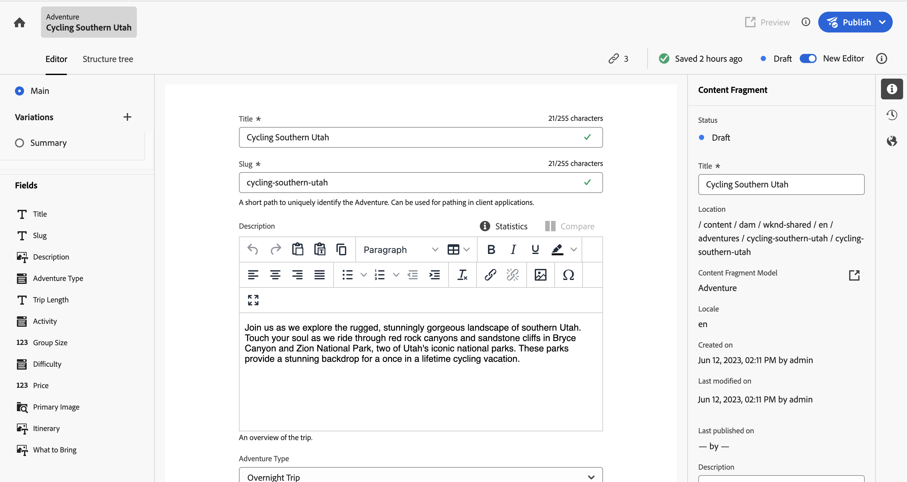

# Inhoudsfragmenten beheren {#managing-content-fragments}

Leer hoe u uw **Inhoudsfragmenten** in Adobe Experience Manager (AEM) as a Cloud Service, van de toegewijde [Content Fragments-console](#content-fragments-console), en [Inhoudsfragmenteditor](/help/sites-cloud/administering/content-fragments/authoring.md#content-fragment-editor). Deze inhoudsfragmenten kunnen worden gebruikt als basis voor inhoud zonder kop of voor het ontwerpen van pagina&#39;s.

>[!NOTE]
>
>Uw projectteam kan de console en de redacteur indien nodig aanpassen. Zie [De console en Editor voor inhoudsfragmenten aanpassen](/help/implementing/developing/extending/content-fragments-console-and-editor.md) voor nadere bijzonderheden.

Na het definiëren van uw [Modellen van inhoudsfragmenten](#creating-a-content-model) U kunt deze gebruiken om:

* [Inhoudsfragmenten maken](#creating-a-content-fragment).
* Open vervolgens het dialoogvenster [Inhoudsfragmenteditor](#opening-the-fragment-editor) tot [auteur uw inhoud en beheer uw Variaties](#editing-the-content-of-your-fragment).
* [Tags beheren](#manage-tags)
* [De eigenschappen (metagegevens) weergeven en bewerken](#viewing-and-editing-properties)
* [De boomstructuur weergeven](/help/sites-cloud/administering/content-fragments/authoring.md#structure-tree)

>[!NOTE]
>
>Inhoudsfragmenten kunnen worden gebruikt:
>
>* for [Levering van inhoud zonder kop met gebruik van inhoudsfragmenten met GraphQL](/help/sites-cloud/administering/content-fragments/content-delivery-with-graphql.md),
>* bij het ontwerpen van pagina&#39;s; zie [Pagina&#39;s ontwerpen met inhoudsfragmenten](/help/sites-cloud/authoring/fragments/content-fragments.md).

>[!NOTE]
>
>Inhoudsfragmenten worden opgeslagen als **Activa**. Zij worden hoofdzakelijk beheerd vanuit de **Inhoudsfragmenten** console, maar kan ook vanuit de [Activa](/help/assets/content-fragments/content-fragments-managing.md) console.

## De console met inhoudsfragmenten {#content-fragments-console}

De console van de Fragmenten van de Inhoud wordt gewijd aan het beheren van, het zoeken naar, en het creëren van de Fragmenten van de Inhoud. Het is geoptimaliseerd voor gebruik in een context zonder kop, maar wordt ook gebruikt bij het maken van Content Fragments voor gebruik in paginaontwerp.

De console van de Fragmenten van de Inhoud verleent directe toegang tot uw fragmenten, en verwante taken. De console kan direct van het hoogste niveau van de Globale Navigatie worden betreden.

Zie voor meer informatie:

* [Basisstructuur en verwerking van de console voor inhoudsfragmenten](#basic-structure-handling-content-fragments-console)

* [De informatie die over uw inhoudsfragmenten wordt verstrekt](#information-content-fragments)

* [Handelingen voor een inhoudsfragment in de inhoudsfragmentconsole](#actions-selected-content-fragment)

* [Kolommen selecteren die worden weergegeven in de console](#select-columns-console)

* [Zoeken en filteren in de console voor inhoudsfragmenten](#filtering-fragments)

* Een selectie van [sneltoetsen](/help/sites-cloud/administering/content-fragments/keyboard-shortcuts.md) zijn beschikbaar voor gebruik in deze console

>[!NOTE]
>
>Op deze console worden alleen inhoudsfragmenten weergegeven. Andere elementtypen, zoals afbeeldingen en video&#39;s, worden niet weergegeven.

>[!CAUTION]
>
>Deze console is *alleen* beschikbaar in de online as a Cloud Service Adobe Experience Manager (AEM).

### Basisstructuur en verwerking van de console {#basic-structure-handling-content-fragments-console}

Selecteren **Inhoudsfragmenten** Hiermee opent u de console op een nieuw tabblad.

<!-- CQDOC-21349: screenshot -->

Hier kunt u zien dat er drie hoofdgebieden zijn:

* De bovenste werkbalk
   * Biedt standaard AEM
   * Ook uw IMS-organisatie tonen
   * Verschillende [handelingen](#actions-unselected)
* Het linkerdeelvenster
   * Hier kunt u de mappenstructuur verbergen of weergeven
   * U kunt een specifieke vertakking van de boomstructuur selecteren
   * Dit kan worden aangepast om geneste mappen weer te geven
   * U kunt kiezen tussen het weergeven van inhoudsfragmenten of [Activa](/help/sites-cloud/administering/content-fragments/assets-content-fragments-console.md)
* Het hoofd-/rechterdeelvenster - vanaf hier kunt u:
   * Zie de lijst met alle inhoudsfragmenten in de geselecteerde vertakking van de structuur:
      * Inhoudsfragmenten uit de geselecteerde map en alle onderliggende mappen worden weergegeven:
         * De plaats wordt aangegeven door de broodkruimels; deze kunnen ook worden gebruikt om de plaats te veranderen:
      * [Informatie wordt weergegeven over elk fragment](#information-content-fragments)
         * [U kunt selecteren welke kolommen u wilt weergeven](#select-columns-console)
      * [Verschillende informatiegebieden](#information-content-fragments) over een inhoudsfragment koppelingen verschaft. Afhankelijk van het veld kunnen deze koppelingen:
         * Open het gewenste fragment in de editor
         * Informatie over verwijzingen weergeven
         * Informatie weergeven over taalversies van het fragment
      * [Bepaalde andere informatiegebieden](#information-content-fragments) over een inhoudsfragment kan worden gebruikt voor [Snel filteren](#fast-filtering):
         * Selecteer een waarde in de kolom en wordt direct toegepast als filter
         * Snel filteren wordt ondersteund voor de **Model**, **Status**, **Gewijzigd door**, **Tags** en **Gepubliceerd door** kolommen.
      * Als u de muisaanwijzer op de kolomkoppen gebruikt, worden een vervolgkeuzelijst met handelingen en schuifregelaars voor de breedte weergegeven. Met deze opties kunt u:
         * Sorteren - selecteer de gewenste actie voor oplopend of aflopend. De volledige tabel wordt op basis van die kolom gesorteerd. Sorteren is alleen beschikbaar voor de desbetreffende kolommen.
         * De grootte van de kolom wijzigen - met de actie of de breedtegraadregelaars
      * Selecteer een of meer fragmenten voor verdere [action](#actions-selected-content-fragment)
   * Gebruik de [Zoeken](#searching-fragments) box
   * Open de [Deelvenster Filter](#filtering-fragments)

### Handelingen {#actions}

Binnen de console is er een reeks acties die u kunt gebruiken, of direct, of na het selecteren van een specifiek fragment:

* Verschillende acties zijn rechtstreeks [beschikbaar via de console](#actions-unselected)
* U kunt [Selecteer een of meer inhoudsfragmenten om de juiste handelingen weer te geven](#actions-selected-content-fragment)

#### Handelingen (niet geselecteerd) {#actions-unselected}

Bepaalde acties zijn beschikbaar via de console, zonder een specifiek inhoudsfragment te selecteren:

* **[Maken](#creating-a-content-fragment)** een nieuw inhoudsfragment
* [Filter](#filtering-fragments) de Inhoudsfragmenten op basis van een selectie van voorspelling en sla het filter op voor toekomstig gebruik
* [Zoeken](#searching-fragments) de inhoudsfragmenten
* [De tabelweergave aanpassen om geselecteerde kolommen met informatie weer te geven](#select-columns-console)
* Gebruiken **Openen in elementen** om de huidige locatie in het dialoogvenster **Activa** console

  >[!NOTE]
  >
  >De **Activa** -console wordt gebruikt om toegang te krijgen tot elementen, zoals afbeeldingen, video&#39;s, enzovoort.  U hebt toegang tot deze console:
  >
  >* met de **Openen in elementen** koppeling (in de console Inhoudsfragmenten)
  >* rechtstreeks van de wereld **Navigatie** ruit

#### Handelingen voor een (geselecteerd) inhoudsfragment {#actions-selected-content-fragment}

Als u een specifiek fragment selecteert, wordt een werkbalk geopend die is toegespitst op de acties die beschikbaar zijn voor dat fragment. U kunt ook meerdere fragmenten selecteren. De selectie van acties wordt dienovereenkomstig aangepast.

<!-- CQDOC-21349: screenshot -->

* **[Openen in nieuwe editor](#editing-the-content-of-your-fragment)**
* **[Openen](/help/assets/content-fragments/content-fragments-variations.md)** (in oorspronkelijke editor)
* **[Publiceren](#publishing-and-previewing-a-fragment)** (en **[Publiceren ongedaan maken](#unpublishing-a-fragment)**)
* **[Tags beheren](#manage-tags)**
* **[Kopiëren](/help/assets/manage-digital-assets.md)**
* **[Verplaatsen](/help/assets/manage-digital-assets.md)**
* **[Naam wijzigen](/help/assets/manage-digital-assets.md)**
* **[Verwijderen](#deleting-a-fragment)**
* **[Vervangen](#find-and-replace)**

>[!NOTE]
>
>Gebruiken **Openen** om het geselecteerde fragment te openen in het dialoogvenster *origineel* editor.

>[!NOTE]
>
>Handelingen als Publiceren, Publiceren ongedaan maken, Verwijderen, Verplaatsen, Naam wijzigen en Kopiëren activeren elk een asynchrone taak. De voortgang van die taak kan worden gecontroleerd via de interface AEM Async Jobs.

### De informatie die over uw inhoudsfragmenten wordt verstrekt {#information-content-fragments}

Het hoofd/juiste paneel (lijstmening) van de console verstrekt een waaier van informatie over uw Fragments van de Inhoud. Sommige punten verstrekken ook directe verbindingen aan verdere acties en/of informatie:

* **Naam**
   * Hier vindt u een koppeling waarmee u het fragment in de editor kunt openen.
* **Model**
   * Alleen informatie.
   * Kan worden gebruikt voor [Snel filteren](#fast-filtering)
* **Map**
   * Verstrekt een verbinding om de omslag in de console te openen.
Als u de muis boven de mapnaam houdt, wordt het JCR-pad weergegeven.
* **Status**
   * Alleen informatie.
   * Kan worden gebruikt voor [Snel filteren](#fast-filtering)
* **Voorvertoning**
   * Alleen informatie:
      * **synchroon**: Inhoudsfragment wordt gesynchroniseerd op het tabblad **Auteur** en **Voorvertoning** diensten.
      * **Niet meer gesynchroniseerd**: Inhoudsfragment is niet meer synchroon op het tabblad **Auteur** en **Voorvertoning** diensten. U moet **Publiceren** tot **Voorvertoning** om ervoor te zorgen dat beide instanties weer synchroon zijn.
      * leeg: het inhoudsfragment bestaat niet in het dialoogvenster **Voorvertoning** service.
* **gewijzigd**
   * Alleen informatie.
* **Gewijzigd door**
   * Alleen informatie.
   * Kan worden gebruikt voor [Snel filteren](#fast-filtering).
* **Tags**
   * Alleen informatie.
   * Hiermee worden alle codes weergegeven die betrekking hebben op het inhoudsfragment. Dit zijn zowel de Hoofd- als eventuele variaties.
   * Kan worden gebruikt voor [Snel filteren](#fast-filtering).
* **Gepubliceerd op**
   * Alleen informatie.
* **Gepubliceerd door**
   * Alleen informatie.
   * Kan worden gebruikt voor [Snel filteren](#fast-filtering).
* **Verwezen door**:
   * Hiermee wordt een koppeling weergegeven waarmee een dialoogvenster wordt geopend waarin alle [bovenliggende verwijzingen](#parent-references-fragment)  van dat fragment; inclusief verwijzen naar inhoudsfragmenten, ervaringsfragmenten en pagina&#39;s. Als u een specifieke verwijzing wilt openen, klikt u op de knop **Titel** in het dialoogvenster.

     

* **Taal**: geef aan [Taal](#language-copies-fragment) exemplaren

   * Geeft de landinstelling van het inhoudsfragment aan, samen met het totale aantal lokale/[Taal](#language-copies-fragment)  kopieën die aan het inhoudsfragment zijn gekoppeld.

     

   * Selecteer de telling om een dialoog te openen die alle taalexemplaren toont. Als u een specifieke taalkopie wilt openen, klikt u op de knop **Titel** in het dialoogvenster.

     

## Inhoudsfragmenten maken {#creating-content-fragments}

Voordat u het inhoudsfragment maakt, moet u het onderliggende inhoudsfragmentmodel maken.

### Een inhoudsmodel maken {#creating-a-content-model}

[Modellen van inhoudsfragmenten](/help/sites-cloud/administering/content-fragments/content-fragment-models.md) moet worden ingeschakeld en gemaakt voordat u inhoudsfragmenten met gestructureerde inhoud maakt.

### Een inhoudsfragment maken {#creating-a-content-fragment}

Een inhoudsfragment maken:

1. Van de **Inhoudsfragmenten** console, selecteren **Maken** (rechtsboven).

   >[!NOTE]
   >
   >Als u de locatie van het nieuwe fragment vooraf wilt definiëren, navigeert u naar de map waar u het fragment wilt maken of kunt u de locatie opgeven tijdens het maken.

1. De **Nieuw inhoudsfragment** wordt geopend, kunt u vanaf dit punt het volgende opgeven:

   * **Locatie** - Automatisch voltooid met de huidige locatie, maar u kunt desgewenst een andere locatie selecteren.
   * **Inhoudsfragmentmodel** - Selecteer in de vervolgkeuzelijst het model dat u als basis voor het fragment wilt gebruiken.
   * **Titel**
   * **Naam** - Automatisch voltooid op basis van de **Titel**, maar u kunt deze desgewenst bewerken.
   * **Beschrijving**

   

1. Selecteren **Maken**, of **Maken en openen** om uw definitie voort te zetten.

## Statussen van inhoudsfragmenten {#statuses-content-fragments}

Tijdens het bestaan kan een inhoudsfragment verschillende statussen hebben, zoals in het dialoogvenster [Console voor inhoudsfragment](/help/sites-cloud/administering/content-fragments/managing.md#content-fragments-console) en [Inhoudsfragmenteditor](/help/sites-cloud/administering/content-fragments/authoring.md):

* **Nieuw** (grijs) Er is een nieuw inhoudsfragment gemaakt, maar het heeft geen inhoud omdat het nog nooit is bewerkt of geopend in de editor voor inhoudsfragmenten.
* **Concept** (blauw) Iemand heeft het (nieuwe) inhoudsfragment bewerkt of geopend in de Inhoudsfragmenteditor, maar het is nog niet gepubliceerd.
* **Gepubliceerd** (groen) Het inhoudsfragment is gepubliceerd.
* **gewijzigd** (oranje) Het inhoudsfragment is bewerkt nadat het is gepubliceerd (maar voordat de wijziging is gepubliceerd).
* **Ongepubliceerd** (rood) Het inhoudsfragment is niet gepubliceerd.

## De inhoud van het fragment (en variaties) bewerken {#editing-the-content-of-your-fragment}

>[!IMPORTANT]
>
>Voor volledige informatie, [zie Inhoudsfragmenten ontwerpen](/help/sites-cloud/administering/content-fragments/authoring.md)

Uw fragment openen voor bewerken:

1. Gebruik de **Inhoudsfragmenten** -console om naar de locatie van het inhoudsfragment te navigeren.
1. Open het fragment voor bewerking door het fragment te selecteren en vervolgens **Openen in nieuwe editor** op de werkbalk.

1. De fragmenteditor wordt geopend. Selecteer uw vereiste **Variatie** Breng de gewenste wijzigingen aan (deze worden automatisch opgeslagen):

   

## Tags weergeven en beheren {#manage-tags}

Vanuit de console Inhoudsfragmenten kunt u alle toegepaste tags weergeven in het dialoogvenster **Tags** kolom; na ervoor te zorgen dat [de kolom wordt weergegeven](#select-columns-console).

### Tags beheren (console) {#manage-tags-console}

De tags beheren:

1. Navigeer naar de console voor inhoudsfragmenten.
1. Selecteer een inhoudsfragment.
1. Selecteren **Tags beheren** in de werkbalk.
1. Gebruik de tagkiezer om tags te selecteren die u wilt toepassen of om tags te verwijderen:

   

1. **Opslaan** updates. Dit zal u aan de console terugkeren.

### Tags weergeven en bewerken (Editor) {#viewing-and-editing-tags}

U kunt de tags die op een fragment zijn toegepast, ook weergeven en bewerken met de opdracht [Eigenschappen](/help/sites-cloud/administering/content-fragments/authoring.md) tabblad van de editor. De weergegeven informatie verschilt per **Hoofd** en alle **Variaties**.

## Eigenschappen weergeven en bewerken (Editor) {#viewing-and-editing-properties}

U kunt de eigenschappen (metagegevens) van een fragment weergeven en bewerken met de opdracht [Eigenschappen](/help/sites-cloud/administering/content-fragments/authoring.md) tabblad van de editor. De weergegeven informatie verschilt per **Hoofd** en alle **Variaties**.

## Een fragment publiceren en voorvertonen {#publishing-and-previewing-a-fragment}

U kunt inhoudsfragmenten publiceren naar:

* de **[Service voor publiceren](/help/headless/deployment/architecture.md)** - voor volledige toegang van het publiek

* de **[Voorvertoningsservice](/help/headless/deployment/architecture.md)** - om de inhoud voor te vertonen voordat deze volledig beschikbaar is

  >[!CAUTION]
  >
  >Inhoudsfragmenten publiceren naar de **Voorvertoningsservice** is alleen beschikbaar via de console Inhoudsfragmenten; het gebruik van de **Publiceren** handeling.

  >[!NOTE]
  >
  >Zie voor meer informatie over de voorvertoningsomgevingen [Omgevingen beheren](/help/implementing/cloud-manager/manage-environments.md#access-preview-service).

>[!CAUTION]
>
>Als het fragment op een model is gebaseerd, moet u ervoor zorgen dat de [model is gepubliceerd](/help/sites-cloud/administering/content-fragments/content-fragment-models.md#publishing-a-content-fragment-model).
>
>Als u een inhoudsfragment publiceert waarvoor het model nog niet is gepubliceerd, wordt dit in een selectielijst aangegeven en wordt het model met het fragment gepubliceerd.

### Publiceren {#publishing}

U kunt inhoudsfragmenten publiceren met de opdracht **Publiceren** optie van:

* de werkbalk van de [Content Fragments-console](#actions-selected-content-fragment)

   * Selecteer een of meer fragmenten in de lijst.

* de werkbalk van de [Inhoudsfragmenten, editor](/help/sites-cloud/administering/content-fragments/authoring.md#content-fragment-editor)

Na het selecteren van **Publiceren** handeling:

1. Selecteer een van de volgende opties om het desbetreffende dialoogvenster te openen:

   * **Nu** - selecteer een van de **Service voor publiceren** of de **Voorvertoningsservice**; na bevestiging wordt het fragment onmiddellijk gepubliceerd
   * **Schema** - naast de vereiste service kunt u ook de datum en tijd selecteren waarop het fragment wordt gepubliceerd

1. Geef alle gegevens op in het dialoogvenster. Bijvoorbeeld voor een gepland publicatieverzoek:

   

   >[!NOTE]
   >
   >Indien nodig moet u de te publiceren referenties opgeven. Standaard worden verwijzingen ook gepubliceerd naar de voorvertoningsservice om ervoor te zorgen dat de inhoud niet wordt afgebroken.

1. Bevestig de handeling Publiceren.

Na publicatie wordt de fragmentstatus bijgewerkt en zichtbaar in de editor en console. Als u een geplande publicatie hebt opgegeven, worden de gegevens weergegeven.

>[!NOTE]
>
>Wanneer u [Een pagina publiceren die het fragment gebruikt](/help/sites-cloud/authoring/fragments/content-fragments.md#publishing); het fragment wordt weergegeven in de paginaverwijzingen.

## Publicatie van een fragment ongedaan maken {#unpublishing-a-fragment}

U kunt de publicatie van inhoudsfragmenten ongedaan maken:

* de werkbalk van de [Content Fragments-console](#actions-selected-content-fragment)

   * Selecteer een of meer fragmenten in de lijst.

* de werkbalk van de [Inhoudsfragmenten, editor](/help/sites-cloud/administering/content-fragments/authoring.md#content-fragment-editor)

In beide gevallen selecteert u **Publiceren ongedaan maken** van de werkbalk, gevolgd door **Nu** of **Gepland**.

Wanneer het relevante dialoogvenster wordt geopend, kunt u de juiste service selecteren:

>[!NOTE]
>
>De **Publiceren ongedaan maken** actie is alleen zichtbaar wanneer gepubliceerde fragmenten beschikbaar zijn.

>[!CAUTION]
>
>Als er al vanuit een ander fragment of een pagina naar het fragment wordt verwezen, wordt er een waarschuwingsbericht weergegeven en moet u bevestigen dat u wilt doorgaan.

## Zoeken en vervangen {#find-and-replace}

<!-- CQDOC-21349: screenshot -->

De **Vervangen** Er is een handeling beschikbaar (op de bovenste werkbalk) om opgegeven tekst in geselecteerde inhoudsfragmenten te zoeken en te vervangen.

Voordat de validatiecriteria worden vervangen, worden deze gecontroleerd en worden eventuele conflicten gemeld. Zo kunt u de vervangende tekenreeks wijzigen of alleen de gevalideerde instanties vervangen.

>[!NOTE]
>
>De actie Zoeken en vervangen kan alleen worden uitgevoerd op maximaal 20 geselecteerde inhoudsfragmenten (tegelijk).
>
>Als u meer dan 20 inhoudsfragmenten selecteert, wordt het bericht weergegeven **Kan niet vinden en vervangen**.

<!-- CQDOC-21349: screenshot -->

## Een fragment verwijderen {#deleting-a-fragment}

Een fragment verwijderen:

1. In de **Inhoudsfragmenten** navigeren naar de locatie van het inhoudsfragment.
1. Selecteer het fragment.
1. Selecteren **Verwijderen** op de werkbalk.
1. Bevestig de **Verwijderen** handeling.

>[!NOTE]
>
>De **Verwijderen** niet beschikbaar is voor fragmenten die momenteel worden gepubliceerd, maar eerst niet worden gepubliceerd.

## Bovenliggende verwijzingen van het fragment zoeken {#parent-references-fragment}

Details van bovenliggende verwijzingen zijn toegankelijk via het

* **Verwijzingen** kolom van de console voor inhoudsfragmenten
* de [bovenliggende verwijzingen koppelen in de bovenste werkbalk van de editor voor inhoudsfragmenten](/help/sites-cloud/administering/content-fragments/authoring.md#view-parent-references)

Beide bevatten een koppeling waarmee een dialoogvenster wordt geopend met alle bovenliggende verwijzingen van dat fragment, inclusief het verwijzen naar inhoudsfragmenten, ervaringsfragmenten en pagina&#39;s. Als u een specifieke verwijzing wilt openen, klikt u op de knop **Titel** of het koppelingspictogram in het dialoogvenster.

Bijvoorbeeld:

## Taalkopieën van het fragment zoeken {#language-copies-fragment}

Nadere bijzonderheden over de taalkopieën zijn te vinden op:

* de **Taal** kolom van de [Console voor inhoudsfragmenten](#information-content-fragments)
* de [Taalkopieën, tabblad van de editor voor inhoudsfragmenten](/help/sites-cloud/administering/content-fragments/authoring.md#view-language-copies)

Het pictogram geeft de landinstelling van het inhoudsfragment aan, samen met het totale aantal landinstellingen/taalkopieën dat aan het inhoudsfragment is gekoppeld. Bijvoorbeeld vanaf de console:

Selecteer de telling om een dialoog te openen die alle taalexemplaren toont. Als u een specifieke taalkopie wilt openen, klikt u op de knop **Titel** in het dialoogvenster.

## Kolommen selecteren die worden weergegeven in de console {#select-columns-console}

Zoals met andere consoles kunt u de kolommen vormen die zichtbaar, en beschikbaar voor actie zijn:

Dit zal een lijst van kolommen voorstellen die u kunt verbergen of tonen:

## Fragmenten filteren {#filtering-fragments}

Het deelvenster Filter biedt de volgende opties:

* een selectie van de voorspelling;
   * inclusief modellen van inhoudsfragmenten, lokalisatie, tags, statusvelden, enzovoort
   * een of meer voorspelden kunnen worden geselecteerd en gecombineerd om het filter te maken
* **Submapitems uitsluiten**, zodat u inhoudsfragmenten die zijn opgeslagen in submappen kunt uitsluiten
* de mogelijkheid **Opslaan** uw configuratie
* de optie om een opgeslagen zoekfilter op te halen voor hergebruik

Als deze optie is geselecteerd, wordt **Filteren met** worden weergegeven (onder het vak Zoeken). Ze kunnen van daaruit worden geschrapt. Bijvoorbeeld:

<!-- CQDOC-21349: screenshot -->

### Snel filteren {#fast-filtering}

U kunt ook een voorspelling selecteren door op een specifieke kolomwaarde in de lijst te klikken. U kunt een of meer waarden selecteren om voorspellingen te combineren.

Selecteer bijvoorbeeld **Gepubliceerd** in de **Status** kolom:

>[!NOTE]
>
>Snel filteren wordt alleen ondersteund voor de **Model**, **Status**, **Gewijzigd door**, **Tags**, en **Gepubliceerd door** kolommen.

Wanneer deze optie is geselecteerd, wordt deze weergegeven als een filtervoorspelling en wordt de lijst dienovereenkomstig gefilterd:

## Fragmenten zoeken {#searching-fragments}

Het zoekvak ondersteunt zoeken in volledige tekst. Voer de zoektermen in het zoekvak in:

<!-- CQDOC-21349: screenshot -->

De geselecteerde resultaten worden weergegeven:

<!-- CQDOC-21349: screenshot -->

Het zoekvak biedt ook snelle toegang tot **Recente inhoudsfragmenten** en **Opgeslagen zoekopdrachten**:

