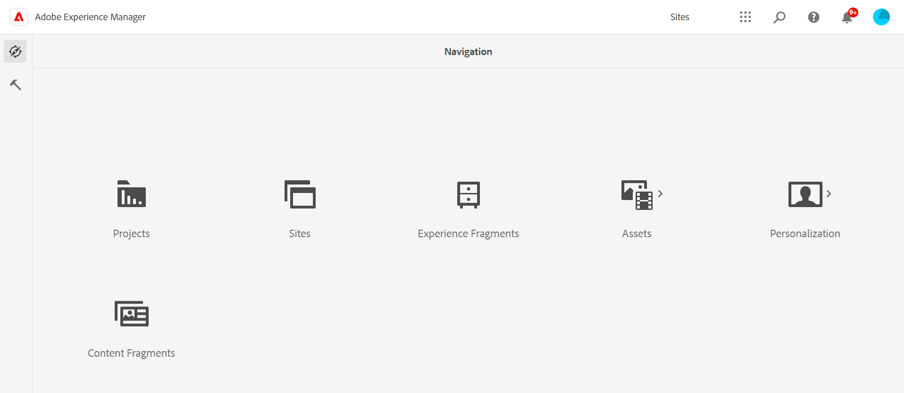

# Een overzicht van het werken met inhoudsfragmenten {#overview-working-with-content-fragments}

Met Adobe Experience Manager (AEM) as a Cloud Service kunt u met inhoudsfragmenten paginaonafhankelijke inhoud ontwerpen, maken, beheren en publiceren. Zij staan u toe om inhoud klaar voor gebruik in veelvoudige plaatsen, en over veelvoudige kanalen voor te bereiden, ideaal voor [ hoofdloze levering ](/help/headless/what-is-headless.md), en [ pagina authoring ](/help/sites-cloud/authoring/fragments/content-fragments.md).

>[!IMPORTANT]
>
>Vele eigenschappen die in deze sectie worden beschreven zijn *slechts* beschikbaar in [ Verenigde Shell ](/help/overview/aem-cloud-service-on-unified-shell.md); zo *online* Adobe Experience Manager (AEM) as a Cloud Service, niet een lokale instantie.

>[!IMPORTANT]
>
>De Fragmenten van de inhoud kunnen van twee consoles worden betreden: **de Fragmenten van de Inhoud** en **Assets**.
>
>Er zijn ook twee editors voor het ontwerpen van inhoudsfragmenten. Hoewel de basisfunctionaliteit hetzelfde is, zijn er enkele verschillen. Beide editors zijn toegankelijk vanuit beide consoles.
>
>Deze sectie behandelt de **console van de Fragmenten van de Inhoud** en de *nieuwe* redacteur van het Fragment van de Inhoud. Deze zijn ontwikkeld voor inhoud zonder kop (hoewel ze voor alle scenario&#39;s kunnen worden gebruikt)
>
>Zie voor meer informatie:
>
>* gebruik van de **Assets** console voor [ het beheren van de Fragmenten van de Inhoud ](/help/assets/content-fragments/content-fragments-managing.md)
>* gebruik van de [*originele* redacteur van het Fragment van de Inhoud ](/help/assets/content-fragments/content-fragments-variations.md),
>* het gebruiken van [ Fragmenten van de Inhoud voor pagina-creatie ](/help/sites-cloud/authoring/fragments/content-fragments.md).

Inhoudsfragmenten bevatten gestructureerde inhoud:

* Elk fragment is gebaseerd op het Model van het Fragment van de a [ Inhoud ](/help/sites-cloud/administering/content-fragments/managing-content-fragment-models.md).
   * Het [ Model van het Fragment van de Inhoud bepaalt de structuur ](/help/sites-cloud/administering/content-fragments/content-fragment-models.md) van het resulterende fragment.
* Elk fragment bestaat uit:
   * **[Hoofd](#main-and-variations)** - een integraal deel van het fragment dat de kerninhoud houdt; bestaat altijd, kan niet worden geschrapt
   * **[Variaties](#main-and-variations)** - één, of meer, permutaties van de inhoud, die door de auteur wordt gecreeerd
* De structuur kan liggen tussen:
   * Basis
      * Bijvoorbeeld een tekstveld met één regel tekst.
      * Kan worden gebruikt voor het voorbereiden van eenvoudige inhoud voor gebruik in paginaontwerp.
      * Kan ook worden gebruikt voor koploze levering aan uw toepassing.
   * Complex
      * Een combinatie van een groot aantal velden met verschillende gegevenstypen, zoals tekst, getal, boolean en datum en tijd.
      * Kan worden gebruikt voor het voorbereiden van meer gestructureerde inhoud voor het ontwerpen van pagina&#39;s of voor levering zonder kop aan uw toepassing.
   * Genest
      * Met de beschikbare gegevenstypen waarnaar wordt verwezen, kunt u de inhoud nesten.
      * De neiging om voor hoofdloze levering aan uw toepassing te worden gebruikt.

Inhoudsfragmenten kunnen ook in JSON-indeling worden geleverd, waarbij gebruik wordt gemaakt van de JSON-exportmogelijkheden (Sling Model) van AEM-kerncomponenten. Deze leveringsvorm:

* biedt u de mogelijkheid om de component te gebruiken om te beheren welke elementen van een fragment moeten worden geleverd
* staat bulklevering toe; door de veelvoudige [ Componenten van de Kern van het Fragment van de Inhoud ](https://experienceleague.adobe.com/docs/experience-manager-core-components/using/wcm-components/content-fragment-component.html) op de pagina toe te voegen die voor API levering wordt gebruikt

Het aantal communicatiekanalen neemt jaarlijks toe. Doorgaans verwijzen kanalen naar het leveringsmechanisme, als:

* Fysiek kanaal, bijvoorbeeld desktop, mobiel.
* Leveringsvorm via een fysiek kanaal, bijvoorbeeld de pagina met productdetails, de pagina met productcategorieën voor desktops of de pagina Mobiel web en de pagina Mobiele apps voor mobiele apparaten.

Nochtans, wilt u (waarschijnlijk) niet *nauwkeurige* zelfde inhoud voor alle kanalen gebruiken - u moet uw inhoud volgens het specifieke kanaal optimaliseren.

Met inhoudelementen kunt u:

* Overweeg hoe u doelpubliek efficiënt langs verschillende kanalen kunt bereiken.
* Kanaalneutrale redactionele inhoud maken en beheren.
* Stel inhoudsgroepen samen voor een reeks kanalen.
* Ontwerpinhoudvariaties voor specifieke kanalen.
* Voeg afbeeldingen aan uw tekst toe door elementen in te voegen.
* Maak geneste inhoud om de complexiteit van uw gegevens te weerspiegelen.

Deze inhoudsfragmenten kunnen vervolgens worden samengesteld om ervaringen via verschillende kanalen te bieden.

>[!NOTE]
>
>**de Fragmenten van de Inhoud** en **[Fragmenten van de Ervaring](/help/sites-cloud/authoring/fragments/content-fragments.md)** zijn verschillende eigenschappen binnen AEM:
>
>* **de Fragmenten van de Inhoud** zijn redactionele inhoud, met definitie en structuur, maar zonder extra visueel ontwerp en/of lay-out. Ze kunnen worden gebruikt om onder andere toegang te krijgen tot gestructureerde gegevens, zoals tekst, cijfers en datums.
>* **de Fragmenten van de Ervaring** zijn volledig opgemaakt inhoud; een fragment van een Web-pagina.
>
>De Fragmenten van de ervaring kunnen inhoud in de vorm van Inhoudsfragmenten bevatten, maar niet andersom.
>
>Voor verdere informatie, zie [ Begrijpend de Fragmenten van de Inhoud en de Fragmenten van de Ervaring in AEM ](https://experienceleague.adobe.com/docs/experience-manager-learn/sites/content-fragments/understand-content-fragments-and-experience-fragments.html#content-fragments).

Deze pagina&#39;s en de volgende pagina&#39;s bevatten de taken voor het maken, configureren, onderhouden en gebruiken van de inhoudsfragmenten:

* [Functionaliteit van inhoudsfragment inschakelen voor uw instantie](/help/sites-cloud/administering/content-fragments/setup.md)
* [ Modellen van het Fragment van de Inhoud ](/help/sites-cloud/administering/content-fragments/managing-content-fragment-models.md) - toelatend, creërend, en [ bepalend ](/help/sites-cloud/administering/content-fragments/content-fragment-models.md) uw modellen
* [ creeer uw Fragmenten van de Inhoud ](/help/sites-cloud/administering/content-fragments/managing.md#creating-a-content-fragment) (gebruikend de Console van het Fragment van de Inhoud)

Nadat de fragmenten zijn gemaakt, kunt u:

* [ gebruik de console van de Fragmenten van de Inhoud ](/help/sites-cloud/administering/content-fragments/managing.md) - aan:
   * toegang krijgen, publiceren (om een voorvertoning of productie weer te geven) en verwijzen naar uw fragmenten
* [ gebruik de redacteur van de Fragmenten van de Inhoud ](/help/sites-cloud/administering/content-fragments/authoring.md) - aan:
   * bewerken, publiceren (voor voorvertoning of productie) en verwijzen naar uw fragmenten
   * samenwerken met andere auteurs die opmerkingen gebruiken
* [ analyseer ](/help/sites-cloud/administering/content-fragments/analysis.md) de structuur van uw Fragment van de Inhoud, gebruikend de redacteur
* [ heb toegang tot uw fragmenten met GraphQL, voor hoofdloze levering aan uw toepassingen ](/help/sites-cloud/administering/content-fragments/content-delivery-with-graphql.md).
* [ integreer en gebruik uw Fragmenten van de Inhoud in Adobe Journey Optimizer ](/help/sites-cloud/administering/content-fragments/content-fragments-with-journey-optimizer.md)
* Creeer, en beheer, [ Lanceringen voor de Fragmenten van de Inhoud ](/help/sites-cloud/administering/content-fragments/launches-for-content-fragments.md)
* [Of gebruik uw fragmenten voor paginaontwerp](/help/sites-cloud/authoring/fragments/content-fragments.md)

>[!NOTE]
>
>Deze pagina&#39;s kunnen samen met:
>
>* [Contentfragmenten aanpassen en uitbreiden](/help/implementing/developing/extending/content-fragments-customizing.md)
>* [Contentfragmenten die componenten voor rendering configureren](/help/implementing/developing/extending/content-fragments-configuring-components-rendering.md)
>* [Ondersteuning voor contentfragmenten in HTTP-API van AEM Assets](/help/assets/content-fragments/assets-api-content-fragments.md)
>* [ AEM GraphQL API voor gebruik met de Fragmenten van de Inhoud ](/help/headless/graphql-api/content-fragments.md)
>* [ het Authoring van de Pagina met de Fragmenten van de Inhoud ](/help/sites-cloud/authoring/fragments/content-fragments.md).
>* Het [ Fragment van de Inhoud en ModelAPIs van het Fragment van de Inhoud ](/help/headless/content-fragment-openapis.md) zijn ook beschikbaar.

## Hoofd en Variaties {#main-and-variations}

Variaties zijn een belangrijk kenmerk van AEM Content Fragments. Zij staan u toe om exemplaren van de **Belangrijkste** inhoud voor gebruik op specifieke kanalen, en scenario&#39;s tot stand te brengen en uit te geven, makend koploze inhoudslevering en pagina het schrijven nog flexibeler.

* **Hoofd**

   * **Hoofd** is geen variatie als dusdanig, maar is de basis van alle variaties.
   * Een integraal onderdeel van het fragment

      * Elk fragment van de Inhoud heeft één geval van **Hoofd**.
      * **Hoofd** kan niet worden geschrapt.

   * **Hoofd** is toegankelijk in de fragmentredacteur onder **[Variaties](/help/sites-cloud/administering/content-fragments/authoring.md#variations)**.

  >[!NOTE]
  >
  >In de redacteur beschikbaar bij de **Assets** console, **Hoofd** wordt geëtiketteerd als **Meester**.

* **Variaties**

   * Uitvoeringen van fragmenttekst die specifiek zijn voor redactionele doeleinden; kan gerelateerd zijn aan het kanaal maar is niet verplicht, maar kan ook voor lokale ad-hocwijzigingen worden gebruikt.
   * Wordt gecreeerd als exemplaren van **Hoofd**, maar kan dan worden uitgegeven zoals vereist; er is vaak inhoudsoverlap tussen de variaties zelf.
   * Kan tijdens het ontwerpen van fragmenten worden gedefinieerd; vanuit het linkerdeelvenster.
   * Opgeslagen in het fragment, om spreiding van inhoudskopieën te voorkomen.
   * De variaties kunnen [ worden vergeleken en worden gesynchroniseerd ](/help/sites-cloud/administering/content-fragments/authoring.md#compare-and-synchronize-rich-text) met **Hoofd**.
  <!--
  * Can be [Summarized](/help/sites-cloud/administering/content-fragments/authoring.md#summarizing-text) to quickly truncate the text to a predefined length.
  -->

## Inhoudsfragmenten en inhoudsservices {#content-fragments-and-content-services}

AEM Content Services is ontworpen om de beschrijving en levering van inhoud in of vanuit AEM te veralgemenen, maar niet alleen op webpagina&#39;s.

Ze leveren inhoud aan kanalen die geen traditionele AEM-webpagina&#39;s zijn, met behulp van gestandaardiseerde methoden die door elke client kunnen worden gebruikt. Deze kanalen kunnen zijn:

* Toepassingen voor één pagina
* Systeemeigen mobiele toepassingen
* andere kanalen en aanraakpunten buiten AEM

De levering wordt uitgevoerd in JSON-indeling met behulp van de JSON Exporter.

Met AEM Content Fragments kunt u gestructureerde inhoud beschrijven en beheren. Gestructureerde inhoud wordt gedefinieerd in modellen die verschillende inhoudstypen kunnen bevatten, zoals tekst, numerieke gegevens, booleaanse gegevens, datum en tijd en meer.

Samen met de JSON-exportmogelijkheden van AEM-kerncomponenten kan deze gestructureerde inhoud vervolgens worden gebruikt om AEM-inhoud te leveren aan andere kanalen dan AEM-pagina&#39;s.

>[!NOTE]
>
>Zie [ Zwaartepunt en AEM ](/help/headless/introduction.md) voor een inleiding aan Zwaardeloze Ontwikkeling voor AEM Sites as a Cloud Service.

>[!NOTE]
>
>AEM ondersteunt ook het vertalen van fragmentinhoud. Zie [ Vertaal Assets ](/help/assets/translate-assets.md) voor verdere informatie.

## Inhoudstype {#content-type}

Inhoudsfragmenten zijn:

* De eigenschap van A **Plaatsen**.

* Opgeslagen als **Assets**:

   * De fragmenten van de inhoud (en hun variaties) kunnen van de [ console van de Fragmenten van de Inhoud worden gecreeerd en worden gehandhaafd ](#content-fragments-console).
   * Geautoriseerd en bewerkt in de [ Redacteur van het Fragment van de Inhoud ](/help/sites-cloud/administering/content-fragments/authoring.md).

* Toegankelijk voor inhoudslevering die [ AEM GraphQL API ](/help/headless/graphql-api/content-fragments.md) gebruiken.

* Beschikbaar in de [ paginaredacteur door de component van het Fragment van de Inhoud te gebruiken ](/help/sites-cloud/authoring/fragments/content-fragments.md) (van verwijzingen voorzien component):

   * De [ Component van de Kern van het Fragment van de Inhoud ](https://experienceleague.adobe.com/docs/experience-manager-core-components/using/wcm-components/content-fragment-component.html) is beschikbaar aan paginaauteurs. Hiermee kunnen ze naar het vereiste inhoudsfragment in HTML- of JSON-indeling verwijzen en dit leveren.

Inhoudsfragmenten zijn een inhoudsstructuur die:

* Deze variabelen zijn niet opgemaakt of ontworpen (tekstopmaak is mogelijk voor tekstvelden).
* Deze zijn onafhankelijk van het leveringsmechanisme (zoals de pagina of het kanaal).
* Bevat één, of meer, [ constituerende delen ](#constituent-parts-of-a-content-fragment).
* Kan [ bevatten, of met, beelden ](#fragments-with-visual-assets) worden verbonden.

### Fragmenten met Visual Assets {#fragments-with-visual-assets}

Om auteurs meer controle over hun inhoud te geven, kunnen afbeeldingen worden toegevoegd aan en/of geïntegreerd met een inhoudsfragment.

Assets kan op verschillende manieren worden gebruikt met een inhoudsfragment. Elk van deze mogelijkheden heeft zijn eigen voordelen:

* als Verwijzing van de a **Inhoud**
* binnen a **Meerdere lijntekst** gebied

### Delen van een inhoudsfragment maken {#constituent-parts-of-a-content-fragment}

De elementen van het inhoudsfragment bestaan uit de volgende onderdelen (direct of indirect):

* **Elementen van het Fragment**

   * Elementen correleren met de gegevensvelden die inhoud bevatten.
   * U gebruikt het Model van het Fragment van de a [ Inhoud ](/help/sites-cloud/administering/content-fragments/managing-content-fragment-models.md) om het fragment van de Inhoud tot stand te brengen. De elementen (gebieden) [ die in het model worden gespecificeerd bepalen de structuur van het fragment ](/help/sites-cloud/administering/content-fragments/content-fragment-models.md). Deze elementen (velden) kunnen van verschillende gegevenstypen zijn.

* **Fragmentalinea&#39;s**

   * Tekstblokken, vaak meerdere regels, die zijn gescheiden als afzonderlijke entiteiten.

   * Inhoudsbeheer tijdens het ontwerpen van pagina&#39;s inschakelen.

* **Metagegevens van het Fragment**

   * Gebruik de [ schema&#39;s van de meta-gegevens van Assets ](/help/assets/metadata-schemas.md).
   * Tags kunnen worden gemaakt wanneer u:

      * Het fragment maken en ontwerpen
      * Of later, wanneer u [ bekijkt of de eigenschappen ](/help/sites-cloud/administering/content-fragments/authoring.md#view-properties-tags) uitgeeft wanneer in de fragmentredacteur

  >[!CAUTION]
  >
  >Metagegevensverwerkingsprofielen zijn niet van toepassing op inhoudsfragmenten.

  >[!CAUTION]
  >
  >Een model van het Fragment van de Inhoud kan gegevensgebieden vaak bepalen genoemd **Titel** en **Beschrijving**. Als deze twee gebieden bestaan, zijn zij user-defined gebieden en kunnen op het inhoudsgebied van de redacteur worden bijgewerkt.
  >
  >Het tevreden Fragment, en zijn variaties, heeft ook meta-gegevens (bezit) gebieden genoemd **Titel** en **Beschrijving**. Deze twee metagegevensvelden maken integraal deel uit van een inhoudsfragment en variatie. Deze velden worden in eerste instantie gedefinieerd wanneer het fragment wordt gemaakt. Deze eigenschappen kunnen worden bijgewerkt in het gebied met eigenschappen/metagegevens van de editor.

* **[Hoofd](#main-and-variations)**
* **[Variaties](#main-and-variations)**

### Vereist door fragmenten {#required-by-fragments}

Voor het maken van Content Fragments hebt u nodig:

* **Model van de Inhoud**

   * Zijn [ toegelaten gebruikend Browser van de Configuratie ](/help/sites-cloud/administering/content-fragments/setup.md).
   * Wordt [ gecreeerd gebruikend de Console van het Fragment van de Inhoud ](/help/sites-cloud/administering/content-fragments/managing-content-fragment-models.md#creating-a-content-fragment-model).
   * Vereist om [ tot een fragment ](/help/sites-cloud/administering/content-fragments/managing.md#creating-content-fragments) te leiden.
   * Definieert de structuur van een fragment (titel, inhoudselementen, tagdefinities).
   * Definities van inhoudsfragmentmodel vereisen een titel en één gegevenselement. Alle overige elementen zijn optioneel.
   * Het model kan de standaardinhoud definiëren, indien van toepassing.
   * Auteurs kunnen de gedefinieerde structuur niet wijzigen tijdens het ontwerpen van fragmentinhoud, maar ze kunnen de modeleditor wel openen vanuit de fragmenteditor.
   * Wijzigingen die worden aangebracht in een model nadat afhankelijke inhoudsfragmenten zijn gemaakt, kunnen van invloed zijn op die inhoudsfragmenten.

Als u de Content Fragments wilt gebruiken voor de levering van inhoud zonder kop, hebt u ook het volgende nodig:

* a [ vraag van GraphQL ](/help/headless/graphql-api/content-fragments.md) om de vereiste inhoud te verzoeken
* deze inhoud kan dan voor de ontwikkeling van uw eigen SPAs voor AEM worden gebruikt; voor meer informatie, herzie de volgende documenten:

   * [SPA WKND-zelfstudie](/help/implementing/developing/hybrid/wknd-tutorial.md)
   * [Aan de slag met Reageren](/help/implementing/developing/hybrid/getting-started-react.md)
   * [Aan de slag met Angular](/help/implementing/developing/hybrid/getting-started-angular.md)

Als u de Content Fragments wilt gebruiken voor het ontwerpen van pagina&#39;s, hebt u ook het volgende nodig:

* A **Component van het Fragment van de Inhoud**

   * Instrumentaal voor het leveren van het fragment in HTML- en/of JSON-indeling.
   * Vereist om [ het fragment op een pagina ](/help/sites-cloud/authoring/fragments/content-fragments.md) van verwijzingen te voorzien.
   * Verantwoordelijk voor de lay-out en levering van een fragment, bijvoorbeeld kanalen.
   * Fragmenten hebben een of meer specifieke componenten nodig om de lay-out te definiëren en om enkele of alle elementen/variaties en bijbehorende inhoud te leveren.
   * Wanneer u een fragment naar een pagina sleept in de ontwerpfase, wordt de vereiste component automatisch gekoppeld.
   * Zie de [ Component van de Kern van het Fragment van de Inhoud ](https://experienceleague.adobe.com/docs/experience-manager-core-components/using/wcm-components/content-fragment-component.html).

## De console met inhoudsfragmenten {#content-fragments-console}

De console van de Fragmenten van de Inhoud wordt gewijd aan het beheren van, het zoeken naar, en het creëren van [ Fragmenten van de Inhoud ](/help/sites-cloud/administering/content-fragments/managing.md), [ Modellen van het Fragment van de Inhoud ](/help/sites-cloud/administering/content-fragments/managing-content-fragment-models.md) en [ Assets ](/help/sites-cloud/administering/content-fragments/assets-content-fragments-console.md). Deze functie is geoptimaliseerd voor gebruik in een context zonder koptekst, maar wordt ook gebruikt bij het maken van Content Fragments en Content Fragment Models voor gebruik in het ontwerpen van pagina&#39;s.

De console kan direct van het hoogste niveau van de Globale Navigatie worden betreden.

U kunt het meest linkse deelvenster gebruiken om het brontype te selecteren dat u wilt weergeven, bekijken en beheren:

Zie voor meer informatie:

* [Inhoudsfragmenten](/help/sites-cloud/administering/content-fragments/managing.md)
* [Modellen van inhoudsfragmenten](/help/sites-cloud/administering/content-fragments/managing-content-fragment-models.md)
* [Assets](/help/sites-cloud/administering/content-fragments/assets-content-fragments-console.md)

* Een selectie van [ toetsenbordkortere weg ](/help/sites-cloud/administering/content-fragments/keyboard-shortcuts.md) is beschikbaar voor gebruik in deze console

>[!CAUTION]
>
>Deze console is *slechts* beschikbaar in online Adobe Experience Manager (AEM) as a Cloud Service.

>[!NOTE]
>
>Uw projectteam kan de console en de redacteur indien nodig aanpassen. Zie [ het Aanpassen van de Console en de Redacteur van het Fragment van de Inhoud ](/help/implementing/developing/extending/content-fragments-console-and-editor.md) voor verdere details.

## Voorbeeldengebruik {#example-usage}

Een fragment met de elementen en variaties kan worden gebruikt om coherente inhoud voor meerdere kanalen te maken. Bij het ontwerpen van het fragment moet u rekening houden met wat er wordt gebruikt en waar.

### WKND-voorbeeld {#wknd-sample}

De [ Gedeelde Plaats WKND en WKND ](/help/implementing/developing/introduction/develop-wknd-tutorial.md) steekproeven worden verstrekt om u over AEM as a Cloud Service te helpen leren.

<!-- CHECK: which links can/should be used these days? -->

Het WKND-project omvat:

* Modellen voor inhoudsfragmenten zijn beschikbaar onder:

   * `.../libs/dam/cfm/models/console/content/models.html/conf/wknd`

   * `.../ui#/aem/libs/dam/cfm/models/console/content/models.html/conf/wknd-shared`

* Inhoudsfragmenten (en andere inhoud) beschikbaar onder:

   * `.../assets.html/content/dam/wknd/en`
