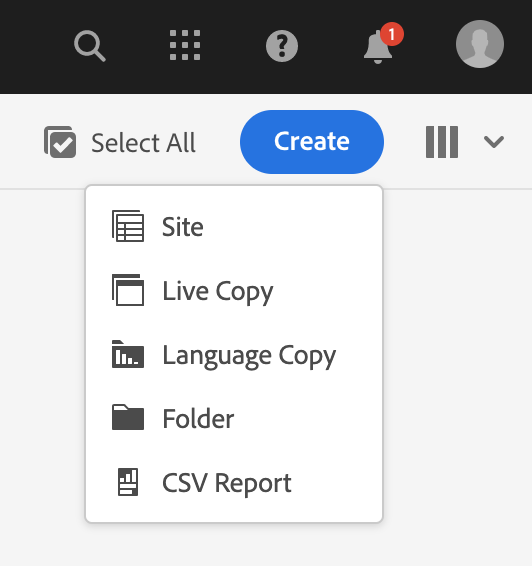
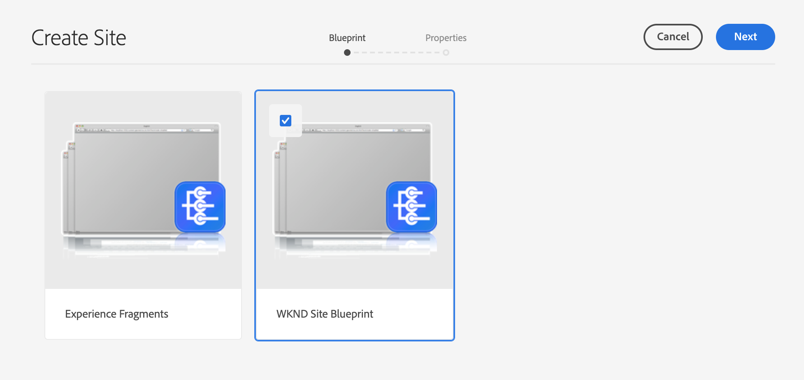
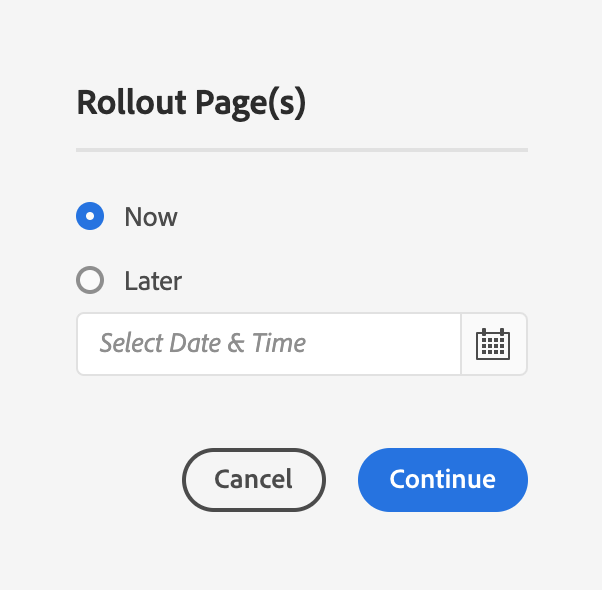
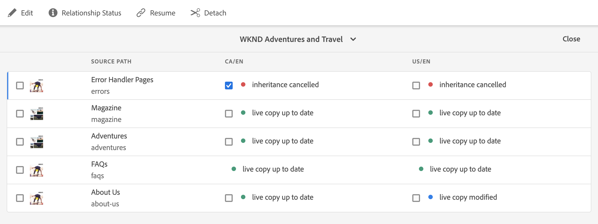
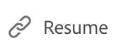
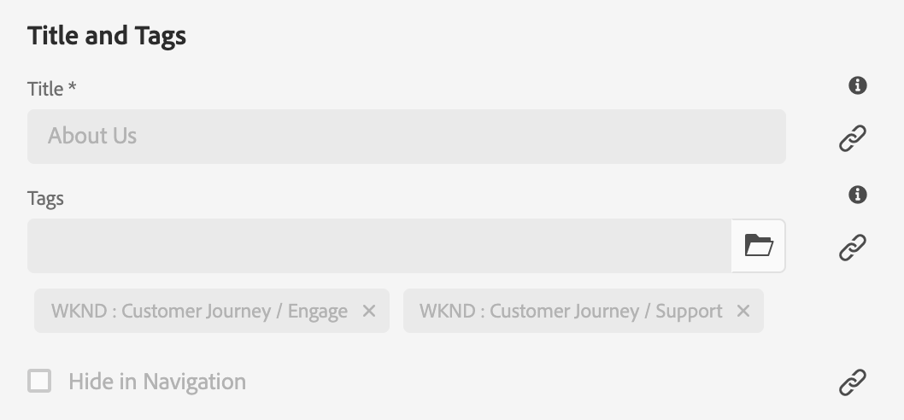
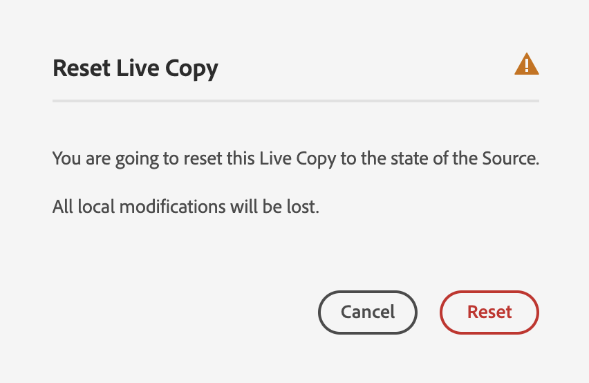

# Actieve kopieën maken en synchroniseren {#creating-and-synchronizing-live-copies}

U kunt een live kopie maken van een pagina of een blauwdrukconfiguratie om die inhoud op uw site opnieuw te gebruiken. Overerving en synchronisatie beheren, kunt u bepalen hoe wijzigingen in de inhoud worden doorgegeven.

## Browserconfiguraties beheren {#managing-blueprint-configurations}

Een blauwdrukconfiguratie identificeert een bestaande website die u als bron voor één of meerdere Live Copy-pagina&#39;s wilt gebruiken.

>[!TIP]
>
>Met vervagingsconfiguraties kunt u wijzigingen in de inhoud doorvoeren in Live kopieën. Zie [Actieve kopieën - Configuratie van bron, blauwdrukken en blauwdruk](overview.md#source-blueprints-and-blueprint-configurations).

Wanneer u een blauwdrukconfiguratie creeert, selecteert u een malplaatje dat de interne structuur van de blauwdruk bepaalt. In de standaardsjabloon voor blauwdrukken wordt ervan uitgegaan dat de bronwebsite de volgende kenmerken heeft:

* De website heeft een hoofdpagina.
* De directe onderliggende pagina&#39;s van de hoofdmap zijn taalvertakkingen van de website. Wanneer u een Live kopie maakt, worden de talen weergegeven als optionele inhoud die u in de kopie wilt opnemen.
* De hoofdmap van elke taalvertakking bevat een of meer onderliggende pagina&#39;s. Wanneer u een actieve kopie maakt, worden onderliggende pagina&#39;s weergegeven, zodat u deze kunt opnemen in de actieve kopie.

>[!NOTE]
>
>Voor een andere structuur is een andere blauwdruksjabloon vereist.

Nadat u de blauwdrukconfiguratie creeert, vormt u de volgende eigenschappen:

* **Naam**: De naam van de configuratie van de blauwdruk
* **Bronpad**: Het pad van de hoofdpagina van de site die u als bron gebruikt (blauwdruk)
* **Beschrijving**. (Optioneel) Een beschrijving van de configuratie van de blauwdruk, die wordt weergegeven in de lijst met blauwdrukconfiguraties die u kunt kiezen bij het maken van een site

Wanneer uw blauwdrukconfiguratie wordt gebruikt, kunt u het met een rollout configuratie associëren die bepaalt hoe de Levende Kopieën van de bron/de blauwdruk worden gesynchroniseerd. Zie [De te gebruiken rollout-configuraties opgeven](live-copy-sync-config.md#specifying-the-rollout-configurations-to-use).

### Blauwdrukconfiguraties maken en bewerken {#creating-editing-blueprint-configurations}

Vervagingsconfiguraties worden beschouwd als onveranderlijke gegevens en kunnen daarom niet worden bewerkt tijdens runtime. Om deze reden, moeten om het even welke configuratieveranderingen via Git worden opgesteld gebruikend de pijpleiding CI/CD.

Meer informatie vindt u in het artikel [Opvallende wijzigingen in Adobe Experience Manager (AEM) as a Cloud Service](/help/release-notes/aem-cloud-changes.md).

De volgende stappen zijn alleen voor test- en ontwikkelingsdoeleinden beschikbaar voor een beheerder van een lokale ontwikkelingsinstantie. Deze opties zijn niet beschikbaar in een AEMaaCS-cloudinstantie.

#### Lokaal een blauwdrukconfiguratie maken {#creating-a-blueprint-configuration}

Een blauwdrukconfiguratie maken:

1. [Navigeren](/help/sites-cloud/authoring/basic-handling.md#global-navigation) aan de **Gereedschappen** en selecteert u vervolgens de **Sites** -menu.
1. Selecteren **Blauwdrukken** om de **Blauwdrukconfiguraties** console:

   

1. Selecteren **Maken**.
1. Selecteer de blauwdruksjabloon en **Volgende** om door te gaan.
1. Selecteer de bronpagina die als blauwdruk moet worden gebruikt; dan **Volgende** om door te gaan.
1. Definiëren:

   * **Titel**: verplichte titel voor de blauwdruk
   * **Beschrijving**: een optionele beschrijving voor meer informatie.

1. **Maken** zal de configuratie van de blauwdruk tot stand brengen die op uw specificatie wordt gebaseerd.

### Een blauwdrukconfiguratie lokaal bewerken of verwijderen{#editing-or-deleting-a-blueprint-configuration}

U kunt een bestaande configuratie van de blauwdruk bewerken of verwijderen:

1. [Navigeren](/help/sites-cloud/authoring/basic-handling.md#global-navigation) aan de **Gereedschappen** en selecteert u vervolgens de **Sites** -menu.
1. Selecteren **Blauwdrukken** om de **Blauwdrukconfiguraties** console:

   

1. Selecteer de vereiste blauwdrukconfiguratie. De juiste acties worden beschikbaar op de werkbalk:

   * **Eigenschappen**; u kunt dit gebruiken om de eigenschappen van de configuratie te bekijken en dan uit te geven.
   * **Verwijderen**

## Een actieve kopie maken {#creating-a-live-copy}

U kunt op verschillende manieren een actieve kopie maken.

### Een actieve kopie van een pagina maken {#creating-a-live-copy-of-a-page}

U kunt een actieve kopie van elke pagina of vertakking maken. Wanneer u de live kopie maakt, kunt u opgeven welke rollout-configuraties moeten worden gebruikt voor het synchroniseren van de inhoud:

* De geselecteerde rollout-configuraties zijn van toepassing op de pagina Live kopie en de onderliggende pagina&#39;s.
* Als u geen rollout configuraties specificeert, bepaalt MSM welke rollout configuraties aan gebruik. Zie [De configuratie voor rollout opgeven die moet worden gebruikt](live-copy-sync-config.md#specifying-the-rollout-configurations-to-use).

U kunt een actieve kopie van elke pagina maken:

* Pagina&#39;s waarnaar wordt verwezen door een [blauwdrukconfiguratie](#creating-a-blueprint-configuration)
* En pagina&#39;s die geen verbinding hebben met een configuratie
* Live kopie op de pagina&#39;s van een andere actieve kopie ([geneste actieve kopieën](overview.md#nested-live-copies))

Het enige verschil is dat de **Uitrol** bevel op de bron/blauwdruk pagina&#39;s is afhankelijk van of de bron door een blauwdrukconfiguratie van verwijzingen wordt voorzien:

* Als u de live kopie maakt op basis van een bronpagina die **is** die in een blauwdrukconfiguratie van verwijzingen worden voorzien, dan is het bevel van de Uitvoer beschikbaar op de bron/blauwdruk pagina(s).
* Als u de live kopie maakt op basis van een bronpagina die **is niet** waarnaar in een blauwdrukconfiguratie wordt verwezen, is de opdracht Uitvoeren niet beschikbaar op de pagina(&#39;s) van de bron/blauwdruk.

Een actieve kopie maken:

1. In de **Sites** console selecteren **Maken** vervolgens **Live kopie**.

   

1. Selecteer de bronpagina en selecteer **Volgende**. Bijvoorbeeld:

   

1. Geef het doelpad van de actieve kopie op (open de bovenliggende map of pagina van de actieve kopie) en selecteer **Volgende**.

   

   >[!NOTE]
   >
   >Het doelpad kan zich niet binnen het bronpad bevinden.

1. Enter:

   * a **Titel** voor de pagina.
   * a **Naam**, die wordt gebruikt in de URL.

   

1. Gebruik de **Subpagina&#39;s uitsluiten** selectievakje:

   * Geselecteerd: maak alleen een actieve kopie van de geselecteerde pagina (oppervlakkige live kopie)
   * Niet geselecteerd: maak een actieve kopie die alle onderliggende elementen van de geselecteerde pagina bevat (diepe Live kopie)

1. (Optioneel) Als u een of meer rollout-configuraties wilt opgeven die u wilt gebruiken voor Live kopie, gebruikt u de opdracht **Rollout Configs** vervolgkeuzelijst om ze te selecteren. Geselecteerde configuraties worden weergegeven onder de keuzelijst.
1. Selecteer **Maken**. Er wordt een bevestigingsbericht weergegeven. Hier kunt u een van de volgende opties selecteren **Openen** of **Gereed**.

   >[!NOTE]
   >
   >Er wordt mogelijk een foutdialoogvenster weergegeven met het bericht &quot;Kan het formulier niet verzenden&quot;. Dit gebeurt als gevolg van een netwerktime-out. Het proces voor het maken van de live kopie wordt echter op de achtergrond uitgevoerd. Wacht een paar minuten en controleer of de pagina&#39;s van de livekopie correct zijn gemaakt.

### Een live kopie van een site maken op basis van een blauwdrukconfiguratie {#creating-a-live-copy-of-a-site-from-a-blueprint-configuration}

Maak een live kopie met behulp van een blauwdrukconfiguratie om een site te maken op basis van de blauwdrukinhoud (bron). Wanneer u een Live kopie maakt op basis van een blauwdrukconfiguratie, selecteert u een of meer taalvertakkingen van de blauwdrukbron die u wilt kopiëren, en selecteert u vervolgens de hoofdstukken die u wilt kopiëren uit de taalvertakkingen. Zie [Een blauwdrukconfiguratie maken](#creating-a-blueprint-configuration).

Als u sommige taalvertakkingen weglaat uit Live Copy, kunt u hen later toevoegen. Zie [Een actieve kopie maken in een live kopie (configuratie blauwdruk)](#creating-a-live-copy-inside-a-live-copy-blueprint-configuration) voor meer informatie.

>[!CAUTION]
>
>Wanneer de bron van de blauwdruk koppelingen en verwijzingen bevat die een alinea in een andere vertakking als doel hebben, worden de doelen niet bijgewerkt in de pagina&#39;s van Live kopie, maar blijven ze gericht naar de oorspronkelijke bestemming.

Geef bij het maken van de site waarden op voor de volgende eigenschappen:

* **Oorspronkelijke talen**: De taalvertakkingen van de blauwdrukbron die in Live Copy moeten worden opgenomen
* **Oorspronkelijke hoofdstukken**: De onderliggende pagina&#39;s van de vertakkingen van de blauwdruktaal die moeten worden opgenomen in de Live kopie
* **Doelpad**: De locatie van de hoofdpagina van de Live Copy-site
* **Titel**: De titel van de hoofdpagina van de Live Copy-site
* **Naam**: (Optioneel) De naam van het JCR-knooppunt dat de hoofdpagina van de Live Copy opslaat (de standaardwaarde is gebaseerd op de titel)
* **Site-eigenaar**: (Optioneel) Informatie over de partij die verantwoordelijk is voor de Live kopie
* **Live kopie**: Selecteer deze optie om een live relatie met de bronsite tot stand te brengen. Als u deze optie niet selecteert, wordt een kopie van de blauwdruk gemaakt, maar wordt deze niet gesynchroniseerd met de bron.
* **Rollout Configs**: (Optioneel) Selecteer een of meer rollout-configuraties die u wilt gebruiken voor het synchroniseren van Live Copy. Standaard worden de rollout-configuraties overgeërfd van de blauwdruk. Zie [De te gebruiken configuraties voor rollout opgeven](live-copy-sync-config.md#specifying-the-rollout-configurations-to-use) voor meer informatie .

Een actieve kopie van een site maken op basis van een blauwdrukconfiguratie:

1. In de **Sites** console, selecteren **Maken** vervolgens **Site** in de keuzelijst.
1. Selecteer de configuratie van de blauwdruk die u als bron van de actieve kopie wilt gebruiken en ga verder met **Volgende**:

   

1. Gebruik de **Oorspronkelijke talen** om de talen op te geven van de blauwdruksite die u wilt gebruiken voor Live Copy.

   Standaard zijn alle beschikbare talen geselecteerd. Als u een taal wilt verwijderen, selecteert u de **X** naast de taal.

   Bijvoorbeeld:

   

1. Gebruik de **Oorspronkelijke hoofdstukken** vervolgkeuzelijst om de secties van de blauwdruk te selecteren die u wilt opnemen in Live kopie. Alle beschikbare hoofdstukken zijn standaard inbegrepen, maar kunnen worden verwijderd.
1. Geef waarden op voor de overige eigenschappen en selecteer **Maken**. Selecteer in het bevestigingsdialoogvenster de optie **Gereed** om terug te keren naar de **Sites** console, of **Site openen** om de hoofdpagina van de site te openen.

### Een actieve kopie maken in een live kopie (configuratie blauwdruk) {#creating-a-live-copy-inside-a-live-copy-blueprint-configuration}

Wanneer u een live kopie maakt in de bestaande live kopie (gemaakt met behulp van een blauwdrukconfiguratie), kunt u alle taalkopieën of hoofdstukken invoegen die niet waren opgenomen toen de live kopie werd gemaakt.

## Uw Live kopie controleren {#monitoring-your-live-copy}

### De status van een live kopie bekijken {#seeing-the-status-of-a-live-copy}

De eigenschappen van een pagina van Actieve kopie tonen de volgende informatie over Live kopie:

* **Bron**: De bronpagina van de pagina Live Copy
* **Status**: De synchronisatiestatus van de Live kopie, inclusief of de Live kopie up-to-date is met de bron, wanneer de laatste synchronisatie heeft plaatsgevonden en wie de synchronisatie heeft uitgevoerd
* **Configuratie**:

   * Of de pagina nog steeds onderhevig is aan overerving van Live Copy
   * Of de configuratie wordt overgeërfd van de bovenliggende pagina
   * Alle rollout-configuraties die in Live Copy worden gebruikt

De eigenschappen weergeven:

1. In de **Sites** selecteert u de pagina Live kopie en opent u de eigenschappen.
1. Selecteer de **Live kopie** tab.

   Bijvoorbeeld:

   

   Zie de sectie [Het Live Copy-overzicht gebruiken](live-copy-overview.md#using-the-live-copy-overview) in het artikel Live Copy Overview Console voor meer informatie.

### De actieve kopieën van een vervagingspagina bekijken {#seeing-the-live-copies-of-a-blueprint-page}

De pagina&#39;s van de blauwdruk (die in een blauwdrukconfiguratie van verwijzingen worden voorzien) verstrekken u een lijst van de Levende pagina&#39;s van het Exemplaar die de huidige (blauwdruk) pagina als bron gebruiken. Gebruik deze lijst om actieve kopieën bij te houden. De lijst wordt weergegeven in de **Blauwdruk** tabblad van het [pagina-eigenschappen](/help/sites-cloud/authoring/sites-console/page-properties.md).

## Live kopie synchroniseren {#synchronizing-your-live-copy}

U kunt uw Live kopie op verschillende manieren synchroniseren.

### Een blauwdruk uitrollen {#rolling-out-a-blueprint}

Leer een blauwdrukpagina om wijzigingen in de inhoud door te voeren in Live kopieën. A **Uitrol** handeling voert de rollout configuraties uit die gebruiken [Bij rollout](live-copy-sync-config.md#rollout-triggers) trigger.

>[!NOTE]
>
>Er kunnen conflicten optreden als er nieuwe pagina&#39;s met dezelfde paginanaam worden gemaakt in zowel de vertakking Verfafdruk als een afhankelijke vertakking Live kopie.
>
>Dergelijke [conflicten moeten bij de uitrol worden afgehandeld en opgelost](rollout-conflicts.md).

#### Een vervaging uitrollen uit pagina-eigenschappen {#rolling-out-a-blueprint-from-page-properties}

1. In de **Sites** selecteert u de pagina in de blauwdruk en opent u de eigenschappen.
1. Open de **Blauwdruk** tab.
1. Selecteren **Uitrol**.

   

1. Geef de pagina&#39;s en eventuele subpagina&#39;s op en bevestig vervolgens met het vinkje:

   

1. Opgeven of de rollout-taak onmiddellijk moet worden uitgevoerd (**Nu**) of op een andere datum of tijd (**Later**).

   

Rollouts worden verwerkt als asynchrone taken en kunnen worden gecontroleerd op de knop [***Async-taakstatus** page](/help/operations/asynchronous-jobs.md#monitor-the-status-of-asynchronous-operations).

#### Een vervaging uitrollen vanuit de referentierail {#roll-out-a-blueprint-from-the-reference-rail}

1. In de **Sites** console, selecteer de pagina in het levende exemplaar en open **[Verwijzingen](/help/sites-cloud/authoring/basic-handling.md#references)** van de werkbalk.
1. Selecteer de **Blauwdruk** om de aan deze pagina gekoppelde blauwdrukken weer te geven.
1. Selecteer de gewenste blauwdruk in de lijst.
1. Selecteren **Uitrol**.

   

1. U wordt gevraagd de details van de uitrol te bevestigen:

   * **Uitrolbereik**:

     Geef op of het bereik alleen voor de geselecteerde pagina is of dat subpagina&#39;s moeten worden opgenomen.

   * **Schema**:

     Opgeven of de rollout-taak onmiddellijk moet worden uitgevoerd (**Nu**) of op een latere datum of tijd (**Later**).

     

1. Nadat u deze details hebt bevestigd, selecteert u **Uitrol** om de handeling uit te voeren.

Rollouts worden verwerkt als asynchrone taken en kunnen worden gecontroleerd op de knop [**Async-taakstatus** page](/help/operations/asynchronous-jobs.md#monitor-the-status-of-asynchronous-operations).

#### Een vervaging uitrollen met het overzicht van Actieve kopie {#roll-out-a-blueprint-from-the-live-copy-overview}

De [**Uitrol** Actie is ook beschikbaar via het Live Copy-overzicht](live-copy-overview.md#using-the-live-copy-overview), wanneer er een pagina Vervagen is geselecteerd.

1. Open de [Overzicht van live kopiëren](live-copy-overview.md#using-the-live-copy-overview) en selecteer een vervagingspagina.
1. Selecteren **Uitrol** op de werkbalk.

   

1. Geef de pagina&#39;s en eventuele subpagina&#39;s op en bevestig vervolgens met het vinkje:

   

1. Opgeven of de rollout-taak onmiddellijk moet worden uitgevoerd (**Nu**) of op een andere datum of tijd (**Later**).

   

Rollouts worden verwerkt als asynchrone taken en kunnen worden gecontroleerd op de knop [**Async-taakstatus** page](/help/operations/asynchronous-jobs.md#monitor-the-status-of-asynchronous-operations).

### Een actieve kopie synchroniseren {#synchronizing-a-live-copy}

Synchroniseer een pagina van de Levende Kopie om inhoudsveranderingen van de bron aan Levende Exemplaar te trekken.

#### Een actieve kopie van pagina-eigenschappen synchroniseren {#synchronize-a-live-copy-from-page-properties}

Synchroniseer een actieve kopie om wijzigingen van de bron naar de actieve kopie over te brengen.

>[!NOTE]
>
>Synchroniseert voert de rollout configuraties uit die gebruiken [Bij rollout](live-copy-sync-config.md#rollout-triggers) trigger.

1. In de **Sites** selecteert u de pagina Live kopie en opent u de eigenschappen.
1. Open de **Live kopie** tab.
1. Selecteren **Synchroniseren**.

   

   Bevestiging is aangevraagd, gebruik **Sync** om verder te gaan.

#### Een actieve kopie synchroniseren vanuit het overzicht Live kopie {#synchronize-a-live-copy-from-the-live-copy-overview}

De [De actie Synchroniseren is ook beschikbaar via het Live Copy-overzicht](live-copy-overview.md#using-the-live-copy-overview), wanneer u een pagina voor live kopiëren hebt geselecteerd.

1. Open de [Overzicht van live kopiëren](live-copy-overview.md#using-the-live-copy-overview) en selecteer een Live Copy-pagina.
1. Selecteren **Synchroniseren** op de werkbalk.
1. Bevestig de **Uitrol** Handeling in het dialoogvenster nadat u hebt opgegeven of u het volgende wilt opnemen:

   * **Pagina- en subpagina&#39;s**
   * **Alleen pagina**

   

## Live kopie van inhoud wijzigen {#changing-live-copy-content}

Als u inhoud van Live kopie wilt wijzigen, kunt u:

* Voeg alinea&#39;s toe aan de pagina.
* Bestaande inhoud bijwerken door de overerving van Live kopie voor een pagina of component te verbreken.

>[!TIP]
>
>Als u handmatig een pagina maakt in Live Copy, is de nieuwe pagina lokaal bij Live kopie. Dit betekent dat de pagina geen bijbehorende bronpagina heeft waaraan de pagina is gekoppeld.
>
>Als beste praktijken zodat kunt u een lokale pagina tot stand brengen die deel van de verhouding uitmaakt is de lokale pagina in de bron tot stand te brengen en een diep uitzettingsproces uit te voeren. Hiermee wordt de pagina lokaal gemaakt als Live kopieën.

>[!NOTE]
>
>Er kunnen conflicten optreden als er nieuwe pagina&#39;s met dezelfde paginanaam worden gemaakt in zowel de vertakking Verfafdruk als een afhankelijke vertakking Live kopie.
>
>Dergelijke [conflicten moeten bij de uitrol worden afgehandeld en opgelost](rollout-conflicts.md).

### Componenten toevoegen aan een Live Copy-pagina {#adding-components-to-a-live-copy-page}

U kunt op elk gewenst moment componenten toevoegen aan een pagina voor Live kopie. De overervingsstatus van de Live kopie en het bijbehorende alineasysteem bepaalt niet hoe u componenten kunt toevoegen.

Wanneer de pagina Live kopie is gesynchroniseerd met de bronpagina, blijven de toegevoegde componenten ongewijzigd. Zie ook [De volgorde van componenten op een Live Copy-pagina wijzigen.](#changing-the-order-of-components-on-a-live-copy-page)

>[!TIP]
>
>Wijzigingen die lokaal worden aangebracht in een component die als container is gemarkeerd, worden niet overschreven door de inhoud van de blauwdruk op een rollout. Zie [Aanbevolen MSM-procedures](best-practices.md#components-and-container-synchronization) voor meer informatie .

### Overerving voor een pagina onderbreken {#suspending-inheritance-for-a-page}

Wanneer u een live kopie maakt, wordt de Live kopie opgeslagen op de hoofdpagina van de gekopieerde pagina&#39;s. Alle onderliggende pagina&#39;s van de basispagina nemen de configuraties van Live Copy over. De componenten op de pagina&#39;s van het Levende Exemplaar erven ook de Levende configuratie van het Exemplaar.

U kunt de overerving van Live kopie voor een pagina van Live kopie onderbreken, zodat u pagina-eigenschappen en -componenten kunt wijzigen. Wanneer u overerving onderbreekt, worden de pagina-eigenschappen en -componenten niet meer gesynchroniseerd met de bron.

>[!TIP]
>
>U kunt [Een actieve kopie loskoppelen](#detaching-a-live-copy) van zijn blauwdruk om alle verbindingen te verwijderen. In tegenstelling tot het opschorten van erfenis, is de losse actie permanent en niet-omkeerbaar.

#### Overerving van pagina-eigenschappen onderbreken {#suspending-inheritance-from-page-properties}

Overerving op een pagina opschorten:

1. Open de eigenschappen van de pagina Live Copy met de **Eigenschappen weergeven** de **Sites** console of gebruiken **Pagina-informatie** op de pagina-werkbalk.
1. Selecteer de **Live kopie** tab.
1. Selecteren **Onderbreken** op de werkbalk. U kunt vervolgens een van de volgende opties selecteren:

   * **Onderbreken**: alleen huidige pagina schorsen.
   * **Opschorting met kinderen**: om de huidige pagina samen met eventuele onderliggende pagina&#39;s op te schorten.

1. Selecteren **Onderbreken** in het bevestigingsdialoogvenster.

#### Overerving van het Live Copy-overzicht opschorten {#suspending-inheritance-from-the-live-copy-overview}

De [Handeling voor schorsing is ook beschikbaar in het overzicht Live kopie](live-copy-overview.md#using-the-live-copy-overview), wanneer u een pagina voor live kopiëren hebt geselecteerd.

1. Open de [Overzicht van live kopiëren](live-copy-overview.md#using-the-live-copy-overview) en selecteer een Live Copy-pagina.
1. Selecteren **Onderbreken** op de werkbalk.
1. Selecteer de gewenste optie uit:

   * **Onderbreken**
   * **Opschorting met kinderen**

   

1. Bevestig de **Onderbreken** in de **Live kopie onderbreken** dialoogvenster:

   

### Overerving voor een pagina hervatten {#resuming-inheritance-for-a-page}

Het onderbreken van de overerving van Live Copy voor een pagina is een tijdelijke handeling. Na de schorsing van de **Hervatten** Deze handeling wordt beschikbaar, zodat u de live relatie opnieuw kunt instellen.

Wanneer u overerving weer inschakelt, wordt de pagina niet automatisch gesynchroniseerd met de bron. U kunt een synchronisatie aanvragen, als dit vereist is:

* In de **Hervatten**/**Vorige versie** dialoog; bijvoorbeeld:

  

* In een later stadium, door de synchronisatieactie manueel te selecteren.

>[!NOTE]
>
>Wanneer u overerving weer inschakelt, wordt de pagina niet automatisch gesynchroniseerd met de bron. Als dit wordt vereist, kunt u manueel om een synchronisatie verzoeken of op het tijdstip van hervatting of later.

#### Overerving van pagina-eigenschappen hervatten {#resuming-inheritance-from-page-properties}

Eenmaal [opgeschort](#suspending-inheritance-from-page-properties) de **Hervatten** Deze handeling wordt weergegeven op de werkbalk van de pagina-eigenschappen:

Als deze optie is geselecteerd, wordt het dialoogvenster weergegeven. U kunt, indien nodig, een synchronisatie selecteren en de actie vervolgens bevestigen.

#### Een Live Copy-pagina hervatten vanuit het Live Copy-overzicht {#resume-a-live-copy-page-from-the-live-copy-overview}

De [Handeling voor hervatten is ook beschikbaar via het Live Copy-overzicht](live-copy-overview.md#using-the-live-copy-overview), wanneer u een pagina voor live kopiëren hebt geselecteerd.

1. Open de [Overzicht van live kopiëren](live-copy-overview.md#using-the-live-copy-overview) en selecteer een geschorste Live Copy-pagina. De pagina wordt weergegeven als **OVERERVING GEANNULEERD**.
1. Selecteren **Hervatten** op de werkbalk.
1. Geef aan of u de pagina wilt synchroniseren nadat u de overerving hebt omgekeerd. Bevestig vervolgens de optie **Hervatten** in de **Live kopie hervatten** in.

### Overervingsdiepte wijzigen (Ondiep/Ondiep) {#changing-inheritance-depth-shallow-deep}

Op een bestaande live kopie kunt u de diepte van een pagina wijzigen, dat wil zeggen of onderliggende pagina&#39;s al dan niet worden opgenomen.

* Schakelen naar een oppervlakkige live kopie:

   * Zal onmiddellijk effect hebben en is niet omkeerbaar.

   * Hiermee worden onderliggende pagina&#39;s expliciet losgekoppeld van de actieve kopie. Verdere wijzigingen op kinderen kunnen niet bewaard worden als ze ongedaan worden gemaakt.

   * Hiermee verwijdert u alle afstammingen `LiveRelationships` zelfs als er geneste `LiveCopies`.

* Overschakelen naar een diepe live kopie:

   * Hiermee blijven onderliggende pagina&#39;s ongewijzigd.
   * Om het effect van de schakelaar te zien, kunt u uitlooptraject maken, worden om het even welke inhoudswijzigingen toegepast volgens de uitrolconfiguratie.

* Schakel over naar een oppervlakkige live kopie en ga vervolgens terug naar diep:

   * Behandelt alle kinderen van (vroeger) oppervlakkige Levende Kopie alsof zij manueel waren gecreeerd en daarom weg worden bewogen gebruikend `[oldname]_msm_moved name`.

U kunt als volgt de diepte opgeven of wijzigen:

1. Open de eigenschappen van de pagina Live Copy met de **Eigenschappen weergeven** de **Sites** console of gebruiken **Pagina-informatie** op de pagina-werkbalk.
1. Selecteer de **Live kopie** tab.
1. In de **Configuratie** de sectie instellen of wissen **Overerving van Actieve kopie** afhankelijk van of onderliggende pagina&#39;s worden opgenomen:

   * Ingeschakeld - een diepe, actieve kopie (de onderliggende pagina&#39;s worden opgenomen)
   * Niet ingeschakeld - Een oppervlakkige actieve kopie (onderliggende pagina&#39;s worden uitgesloten)

   >[!CAUTION]
   >
   >Het overschakelen naar een oppervlakkige versie van Live Copy heeft onmiddellijk effect en is niet-omkeerbaar.
   >
   >Zie [Actieve kopieën - Compositie](overview.md#live-copies-composition) voor meer informatie .

1. Selecteren **Opslaan** om uw updates voort te zetten.

### Overerving voor een component annuleren {#cancelling-inheritance-for-a-component}

Annuleer de overerving van Live kopie voor een component zodat de component niet meer wordt gesynchroniseerd met de broncomponent. U kunt overerving indien nodig op een later tijdstip inschakelen.

>[!NOTE]
>
>Wanneer u overerving weer inschakelt, wordt de component niet automatisch gesynchroniseerd met de bron. U kunt handmatig een synchronisatie aanvragen als dit vereist is.

Overerving annuleren om de inhoud van de component te wijzigen of de component te verwijderen:

1. Selecteer de component waarvoor u overname wilt annuleren.

   

1. Selecteer op de werkbalk van de component de optie **Overerving annuleren** pictogram.

   

1. Bevestig in het dialoogvenster Overerving annuleren de handeling met **Ja**.

   De werkbalk van de component wordt bijgewerkt en bevat alle (toepasselijke) bewerkingsopdrachten.

### Overerving voor een component opnieuw inschakelen {#re-enabling-inheritance-for-a-component}

Als u overerving voor een component wilt inschakelen, selecteert u de optie **Overerving opnieuw inschakelen** op de werkbalk van de component.

### De volgorde van componenten op een Live Copy-pagina wijzigen {#changing-the-order-of-components-on-a-live-copy-page}

Als een live kopie componenten bevat die deel uitmaken van een alineasysteem, gelden voor de overerving van dat alineasysteem de volgende regels:

* De volgorde van componenten in een overgeërfd alineasysteem kan worden gewijzigd, zelfs als overerving is ingesteld.
* Bij rollout wordt de volgorde van de componenten hersteld op basis van de blauwdruk. Als nieuwe componenten vóór de rollout aan Live Copy zijn toegevoegd, worden ze samen met de componenten opnieuw geordend waarboven ze zijn toegevoegd.
* Als de overerving van het alineasysteem wordt geannuleerd, wordt de volgorde van componenten niet hersteld bij de rollout en blijft deze in de Live Copy ongewijzigd.

>[!NOTE]
>
>Bij het terugkeren van een geannuleerde overerving op een alineasysteem, de volgorde van componenten **wordt niet automatisch hersteld** in de blauwdruk. U kunt handmatig een synchronisatie aanvragen als dit vereist is.

Gebruik de volgende procedure om de overname van het alineasysteem te annuleren.

1. Open de pagina Live kopie.
1. Sleep een bestaande component naar een nieuwe locatie op de pagina.
1. In de **Overerving annuleren** de handeling bevestigen met **Ja**.

### Eigenschappen van een Live Copy-pagina overschrijven {#overriding-properties-of-a-live-copy-page}

De pagina-eigenschappen van een Live Copy-pagina worden standaard van de bronpagina overgenomen en kunnen niet worden bewerkt.

U kunt overerving voor een eigenschap annuleren wanneer u de eigenschapswaarde voor de live kopie moet wijzigen. Een koppelingspictogram geeft aan dat overerving is ingeschakeld voor de eigenschap.

Wanneer u overerving annuleert, kunt u de waarde van de eigenschap wijzigen. Een pictogram voor verbroken koppelingen geeft aan dat overerving wordt geannuleerd.

U kunt overerving voor een eigenschap indien nodig later opnieuw inschakelen.

>[!NOTE]
>
>Wanneer u overerving weer inschakelt, wordt de pagina-eigenschap Live Copy niet automatisch gesynchroniseerd met de eigenschap source. U kunt handmatig een synchronisatie aanvragen als dit vereist is.

1. Open de eigenschappen van de pagina Live Copy met de **Eigenschappen weergeven** van de **Sites** console of **Pagina-informatie** op de werkbalk Pagina.
1. Als u de overerving van een eigenschap wilt annuleren, selecteert u het koppelingspictogram dat rechts van de eigenschap wordt weergegeven.

   

1. In de **Overerving annuleren** bevestigingsvenster, selecteren **Ja**.

### Eigenschappen van een Live Copy-pagina herstellen {#revert-properties-of-a-live-copy-page}

Als u overerving voor een eigenschap wilt inschakelen, selecteert u de optie **Overerving herstellen** wordt weergegeven naast de eigenschap.

### Live Copy-pagina opnieuw instellen {#resetting-a-live-copy-page}

U kunt een pagina van Live kopie opnieuw instellen voor het volgende:

* Alle annuleringen van overerving verwijderen
* Hiermee keert u de pagina terug naar hetzelfde frame als de bronpagina.

Het opnieuw instellen beïnvloedt de wijzigingen die u hebt aangebracht in pagina-eigenschappen, het alineasysteem en componenten.

#### Een actieve pagina voor kopiëren herstellen vanuit de pagina-eigenschappen {#reset-a-live-copy-page-from-the-page-properties}

1. In de **Sites** console, selecteert u de pagina Live kopiëren en selecteert u **Eigenschappen weergeven**.
1. Open de **Live kopie** tab.
1. Selecteren **Herstellen** op de werkbalk.

   

1. In de **Live kopie opnieuw instellen** dialoogvenster, bevestigen met **Herstellen**.

#### Een Live Copy-pagina herstellen vanuit het Live Copy-overzicht {#reset-a-live-copy-page-from-the-live-copy-overview}

De [**Herstellen** Actie is ook beschikbaar via het Live Copy-overzicht](live-copy-overview.md#using-the-live-copy-overview), wanneer u een pagina voor live kopiëren hebt geselecteerd.

1. Open de [Overzicht van live kopiëren](live-copy-overview.md#using-the-live-copy-overview) en selecteer een Live Copy-pagina.
1. Selecteren **Herstellen** op de werkbalk.
1. Bevestig de **Herstellen** in de **Live kopie opnieuw instellen** dialoogvenster:

   

## Een Live Copy-pagina vergelijken met een vervagingspagina {#comparing-a-live-copy-page-with-a-blueprint-page}

Als u de aangebrachte wijzigingen wilt bijhouden, kunt u de blauwdrukpagina weergeven in **Verwijzingen** en deze vergelijken met de bijbehorende pagina Live Copy:

1. In de **Sites** console, [navigeer naar een blauwdruk- of Live Copy-pagina en selecteer deze](/help/sites-cloud/authoring/basic-handling.md#viewing-and-selecting-resources).
1. Open de **[Verwijzingen](/help/sites-cloud/authoring/basic-handling.md#references)** en afhankelijk van de context:

   * **Blauwdruk**
   * **Actieve kopieën**

1. Selecteer uw specifieke Live kopie afhankelijk van de context of:

   * **Vergelijken met vervaging**
   * **Vergelijken met Live kopie**

   Bijvoorbeeld:

   

1. De pagina&#39;s Live kopiëren en Bladeren worden naast elkaar geopend.

   Zie voor meer informatie over het gebruik van de vergelijkingsfunctie [Pagina grijs](/help/sites-cloud/authoring/sites-console/page-diff.md).

## Een actieve kopie ontkoppelen {#detaching-a-live-copy}

Met de handeling Loskoppelen wordt de live relatie tussen een actieve kopie en de bron-/blauwdrukpagina permanent verwijderd. Alle MSM-relevante eigenschappen worden verwijderd uit Live Copy en de Live Copy-pagina&#39;s worden een zelfstandige kopie.

>[!CAUTION]
>
>U kunt de live relatie niet meer herstellen nadat u de live kopie hebt losgekoppeld.
>
>Als u de live relatie wilt verwijderen met de optie om deze later opnieuw te installeren, kunt u [Overerving van live kopiëren annuleren](#suspending-inheritance-for-a-page) voor de pagina.

Er zijn implicaties voor waar binnen de boom die u gebruikt **Loskoppelen**:

* **Koppelen op een basispagina van een actieve kopie**

  Wanneer deze bewerking wordt uitgevoerd op de hoofdpagina van een live kopie, wordt de live relatie tussen alle pagina&#39;s van de blauwdruk en de bijbehorende actieve kopie verwijderd.

  Meer wijzigingen in de pagina&#39;s van de blauwdruk **niet** heeft invloed op Live kopie.

* **Koppelen op een subpagina van een actieve kopie**

  Wanneer deze bewerking wordt uitgevoerd op een subpagina (of vertakking) in een actieve kopie:

   * De live relatie wordt verwijderd voor die subpagina (of vertakking) en
   * De (sub)pagina&#39;s in de Levende tak van het Exemplaar worden behandeld alsof zij manueel waren gecreeerd.

  De subpagina&#39;s zijn echter nog steeds onderhevig aan de live relatie van de bovenliggende vertakking, zodat een verdere uitrol van de blauwdrukpagina(&#39;s) beide:

   1. Wijzig de naam van de losgekoppelde pagina(&#39;s):

      * Dit komt omdat MSM deze pagina&#39;s beschouwt als handmatig gemaakte pagina&#39;s die een conflict veroorzaken omdat ze dezelfde naam hebben als de pagina&#39;s van Live Copy die ze proberen te maken.

   1. Maak een nieuwe Live Copy-pagina met de oorspronkelijke naam die de wijzigingen bevat die u tijdens de rollout hebt aangebracht.

  >[!NOTE]
  >
  >Zie [Conflicten MSM-rollout](rollout-conflicts.md) voor nadere bijzonderheden over dergelijke situaties.

### Een actieve pagina voor kopiëren loskoppelen van de pagina-eigenschappen {#detach-a-live-copy-page-from-the-page-properties}

Een actieve kopie loskoppelen:

1. In de **Sites** console, selecteert u de pagina Live kopiëren en selecteert u **Eigenschappen weergeven**.
1. Open de **Live kopie** tab.
1. Selecteer op de werkbalk de optie **Loskoppelen**.

   

1. Er wordt een bevestigingsdialoogvenster weergegeven. Selecteer **Loskoppelen** om de actie te voltooien.

### Een Live Copy-pagina loskoppelen van het Live Copy-overzicht {#detach-a-live-copy-page-from-the-live-copy-overview}

De [De actie Ontkoppelen is ook beschikbaar in het Live Copy-overzicht](live-copy-overview.md#using-the-live-copy-overview), wanneer u een pagina voor live kopiëren hebt geselecteerd.

1. Open de [Overzicht van live kopiëren](live-copy-overview.md#using-the-live-copy-overview) en selecteer een Live Copy-pagina.
1. Selecteren **Loskoppelen** op de werkbalk.
1. Bevestig de **Loskoppelen** in de **Live kopie ontkoppelen** dialoogvenster:

   
