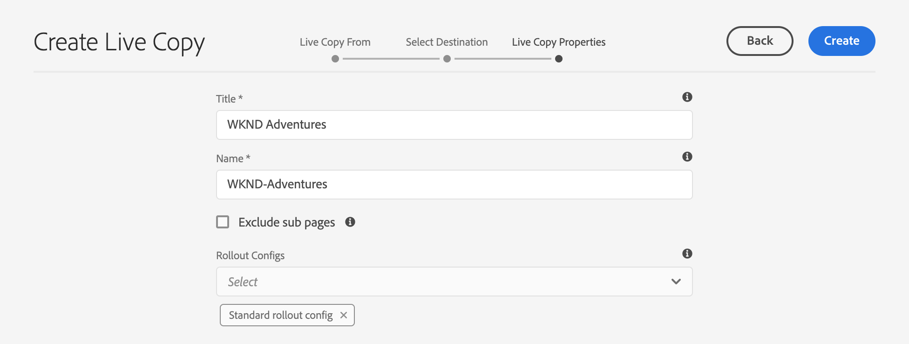
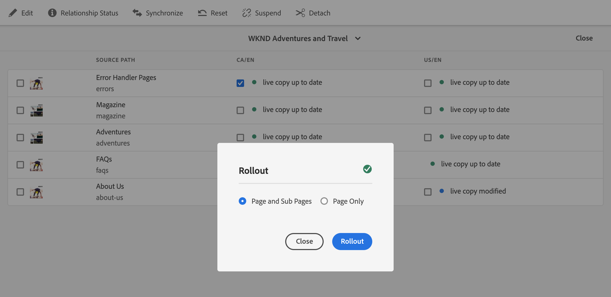
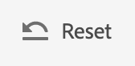

# Actieve kopieën maken en synchroniseren {#creating-and-synchronizing-live-copies}

U kunt een live kopie maken van een pagina of een blauwdrukconfiguratie om die inhoud op uw site opnieuw te gebruiken. Overerving en synchronisatie beheren, kunt u bepalen hoe wijzigingen in de inhoud worden doorgegeven.

## Browserconfiguraties beheren {#managing-blueprint-configurations}

Een blauwdrukconfiguratie identificeert een bestaande website die u als bron voor één of meerdere Live Copy-pagina&#39;s wilt gebruiken.

>[!TIP]
>
>Met vervagingsconfiguraties kunt u wijzigingen in de inhoud doorvoeren in Live kopieën. Zie [ Levende Kopieën - Source, Blauwdrukken en de Configuraties van de Vervaging ](overview.md#source-blueprints-and-blueprint-configurations).

Wanneer u een blauwdrukconfiguratie creeert, selecteert u een malplaatje dat de interne structuur van de blauwdruk bepaalt. In de standaardsjabloon voor blauwdrukken wordt ervan uitgegaan dat de bronwebsite de volgende kenmerken heeft:

* De website heeft een hoofdpagina.
* De directe onderliggende pagina&#39;s van de hoofdmap zijn taalvertakkingen van de website. Wanneer u een Live kopie maakt, worden de talen weergegeven als optionele inhoud die u in de kopie wilt opnemen.
* De hoofdmap van elke taalvertakking bevat een of meer onderliggende pagina&#39;s. Wanneer u een actieve kopie maakt, worden onderliggende pagina&#39;s weergegeven, zodat u deze kunt opnemen in de actieve kopie.

>[!NOTE]
>
>Voor een andere structuur is een andere blauwdruksjabloon vereist.

Nadat u de blauwdrukconfiguratie creeert, vormt u de volgende eigenschappen:

* **Naam**: De naam van de configuratie van de blauwdruk
* **Weg van Source**: De weg van de wortelpagina van de plaats die u als bron (blauwdruk) gebruikt
* **Beschrijving**. (Optioneel) Een beschrijving van de configuratie van de blauwdruk, die wordt weergegeven in de lijst met blauwdrukconfiguraties die u kunt kiezen bij het maken van een site

Wanneer uw blauwdrukconfiguratie wordt gebruikt, kunt u het met een rollout configuratie associëren die bepaalt hoe de Levende Kopieën van de bron/de blauwdruk worden gesynchroniseerd. Zie [ het specificeren van de Configuraties van de Output aan Gebruik ](live-copy-sync-config.md#specifying-the-rollout-configurations-to-use).

### Blauwdrukconfiguraties maken en bewerken {#creating-editing-blueprint-configurations}

Vervagingsconfiguraties worden beschouwd als onveranderlijke gegevens en kunnen daarom niet worden bewerkt tijdens runtime. Om deze reden, moeten om het even welke configuratieveranderingen via Git worden opgesteld gebruikend de pijpleiding CI/CD.

Meer informatie kan in de artikel [ Notable Veranderingen in Adobe Experience Manager (AEM) as a Cloud Service ](/help/release-notes/aem-cloud-changes.md) worden gevonden.

De volgende stappen zijn alleen voor test- en ontwikkelingsdoeleinden beschikbaar voor een beheerder van een lokale ontwikkelingsinstantie. Deze opties zijn niet beschikbaar in een AEMaaCS-cloudinstantie.

#### Lokaal een blauwdrukconfiguratie maken {#creating-a-blueprint-configuration}

Een blauwdrukconfiguratie maken:

1. [ navigeer ](/help/sites-cloud/authoring/basic-handling.md#global-navigation) aan het **Hulpmiddelen** menu, dan selecteer het **Sites** menu.
1. Selecteer **Vervagen** om de **console van de Configuraties van de Vervaging** te openen:

   

1. Selecteer **creeer**.
1. Selecteer het blauwdrukmalplaatje, dan **daarna** om verder te gaan.
1. Selecteer de bronpagina die als blauwdruk moet worden gebruikt; dan **daarna** om verder te gaan.
1. Definiëren:

   * **Titel**: verplichte titel voor de blauwdruk
   * **Beschrijving**: een facultatieve beschrijving om meer details te verstrekken.

1. **creeer** zal tot de blauwdrukconfiguratie leiden die op uw specificatie wordt gebaseerd.

### Een blauwdrukconfiguratie lokaal bewerken of verwijderen{#editing-or-deleting-a-blueprint-configuration}

U kunt een bestaande configuratie van de blauwdruk bewerken of verwijderen:

1. [ navigeer ](/help/sites-cloud/authoring/basic-handling.md#global-navigation) aan het **Hulpmiddelen** menu, dan selecteer het **Sites** menu.
1. Selecteer **Vervagen** om de **console van de Configuraties van de Vervaging** te openen:

   

1. Selecteer de vereiste blauwdrukconfiguratie. De juiste acties worden beschikbaar op de werkbalk:

   * **Eigenschappen**; u kunt dit gebruiken om de eigenschappen van de configuratie te bekijken en dan uit te geven.
   * **Schrapping**

## Een actieve kopie maken {#creating-a-live-copy}

U kunt op verschillende manieren een actieve kopie maken.

### Een actieve kopie van een pagina maken {#creating-a-live-copy-of-a-page}

U kunt een actieve kopie van elke pagina of vertakking maken. Wanneer u de live kopie maakt, kunt u opgeven welke rollout-configuraties moeten worden gebruikt voor het synchroniseren van de inhoud:

* De geselecteerde rollout-configuraties zijn van toepassing op de pagina Live kopie en de onderliggende pagina&#39;s.
* Als u geen rollout configuraties specificeert, bepaalt MSM welke rollout configuraties aan gebruik. Zie [ specificerend de Configuratie van de Uitvoer aan Gebruik ](live-copy-sync-config.md#specifying-the-rollout-configurations-to-use).

U kunt een actieve kopie van elke pagina maken:

* Pagina&#39;s die door a [ blauwdrukconfiguratie ](#creating-a-blueprint-configuration) van verwijzingen worden voorzien
* En pagina&#39;s die geen verbinding hebben met een configuratie
* Levend Exemplaar binnen de pagina&#39;s van een ander Levend Exemplaar ([ genestelde Levende Exemplaren ](overview.md#nested-live-copies))

Het enige verschil is dat de beschikbaarheid van het **bevel van de Uitvoer** op de bron/de blauwdruk pagina&#39;s afhankelijk is van of de bron door een blauwdrukconfiguratie van verwijzingen wordt voorzien:

* Als u het Levende Exemplaar van een bronpagina creeert die **** in een blauwdrukconfiguratie van verwijzingen wordt voorzien, dan is het bevel van de Uitvoer beschikbaar op de bron/blauwdruk pagina(s).
* Als u het Levende Exemplaar van een bronpagina creeert die **niet** in een blauwdrukconfiguratie van verwijzingen wordt voorzien, dan zal het bevel van de Uitvoer niet beschikbaar op de bron/blauwdruk pagina(s) zijn.

Een actieve kopie maken:

1. In de **console 1} uitgezochte** van Plaatsen **, dan** Levende Exemplaar **.**

   

1. Selecteer de bronpagina dan selecteren **daarna**. Bijvoorbeeld:

   

1. Specificeer de bestemmingspad van Levend Exemplaar (open de ouderomslag/de pagina van Levend Exemplaar) en selecteer dan **daarna**.

   

   >[!NOTE]
   >
   >Het doelpad kan zich niet binnen het bronpad bevinden.

1. Enter:

   * a **Titel** voor de pagina.
   * a **Naam**, die in URL wordt gebruikt.

   

1. Gebruik **sluit subpagina&#39;s** checkbox uit:

   * Geselecteerd: maak alleen een actieve kopie van de geselecteerde pagina (oppervlakkige live kopie)
   * Niet geselecteerd: maak een actieve kopie die alle onderliggende elementen van de geselecteerde pagina bevat (diepe Live kopie)

1. (Facultatief) om één of meerdere rollout configuraties te specificeren voor Levend Exemplaar te gebruiken, gebruik **Rollout vormt** drop-down lijst om hen te selecteren. Geselecteerde configuraties worden weergegeven onder de keuzelijst.
1. Selecteer **Maken**. Een bevestigingsbericht wordt getoond, van hier kunt u of **Open** selecteren of **Gereed**.

   >[!NOTE]
   >
   >Er wordt mogelijk een foutdialoogvenster weergegeven met het bericht &quot;Kan het formulier niet verzenden&quot;. Dit gebeurt als gevolg van een netwerktime-out. Het proces voor het maken van de live kopie wordt echter op de achtergrond uitgevoerd. Wacht een paar minuten en controleer of de pagina&#39;s van de livekopie correct zijn gemaakt.

### Een live kopie van een site maken op basis van een blauwdrukconfiguratie {#creating-a-live-copy-of-a-site-from-a-blueprint-configuration}

Maak een live kopie met behulp van een blauwdrukconfiguratie om een site te maken op basis van de blauwdrukinhoud (bron). Wanneer u een Live kopie maakt op basis van een blauwdrukconfiguratie, selecteert u een of meer taalvertakkingen van de blauwdrukbron die u wilt kopiëren, en selecteert u vervolgens de hoofdstukken die u wilt kopiëren uit de taalvertakkingen. Zie [ Creërend een Configuratie van de Vervaging ](#creating-a-blueprint-configuration).

Als u sommige taalvertakkingen weglaat uit Live Copy, kunt u hen later toevoegen. Zie [ Creërend Levend Exemplaar binnen een Levend Exemplaar (de Configuratie van de Vervaging) ](#creating-a-live-copy-inside-a-live-copy-blueprint-configuration) voor details.

>[!CAUTION]
>
>Wanneer de bron van de blauwdruk koppelingen en verwijzingen bevat die een alinea in een andere vertakking als doel hebben, worden de doelen niet bijgewerkt in de pagina&#39;s van Live kopie, maar blijven ze gericht naar de oorspronkelijke bestemming.

Geef bij het maken van de site waarden op voor de volgende eigenschappen:

* **Aanvankelijke Talen**: De taaltakken van de blauwdrukbron om in Levend Exemplaar te omvatten
* **Aanvankelijke Hoofdstukken**: De kindpagina&#39;s van de de taaltakken van de blauwdruk om in Levend Exemplaar te omvatten
* **Weg van de Bestemming**: De plaats van de wortelpagina van de Levende plaats van het Exemplaar
* **Titel**: De titel van de wortelpagina van de Levende plaats van het Exemplaar
* **Naam**: (Facultatief) de naam van de knoop JCR die de wortelpagina van Levend Exemplaar opslaat (de standaardwaarde is gebaseerd op de titel)
* **Eigenaar van de Plaats**: (Facultatieve) Informatie over de partij verantwoordelijk voor Levende Exemplaar
* **Levende Exemplaar**: Selecteer deze optie om een levende verhouding met de bronplaats te vestigen. Als u deze optie niet selecteert, wordt een kopie van de blauwdruk gemaakt, maar wordt deze niet gesynchroniseerd met de bron.
* **Uitvoer vormt**: (Facultatief) selecteer één of meerdere rollout configuraties aan gebruik voor het synchroniseren van Levende Exemplaar. Standaard worden de rollout-configuraties overgeërfd van de blauwdruk. Zie [ het Specificeren van de Configuraties van de Output ](live-copy-sync-config.md#specifying-the-rollout-configurations-to-use) voor meer details gebruiken.

Een actieve kopie van een site maken op basis van een blauwdrukconfiguratie:

1. In de **console van Plaatsen**, uitgezochte **creeert**, toen **Plaats** van de drop-down selecteur.
1. Selecteer de blauwdrukconfiguratie als bron van het Levende Exemplaar te gebruiken en met **daarna** te werk te gaan:

   

1. Gebruik de **Aanvankelijke Talen** selecteur om de talen van de blauwdrukplaats te specificeren voor Levend Exemplaar te gebruiken.

   Standaard zijn alle beschikbare talen geselecteerd. Om een taal te verwijderen, selecteer **X** die naast de taal verschijnt.

   Bijvoorbeeld:

   

1. Gebruik de **Aanvankelijke drop-down Hoofdstukken** om de secties van de blauwdruk te selecteren in Levend Exemplaar te omvatten. Alle beschikbare hoofdstukken zijn standaard inbegrepen, maar kunnen worden verwijderd.
1. Verstrek waarden voor de resterende eigenschappen en selecteer dan **creeer**. In het bevestigingsdialoogvakje, uitgezochte **Gedaan** om aan de **console van Plaatsen** terug te keren, of **Open Plaats** om de wortelpagina van de plaats te openen.

### Een actieve kopie maken in een live kopie (configuratie blauwdruk) {#creating-a-live-copy-inside-a-live-copy-blueprint-configuration}

Wanneer u een live kopie maakt in de bestaande live kopie (gemaakt met behulp van een blauwdrukconfiguratie), kunt u alle taalkopieën of hoofdstukken invoegen die niet waren opgenomen toen de live kopie werd gemaakt.

## Uw Live kopie controleren {#monitoring-your-live-copy}

### De status van een live kopie bekijken {#seeing-the-status-of-a-live-copy}

De eigenschappen van een pagina van Actieve kopie tonen de volgende informatie over Live kopie:

* **Source**: De bronpagina van de Levende pagina van het Exemplaar
* **Status**: De synchronisatiestatus van het Levende Exemplaar met inbegrip van of het Levende Exemplaar met de bron bijgewerkt is, toen de laatste synchronisatie voorkwam, en die de synchronisatie uitvoerde
* **Configuratie**:

   * Of de pagina nog steeds onderhevig is aan overerving van Live Copy
   * Of de configuratie wordt overgeërfd van de bovenliggende pagina
   * Alle rollout-configuraties die in Live Copy worden gebruikt

De eigenschappen weergeven:

1. In de **console van Plaatsen**, selecteer de Levende pagina van het Exemplaar en open de eigenschappen.
1. Selecteer het **Levende 1} lusje van het Exemplaar {.**

   Bijvoorbeeld:

   

   Zie de sectie [ Gebruikend het Levende Overzicht van het Exemplaar ](live-copy-overview.md#using-the-live-copy-overview) in de artikel Levende Console van het Overzicht van het Exemplaar voor meer details.

### De actieve kopieën van een vervagingspagina bekijken {#seeing-the-live-copies-of-a-blueprint-page}

De pagina&#39;s van de blauwdruk (die in een blauwdrukconfiguratie van verwijzingen worden voorzien) verstrekken u een lijst van de Levende pagina&#39;s van het Exemplaar die de huidige (blauwdruk) pagina als bron gebruiken. Gebruik deze lijst om actieve kopieën bij te houden. De lijst verschijnt op het **Vervagen** lusje van de [ paginaeigenschappen ](/help/sites-cloud/authoring/sites-console/page-properties.md).

## Live kopie synchroniseren {#synchronizing-your-live-copy}

U kunt uw Live kopie op verschillende manieren synchroniseren.

### Een blauwdruk uitrollen {#rolling-out-a-blueprint}

Leer een blauwdrukpagina om wijzigingen in de inhoud door te voeren in Live kopieën. A **Rollout** actie voert de rollout configuraties uit die [ op de trekker ](live-copy-sync-config.md#rollout-triggers) gebruiken van de Output.

>[!NOTE]
>
>Er kunnen conflicten optreden als er nieuwe pagina&#39;s met dezelfde paginanaam worden gemaakt in zowel de vertakking Verfafdruk als een afhankelijke vertakking Live kopie.
>
>Zulke [ conflicten moeten worden behandeld en op rollout ](rollout-conflicts.md) worden opgelost.

#### Een vervaging uitrollen uit pagina-eigenschappen {#rolling-out-a-blueprint-from-page-properties}

1. In de **console van Plaatsen**, selecteer de pagina in de blauwdruk en open de eigenschappen.
1. Open het **Vervagen** lusje.
1. Selecteer **Uitvoer**.

   

1. Geef de pagina&#39;s en eventuele subpagina&#39;s op en bevestig vervolgens met het vinkje:

   

1. Specificeer als de rollout baan onmiddellijk (**nu**) of op een andere datum/tijd (**later**) zou moeten worden uitgevoerd.

   

Rollouts worden verwerkt als asynchrone banen en kunnen op [* **Async de Status van Banen** pagina ](/help/operations/asynchronous-jobs.md#monitor-the-status-of-asynchronous-operations) worden gecontroleerd.

#### Een vervaging uitrollen vanuit de referentierail {#roll-out-a-blueprint-from-the-reference-rail}

1. In de **console van Plaatsen**, selecteer de pagina in het levende exemplaar en open het **[paneel van Verwijzingen](/help/sites-cloud/authoring/basic-handling.md#references)** (van de toolbar).
1. Selecteer de **Vervaging** optie van de lijst, om de blauwdrukken te tonen verbonden aan deze pagina.
1. Selecteer de gewenste blauwdruk in de lijst.
1. Selecteer **Uitvoer**.

   

1. U wordt gevraagd de details van de uitrol te bevestigen:

   * **werkingsgebied van de Uitvoer**:

     Geef op of het bereik alleen voor de geselecteerde pagina is of dat subpagina&#39;s moeten worden opgenomen.

   * **Programma**:

     Specificeer als de rollout baan onmiddellijk (**nu**) of bij een recentere datum/tijd (**later**) zou moeten worden uitgevoerd.

     

1. Na het bevestigen van deze details, uitgezochte **Uitvoer** om de actie uit te voeren.

De rollen worden verwerkt als asynchrone banen en kunnen op de [**Async Status van Banen** pagina ](/help/operations/asynchronous-jobs.md#monitor-the-status-of-asynchronous-operations) worden gecontroleerd.

#### Een vervaging uitrollen met het overzicht van Actieve kopie {#roll-out-a-blueprint-from-the-live-copy-overview}

De [**actie van de Uitvoer** is ook beschikbaar bij het Levende Overzicht van het Exemplaar ](live-copy-overview.md#using-the-live-copy-overview), wanneer een pagina van de Vervaging wordt geselecteerd.

1. Open het [ Levende Overzicht van het Exemplaar ](live-copy-overview.md#using-the-live-copy-overview) en selecteer een Pagina van de Vervaging.
1. Selecteer **Uitvoer** van de toolbar.

   

1. Geef de pagina&#39;s en eventuele subpagina&#39;s op en bevestig vervolgens met het vinkje:

   

1. Specificeer als de rollout baan onmiddellijk (**nu**) of op een andere datum/tijd (**later**) zou moeten worden uitgevoerd.

   

De rollen worden verwerkt als asynchrone banen en kunnen op de [**Async Status van Banen** pagina ](/help/operations/asynchronous-jobs.md#monitor-the-status-of-asynchronous-operations) worden gecontroleerd.

### Een actieve kopie synchroniseren {#synchronizing-a-live-copy}

Synchroniseer een pagina van de Levende Kopie om inhoudsveranderingen van de bron aan Levende Exemplaar te trekken.

#### Een actieve kopie van pagina-eigenschappen synchroniseren {#synchronize-a-live-copy-from-page-properties}

Synchroniseer een actieve kopie om wijzigingen van de bron naar de actieve kopie over te brengen.

>[!NOTE]
>
>Het synchroniseren voert de rollout configuraties uit die [ op de trekker van de Uitvoer ](live-copy-sync-config.md#rollout-triggers) gebruiken.

1. In de **console van Plaatsen**, selecteer de Levende pagina van het Exemplaar en open de eigenschappen.
1. Open het **Levende 1} lusje van het Exemplaar {.**
1. Selecteer **synchroniseren**.

   

   De bevestiging wordt gevraagd, gebruik **Synchronisatie** om te werk te gaan.

#### Een actieve kopie synchroniseren vanuit het overzicht Live kopie {#synchronize-a-live-copy-from-the-live-copy-overview}

De [ synchroniseer actie is ook beschikbaar bij het Levende Overzicht van het Exemplaar ](live-copy-overview.md#using-the-live-copy-overview), wanneer een Levende pagina van het Exemplaar wordt geselecteerd.

1. Open het [ Levende Overzicht van het Exemplaar ](live-copy-overview.md#using-the-live-copy-overview) en selecteer een Levende Pagina van het Exemplaar.
1. Selecteer **Synchroniseer** van de toolbar.
1. Bevestig de **actie van de Uitvoer** in de dialoog na het specificeren van of u wilt omvatten:

   * **Pagina en Subpagina&#39;s**
   * **slechts Pagina**

   

## Live kopie van inhoud wijzigen {#changing-live-copy-content}

Als u inhoud van Live kopie wilt wijzigen, kunt u:

* Voeg alinea&#39;s toe aan de pagina.
* Bestaande inhoud bijwerken door de overerving van Live kopie voor een pagina of component te verbreken.

>[!TIP]
>
>Als u handmatig een pagina maakt in Live Copy, is de nieuwe pagina lokaal bij Live kopie. Dit betekent dat de pagina geen bijbehorende bronpagina heeft waaraan de pagina is gekoppeld.
>
>Als beste praktijken zodat kunt u een lokale pagina tot stand brengen die deel van de verhouding uitmaakt is de lokale pagina in de bron tot stand te brengen en een diep uitzettingsproces uit te voeren. Hiermee wordt de pagina lokaal gemaakt als Live kopieën.

>[!NOTE]
>
>Er kunnen conflicten optreden als er nieuwe pagina&#39;s met dezelfde paginanaam worden gemaakt in zowel de vertakking Verfafdruk als een afhankelijke vertakking Live kopie.
>
>Zulke [ conflicten moeten worden behandeld en op rollout ](rollout-conflicts.md) worden opgelost.

### Componenten toevoegen aan een Live Copy-pagina {#adding-components-to-a-live-copy-page}

U kunt op elk gewenst moment componenten toevoegen aan een pagina voor Live kopie. De overervingsstatus van de Live kopie en het bijbehorende alineasysteem bepaalt niet hoe u componenten kunt toevoegen.

Wanneer de pagina Live kopie is gesynchroniseerd met de bronpagina, blijven de toegevoegde componenten ongewijzigd. Zie ook [ Veranderend de Orde van Componenten op een Levende Pagina van het Exemplaar ](#changing-the-order-of-components-on-a-live-copy-page).

>[!TIP]
>
>Wijzigingen die lokaal worden aangebracht in een component die als container is gemarkeerd, worden niet overschreven door de inhoud van de blauwdruk op een rollout. Zie ](best-practices.md#components-and-container-synchronization) Beste praktijken MSM [ voor meer informatie.

### Overerving voor een pagina onderbreken {#suspending-inheritance-for-a-page}

Wanneer u een live kopie maakt, wordt de Live kopie opgeslagen op de hoofdpagina van de gekopieerde pagina&#39;s. Alle onderliggende pagina&#39;s van de basispagina nemen de configuraties van Live Copy over. De componenten op de pagina&#39;s van het Levende Exemplaar erven ook de Levende configuratie van het Exemplaar.

U kunt de overerving van Live kopie voor een pagina van Live kopie onderbreken, zodat u pagina-eigenschappen en -componenten kunt wijzigen. Wanneer u overerving onderbreekt, worden de pagina-eigenschappen en -componenten niet meer gesynchroniseerd met de bron.

>[!TIP]
>
>U kunt ook [ een Levend Exemplaar ](#detaching-a-live-copy) van zijn blauwdruk losmaken om alle verbindingen te verwijderen. In tegenstelling tot het opschorten van erfenis, is de losse actie permanent en niet-omkeerbaar.

#### Overerving van pagina-eigenschappen onderbreken {#suspending-inheritance-from-page-properties}

Overerving op een pagina opschorten:

1. Open de eigenschappen van de Levende pagina van het Exemplaar of gebruikend het **bevel van de Eigenschappen van de Mening** van de **console van Plaatsen** of het gebruiken van **Informatie van de Pagina** op de paginakoolbar.
1. Selecteer het **Levende 1} lusje van het Exemplaar {.**
1. Selecteer **Onderbreking** van de toolbar. U kunt vervolgens een van de volgende opties selecteren:

   * **Uitstel**: om huidige slechts pagina op te schorten.
   * **Opschorting met kinderen**: om de huidige pagina samen met om het even welke kindpagina&#39;s op te schorten.

1. Selecteer **Onderbreking** op de bevestigingsdialoog.

#### Overerving van het Live Copy-overzicht opschorten {#suspending-inheritance-from-the-live-copy-overview}

De [ opschortende actie is ook beschikbaar bij het Levende Overzicht van het Exemplaar ](live-copy-overview.md#using-the-live-copy-overview), wanneer een Levende pagina van het Exemplaar wordt geselecteerd.

1. Open het [ Levende Overzicht van het Exemplaar ](live-copy-overview.md#using-the-live-copy-overview) en selecteer een Levende Pagina van het Exemplaar.
1. Selecteer **Onderbreking** van de toolbar.
1. Selecteer de gewenste optie uit:

   * **Suspend**
   * **Opschorting met kinderen**

   

1. Bevestig **Onderbreking** actie in de **Levende dialoog van het Exemplaar** onderbreken:

   

### Overerving voor een pagina hervatten {#resuming-inheritance-for-a-page}

Het onderbreken van de overerving van Live Copy voor een pagina is een tijdelijke handeling. Zodra opgeschort wordt de **Hervatten** actie beschikbaar, toestaand u om de levende verhouding opnieuw op te nemen.

Wanneer u overerving weer inschakelt, wordt de pagina niet automatisch gesynchroniseerd met de bron. U kunt een synchronisatie aanvragen, als dit vereist is:

* In **hervat**/**keert** dialoog terug; bijvoorbeeld:

  

* In een later stadium, door de synchronisatieactie manueel te selecteren.

>[!NOTE]
>
>Wanneer u overerving weer inschakelt, wordt de pagina niet automatisch gesynchroniseerd met de bron. Als dit wordt vereist, kunt u manueel om een synchronisatie verzoeken of op het tijdstip van hervatting of later.

#### Overerving van pagina-eigenschappen hervatten {#resuming-inheritance-from-page-properties}

Zodra  opgeschort **hervat** actie in de toolbar van de paginaeigenschappen wordt:

Als deze optie is geselecteerd, wordt het dialoogvenster weergegeven. U kunt, indien nodig, een synchronisatie selecteren en de actie vervolgens bevestigen.

#### Een Live Copy-pagina hervatten vanuit het Live Copy-overzicht {#resume-a-live-copy-page-from-the-live-copy-overview}

De [ actie van het Hervatten is ook beschikbaar bij het Levende Overzicht van het Exemplaar ](live-copy-overview.md#using-the-live-copy-overview), wanneer een Levende pagina van het Exemplaar wordt geselecteerd.

1. Open het [ Levende Overzicht van het Exemplaar ](live-copy-overview.md#using-the-live-copy-overview) en selecteer een geschorste Levende Pagina van het Exemplaar. De pagina wordt getoond als **GEANNULEERDE OVERERVING**.
1. Selecteer **Hervatten** van de toolbar.
1. Wijs erop of u de pagina na het terugkeren van overerving wilt synchroniseren, dan de **Actie van het Hervatten** in de **Levende dialoog van het Exemplaar van de Hervatten** bevestigen.

### Overervingsdiepte wijzigen (Ondiep/Ondiep) {#changing-inheritance-depth-shallow-deep}

Op een bestaande live kopie kunt u de diepte van een pagina wijzigen, dat wil zeggen of onderliggende pagina&#39;s al dan niet worden opgenomen.

* Schakelen naar een oppervlakkige live kopie:

   * Zal onmiddellijk effect hebben en is niet omkeerbaar.

   * Hiermee worden onderliggende pagina&#39;s expliciet losgekoppeld van de actieve kopie. Verdere wijzigingen op kinderen kunnen niet bewaard worden als ze ongedaan worden gemaakt.

   * Hiermee verwijdert u alle afstammingen `LiveRelationships`, zelfs als er `LiveCopies` is genest.

* Overschakelen naar een diepe live kopie:

   * Hiermee blijven onderliggende pagina&#39;s ongewijzigd.
   * Om het effect van de schakelaar te zien, kunt u uitlooptraject maken, worden om het even welke inhoudswijzigingen toegepast volgens de uitrolconfiguratie.

* Schakel over naar een oppervlakkige live kopie en ga vervolgens terug naar diep:

   * Behandelt alle kinderen van (vroeger) oppervlakkige Levende Exemplaar alsof zij manueel waren gecreeerd en daarom worden bewogen gebruikend `[oldname]_msm_moved name`.

U kunt als volgt de diepte opgeven of wijzigen:

1. Open de eigenschappen van de Levende pagina van het Exemplaar of gebruikend het **bevel van de Eigenschappen van de Mening** van de **console van Plaatsen** of het gebruiken van **Informatie van de Pagina** op de paginakoolbar.
1. Selecteer het **Levende 1} lusje van het Exemplaar {.**
1. In de **sectie van de Configuratie**, plaats of ontruim de **Levende optie van de Overerving van het Exemplaar** afhankelijk van of de kindpagina&#39;s inbegrepen zijn:

   * Ingeschakeld - een diepe, actieve kopie (de onderliggende pagina&#39;s worden opgenomen)
   * Niet ingeschakeld - Een oppervlakkige actieve kopie (onderliggende pagina&#39;s worden uitgesloten)

   >[!CAUTION]
   >
   >Het overschakelen naar een oppervlakkige versie van Live Copy heeft onmiddellijk effect en is niet-omkeerbaar.
   >
   >Zie [ Levende Exemplaren - Samenstelling ](overview.md#live-copies-composition) voor meer informatie.

1. Selecteer **sparen** om uw updates voort te zetten.

### Overerving voor een component annuleren {#cancelling-inheritance-for-a-component}

Annuleer de overerving van Live kopie voor een component zodat de component niet meer wordt gesynchroniseerd met de broncomponent. U kunt overerving indien nodig op een later tijdstip inschakelen.

>[!NOTE]
>
>Wanneer u overerving weer inschakelt, wordt de component niet automatisch gesynchroniseerd met de bron. U kunt handmatig een synchronisatie aanvragen als dit vereist is.

Overerving annuleren om de inhoud van de component te wijzigen of de component te verwijderen:

1. Selecteer de component waarvoor u overname wilt annuleren.

   

1. Voor de componententoolbar, selecteer **annuleer Overerving** pictogram.

   

1. In het Cancel de dialoogvakje van de Overerving, bevestig de actie met **ja**.

   De werkbalk van de component wordt bijgewerkt en bevat alle (toepasselijke) bewerkingsopdrachten.

### Overerving voor een component opnieuw inschakelen {#re-enabling-inheritance-for-a-component}

Om overerving voor een component toe te laten, selecteer **re-enable het pictogram van de Overerving** op de componententoolbar.

### De volgorde van componenten op een Live Copy-pagina wijzigen {#changing-the-order-of-components-on-a-live-copy-page}

Als een live kopie componenten bevat die deel uitmaken van een alineasysteem, gelden voor de overerving van dat alineasysteem de volgende regels:

* De volgorde van componenten in een overgeërfd alineasysteem kan worden gewijzigd, zelfs als overerving is ingesteld.
* Bij rollout wordt de volgorde van de componenten hersteld op basis van de blauwdruk. Als nieuwe componenten vóór de rollout aan Live Copy zijn toegevoegd, worden ze samen met de componenten opnieuw geordend waarboven ze zijn toegevoegd.
* Als de overerving van het alineasysteem wordt geannuleerd, wordt de volgorde van componenten niet hersteld bij de rollout en blijft deze in de Live Copy ongewijzigd.

>[!NOTE]
>
>Wanneer het terugkeren van een geannuleerde overerving op een paragraafsysteem, zal de orde van componenten **niet automatisch worden hersteld** van de blauwdruk. U kunt handmatig een synchronisatie aanvragen als dit vereist is.

Gebruik de volgende procedure om de overname van het alineasysteem te annuleren.

1. Open de pagina Live kopie.
1. Sleep een bestaande component naar een nieuwe locatie op de pagina.
1. In **annuleer Overerving** dialoogdoos, bevestig de actie met **ja**.

### Eigenschappen van een Live Copy-pagina overschrijven {#overriding-properties-of-a-live-copy-page}

De pagina-eigenschappen van een Live Copy-pagina worden standaard van de bronpagina overgenomen en kunnen niet worden bewerkt.

U kunt overerving voor een eigenschap annuleren wanneer u de eigenschapswaarde voor de live kopie moet wijzigen. Een koppelingspictogram geeft aan dat overerving is ingeschakeld voor de eigenschap.

Wanneer u overerving annuleert, kunt u de waarde van de eigenschap wijzigen. Een pictogram voor verbroken koppelingen geeft aan dat overerving wordt geannuleerd.

U kunt overerving voor een eigenschap indien nodig later opnieuw inschakelen.

>[!NOTE]
>
>Wanneer u overerving weer inschakelt, wordt de pagina-eigenschap Live Copy niet automatisch gesynchroniseerd met de eigenschap source. U kunt handmatig een synchronisatie aanvragen als dit vereist is.

1. Open de eigenschappen van de Levende pagina van het Exemplaar gebruikend of de **optie van de Eigenschappen van de Mening** van de **console van de Plaatsen** of **pictogram van de Informatie van de Pagina** op de paginakoolbar.
1. Als u de overerving van een eigenschap wilt annuleren, selecteert u het koppelingspictogram dat rechts van de eigenschap wordt weergegeven.

   

1. In **annuleer de bevestigingsdialoog van de Overerving**, uitgezochte **ja**.

### Eigenschappen van een Live Copy-pagina herstellen {#revert-properties-of-a-live-copy-page}

Om overerving voor een bezit toe te laten, selecteer **Terugkeren Overerving** pictogram dat naast het bezit verschijnt.

 terug

### Live Copy-pagina opnieuw instellen {#resetting-a-live-copy-page}

U kunt een pagina van Live kopie opnieuw instellen voor het volgende:

* Alle annuleringen van overerving verwijderen
* Hiermee keert u de pagina terug naar hetzelfde frame als de bronpagina.

Het opnieuw instellen beïnvloedt de wijzigingen die u hebt aangebracht in pagina-eigenschappen, het alineasysteem en componenten.

#### Een actieve pagina voor kopiëren herstellen vanuit de pagina-eigenschappen {#reset-a-live-copy-page-from-the-page-properties}

1. In de **console van Plaatsen**, selecteer de Levende pagina van het Exemplaar en selecteer **Eigenschappen van de Mening**.
1. Open het **Levende 1} lusje van het Exemplaar {.**
1. Selecteer **Terugstellen** van de toolbar.

   

1. In het **Levende de dialoogvakje van het Exemplaar van het Terugstellen**, bevestig met **Terugstellen**.

#### Een Live Copy-pagina herstellen vanuit het Live Copy-overzicht {#reset-a-live-copy-page-from-the-live-copy-overview}

[**het Terugstellen** actie is ook beschikbaar bij het Levende Overzicht van het Exemplaar ](live-copy-overview.md#using-the-live-copy-overview), wanneer een Levende pagina van het Exemplaar wordt geselecteerd.

1. Open het [ Levende Overzicht van het Exemplaar ](live-copy-overview.md#using-the-live-copy-overview) en selecteer een Levende Pagina van het Exemplaar.
1. Selecteer **Terugstellen** van de toolbar.
1. Bevestig de **1} actie van het Terugstellen {in de** Levende dialoog van het Exemplaar van het Terugstellen **:**

   

## Een Live Copy-pagina vergelijken met een vervagingspagina {#comparing-a-live-copy-page-with-a-blueprint-page}

Om de veranderingen te volgen u hebt aangebracht, kunt u de blauwdrukpagina in **Verwijzingen** bekijken en het met zijn Levende pagina van het Exemplaar vergelijken:

1. In de **console van Plaatsen**, [ navigeert aan een blauwdruk of Levende pagina van het Exemplaar en selecteert het ](/help/sites-cloud/authoring/basic-handling.md#viewing-and-selecting-resources).
1. Open het **[paneel van Verwijzingen](/help/sites-cloud/authoring/basic-handling.md#references)** en afhankelijk van context selecteer één van beiden:

   * **Vervaging**
   * **Levende Exemplaren**

1. Selecteer uw specifieke Live kopie afhankelijk van de context of:

   * **vergelijk met Vervagen**
   * **vergelijk met Levend Exemplaar**

   Bijvoorbeeld:

   

1. De pagina&#39;s Live kopiëren en Bladeren worden naast elkaar geopend.

   Voor volledige informatie over het gebruiken van de vergelijkingseigenschap zie [ Diff van de Pagina ](/help/sites-cloud/authoring/sites-console/page-diff.md).

## Een actieve kopie ontkoppelen {#detaching-a-live-copy}

Met de handeling Loskoppelen wordt de live relatie tussen een actieve kopie en de bron-/blauwdrukpagina permanent verwijderd. Alle MSM-relevante eigenschappen worden verwijderd uit Live Copy en de Live Copy-pagina&#39;s worden een zelfstandige kopie.

>[!CAUTION]
>
>U kunt de live relatie niet meer herstellen nadat u de live kopie hebt losgekoppeld.
>
>Om de levende verhouding met de optie van het later opnieuw opnemen van het te verwijderen, kunt u [ Levende overerving van het Exemplaar ](#suspending-inheritance-for-a-page) voor de pagina annuleren.

Er zijn implicaties op waar binnen de boom die u **gebruikt losmaken**:

* **losmaken op een Wortel- Pagina van een Levend Exemplaar**

  Wanneer deze bewerking wordt uitgevoerd op de hoofdpagina van een live kopie, wordt de live relatie tussen alle pagina&#39;s van de blauwdruk en de bijbehorende actieve kopie verwijderd.

  Verdere veranderingen in pagina&#39;s in de blauwdruk **zullen niet** Levende Exemplaar beïnvloeden.

* **losmaken op een Subpagina van Levend Exemplaar**

  Wanneer deze bewerking wordt uitgevoerd op een subpagina (of vertakking) in een actieve kopie:

   * De live relatie wordt verwijderd voor die subpagina (of vertakking) en
   * De (sub)pagina&#39;s in de Levende tak van het Exemplaar worden behandeld alsof zij manueel waren gecreeerd.

  De subpagina&#39;s zijn echter nog steeds onderhevig aan de live relatie van de bovenliggende vertakking, zodat een verdere uitrol van de blauwdrukpagina(&#39;s) beide:

   1. Wijzig de naam van de losgekoppelde pagina(&#39;s):

      * Dit komt omdat MSM deze pagina&#39;s beschouwt als handmatig gemaakte pagina&#39;s die een conflict veroorzaken omdat ze dezelfde naam hebben als de pagina&#39;s van Live Copy die ze proberen te maken.

   1. Maak een nieuwe Live Copy-pagina met de oorspronkelijke naam die de wijzigingen bevat die u tijdens de rollout hebt aangebracht.

  >[!NOTE]
  >
  >Zie {de Conflicten van de Uitvoer MSM ](rollout-conflicts.md) voor details van dergelijke situaties.[

### Een actieve pagina voor kopiëren loskoppelen van de pagina-eigenschappen {#detach-a-live-copy-page-from-the-page-properties}

Een actieve kopie loskoppelen:

1. In de **console van Plaatsen**, selecteer de Levende pagina van het Exemplaar en selecteer **Eigenschappen van de Mening**.
1. Open het **Levende 1} lusje van het Exemplaar {.**
1. Voor de toolbar, uitgezochte **maak** los.

   

1. Een bevestigingsdialoogdoos wordt getoond, uitgezocht **ontkoppelt** om de actie te voltooien.

### Een Live Copy-pagina loskoppelen van het Live Copy-overzicht {#detach-a-live-copy-page-from-the-live-copy-overview}

De [ ontkoppelde actie is ook beschikbaar bij het Levende Overzicht van het Exemplaar ](live-copy-overview.md#using-the-live-copy-overview), wanneer een Levende pagina van het Exemplaar wordt geselecteerd.

1. Open het [ Levende Overzicht van het Exemplaar ](live-copy-overview.md#using-the-live-copy-overview) en selecteer een Levende Pagina van het Exemplaar.
1. Selecteer **losmaken** van de toolbar.
1. Bevestig **losmaken** actie in de **Levende dialoog van het Exemplaar** loskoppelen:

   
